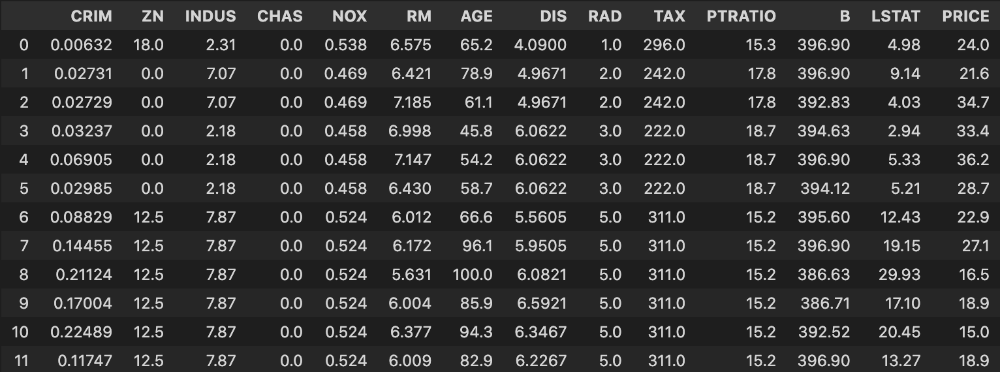
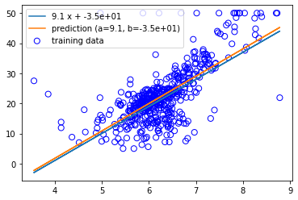

<script type="text/x-mathjax-config">MathJax.Hub.Config({tex2jax:{inlineMath:[['\$','\$'],['\\(','\\)']],processEscapes:true},CommonHTML: {matchFontHeight:false}});</script>
<script type="text/javascript" async src="https://cdnjs.cloudflare.com/ajax/libs/mathjax/2.7.1/MathJax.js?config=TeX-MML-AM_CHTML"></script>


機械学習
============
# 機械学習モデリングプロセス

- 問題設定
  - 最も重要
  - 機械学習が必要なのか
- データ選定
  - GIGO(Garbage in Garbage out)になってないか
- データの前処理
  - 時間の90％
- 機械学習モデルの選定（ここのメイン）

# 扱う内容について
- 教師なし学習と教師あり学習について

# 機械学習

- 機械学習の定義
  - トム・ミッチェルなどによる定義

# 線形回帰モデル
- 線形回帰とは
  - ざっくりいえば比例、超平面、など
    > \\\(y=ax+b\\\)
      - ....（2次元）
    > \\\(y=ax+by+c\\\)
      - ....（3次元）
  - 一般には
    > \\\(y=a_0 + \displaystyle \sum\ ax\\\)
- 回帰問題
  - ある入力（離散あるいは連続）から出力（連続値）を予測
  - バプニックの原理
    - 回帰ではランキング的なことも考えることができるが、回帰はランキングだけでなく、差なんかも考えている。
    - なので、ランキングを回帰問題で考えることは、途中でより難しい問題を考えていることであり、望ましくない。
    - 密度比推定で調べると面白いし差が色々得られる。東京大学の杉山先生など
  - 入力とパラメータの内積として、モデルを表せる。
  - 誤差について
    - ホワイトノイズだけでなく、説明変数で拾い切れていない要素もここに入る。
  - 入出力全体をベクトルや線形代数を使ってまとめて表現することがある。
  - y＝Xw として、Xは計画行列（デザインマトリックス）といわれる。
- データの分割とモデルの汎化性能測定について
  - 汎化(Generalization)のために推論データと検証データに分割させる
  - クロスバリデーションなど
- 線形回帰のモデルのパラメータの推定
  - 最小二乗法で推定
  > \\\(\displaystyle \sum\ (y_{\hat{i}} - y_i)^2 = \displaystyle \sum\ (ε_i)^2\\\)
  - なぜなら
  > \\\(y_{\hat{i}} = w_0 + w_1 x_i\\\)
   \\\(y_i = w_0 + w_1 x_i + ε_i\\\)
  - 注意点として、二乗誤差は外れ値に弱い
  - Huber損失、Tukey損失というのように外れ値に頑健な機械学習を考えることはできる。（イラストで学ぶ機械学習）
  > \\\(MSE_i = J(w) = \displaystyle \frac{\sum\ ε_i^2}{n}\\\)
  - 上記が今我々が予測したいこと
  - MSEが最小となるwの値を微分して求める。
  > \\\(\displaystyle \frac{\partial}{\partial w} \left \lbrace \frac{1}{n_{train}}\sum_{i=1}^{n_{train}} \left ( \boldsymbol{x_{i}^{T} w} - \boldsymbol{y_{i}} \right )^2 \right \rbrace =0\\\)
  - 変形して
  > \\\(\displaystyle \frac{\partial}{\partial w} \left \lbrace \frac{1}{n_{train}} \left ( \boldsymbol{Xw} - \boldsymbol{y} \right )^T \left ( \boldsymbol{Xw} - \boldsymbol{Y} \right )\right \rbrace =0\\\)
  > \\\(\displaystyle \frac{\partial}{\partial w} \left \lbrace \frac{1}{n_{train}} \left ( \boldsymbol{w^{T}X^{T}Xw} - \boldsymbol{Y^{T}Xw} - \boldsymbol{w^{T}X^{T}Y} - \boldsymbol{Y^{T}Y} \right )\right \rbrace =0\\\)
  - （）の中の第２項と第３項は展開すれば同じもの。
  - 微分すると、
  > \\\(\displaystyle \frac{1}{n_{train}} \left ( 2\boldsymbol{X^{T}Xw} - 2\boldsymbol{X^{T}y} \right )=0\\\)
  - これには以下を利用（Aが行列、wが横ベクトル）
    > \\\(\displaystyle \frac{\partial(w^{T}Aw)}{\partial w} = (A^{T} +A)w\\\)
    > \\\(\displaystyle \frac{\partial (Aw)}{\partial w} = Aw\\\)
    - matrix cookbookを参照しても良い。
  - 解は
  > \\\(\displaystyle \boldsymbol{\hat{w}} =\left ( \boldsymbol{X^{T}X} \right )^{-1}\boldsymbol{X^{T}y}\\\)
  - yの予測値は以下になる。
  > \\\(\displaystyle \boldsymbol{\hat{y}} =\boldsymbol{X} \left ( \boldsymbol{X^{T}X} \right )^{-1}\boldsymbol{X^{T}y}\\\)
  - \\\(\displaystyle \boldsymbol{X} \left ( \boldsymbol{X^{T}X} \right )^{-1}\boldsymbol{X^{T}}\\\)の部分は真の値yから予測値へ射映させる行列という意味で射影行列という。
  - 逆行列が常に存在しない問題について
    - 存在する条件は？
      - ムーアペンローズの一般化逆行列
    - 存在しない時はどうするか
      - 逆行列っぽいものを持ってくる
- データを動かす。
  - DLも含めて機械学習は外装問題にとても弱いと考えた方が良い。

# 実践

-  Bostonデータセットを使って線形回帰を記述する。
```python
# ボストンの住宅データをbostonというインスタンスにインポート
from sklearn.datasets import load_boston
boston = load_boston()

# データの中身を確認
# カラム'target'は住宅価格であるから必ず正の値になる。業務などではこのあたりの確認(前処理)やデータの上限などの確認が重要。
print(boston['target'])
# > [24.  21.6 34.7 33.4 36.2 ... 17.5 20.2 18.2 13.6 19.6 15.2 14.5 15.6 13.9 16.6 14.8 ... 11.9]

# データフレームの作成
# カラムに特徴量の名称、データにデータ内容を持つデータフレームを作成
df = DataFrame(data=boston.data, columns=boston.feature_names)

# 目的変数をDataFrameに追加
df['PRICE'] = np.array(boston.target)

# 最初の12行を出力
# ぱっと見でおかしなデータがないか確認してみる
df.head(12)
```


各項目の説明は以下
> CRIM： 町別の「犯罪率」
> ZN： 25,000平方フィートを超える区画に分類される住宅地の割合＝「広い家の割合」
> INDUS： 町別の「非小売業の割合」
> CHAS： チャールズ川のダミー変数（区画が川に接している場合は1、そうでない場合は0）＝「川の隣か」
> NOX： 「NOx濃度（0.1ppm単位）」＝一酸化窒素濃度（parts per 10 million単位）。この項目を目的変数とする場合もある
> RM： 1戸当たりの「平均部屋数」
> AGE： 1940年より前に建てられた持ち家の割合＝「古い家の割合」
> DIS： 5つあるボストン雇用センターまでの加重距離＝「主要施設への距離」
> RAD： 「主要高速道路へのアクセス性」の指数
> TAX： 10,000ドル当たりの「固定資産税率」
> PTRATIO： 町別の「生徒と先生の比率」
> B： 「1000(Bk - 0.63)」の二乗値。Bk＝「町ごとの黒人の割合」を指す
> LSTAT： 「低所得者人口の割合」
> MEDV：「住宅価格」（1000ドル単位）の中央値。通常はこの数値が目的変数として使われる

- 単回帰の説明変数と目的変数を設定。
- 今回は1戸当たりの「平均部屋数」から住宅価格を予測する。
```python
# 説明変数
data = df.loc[:, ['RM']].values
data_np = df.loc[:,'RM'].values

# 目的変数
target = df.loc[:, 'PRICE'].values
```
- 学習
- Numpyでの実装
```python
#numpy実装の回帰(Bostonデータ)

cov2, a2, b2 = train(data_np, target)
print("cov: {}".format(cov2))
print("coef: {}".format(a2))
print("intercept: {}".format(b2))
```
- 結果
> cov: [[ 0.49269522  4.48456555]
>  [ 4.48456555 84.41955616]]
> coef: 9.102108981180306
> intercept: -34.67062077643854

- SKLEARNでの実装
```python
#skl実装の回帰(Bostonデータ)
reg2 = model.fit(data.reshape(-1,1), target.reshape(-1, 1))

print("coef_: {}".format(reg2.coef_))
print("intercept_: {}".format(reg2.intercept_))
```
- 結果を図より確認する。
> coef_: [[9.10210898]]
> intercept_: [-34.67062078]

- 双方とも結果は同じことを確認。 
- 図にあらわして結果を確認。
```python
ys_pred2 = a2 * data_np + b2
ys_true2 = 9 * data_np - 35

plt.scatter(data_np, target, facecolor="none", edgecolor="b", s=50, label="training data")
plt.plot(data_np, ys_true2, label="{:.2} x + {:.2}".format(a2, b2))
plt.plot(data_np, ys_pred2, label="prediction (a={:.2}, b={:.2})".format(a2, b2))
plt.legend()
plt.show()
```

- 予測した線形は分布から大きく外れていないことがわかった。

- 次は重回帰を実施する。
- まずはデータの作成
```python
#カラムを指定してデータを表示
df[['CRIM', 'RM']].head()

# 説明変数
data2 = df.loc[:, ['CRIM', 'RM']].values
# 目的変数
target2 = df.loc[:, 'PRICE'].values
```
- 学習の実施
```python
# オブジェクト生成
model2 = LinearRegression()
# fit関数でパラメータ推定
model2.fit(data2, target2)
model2.predict([[0.2, 7]])
# 単回帰の回帰係数と切片を出力
print('推定された回帰係数: %.3f, 推定された切片 : %.3f' % (model.coef_, model.intercept_))
# 重回帰の回帰係数と切片を出力
print(model2.coef_)
print(model2.intercept_)

```
- 各係数と切片の値は以下。
> [-0.26491325  8.39106825]
> -29.24471945192992
- 
- 値の評価のため、最小２乗誤差および決定係数を求める。
```python
# train_test_splitをインポート
from sklearn.model_selection import train_test_split
# 70%を学習用、30%を検証用データにするよう分割
X_train, X_test, y_train, y_test = train_test_split(data2, target2, 
test_size = 0.3, random_state = 666)
# 学習用データでパラメータ推定
model.fit(X_train, y_train)
# 作成したモデルから予測（学習用、検証用モデル使用）
y_train_pred = model.predict(X_train)
y_test_pred = model.predict(X_test)

# 平均二乗誤差を評価するためのメソッドを呼び出し
from sklearn.metrics import mean_squared_error
# 学習用、検証用データに関して平均二乗誤差を出力
print('MSE Train : %.3f, Test : %.3f' % (mean_squared_error(y_train, y_train_pred), mean_squared_error(y_test, y_test_pred)))
# 学習用、検証用データに関してR^2を出力
print('R^2 Train : %.3f, Test : %.3f' % (model.score(X_train, y_train), model.score(X_test, y_test)))

```
> MSE Train : 40.586, Test : 34.377
> R^2 Train : 0.549, Test : 0.518

- 決定係数が0.5前後なのである程度の信頼度のある予測値になっていることがわかる。


[リンク先に記載](https://github.com/MatSoich/RabbitChallenge/blob/master/機械学習/codes/1.線形回帰モデル.ipynb)
or
[ダウンロード](/codes/1.線形回帰モデル.ipynb)


