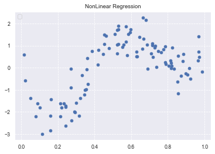
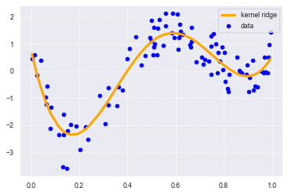

<script type="text/x-mathjax-config">MathJax.Hub.Config({tex2jax:{inlineMath:[['\$','\$'],['\\(','\\)']],processEscapes:true},CommonHTML: {matchFontHeight:false}});</script>
<script type="text/javascript" async src="https://cdnjs.cloudflare.com/ajax/libs/mathjax/2.7.1/MathJax.js?config=TeX-MML-AM_CHTML"></script>


機械学習
============

# 非線形回帰モデル

- 線形回帰でのxの代わりにlogやsinやcosなどの非線形の関数を使う。φ(x)とか
- wについては線形のまま(linear in parameter)
- なので正確には「線形モデルによる非線形回帰」
- 最小二乗法の解も先ほどと同様に求まる。
  - 線形代数だと、y=Xw　→ y=Φwでほとんど同じだから。
  > \\\(\displaystyle \boldsymbol{\hat{w}} =\left ( \boldsymbol{\Phi^{T}\Phi} \right )^{-1}\boldsymbol{\Phi^{T}y}\\\)
  > \\\(\displaystyle \boldsymbol{\hat{y}} =\boldsymbol{\Phi} \left ( \boldsymbol{\Phi^{T}\Phi} \right )^{-1}\boldsymbol{\Phi^{T}y}\\\)
- 高次関数にすればするほど説明力が高いのか、という問題。
  - 4次関数以上で近似すると結果はあまり変わらない。
    - オッカムの剃刀
  - アンダーフィッティングとオーバーフィッティングの問題。
    - 汎化できないと意味がない。
  - 不要な基底関数を削除するなど。
    - 赤池情報量基準などを採用
  - 正則化法
    - 以下のような行列Xを考える。
    - ２列目と３列目の値が平行に近い。このような場合、\\\((X^{T} X)^{-1}\\\)の値が大きくなってしまう。
    - このような場合は適切な値を求められるように罰則項を適用する。
  - >\\\(E(W) = J(W) + λw^{T}w\\\)
    - 他の書き方では
    > \\\(\displaystyle \boldsymbol{S_{\gamma }} = \left (\boldsymbol{Y} -\boldsymbol{\Phi w} \right )^T \left (\boldsymbol{Y} - \boldsymbol{\Phi w} \right ) + \gamma\boldsymbol{S}(\boldsymbol{w})\\\)
    - 上記は解きたいmin MSE s.t.R(w)<=r をKKT条件で書き換えたもの

\\\(X =\begin{pmatrix}
1 & 2  & 4   \\\\  
1 & 3  & 5.9 \\\\  
1 & 4  & 8.1 \\\\  
\end{pmatrix}
\\\)


- Lasso回帰とRidge回帰
  - Lasso回帰はいくつかのパラメータを正解にゼロに予想する。
    - そのため、不要な係数を簡単に削除することができる。
  - Ridge回帰はパラメータを0に近づけるように推定するので、いらない項目も０にならずに残る可能性があるが、正確性はLassoより高い場合が多い（？）。
  - 正則化によってオーバーフィッティングを抑えることができる
- 正則化以外で過学習を防ぐ方法
  - 単純に学習量を増やす。５０個のパラメータを用意しても、10000個のデータを用意すれば過学習にはならない。というような形
- こうやって求めたいくつかのモデルのうち、採用するモデルは交差検証法で決定。

- 検証の手法
  - ホールドアウト法
    - 学習データと検証データを最初に固定。検証の間に入れ換えない。
    - 手元のデータが大量にあれば使える。
    - 手元にデータが少ない時に問題が起こる
    - 外れ値が検証データに入ると、外れ値にフィットするようなモデルが得られる。
  - 交差検証法
    - 学習と検証を繰り返す。
    - 各モデルに対してCV値を求め、CV値が一番低いモデルを採用する。
    - CV値（検証誤差）には、基本的に二乗誤差を使う。
- グリッドサーチについて
  - ハイパーパラメータの自動決定手法
  - よくあるものはいくつか候補を用意して、候補の組み合わせごとに確かめていく。
  - 作業して、作ってみるのは悪いことではない。
  - 実践ではベイズ最適化でなされることが多い。
# 実践
- データ作成
```python
import numpy as np
import matplotlib.pyplot as plt
import seaborn as sns
%matplotlib inline
#seaborn設定
sns.set()
#背景変更
sns.set_style("darkgrid", {'grid.linestyle': '--'})
#大きさ(スケール変更)
sns.set_context("paper")
n=100

def true_func(x):
    z = 1-48*x+218*x**2-315*x**3+145*x**4
    return z 

def linear_func(x):
    z = x
    return z 

# 真の関数からノイズを伴うデータを生成

# 真の関数からデータ生成
data = np.random.rand(n).astype(np.float32)
data = np.sort(data)
target = true_func(data)

# 　ノイズを加える
noise = 0.5 * np.random.randn(n) 
target = target  + noise

# ノイズ付きデータを描画

plt.scatter(data, target)

plt.title('NonLinear Regression')
plt.legend(loc=2)
```


- 線型ではないデータを作成することができた。
- 実装する。今回はカーネル回帰にリッジ回帰の要素を加えた、カーネルリッジ回帰を利用する。

```python
from sklearn.kernel_ridge import KernelRidge

clf = KernelRidge(alpha=0.0002, kernel='rbf')
clf.fit(data, target)

p_kridge = clf.predict(data)

plt.scatter(data, target, color='blue', label='data')

plt.plot(data, p_kridge, color='orange', linestyle='-', linewidth=3, markersize=6, label='kernel ridge')
plt.legend()
#plt.plot(data, p, color='orange', marker='o', linestyle='-', linewidth=1, markersize=6)

```

- うまくデータにあったモデルを作れていることがわかる。


[リンク先に記載](https://github.com/MatSoich/RabbitChallenge/blob/master/機械学習/codes/2.非線形回帰モデル.ipynb)
or
[ダウンロード](codes/2.非線形回帰モデル.ipynb)