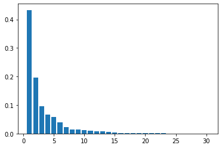
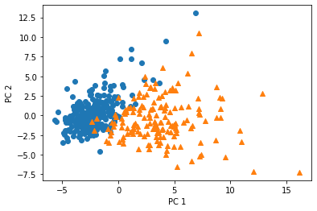

<script type="text/x-mathjax-config">MathJax.Hub.Config({tex2jax:{inlineMath:[['\$','\$'],['\\(','\\)']],processEscapes:true},CommonHTML: {matchFontHeight:false}});</script>
<script type="text/javascript" async src="https://cdnjs.cloudflare.com/ajax/libs/mathjax/2.7.1/MathJax.js?config=TeX-MML-AM_CHTML"></script>


主成分分析
============

# 主成分分析プロセス

- 多変量データの持つ構造できるだけ保ったまま、より少数の次元に線形変換（射影）する。結果、情報量を圧縮することができる。

  - 元データ : 
  >\\\(\boldsymbol x_i  = (x_{i1},x_{i2},......,x_{im}) \in \mathbb{R}\\\)
  - 平均(ベクトル) : 
  >\\\(\displaystyle \bar{\boldsymbol x} =  \frac{1}{n} \sum_{i=1}^{n} \boldsymbol{x_i}\\\)
  - データ行列 : 
  >\\\(\bar{\boldsymbol X} = (\boldsymbol x_1 - \bar{\boldsymbol x},\boldsymbol x_2 - \bar{\boldsymbol x},......,\boldsymbol x_n - \bar{\boldsymbol x})\\\)
  - 分散共分散行列 : 
  >\\\(\displaystyle \boldsymbol \Sigma = Var(\bar{\boldsymbol X}) = \frac{1}{n}  \bar{\boldsymbol X}^T \bar{\boldsymbol X}\\\)
  - 線形変換後のベクトル : 
  >\\\(\boldsymbol s_i  = (\boldsymbol s_{1j},\boldsymbol s_{2j},......, \boldsymbol s_{nj})^T = \underbrace{\bar{\boldsymbol  X} \boldsymbol a_j }_{n \times m,m \times 1}, \boldsymbol{a_j} \in \mathbb{R}^m\\\)
- 上記条件の元で線形変換後の分散を表すと以下。
  > \\\(\displaystyle Var(\boldsymbol s_j ) = \frac{1}{n}\boldsymbol{s_j^T s_j} = \frac{1}{n}( \bar{\boldsymbol X} \boldsymbol a_j)^T(\bar{\boldsymbol X}\boldsymbol a_j) = \frac{1}{n} \boldsymbol a_j^T \bar{\boldsymbol X}^T\bar{\boldsymbol X} \boldsymbol a_j  = \boldsymbol a_j^T Var(\bar{\boldsymbol X}) \boldsymbol a_j\\\)
- 情報のロスをなるべく少なくなるように圧縮
  - 分散を最大化するような軸をとる。
- 解き方としては誓約付き最適化問題としてラグランジェ関数を解く。
  - 目的関数: 
  >\\\(\displaystyle arg \max_{\boldsymbol a \in \mathbb{R}^m} = \boldsymbol a_j^T Var(\bar{\boldsymbol X}) \boldsymbol a_j\\\)
  - 制約条件: 
  >\\\(\boldsymbol a_j^T \boldsymbol a_j = 1\\\)
- 上記より導き出されるラグランジェ乗数 \\\(\lambda\\\)用いたラグランジェ関数Eは以下のようになる。
  > \\\(E(a_j) = \boldsymbol a_j^T Var(\bar{\boldsymbol X}) \boldsymbol a_j - \lambda (\boldsymbol a_j^T \boldsymbol a_j - 1)\\\)
- この関数の微分が0になる点がラグランジェ関数を最大にする係数ベクトルとなる。（関数の凸性を前提。）元のデータの分散共分散行列の固有値と固有ベクトルが、上記の制約つき最適化問題の解になる。
  > \\\(\displaystyle \frac{ \partial E(a_j) }{ \partial a_j } = 2 ar(\bar{\boldsymbol X}) \boldsymbol a_j - 2 \lambda \boldsymbol a_j = 0\\\)
  > \\\(\longrightarrow Var(\bar{\boldsymbol X}) \boldsymbol a_j = \lambda \boldsymbol a_j\\\)
- また射影先の分散は固有値に一致する。
  > \\\(\displaystyle Var(\boldsymbol s_1) = \boldsymbol a_1^T Var(\bar{\boldsymbol X}) \boldsymbol a_1 = \lambda_1 \boldsymbol a_j^T \boldsymbol a_j =\lambda_1\\\)

- 寄与率
  - 集約した主成分のうち、各種成分が全体の情報のうち、どれだけ保持されているのかを表す。
  - 固有値の和と元のデータの分散が一致するため寄与率の計算を実施することができる。
  - 固有値の分散は元のデータに対する固有値
    > \\\( V_{total} = \displaystyle \sum_{i=1}^{m}\ \lambda_i\\\)
  - 第k主成分の分散は主成分に対応する固有値のため、第k主成分に対する寄与率\\\(C_k\\\)は以下のように書くことができる。
    > \\\(C_k = \displaystyle \frac{\lambda_k}{\sum_{i=1}^m \lambda_i}\\\)

# 実践
- 設定
  - 乳がん検査データを利用し主成分を利用し2次元空間上に次元圧縮
  - 32次元のデータを2次元上に次元圧縮した際に、うまく判別できるかを確認

```python
import pandas as pd
from sklearn.model_selection import train_test_split
from sklearn.preprocessing import StandardScaler
from sklearn.linear_model import LogisticRegressionCV
from sklearn.metrics import confusion_matrix
from sklearn.decomposition import PCA
import matplotlib.pyplot as plt
%matplotlib inline

cancer_df = pd.read_csv('./data/cancer.csv')
cancer_df.drop('Unnamed: 32', axis=1, inplace=True)
cancer_df.head(5)

# 目的変数の抽出
y = cancer_df.diagnosis.apply(lambda d: 1 if d == 'M' else 0)

# 説明変数の抽出(使用しない)
X = cancer_df.loc[:, 'radius_mean':]

# 学習用とテスト用でデータを分離
X_train, X_test, y_train, y_test = train_test_split(X, y, random_state=0)

# 標準化
scaler = StandardScaler()
X_train_scaled = scaler.fit_transform(X_train)
X_test_scaled = scaler.transform(X_test)

# 主成分分析実施
pca = PCA(n_components=30)
pca.fit(X_train_scaled)
plt.bar([n for n in range(1, len(pca.explained_variance_ratio_)+1)], pca.explained_variance_ratio_)
```
- 寄与率は以下のようになり、第一主成分と第二主成分だけで全体の6割以上を説明できることがわかる。（２次元圧縮することに説得力あり。）

- 次元圧縮した結果を表示する。
```python
# PCA
# 次元数2まで圧縮
pca = PCA(n_components=2)
X_train_pca = pca.fit_transform(X_train_scaled)
print('X_train_pca shape: {}'.format(X_train_pca.shape))
# X_train_pca shape: (426, 2)

# 寄与率
print('explained variance ratio: {}'.format(pca.explained_variance_ratio_))
# explained variance ratio: [ 0.43315126  0.19586506]

# 散布図にプロット
temp = pd.DataFrame(X_train_pca)
temp['Outcome'] = y_train.values
b = temp[temp['Outcome'] == 0]
m = temp[temp['Outcome'] == 1]
plt.scatter(x=b[0], y=b[1], marker='o') # 良性は○でマーク
plt.scatter(x=m[0], y=m[1], marker='^') # 悪性は△でマーク
plt.xlabel('PC 1') # 第1主成分をx軸
plt.ylabel('PC 2') # 第2主成分をy軸

```



- 図を見ると、2次元圧縮後にきれいに結果の境目を確認できる。次元圧縮がうまくできていることがわかる。

ノートブックは
[リンク先に記載](https://github.com/MatSoich/RabbitChallenge/blob/master/機械学習/codes/4.主成分分析.ipynb)
or
[ダウンロード](codes/4.主成分分析.ipynb)