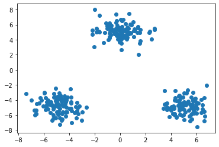
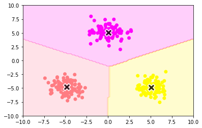

<script type="text/x-mathjax-config">MathJax.Hub.Config({tex2jax:{inlineMath:[['\$','\$'],['\\(','\\)']],processEscapes:true},CommonHTML: {matchFontHeight:false}});</script>
<script type="text/javascript" async src="https://cdnjs.cloudflare.com/ajax/libs/mathjax/2.7.1/MathJax.js?config=TeX-MML-AM_CHTML"></script>


クラスタリング
============
# k-means
- クラスタリングはラベルのない状況でデータをグルーピングすることができる教師なし学習。k-meansはその代表的な手法。
- k-meansのアルゴリズムは以下。
  1. 各クラスタ中心の初期値を設定。
  2. 角データ点に対して、最も近いクラスタ中心のクラスタを割り当て
  3. 各クラスタの平均ベクトルを計算。新しいクラスタ中心として割り当て。
  4. 2と３を収束するまで繰り返す。
- kはハイパーパラメータなので事前の設定が必要。
  - 初期値の置き方が大事で置き方によってパフォーマンスが変わってしまう。
  - k-meansではランダムで決まってしまうこの点を改善したのがk-means++で、クラスタ中心の初期値それぞれが近づきすぎないような初期値の設定をしている。

# 実践
- numpy 及び sklearnでそれそれ実施する。
- まずはデータの作成
```python
# ライブラリインストール

%matplotlib inline
import numpy as np
import matplotlib.pyplot as plt
def gen_data():
    x1 = np.random.normal(size=(100, 2)) + np.array([-5, -5])
    x2 = np.random.normal(size=(100, 2)) + np.array([5, -5])
    x3 = np.random.normal(size=(100, 2)) + np.array([0, 5])
    return np.vstack((x1, x2, x3))
#データ作成
X_train = gen_data()
#データ描画
plt.scatter(X_train[:, 0], X_train[:, 1])

```


まずnumpyでの実装を実施する。
```python
def plt_result(X_train, centers, xx):
    #　データを可視化
    plt.scatter(X_train[:, 0], X_train[:, 1], c=y_pred, cmap='spring')
    # 中心を可視化
    plt.scatter(centers[:, 0], centers[:, 1], s=200, marker='X', lw=2, c='black', edgecolor="white")
    # 領域の可視化
    pred = np.empty(len(xx), dtype=int)
    for i, x in enumerate(xx):
        d = distance(x, centers)
        pred[i] = np.argmin(d)
    plt.contourf(xx0, xx1, pred.reshape(100, 100), alpha=0.2, cmap='spring')

y_pred = np.empty(len(X_train), dtype=int)
for i, x in enumerate(X_train):
    d = distance(x, centers)
    y_pred[i] = np.argmin(d)

xx0, xx1 = np.meshgrid(np.linspace(-10, 10, 100), np.linspace(-10, 10, 100))
xx = np.array([xx0, xx1]).reshape(2, -1).T

plt_result(X_train, centers, xx)
```

- 上記を見ると正しく分類できていることがわかる。
- 次にSKLEARNで実装する。

```python
from sklearn.cluster import KMeans
kmeans = KMeans(n_clusters=3, random_state=0).fit(X_train)
print("cluster_centers: {}".format(kmeans.cluster_centers_))
plt_result(X_train, kmeans.cluster_centers_, xx)

```
> cluster_centers: [[ 5.09273785 -4.86667888]
>  [ 0.03846317  5.11052585]
>  [-4.8650078  -4.79725477]]


- numpyと同様に綺麗に分類されていることがわかる。


[リンク先に記載](https://github.com/MatSoich/RabbitChallenge/blob/master/機械学習/codes/5.クラスタリング.ipynb)
or
[ダウンロード](codes/5.クラスタリング.ipynb)