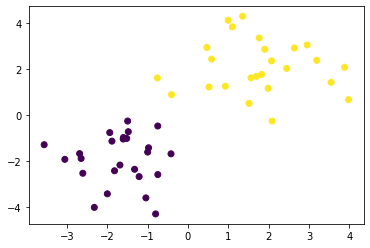
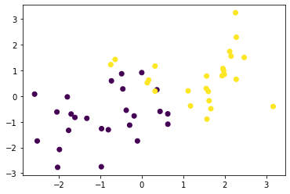

<script type="text/x-mathjax-config">MathJax.Hub.Config({tex2jax:{inlineMath:[['\$','\$'],['\\(','\\)']],processEscapes:true},CommonHTML: {matchFontHeight:false}});</script>
<script type="text/javascript" async src="https://cdnjs.cloudflare.com/ajax/libs/mathjax/2.7.1/MathJax.js?config=TeX-MML-AM_CHTML"></script>
サポートベクトルマシン
============
# 概要

- SVMとは
  - SVMは、2クラス分類問題の代表的な手法の1つで、未知データに対して高い予測精度を持つ
  - SVMはもともと2クラス分類問題のために考案されたが、その後、回帰問題や教師なし問題などへも応用されている。
  - 今回記述するSVMのことを、他の問題用のSVMと区別して、特にサポートベクトル(SV)分類(support vector classi cation)と呼ぶ
- 決定関数と分類境界
  - 一般に2クラス分類問題では、特徴ベクトルxがどちらのクラスに属するか判定するために次の決定関数(decision function)と呼ばれる関数f(x)が使われます。
  > \\\(f(x) =\boldsymbol w^T \boldsymbol x+b\\\)
  - ここでwは、特徴ベクトルxと同じ次元の数値ベクトルで、\\\(w^Tx\\\)は次のように計算されます。
  > \\\(
      \displaystyle \boldsymbol w^T \boldsymbol x=(w_1,\cdots,w_n)\left(\begin{array}{c} x_1 \cr x_2 \cr \vdots \cr x_n\end{array}\right)=w_1x_1 + w_2x_2 + \cdots + w_nx_n=\sum_{i+1}^n w_ix_i
    \\\)
  - ある入力データxに対して決定関数f(x)を計算し、その符号により2つのクラスに分類します。
  > \\\(\displaystyle
\begin{aligned} 
y= sgn f(x) =
    \begin{cases}
        +1 & (f(x) > 0) \cr
        -1 & (f(x) < 0) 
    \end{cases}
\end{aligned} \\\)
  - f(x) = 0が、特徴ベクトル \\\(\boldsymbol x= (x1, x2)^T\\\)を2つのクラスに分ける境界線になっていることが分かる。
- 線形サポートベクトル分類(ハードマージン)
  - SVMに基づいてこのn個の訓練データからパラメータw、bを決定する方法を説明していきます
  - まずは分離可能な場合を考えることにします。
  > \\\(y_if(x_i)>0  (i= 1,2,\cdots,n)\\\)
  - (正しく分類できていないデータがある場合には、そのデータ\\\((x_i, y_i)\\\)に対して\\\(sgnf(x_i)\\\)と\\\(y_i\\\)の符号が逆になっているため\\\(y_if(x_i)<0\\\)となります。
  - 分類境界を挟んで2つのクラスがどのくらい離れているかをマージン(margin)と呼びます。
  - マージンを最大化することは、分類境界f(x) = 0と分類境界から最も近くにあるデータ\\\(x_i\\\)との距離を最大化すことを表す。
  - \\\(f(x) = 0\\\)と\\\(\boldsymbol x_i\\\)の距離は、次式で表される。
  > \\\(
      \displaystyle \frac{ \|f(\boldsymbol x_i)\| }{\\|\boldsymbol w\\|}=\frac{\|\boldsymbol  w^T \boldsymbol x_i + b\|}{\\|\boldsymbol w\\|}
    \\\)
  - ここで、\\\(\\|w\\|\\\)はL2ノルム\\\(\\|w\\|=\sqrt{w_1^2+w_2^2+ \cdots + w_n^2}\\\)を表します。つまり「点と平面の距離の公式」です
  - 分類境界f(x) = 0と分類境界から最も近くにあるデータとの距離は、次のように書ける。
  > \\\(
      \displaystyle \min_{i} \frac{y_i[\boldsymbol w^t \boldsymbol x_i + b]}{\\|\boldsymbol w\\|} = \frac{1}{\\| \boldsymbol w\\|} \min_i [y_i[\boldsymbol w^t \boldsymbol x_i + b]] = \frac{M(\boldsymbol w, b)}{\\|\boldsymbol w\\|}
    \\\)
  - マージンを最大化することは、この量を最大化することと等価ですから、SVMの目的関数は次のように書ける
  > \\\(
      \displaystyle \max_{w,b} \left[ \min_{i} \frac{y_i[\boldsymbol w^t \boldsymbol x_i + b]}{\\|\boldsymbol w\\|} \right] = \max_{w,b} \frac{M(\boldsymbol w, b)}{\\|\boldsymbol w\\|}
    \\\)
  - w,bを規格化して簡潔に表して、
  > \\\(
      \displaystyle \tilde {\boldsymbol w} = \frac{\boldsymbol w}{M(\boldsymbol w , b)} ,\displaystyle \tilde b = \frac{b}{M(\boldsymbol w , b)}
    \\\)
  - するとSVMの目的関数を以下のように扱いやすい形にできる。
  > \\\(
      \displaystyle \min_{\tilde w,\tilde b} \frac{1}{2} \\|\boldsymbol {\tilde w}\\|^2 \space s.t. \space y_i[\boldsymbol {\tilde w^t} \boldsymbol x_i + \tilde b] \geq 1
    \\\)
  - (以後の簡便化のためチルダは表記しない。)
  - このような分離可能性を仮定したSV分類のことを一般にハードマージンと呼ぶ。
- 線形サポートベクトル分類(ソフトマージン）
  - 仮定をなくし、SV分類を分離可能でないデータに適用できるように拡張する。このようなタスクは、前のセクションのハードマージンに対して、ソフトマージン(soft margin)と呼ばれる。
  - \\\(y_i[\boldsymbol w^t \boldsymbol x_i + b] \geq 1- \xi_i(i= 1,\cdots , n)\\\)
  - \\\(\xi_i\\\)はマージン内に入るデータや誤分類されたデータに対する誤差を表す変数となっており、スラック変数(slack variable)と呼ぶ。
  > \\\(
      \displaystyle \min_{w,b,\xi}\left[ \frac{1}{2} \\|\boldsymbol w\\|^2 + C \sum_{i=1}^n \xi_i\right] \space s.t. \space y_i[\boldsymbol w^t \boldsymbol x_i + b] \geq 1 - \xi_i, \space \xi_i \geq 0
    \\\)
- SVMにおける双対表現
  - 上記のハードマージン、ソフトマージンの最適化問題は、SV分類の主問題と呼ばれる。この主問題を解けば分類境界を決定でキルが、SV分類ではこの主問題と等価な双対問題の方を解くことが一般的。理由は以下。
    - 主問題と比べて双対問題の方が変数を少なくできる
    - 分類境界の非線形化を考える上で双対問題の形式(双対形式)の方が有利となる
  - 双対表現についてはまず次のラグランジュ関数を考える。
  > \\\(
      L(\displaystyle \boldsymbol w,b,\boldsymbol \xi,\boldsymbol \alpha,\boldsymbol \mu) = \frac{1}{2} \\|\boldsymbol w\\|^2 + C \sum_{i=1}^n \xi_i - \sum_{i=1}^n \alpha_i \left[y_i[\boldsymbol w^t \boldsymbol x_i + b] - 1 + \xi_i\right] - \sum_{i=1}^n \mu_i\xi_i
    \\\)
  - ここで、\\\(\alpha_i \geq 0, \space \mu_i \geq 0 \space (i = 1, \cdots, n), \boldsymbol \alpha = (\alpha_1, \cdots, \alpha_n)^T, \space \mu = (\mu_1, \cdots, \mu_n)^T )\\\)
  - 元の最適化問題に登場する変数\\\(\boldsymbol w, b,\boldsymbol \xi\\\)についての主変数と呼び、新たに導入した\\\(\boldsymbol \alpha, \boldsymbol \mu\\\)のことを双対変数と呼ぶ。
- 双対問題の導出
  - 双対問題は上記ラグランジェ関数を用いて以下のように定式化される。
  > \\\(
      \displaystyle \max_{\boldsymbol \alpha, \boldsymbol \mu} \min_{\boldsymbol w, b,\boldsymbol \xi} L(\displaystyle \boldsymbol w,b,\boldsymbol \xi,\boldsymbol \alpha,\boldsymbol \mu)
    \\\)
  - 解を求めると以下のようになる。
  > \\\(
      \displaystyle \max_{\boldsymbol \alpha, \boldsymbol \mu} \min_{\boldsymbol w, b,\boldsymbol \xi} L(\displaystyle \boldsymbol w,b,\boldsymbol \xi,\boldsymbol \alpha,\boldsymbol \mu) =
    \\\)
  > \\\(
      \displaystyle \max_{\boldsymbol \alpha, \boldsymbol \mu} L(\displaystyle \boldsymbol w^\ast,b^\ast,\boldsymbol \xi^\ast,\boldsymbol \alpha,\boldsymbol \mu) =
    \\\)
  > \\\(
      \displaystyle \max_{\boldsymbol \alpha} \left[ - \frac{1}{2} \sum_{i=1}^n \sum_{j=1}^n \alpha_i \alpha_j y_i y_j \boldsymbol x_i^T \boldsymbol x_i + \sum_{i=1}^n \alpha_i \right]
    \\\)
    \\\(
        \displaystyle s.t. \space \sum_{i=1}^n \alpha_i y_i = 0, 0 \leq \alpha_i \leq C \space (i = 1, \cdots, n)
    \\\)
  - ちなみに主問題は以下のように表現できる。
  > \\\(
      \displaystyle \min_{\boldsymbol w, b,\boldsymbol \xi} L(\displaystyle \boldsymbol w,b,\boldsymbol \xi,\boldsymbol \alpha^\ast,\boldsymbol \mu^\ast)
    \\\)

- 主問題と双対問題の関係
  - 主問題と双対問題は最適解であるラグランジュ関数の鞍点に対して異なる方向からアプローチしている方法と理解できる。
- カーネルを用いた非線形分離への拡張
  - ここまで線形SV分類を考えてきたが、データ分布によっては線形分離ではうまくいかないケースが出てくる。
  - このようなケースに対しては、SVMでは特徴ベクトルを非線形変換して、その変換した空間で分類を行う、「カーネルトリック」呼ばれる手法が用いられる。
  - 非線形変換する関数を\\\(\boldsymbol \phi(\boldsymbol x)\\\)として、SV分類の目的関数は以下のように変形することができる。
  > \\\(\displaystyle \max_{\boldsymbol \alpha} \left[ - \frac{1}{2} \sum_{i=1}^n \sum_{j=1}^n \alpha_i \alpha_j y_i y_j \boldsymbol \phi(\boldsymbol x_i)^T \boldsymbol \phi(\boldsymbol x_i) + \sum_{i=1}^n \alpha_i \right]\\\) 
  - このまま上記問題を解くことは\\\(\boldsymbol \phi(\boldsymbol x_i)^T \boldsymbol \phi(\boldsymbol x_i)\\\)の内積部分の計算量が莫大になるため困難。これを簡略化するテクニックがカーネルトリック。具体的には内積部分をカーネル関数で置き換える。
  > \\\(K(\boldsymbol x_i \boldsymbol x_j)= \boldsymbol \phi(\boldsymbol x_i)^T \boldsymbol \phi(\boldsymbol x_i)\\\)
  - 具体形なカーネル関数としては以下の３つがある。
    - 多項式カーネル
    > \\\(K(\boldsymbol x_i \boldsymbol x_j)= \left[ \boldsymbol x_i^T \boldsymbol x_j + c \right]^d\\\)
    - ガウスカーネル
    > \\\(K(\boldsymbol x_i \boldsymbol x_j)= \exp( - \gamma \\|\boldsymbol x_i - \boldsymbol x_j\\|^2)\\\)
    - シグモイドカーネル
    > \\\(K(\boldsymbol x_i \boldsymbol x_j)=  \tanh(b \boldsymbol x_i^T \boldsymbol x_j + c)\\\) 

# 実践

- まずはSVを使った線型分離を実施する。
- データをまず作る。

```python
%matplotlib inline
import numpy as np
import matplotlib.pyplot as plt
def gen_data():
    x0 = np.random.normal(size=50).reshape(-1, 2) - 2.
    x1 = np.random.normal(size=50).reshape(-1, 2) + 2.
    X_train = np.concatenate([x0, x1])
    ys_train = np.concatenate([np.zeros(25), np.ones(25)]).astype(np.int)
    return X_train, ys_train
X_train, ys_train = gen_data()
plt.scatter(X_train[:, 0], X_train[:, 1], c=ys_train)
```

- 作られたデータは下記のようになる。


```python
# 学習
t = np.where(ys_train == 1.0, 1.0, -1.0)

n_samples = len(X_train)
# 線形カーネル
K = X_train.dot(X_train.T)

eta1 = 0.01
eta2 = 0.001
n_iter = 500

H = np.outer(t, t) * K

a = np.ones(n_samples)
for _ in range(n_iter):
    grad = 1 - H.dot(a)
    a += eta1 * grad
    a -= eta2 * a.dot(t) * t
    a = np.where(a > 0, a, 0)

# 予測
index = a > 1e-6
support_vectors = X_train[index]
support_vector_t = t[index]
support_vector_a = a[index]

term2 = K[index][:, index].dot(support_vector_a * support_vector_t)
b = (support_vector_t - term2).mean()

xx0, xx1 = np.meshgrid(np.linspace(-5, 5, 100), np.linspace(-5, 5, 100))
xx = np.array([xx0, xx1]).reshape(2, -1).T

X_test = xx
y_project = np.ones(len(X_test)) * b
for i in range(len(X_test)):
    for a, sv_t, sv in zip(support_vector_a, support_vector_t, support_vectors):
        y_project[i] += a * sv_t * sv.dot(X_test[i])
y_pred = np.sign(y_project)

# 訓練データを可視化
plt.scatter(X_train[:, 0], X_train[:, 1], c=ys_train)
# サポートベクトルを可視化
plt.scatter(support_vectors[:, 0], support_vectors[:, 1],
                    s=100, facecolors='none', edgecolors='k')
# 領域を可視化
#plt.contourf(xx0, xx1, y_pred.reshape(100, 100), alpha=0.2, levels=np.linspace(0, 1, 3))
# マージンと決定境界を可視化
plt.contour(xx0, xx1, y_project.reshape(100, 100), colors='k',
                     levels=[-1, 0, 1], alpha=0.5, linestyles=['--', '-', '--'])

# マージンと決定境界を可視化
plt.quiver(0, 0, 0.1, 0.35, width=0.01, scale=1, color='pink')
```

- 結果としては下図のように線型境界で分類することができた。


- 次に線型分離不可能な場合をrbfカーネルを使って分離する。
- まず学習データを作る。

```python
factor = .2
n_samples = 50
linspace = np.linspace(0, 2 * np.pi, n_samples // 2 + 1)[:-1]
outer_circ_x = np.cos(linspace)
outer_circ_y = np.sin(linspace)
inner_circ_x = outer_circ_x * factor
inner_circ_y = outer_circ_y * factor

X = np.vstack((np.append(outer_circ_x, inner_circ_x),
               np.append(outer_circ_y, inner_circ_y))).T
y = np.hstack([np.zeros(n_samples // 2, dtype=np.intp),
               np.ones(n_samples // 2, dtype=np.intp)])
X += np.random.normal(scale=0.15, size=X.shape)
x_train = X
y_train = y

plt.scatter(x_train[:,0], x_train[:,1], c=y_train)
```


- RBFカーネルを用いて非線形で分離する。 

```python
# 学習
def rbf(u, v):
        sigma = 0.8
        return np.exp(-0.5 * ((u - v)**2).sum() / sigma**2)
    
X_train = x_train
t = np.where(y_train == 1.0, 1.0, -1.0)

n_samples = len(X_train)
# RBFカーネル
K = np.zeros((n_samples, n_samples))
for i in range(n_samples):
    for j in range(n_samples):
        K[i, j] = rbf(X_train[i], X_train[j])

eta1 = 0.01
eta2 = 0.001
n_iter = 5000

H = np.outer(t, t) * K

a = np.ones(n_samples)
for _ in range(n_iter):
    grad = 1 - H.dot(a)
    a += eta1 * grad
    a -= eta2 * a.dot(t) * t
    a = np.where(a > 0, a, 0)

# 予測
index = a > 1e-6
support_vectors = X_train[index]
support_vector_t = t[index]
support_vector_a = a[index]

term2 = K[index][:, index].dot(support_vector_a * support_vector_t)
b = (support_vector_t - term2).mean()

xx0, xx1 = np.meshgrid(np.linspace(-1.5, 1.5, 100), np.linspace(-1.5, 1.5, 100))
xx = np.array([xx0, xx1]).reshape(2, -1).T

X_test = xx
y_project = np.ones(len(X_test)) * b
for i in range(len(X_test)):
    for a, sv_t, sv in zip(support_vector_a, support_vector_t, support_vectors):
        y_project[i] += a * sv_t * rbf(X_test[i], sv)
y_pred = np.sign(y_project)

# 訓練データを可視化
plt.scatter(x_train[:, 0], x_train[:, 1], c=y_train)
# サポートベクトルを可視化
plt.scatter(support_vectors[:, 0], support_vectors[:, 1],
                    s=100, facecolors='none', edgecolors='k')
# 領域を可視化
plt.contourf(xx0, xx1, y_pred.reshape(100, 100), alpha=0.2, levels=np.linspace(0, 1, 3))
# マージンと決定境界を可視化
plt.contour(xx0, xx1, y_project.reshape(100, 100), colors='k',
                     levels=[-1, 0, 1], alpha=0.5, linestyles=['--', '-', '--'])
```


- 上図のようにRBFカーネルを使うことで非線形で分離することができた。
- 最後に領域が重なった２つのデータを分離できるか試みる。これまでのハードマージンの手法では分離できないが、ソフトマージンを用いることで分離できる。
- 上２つ同様にデータをまず作成する。

```python
x0 = np.random.normal(size=50).reshape(-1, 2) - 1.
x1 = np.random.normal(size=50).reshape(-1, 2) + 1.
x_train = np.concatenate([x0, x1])
y_train = np.concatenate([np.zeros(25), np.ones(25)]).astype(np.int)

plt.scatter(x_train[:, 0], x_train[:, 1], c=y_train)
```

- 下記のように領域の重なったデータを作成できたことがわかる。

- ソフトマージンのSVMで学習を実施する。

```python
X_train = x_train
t = np.where(y_train == 1.0, 1.0, -1.0)

n_samples = len(X_train)
# 線形カーネル
K = X_train.dot(X_train.T)

C = 1
eta1 = 0.01
eta2 = 0.001
n_iter = 1000

H = np.outer(t, t) * K

a = np.ones(n_samples)
for _ in range(n_iter):
    grad = 1 - H.dot(a)
    a += eta1 * grad
    a -= eta2 * a.dot(t) * t
    a = np.clip(a, 0, C)

# 予測
index = a > 1e-8
support_vectors = X_train[index]
support_vector_t = t[index]
support_vector_a = a[index]

term2 = K[index][:, index].dot(support_vector_a * support_vector_t)
b = (support_vector_t - term2).mean()

xx0, xx1 = np.meshgrid(np.linspace(-4, 4, 100), np.linspace(-4, 4, 100))
xx = np.array([xx0, xx1]).reshape(2, -1).T

X_test = xx
y_project = np.ones(len(X_test)) * b
for i in range(len(X_test)):
    for a, sv_t, sv in zip(support_vector_a, support_vector_t, support_vectors):
        y_project[i] += a * sv_t * sv.dot(X_test[i])
y_pred = np.sign(y_project)

# 訓練データを可視化
plt.scatter(x_train[:, 0], x_train[:, 1], c=y_train)
# サポートベクトルを可視化
plt.scatter(support_vectors[:, 0], support_vectors[:, 1],
                    s=100, facecolors='none', edgecolors='k')
# 領域を可視化
plt.contourf(xx0, xx1, y_pred.reshape(100, 100), alpha=0.2, levels=np.linspace(0, 1, 3))
# マージンと決定境界を可視化
plt.contour(xx0, xx1, y_project.reshape(100, 100), colors='k',
                     levels=[-1, 0, 1], alpha=0.5, linestyles=['--', '-', '--'])

```

- 結果を図示すると下記のようになる。
- ソフトマージンを適用したことにより、誤分類を許しつつも、制約（この場合線型）の中で誤分類が少なくなるように境界をひけていることがわかる。


ノートブックは
[リンク先に記載](https://github.com/MatSoich/RabbitChallenge/blob/master/機械学習/codes/7.サポートベクトルマシン.ipynb)
or
[ダウンロード](codes/7.サポートベクトルマシン.ipynb)