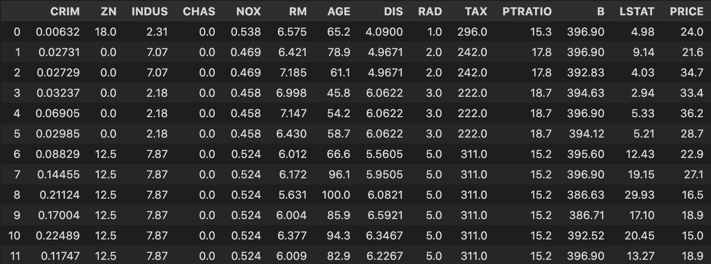
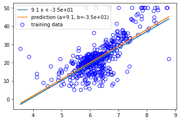
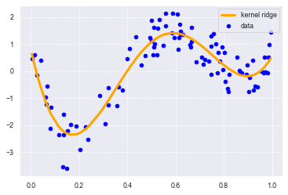
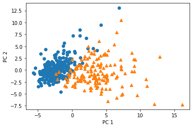
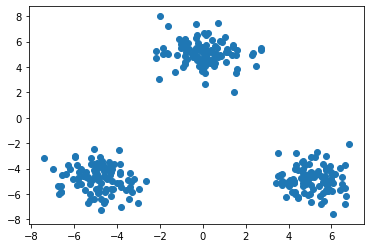
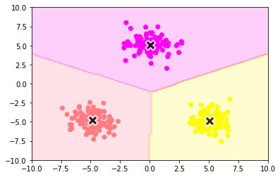

<script type="text/x-mathjax-config">MathJax.Hub.Config({tex2jax:{inlineMath:[['\$','\$'],['\\(','\\)']],processEscapes:true},CommonHTML: {matchFontHeight:false}});</script>
<script type="text/javascript" async src="https://cdnjs.cloudflare.com/ajax/libs/mathjax/2.7.1/MathJax.js?config=TeX-MML-AM_CHTML"></script>


機械学習
============
# 機械学習モデリングプロセス

- 問題設定
  - 最も重要
  - 機械学習が必要なのか
- データ選定
  - GIGO(Garbage in Garbage out)になってないか
- データの前処理
  - 時間の90％
- 機械学習モデルの選定（ここのメイン）

# 扱う内容について
- 教師なし学習と教師あり学習について

# 機械学習

- 機械学習の定義
  - トム・ミッチェルなどによる定義

# 線形回帰モデル
- 線形回帰とは
  - ざっくりいえば比例、超平面、など
    > \\\(y=ax+b\\\)
      - ....（2次元）
    > \\\(y=ax+by+c\\\)
      - ....（3次元）
  - 一般には
    > \\\(y=a_0 + \displaystyle \sum\ ax\\\)
- 回帰問題
  - ある入力（離散あるいは連続）から出力（連続値）を予測
  - バプニックの原理
    - 回帰ではランキング的なことも考えることができるが、回帰はランキングだけでなく、差なんかも考えている。
    - なので、ランキングを回帰問題で考えることは、途中でより難しい問題を考えていることであり、望ましくない。
    - 密度比推定で調べると面白いし差が色々得られる。東京大学の杉山先生など
  - 入力とパラメータの内積として、モデルを表せる。
  - 誤差について
    - ホワイトノイズだけでなく、説明変数で拾い切れていない要素もここに入る。
  - 入出力全体をベクトルや線形代数を使ってまとめて表現することがある。
  - y＝Xw として、Xは計画行列（デザインマトリックス）といわれる。
- データの分割とモデルの汎化性能測定について
  - 汎化(Generalization)のために推論データと検証データに分割させる
  - クロスバリデーションなど
- 線形回帰のモデルのパラメータの推定
  - 最小二乗法で推定
  > \\\(\displaystyle \sum\ (y_{\hat{i}} - y_i)^2 = \displaystyle \sum\ (ε_i)^2\\\)
  - なぜなら
  > \\\(y_{\hat{i}} = w_0 + w_1 x_i\\\)
   \\\(y_i = w_0 + w_1 x_i + ε_i\\\)
  - 注意点として、二乗誤差は外れ値に弱い
  - Huber損失、Tukey損失というのように外れ値に頑健な機械学習を考えることはできる。（イラストで学ぶ機械学習）
  > \\\(MSE_i = J(w) = \displaystyle \frac{\sum\ ε_i^2}{n}\\\)
  - 上記が今我々が予測したいこと
  - MSEが最小となるwの値を微分して求める。
  > \\\(\displaystyle \frac{\partial}{\partial w} \left \lbrace \frac{1}{n_{train}}\sum_{i=1}^{n_{train}} \left ( \boldsymbol{x_{i}^{T} w} - \boldsymbol{y_{i}} \right )^2 \right \rbrace =0\\\)
  - 変形して
  > \\\(\displaystyle \frac{\partial}{\partial w} \left \lbrace \frac{1}{n_{train}} \left ( \boldsymbol{Xw} - \boldsymbol{y} \right )^T \left ( \boldsymbol{Xw} - \boldsymbol{Y} \right )\right \rbrace =0\\\)
  > \\\(\displaystyle \frac{\partial}{\partial w} \left \lbrace \frac{1}{n_{train}} \left ( \boldsymbol{w^{T}X^{T}Xw} - \boldsymbol{Y^{T}Xw} - \boldsymbol{w^{T}X^{T}Y} - \boldsymbol{Y^{T}Y} \right )\right \rbrace =0\\\)
  - （）の中の第２項と第３項は展開すれば同じもの。
  - 微分すると、
  > \\\(\displaystyle \frac{1}{n_{train}} \left ( 2\boldsymbol{X^{T}Xw} - 2\boldsymbol{X^{T}y} \right )=0\\\)
  - これには以下を利用（Aが行列、wが横ベクトル）
    > \\\(\displaystyle \frac{\partial(w^{T}Aw)}{\partial w} = (A^{T} +A)w\\\)
    > \\\(\displaystyle \frac{\partial (Aw)}{\partial w} = Aw\\\)
    - matrix cookbookを参照しても良い。
  - 解は
  > \\\(\displaystyle \boldsymbol{\hat{w}} =\left ( \boldsymbol{X^{T}X} \right )^{-1}\boldsymbol{X^{T}y}\\\)
  - yの予測値は以下になる。
  > \\\(\displaystyle \boldsymbol{\hat{y}} =\boldsymbol{X} \left ( \boldsymbol{X^{T}X} \right )^{-1}\boldsymbol{X^{T}y}\\\)
  - \\\(\displaystyle \boldsymbol{X} \left ( \boldsymbol{X^{T}X} \right )^{-1}\boldsymbol{X^{T}}\\\)の部分は真の値yから予測値へ射映させる行列という意味で射影行列という。
  - 逆行列が常に存在しない問題について
    - 存在する条件は？
      - ムーアペンローズの一般化逆行列
    - 存在しない時はどうするか
      - 逆行列っぽいものを持ってくる
- データを動かす。
  - DLも含めて機械学習は外装問題にとても弱いと考えた方が良い。

# 実践

-  Bostonデータセットを使って線形回帰を記述する。
```python
# ボストンの住宅データをbostonというインスタンスにインポート
from sklearn.datasets import load_boston
boston = load_boston()

# データの中身を確認
# カラム'target'は住宅価格であるから必ず正の値になる。業務などではこのあたりの確認(前処理)やデータの上限などの確認が重要。
print(boston['target'])
# > [24.  21.6 34.7 33.4 36.2 ... 17.5 20.2 18.2 13.6 19.6 15.2 14.5 15.6 13.9 16.6 14.8 ... 11.9]

# データフレームの作成
# カラムに特徴量の名称、データにデータ内容を持つデータフレームを作成
df = DataFrame(data=boston.data, columns=boston.feature_names)

# 目的変数をDataFrameに追加
df['PRICE'] = np.array(boston.target)

# 最初の12行を出力
# ぱっと見でおかしなデータがないか確認してみる
df.head(12)
```


各項目の説明は以下
> CRIM： 町別の「犯罪率」
> ZN： 25,000平方フィートを超える区画に分類される住宅地の割合＝「広い家の割合」
> INDUS： 町別の「非小売業の割合」
> CHAS： チャールズ川のダミー変数（区画が川に接している場合は1、そうでない場合は0）＝「川の隣か」
> NOX： 「NOx濃度（0.1ppm単位）」＝一酸化窒素濃度（parts per 10 million単位）。この項目を目的変数とする場合もある
> RM： 1戸当たりの「平均部屋数」
> AGE： 1940年より前に建てられた持ち家の割合＝「古い家の割合」
> DIS： 5つあるボストン雇用センターまでの加重距離＝「主要施設への距離」
> RAD： 「主要高速道路へのアクセス性」の指数
> TAX： 10,000ドル当たりの「固定資産税率」
> PTRATIO： 町別の「生徒と先生の比率」
> B： 「1000(Bk - 0.63)」の二乗値。Bk＝「町ごとの黒人の割合」を指す
> LSTAT： 「低所得者人口の割合」
> MEDV：「住宅価格」（1000ドル単位）の中央値。通常はこの数値が目的変数として使われる

- 単回帰の説明変数と目的変数を設定。
- 今回は1戸当たりの「平均部屋数」から住宅価格を予測する。

```python
# 説明変数
data = df.loc[:, ['RM']].values
data_np = df.loc[:,'RM'].values

# 目的変数
target = df.loc[:, 'PRICE'].values
```

- 学習
- Numpyでの実装

```python
#numpy実装の回帰(Bostonデータ)
cov2, a2, b2 = train(data_np, target)
print("cov: {}".format(cov2))
print("coef: {}".format(a2))
print("intercept: {}".format(b2))
```

- 結果
> cov: [[ 0.49269522  4.48456555]
>  [ 4.48456555 84.41955616]]
> coef: 9.102108981180306
> intercept: -34.67062077643854

- SKLEARNでの実装

```python
#skl実装の回帰(Bostonデータ)
reg2 = model.fit(data.reshape(-1,1), target.reshape(-1, 1))

print("coef_: {}".format(reg2.coef_))
print("intercept_: {}".format(reg2.intercept_))
```

- 結果を図より確認する。
> coef_: [[9.10210898]]
> intercept_: [-34.67062078]

- 双方とも結果は同じことを確認。 
- 図にあらわして結果を確認。

```python
ys_pred2 = a2 * data_np + b2
ys_true2 = 9 * data_np - 35

plt.scatter(data_np, target, facecolor="none", edgecolor="b", s=50, label="training data")
plt.plot(data_np, ys_true2, label="{:.2} x + {:.2}".format(a2, b2))
plt.plot(data_np, ys_pred2, label="prediction (a={:.2}, b={:.2})".format(a2, b2))
plt.legend()
plt.show()
```


- 予測した線形は分布から大きく外れていないことがわかった。
- 次は重回帰を実施する。
- まずはデータの作成

```python
#カラムを指定してデータを表示
df[['CRIM', 'RM']].head()

# 説明変数
data2 = df.loc[:, ['CRIM', 'RM']].values
# 目的変数
target2 = df.loc[:, 'PRICE'].values
```

- 学習の実施

```python
# オブジェクト生成
model2 = LinearRegression()
# fit関数でパラメータ推定
model2.fit(data2, target2)
model2.predict([[0.2, 7]])
# 単回帰の回帰係数と切片を出力
print('推定された回帰係数: %.3f, 推定された切片 : %.3f' % (model.coef_, model.intercept_))
# 重回帰の回帰係数と切片を出力
print(model2.coef_)
print(model2.intercept_)

```

- 各係数と切片の値は以下。
> [-0.26491325  8.39106825]
> -29.24471945192992
- 値の評価のため、最小２乗誤差および決定係数を求める。

```python
# train_test_splitをインポート
from sklearn.model_selection import train_test_split
# 70%を学習用、30%を検証用データにするよう分割
X_train, X_test, y_train, y_test = train_test_split(data2, target2, 
test_size = 0.3, random_state = 666)
# 学習用データでパラメータ推定
model.fit(X_train, y_train)
# 作成したモデルから予測（学習用、検証用モデル使用）
y_train_pred = model.predict(X_train)
y_test_pred = model.predict(X_test)

# 平均二乗誤差を評価するためのメソッドを呼び出し
from sklearn.metrics import mean_squared_error
# 学習用、検証用データに関して平均二乗誤差を出力
print('MSE Train : %.3f, Test : %.3f' % (mean_squared_error(y_train, y_train_pred), mean_squared_error(y_test, y_test_pred)))
# 学習用、検証用データに関してR^2を出力
print('R^2 Train : %.3f, Test : %.3f' % (model.score(X_train, y_train), model.score(X_test, y_test)))

```

> MSE Train : 40.586, Test : 34.377
> R^2 Train : 0.549, Test : 0.518

- 決定係数が0.5前後なのである程度の信頼度のある予測値になっていることがわかる。


====================================
# 非線形回帰モデル

- 線形回帰でのxの代わりにlogやsinやcosなどの非線形の関数を使う。φ(x)とか
- wについては線形のまま(linear in parameter)
- なので正確には「線形モデルによる非線形回帰」
- 最小二乗法の解も先ほどと同様に求まる。
  - 線形代数だと、y=Xw　→ y=Φwでほとんど同じだから。
  > \\\(\displaystyle \boldsymbol{\hat{w}} =\left ( \boldsymbol{\Phi^{T}\Phi} \right )^{-1}\boldsymbol{\Phi^{T}y}\\\)
  > \\\(\displaystyle \boldsymbol{\hat{y}} =\boldsymbol{\Phi} \left ( \boldsymbol{\Phi^{T}\Phi} \right )^{-1}\boldsymbol{\Phi^{T}y}\\\)
- 高次関数にすればするほど説明力が高いのか、という問題。
  - 4次関数以上で近似すると結果はあまり変わらない。
    - オッカムの剃刀
  - アンダーフィッティングとオーバーフィッティングの問題。
    - 汎化できないと意味がない。
  - 不要な基底関数を削除するなど。
    - 赤池情報量基準などを採用
  - 正則化法
    - 以下のような行列Xを考える。
    - ２列目と３列目の値が平行に近い。このような場合、\\\((X^{T} X)^{-1}\\\)の値が大きくなってしまう。
    - このような場合は適切な値を求められるように罰則項を適用する。
  - >\\\(E(W) = J(W) + λw^{T}w\\\)
    - 他の書き方では
    > \\\(\displaystyle \boldsymbol{S_{\gamma }} = \left (\boldsymbol{Y} -\boldsymbol{\Phi w} \right )^T \left (\boldsymbol{Y} - \boldsymbol{\Phi w} \right ) + \gamma\boldsymbol{S}(\boldsymbol{w})\\\)
    - 上記は解きたいmin MSE s.t.R(w)<=r をKKT条件で書き換えたもの

\\\(X =\begin{pmatrix}
1 & 2  & 4   \\\\  
1 & 3  & 5.9 \\\\  
1 & 4  & 8.1 \\\\  
\end{pmatrix}
\\\)


- Lasso回帰とRidge回帰
  - Lasso回帰はいくつかのパラメータを正解にゼロに予想する。
    - そのため、不要な係数を簡単に削除することができる。
  - Ridge回帰はパラメータを0に近づけるように推定するので、いらない項目も０にならずに残る可能性があるが、正確性はLassoより高い場合が多い（？）。
  - 正則化によってオーバーフィッティングを抑えることができる
- 正則化以外で過学習を防ぐ方法
  - 単純に学習量を増やす。５０個のパラメータを用意しても、10000個のデータを用意すれば過学習にはならない。というような形
- こうやって求めたいくつかのモデルのうち、採用するモデルは交差検証法で決定。

- 検証の手法
  - ホールドアウト法
    - 学習データと検証データを最初に固定。検証の間に入れ換えない。
    - 手元のデータが大量にあれば使える。
    - 手元にデータが少ない時に問題が起こる
    - 外れ値が検証データに入ると、外れ値にフィットするようなモデルが得られる。
  - 交差検証法
    - 学習と検証を繰り返す。
    - 各モデルに対してCV値を求め、CV値が一番低いモデルを採用する。
    - CV値（検証誤差）には、基本的に二乗誤差を使う。
- グリッドサーチについて
  - ハイパーパラメータの自動決定手法
  - よくあるものはいくつか候補を用意して、候補の組み合わせごとに確かめていく。
  - 作業して、作ってみるのは悪いことではない。
  - 実践ではベイズ最適化でなされることが多い。
# 実践
- データ作成

```python
import numpy as np
import matplotlib.pyplot as plt
import seaborn as sns
%matplotlib inline
#seaborn設定
sns.set()
#背景変更
sns.set_style("darkgrid", {'grid.linestyle': '--'})
#大きさ(スケール変更)
sns.set_context("paper")
n=100

def true_func(x):
    z = 1-48*x+218*x**2-315*x**3+145*x**4
    return z 

def linear_func(x):
    z = x
    return z 

# 真の関数からノイズを伴うデータを生成

# 真の関数からデータ生成
data = np.random.rand(n).astype(np.float32)
data = np.sort(data)
target = true_func(data)

# 　ノイズを加える
noise = 0.5 * np.random.randn(n) 
target = target  + noise

# ノイズ付きデータを描画

plt.scatter(data, target)

plt.title('NonLinear Regression')
plt.legend(loc=2)
```


- 線型ではないデータを作成することができた。
- 実装する。今回はカーネル回帰にリッジ回帰の要素を加えた、カーネルリッジ回帰を利用する。

```python
from sklearn.kernel_ridge import KernelRidge

clf = KernelRidge(alpha=0.0002, kernel='rbf')
clf.fit(data, target)

p_kridge = clf.predict(data)

plt.scatter(data, target, color='blue', label='data')

plt.plot(data, p_kridge, color='orange', linestyle='-', linewidth=3, markersize=6, label='kernel ridge')
plt.legend()
#plt.plot(data, p, color='orange', marker='o', linestyle='-', linewidth=1, markersize=6)

```

- うまくデータにあったモデルを作れていることがわかる。


====================================

# ロジスティック回帰モデル

- 各クラスに当てはまる確率を直接予測する。\\\(p（C_k\|x)\\\)を直接モデル化
  - 識別的アプローチ(SVMなどは識別の関数の構成、という形をとることもある。)
  - 一方で生成的アプローチというものも存在する
  - \\\(p(C_k)\\\)と\\\(p(x\|C_k)\\\)をモデル化し、その後Bayesの定理を用いる。
    > \\\(\displaystyle p(C_k\|x)= \frac{p(C_k,x)}{p(x)} = \frac{p(x,C_k)}{p(x)} = \frac{p(x\|C_k)p(C_k)}{p(x)}\\\) 
    - 生成的アプローチは幅を持って推定できるのと、新たなデータを生み出せる可能性があるので、生成的アプローチを実施している。
  - ロジスティック関数は状態空間から[0, 1]に確率を潰している。
  - 識別的アプローチは確率を与えてくれるので、確率が0.8以上で１、0.2以下で0と判定する、それ以外は判定を保留する、というようなことができる。SVMなどの識別モデルではこういったことはできない（難しい）。
  - 生成的アプローチに関して、ここで尤度関数を考える。尤度関数は、ある分布（例えばベルヌーイ分布）を想定して、データを固定し、パラメータを変化させて、尤度関数を最大化するようなパラメータを選択する。これを最尤推定という。
    - 機械学習においては、既知の過去の試行であるデータを元に最適なパラメータ(例えば確率p)を推定するので、最尤推定の枠組みに収まると考える。最小二乗法も最尤法の中の一つである。
- ロジスティック関数の最尤推定の話
  - sigmoid関数の微分はsigmoid関数で表せる。
  > \\\( \displaystyle \frac{\partial \sigma (x)} {\partial x} = \frac{\partial } {\partial x} \left \lbrace \frac{1}{1 + \exp(-ax)^2} \right \rbrace =a\sigma(x)\left ( 1 - \sigma(x) \right )\\\)
  - ロジスティック回帰の分布についてはベルヌーイ分布として、以下のように表せる。
  > \\\( \displaystyle P(y_1,y_2,\cdot \cdot \cdot, y_n \|w_1,w_2,\cdot \cdot \cdot, w_m) = \prod_{i=1}^{n} p_i^{y_i} (1-p_i)^{(1-y_i)}\\\)
  - p_iはsigmoid関数（logistic関数）なので
  > \\\(\displaystyle = \prod_{i=1}^{n} \sigma(\boldsymbol{w^T x_i})^{y_i} (1-\sigma(\boldsymbol{w^T x_i}))^{(1-y_i)}\\\)
  - これをパラメータwの式とすると、尤度関数L(w)として考えることができる。
  - この時最適なパラメータwを考える。
- 対数尤度関数を作る意味
  - １つは掛け算から足し算にすることで計算が簡単になる。
  - もう一つ（実装上においては最も）重要なのは、確率の掛け算による桁落ちを防ぐ。
- 損失関数として対数尤度をとった計算は以下。
  > \\\(E(\boldsymbol{w}) = - log(L(\boldsymbol{w})) = - \displaystyle\sum_{i=1}^n \left \lbrace y_ilog(p_i) + (1 - y_i)log(1 - p_i) \right \rbrace\\\)
- ここで
  > \\\(\displaystyle p_{i} = \sigma(\boldsymbol w^T \boldsymbol x_{i}) = \frac{1}{1+\exp(\boldsymbol w^T \boldsymbol x_i)}\\\)
  > \\\(\displaystyle z_{i} = \boldsymbol{w}^{T}\boldsymbol{x}_{i}\\\)
- とする。
- 損失関数の一回微分が0となる値を求める。
  > \\\(\displaystyle \frac{\partial E(\boldsymbol w)}{\partial \boldsymbol w} = -\sum_{i=1}^n \frac{\partial E_i}{\partial p_i}\frac{\partial p_i}{\partial z_i}\frac{\partial z_i}{\partial \boldsymbol w} = \sum_{i=1}^n(\frac{y_i}{p_i} - \frac{1 - y_i}{1 - p_i})p_i(1 - p_i)\boldsymbol x_i = \sum_{i=1}^n(y_i - p_i)\boldsymbol x_i\\\)
- 勾配降下法では、この値を基準にしてパラメータを更新していく。
  > \\\(\displaystyle \boldsymbol w^{k+1} = \boldsymbol w^k + \eta \sum_{i=1}^n(y_i-p_i)\boldsymbol x_i \\\)
  - (\\\(\eta\\\)は調整項)
- 確率的勾配降下法では以下のような式になる。
  > \\\(\displaystyle \boldsymbol w^{k+1} = \boldsymbol{w^k} + \eta (y_i-p_i)\boldsymbol{x_i}\\\)
  - 確率的勾配降下法ではデータを一つずつランダムに選んでパラメータを更新される。
  - 更新を繰り返して、解を探索することができる。

# 実践
- タイタニックデータを使い、ロジスティック回帰を実施する。
- Fareのみの一変数で作成
```python
#運賃だけのリストを作成
data1 = titanic_df.loc[:, ["Fare"]].values
#生死フラグのみのリストを作成
label1 =  titanic_df.loc[:,["Survived"]].values
from sklearn.linear_model import LogisticRegression
model=LogisticRegression()
model.fit(data1, label1)
model.predict([[61]])

X_test_value = model.decision_function(data1) 
print (model.intercept_)
print (model.coef_)
```
- 切片及び係数は以下
> [-0.94131796]
> [[0.01519666]]
- Fare及びPclass_Genderという合成変数で作成。
```python
titanic_df['Gender'] = titanic_df['Sex'].map({'female': 0, 'male': 1}).astype(int)
titanic_df['Pclass_Gender'] = titanic_df['Pclass'] + titanic_df['Gender']
#運賃とジェンダーのルールを作成
data2 = titanic_df.loc[:, ["AgeFill", "Pclass_Gender"]].values
#生死フラグのみのリストを作成
label2 = titanic_df.loc[:,["Survived"]].values
model2 = LogisticRegression()
model2.fit(data2, label2)
```
- 切片及び係数は以下
> [3.42539711]
> [[-0.00221662 -1.33656736]]

```python
from sklearn.model_selection import train_test_split
traindata1, testdata1, trainlabel1, testlabel1 = train_test_split(data1, label1, test_size=0.2)
traindata1.shape
trainlabel1.shape
traindata2, testdata2, trainlabel2, testlabel2 = train_test_split(data2, label2, test_size=0.2)
traindata2.shape
trainlabel2.shape
#本来は同じデータセットを分割しなければいけない。(簡易的に別々に分割している。)
eval_model1=LogisticRegression()
eval_model2=LogisticRegression()
predictor_eval1=eval_model1.fit(traindata1, trainlabel1).predict(testdata1)
predictor_eval2=eval_model2.fit(traindata2, trainlabel2).predict(testdata2)

from sklearn import metrics
print(metrics.classification_report(testlabel1, predictor_eval1))
print(metrics.classification_report(testlabel2, predictor_eval2))
```
- 一変数での Precision値、recall値、F1scoreは以下。
>               precision    recall  f1-score   support
> 
>            0       0.63      0.94      0.75       106
>            1       0.70      0.19      0.30        73
> 
>     accuracy                           0.64       179
>    macro avg       0.66      0.57      0.53       179
> weighted avg       0.66      0.64      0.57       179

- 二変数での Precision値、recall値、F1scoreは以下。
>               precision    recall  f1-score   support
> 
>            0       0.81      0.85      0.83       123
>            1       0.63      0.55      0.59        56
> 
>     accuracy                           0.76       179
>    macro avg       0.72      0.70      0.71       179
> weighted avg       0.75      0.76      0.76       179
- F1-ScoreはRecall(再現率)とPrecision(適合率)はトレードオフの関係にありこれらの調和平均をとったもの。F1-scoreの値からに変数での方が正確な予測ができていることがわかる。
- 次に混同行列を一変数、二変数で作成して詳細を確認する。

```python
from sklearn.metrics import confusion_matrix
confusion_matrix1=confusion_matrix(testlabel1, predictor_eval1)
confusion_matrix2=confusion_matrix(testlabel2, predictor_eval2)
confusion_matrix1

```
- 一変数
> array([[100,   6],
>        [ 59,  14]])

```python
confusion_matrix2

```
- 二変数
> array([[105,  18],
>        [ 25,  31]])      

- 上記より一変数では、左下のFalse Neagativeつまり本当は死亡しているのに生存していると予測してしまっている場合が多いことがわかる。


===============================================
# 主成分分析

# 主成分分析プロセス
- 多変量データの持つ構造できるだけ保ったまま、より少数の次元に線形変換（射影）する。結果、情報量を圧縮することができる。
  - 元データ : 
  >\\\(\boldsymbol x_i  = (x_{i1},x_{i2},......,x_{im}) \in \mathbb{R}\\\)
  - 平均(ベクトル) : 
  >\\\(\displaystyle \bar{\boldsymbol x} =  \frac{1}{n} \sum_{i=1}^{n} \boldsymbol{x_i}\\\)
  - データ行列 : 
  >\\\(\bar{\boldsymbol X} = (\boldsymbol x_1 - \bar{\boldsymbol x},\boldsymbol x_2 - \bar{\boldsymbol x},......,\boldsymbol x_n - \bar{\boldsymbol x})\\\)
  - 分散共分散行列 : 
  >\\\(\displaystyle \boldsymbol \Sigma = Var(\bar{\boldsymbol X}) = \frac{1}{n}  \bar{\boldsymbol X}^T \bar{\boldsymbol X}\\\)
  - 線形変換後のベクトル : 
  >\\\(\boldsymbol s_i  = (\boldsymbol s_{1j},\boldsymbol s_{2j},......, \boldsymbol s_{nj})^T = \underbrace{\bar{\boldsymbol  X} \boldsymbol a_j }_{n \times m,m \times 1}, \boldsymbol{a_j} \in \mathbb{R}^m\\\)
- 上記条件の元で線形変換後の分散を表すと以下。
  > \\\(\displaystyle Var(\boldsymbol s_j ) = \frac{1}{n}\boldsymbol{s_j^T s_j} = \frac{1}{n}( \bar{\boldsymbol X} \boldsymbol a_j)^T(\bar{\boldsymbol X}\boldsymbol a_j) = \frac{1}{n} \boldsymbol a_j^T \bar{\boldsymbol X}^T\bar{\boldsymbol X} \boldsymbol a_j  = \boldsymbol a_j^T Var(\bar{\boldsymbol X}) \boldsymbol a_j\\\)
- 情報のロスをなるべく少なくなるように圧縮
  - 分散を最大化するような軸をとる。
- 解き方としては誓約付き最適化問題としてラグランジェ関数を解く。
  - 目的関数: 
  >\\\(\displaystyle arg \max_{\boldsymbol a \in \mathbb{R}^m} = \boldsymbol a_j^T Var(\bar{\boldsymbol X}) \boldsymbol a_j\\\)
  - 制約条件: 
  >\\\(\boldsymbol a_j^T \boldsymbol a_j = 1\\\)
- 上記より導き出されるラグランジェ乗数 \\\(\lambda\\\)用いたラグランジェ関数Eは以下のようになる。
  > \\\(E(a_j) = \boldsymbol a_j^T Var(\bar{\boldsymbol X}) \boldsymbol a_j - \lambda (\boldsymbol a_j^T \boldsymbol a_j - 1)\\\)
- この関数の微分が0になる点がラグランジェ関数を最大にする係数ベクトルとなる。（関数の凸性を前提。）元のデータの分散共分散行列の固有値と固有ベクトルが、上記の制約つき最適化問題の解になる。
  > \\\(\displaystyle \frac{ \partial E(a_j) }{ \partial a_j } = 2 ar(\bar{\boldsymbol X}) \boldsymbol a_j - 2 \lambda \boldsymbol a_j = 0\\\)
  > \\\(\longrightarrow Var(\bar{\boldsymbol X}) \boldsymbol a_j = \lambda \boldsymbol a_j\\\)
- また射影先の分散は固有値に一致する。
  > \\\(\displaystyle Var(\boldsymbol s_1) = \boldsymbol a_1^T Var(\bar{\boldsymbol X}) \boldsymbol a_1 = \lambda_1 \boldsymbol a_j^T \boldsymbol a_j =\lambda_1\\\)
   
- 寄与率
  - 集約した主成分のうち、各種成分が全体の情報のうち、どれだけ保持されているのかを表す。
  - 固有値の和と元のデータの分散が一致するため寄与率の計算を実施することができる。
  - 固有値の分散は元のデータに対する固有値
    > \\\( V_{total} = \displaystyle \sum_{i=1}^{m}\ \lambda_i\\\)
  - 第k主成分の分散は主成分に対応する固有値のため、第k主成分に対する寄与率\\\(C_k\\\)は以下のように書くことができる。
    > \\\(C_k = \displaystyle \frac{\lambda_k}{\sum_{i=1}^m \lambda_i}\\\)

# 実践
- 設定
  - 乳がん検査データを利用し主成分を利用し2次元空間上に次元圧縮
  - 32次元のデータを2次元上に次元圧縮した際に、うまく判別できるかを確認
```python
import pandas as pd
from sklearn.model_selection import train_test_split
from sklearn.preprocessing import StandardScaler
from sklearn.linear_model import LogisticRegressionCV
from sklearn.metrics import confusion_matrix
from sklearn.decomposition import PCA
import matplotlib.pyplot as plt
%matplotlib inline

cancer_df = pd.read_csv('./data/cancer.csv')
cancer_df.drop('Unnamed: 32', axis=1, inplace=True)
cancer_df.head(5)

# 目的変数の抽出
y = cancer_df.diagnosis.apply(lambda d: 1 if d == 'M' else 0)

# 説明変数の抽出(使用しない)
X = cancer_df.loc[:, 'radius_mean':]

# 学習用とテスト用でデータを分離
X_train, X_test, y_train, y_test = train_test_split(X, y, random_state=0)

# 標準化
scaler = StandardScaler()
X_train_scaled = scaler.fit_transform(X_train)
X_test_scaled = scaler.transform(X_test)

# 主成分分析実施
pca = PCA(n_components=30)
pca.fit(X_train_scaled)
plt.bar([n for n in range(1, len(pca.explained_variance_ratio_)+1)], pca.explained_variance_ratio_)
```
- 寄与率は以下のようになり、第一主成分と第二主成分だけで全体の6割以上を説明できることがわかる。（２次元圧縮することに説得力あり。）

- 次元圧縮した結果を表示する。
```python
# PCA
# 次元数2まで圧縮
pca = PCA(n_components=2)
X_train_pca = pca.fit_transform(X_train_scaled)
print('X_train_pca shape: {}'.format(X_train_pca.shape))
# X_train_pca shape: (426, 2)

# 寄与率
print('explained variance ratio: {}'.format(pca.explained_variance_ratio_))
# explained variance ratio: [ 0.43315126  0.19586506]

# 散布図にプロット
temp = pd.DataFrame(X_train_pca)
temp['Outcome'] = y_train.values
b = temp[temp['Outcome'] == 0]
m = temp[temp['Outcome'] == 1]
plt.scatter(x=b[0], y=b[1], marker='o') # 良性は○でマーク
plt.scatter(x=m[0], y=m[1], marker='^') # 悪性は△でマーク
plt.xlabel('PC 1') # 第1主成分をx軸
plt.ylabel('PC 2') # 第2主成分をy軸

```


- 図を見ると、2次元圧縮後にきれいに結果の境目を確認できる。次元圧縮がうまくできていることがわかる。


==========================================
# クラスタリング

# k-means
- クラスタリングはラベルのない状況でデータをグルーピングすることができる教師なし学習。k-meansはその代表的な手法。
- k-meansのアルゴリズムは以下。
  1. 各クラスタ中心の初期値を設定。
  2. 角データ点に対して、最も近いクラスタ中心のクラスタを割り当て
  3. 各クラスタの平均ベクトルを計算。新しいクラスタ中心として割り当て。
  4. 2と３を収束するまで繰り返す。
- kはハイパーパラメータなので事前の設定が必要。
  - 初期値の置き方が大事で置き方によってパフォーマンスが変わってしまう。
  - k-meansではランダムで決まってしまうこの点を改善したのがk-means++で、クラスタ中心の初期値それぞれが近づきすぎないような初期値の設定をしている。

# 実践
- numpy 及び sklearnでそれそれ実施する。
- まずはデータの作成
```python
# ライブラリインストール

%matplotlib inline
import numpy as np
import matplotlib.pyplot as plt
def gen_data():
    x1 = np.random.normal(size=(100, 2)) + np.array([-5, -5])
    x2 = np.random.normal(size=(100, 2)) + np.array([5, -5])
    x3 = np.random.normal(size=(100, 2)) + np.array([0, 5])
    return np.vstack((x1, x2, x3))
#データ作成
X_train = gen_data()
#データ描画
plt.scatter(X_train[:, 0], X_train[:, 1])

```


まずnumpyでの実装を実施する。
```python
def plt_result(X_train, centers, xx):
    #　データを可視化
    plt.scatter(X_train[:, 0], X_train[:, 1], c=y_pred, cmap='spring')
    # 中心を可視化
    plt.scatter(centers[:, 0], centers[:, 1], s=200, marker='X', lw=2, c='black', edgecolor="white")
    # 領域の可視化
    pred = np.empty(len(xx), dtype=int)
    for i, x in enumerate(xx):
        d = distance(x, centers)
        pred[i] = np.argmin(d)
    plt.contourf(xx0, xx1, pred.reshape(100, 100), alpha=0.2, cmap='spring')

y_pred = np.empty(len(X_train), dtype=int)
for i, x in enumerate(X_train):
    d = distance(x, centers)
    y_pred[i] = np.argmin(d)

xx0, xx1 = np.meshgrid(np.linspace(-10, 10, 100), np.linspace(-10, 10, 100))
xx = np.array([xx0, xx1]).reshape(2, -1).T

plt_result(X_train, centers, xx)
```

- 上記を見ると正しく分類できていることがわかる。
- 次にSKLEARNで実装する。

```python
from sklearn.cluster import KMeans
kmeans = KMeans(n_clusters=3, random_state=0).fit(X_train)
print("cluster_centers: {}".format(kmeans.cluster_centers_))
plt_result(X_train, kmeans.cluster_centers_, xx)

```
> cluster_centers: [[ 5.09273785 -4.86667888]
>  [ 0.03846317  5.11052585]
>  [-4.8650078  -4.79725477]]


- numpyと同様に綺麗に分類されていることがわかる。


================================
# k-近傍法

# プロセス
- 最近傍のデータをk個とってきて、それらが最も多く所属するクラスに識別させる。
- kを変化させると結果が変わり、kを大きくすると決定境界は滑らかになる。
- kはハイパーパラメータなので事前の設定が必要。

# 実践
- Numpy及びSKLEARNで実行する
- まずデータを作成する。
```python
#　ライブラリのインストール
%matplotlib inline
import numpy as np
import matplotlib.pyplot as plt
from scipy import stats
def gen_data():
    x0 = np.random.normal(size=50).reshape(-1, 2) - 1
    x1 = np.random.normal(size=50).reshape(-1, 2) + 1.
    x_train = np.concatenate([x0, x1])
    y_train = np.concatenate([np.zeros(25), np.ones(25)]).astype(np.int)
    return x_train, y_train

X_train, ys_train = gen_data()
plt.scatter(X_train[:, 0], X_train[:, 1], c=ys_train)
```
- 作成したデータを図示すると下図のようになる。

- 次にNumpyで実装をする。

```python
def distance(x1, x2):
    return np.sum((x1 - x2)**2, axis=1)

def knc_predict(n_neighbors, x_train, y_train, X_test):
    y_pred = np.empty(len(X_test), dtype=y_train.dtype)
    for i, x in enumerate(X_test):
        distances = distance(x, X_train)
        nearest_index = distances.argsort()[:n_neighbors]
        mode, _ = stats.mode(y_train[nearest_index])
        y_pred[i] = mode
    return y_pred

def plt_resut(x_train, y_train, y_pred):
    xx0, xx1 = np.meshgrid(np.linspace(-5, 5, 100), np.linspace(-5, 5, 100))
    xx = np.array([xx0, xx1]).reshape(2, -1).T
    plt.scatter(x_train[:, 0], x_train[:, 1], c=y_train)
    plt.contourf(xx0, xx1, y_pred.reshape(100, 100).astype(dtype=np.float), alpha=0.2, levels=np.linspace(0, 1, 3))

n_neighbors = 3

xx0, xx1 = np.meshgrid(np.linspace(-5, 5, 100), np.linspace(-5, 5, 100))
X_test = np.array([xx0, xx1]).reshape(2, -1).T

y_pred = knc_predict(n_neighbors, X_train, ys_train, X_test)
plt_resut(X_train, ys_train, y_pred)

```

- k=3で実装しているためか、境界線がかなり歪な様子が見て取れる。
- 次にSKLEARNでも同様に実装する。


```python
xx0, xx1 = np.meshgrid(np.linspace(-5, 5, 100), np.linspace(-5, 5, 100))
xx = np.array([xx0, xx1]).reshape(2, -1).T

from sklearn.neighbors import KNeighborsClassifier
knc = KNeighborsClassifier(n_neighbors=n_neighbors).fit(X_train, ys_train)
plt_resut(X_train, ys_train, knc.predict(xx))

```

- 同様の図が出力されることが確認できた。


========================================
# サポートベクトルマシン

# 概要

- SVMとは
  - SVMは、2クラス分類問題の代表的な手法の1つで、未知データに対して高い予測精度を持つ
  - SVMはもともと2クラス分類問題のために考案されたが、その後、回帰問題や教師なし問題などへも応用されている。
  - 今回記述するSVMのことを、他の問題用のSVMと区別して、特にサポートベクトル(SV)分類(support vector classi cation)と呼ぶ
- 決定関数と分類境界
  - 一般に2クラス分類問題では、特徴ベクトルxがどちらのクラスに属するか判定するために次の決定関数(decision function)と呼ばれる関数f(x)が使われます。
  > \\\(f(x) =\boldsymbol w^T \boldsymbol x+b\\\)
  - ここでwは、特徴ベクトルxと同じ次元の数値ベクトルで、\\\(w^Tx\\\)は次のように計算されます。
  > \\\(
      \displaystyle \boldsymbol w^T \boldsymbol x=(w_1,\cdots,w_n)\left(\begin{array}{c} x_1 \cr x_2 \cr \vdots \cr x_n\end{array}\right)=w_1x_1 + w_2x_2 + \cdots + w_nx_n=\sum_{i+1}^n w_ix_i
    \\\)
  - ある入力データxに対して決定関数f(x)を計算し、その符号により2つのクラスに分類します。
  > \\\(\displaystyle
\begin{aligned} 
y= sgn f(x) =
    \begin{cases}
        +1 & (f(x) > 0) \cr
        -1 & (f(x) < 0) 
    \end{cases}
\end{aligned} \\\)
  - f(x) = 0が、特徴ベクトル \\\(\boldsymbol x= (x1, x2)^T\\\)を2つのクラスに分ける境界線になっていることが分かる。
- 線形サポートベクトル分類(ハードマージン)
  - SVMに基づいてこのn個の訓練データからパラメータw、bを決定する方法を説明していきます
  - まずは分離可能な場合を考えることにします。
  > \\\(y_if(x_i)>0  (i= 1,2,\cdots,n)\\\)
  - (正しく分類できていないデータがある場合には、そのデータ\\\((x_i, y_i)\\\)に対して\\\(sgnf(x_i)\\\)と\\\(y_i\\\)の符号が逆になっているため\\\(y_if(x_i)<0\\\)となります。
  - 分類境界を挟んで2つのクラスがどのくらい離れているかをマージン(margin)と呼びます。
  - マージンを最大化することは、分類境界f(x) = 0と分類境界から最も近くにあるデータ\\\(x_i\\\)との距離を最大化すことを表す。
  - \\\(f(x) = 0\\\)と\\\(\boldsymbol x_i\\\)の距離は、次式で表される。
  > \\\(
      \displaystyle \frac{ \|f(\boldsymbol x_i)\| }{\\|\boldsymbol w\\|}=\frac{\|\boldsymbol  w^T \boldsymbol x_i + b\|}{\\|\boldsymbol w\\|}
    \\\)
  - ここで、\\\(\\|w\\|\\\)はL2ノルム\\\(\\|w\\|=\sqrt{w_1^2+w_2^2+ \cdots + w_n^2}\\\)を表します。つまり「点と平面の距離の公式」です
  - 分類境界f(x) = 0と分類境界から最も近くにあるデータとの距離は、次のように書ける。
  > \\\(
      \displaystyle \min_{i} \frac{y_i[\boldsymbol w^t \boldsymbol x_i + b]}{\\|\boldsymbol w\\|} = \frac{1}{\\| \boldsymbol w\\|} \min_i [y_i[\boldsymbol w^t \boldsymbol x_i + b]] = \frac{M(\boldsymbol w, b)}{\\|\boldsymbol w\\|}
    \\\)
  - マージンを最大化することは、この量を最大化することと等価ですから、SVMの目的関数は次のように書ける
  > \\\(
      \displaystyle \max_{w,b} \left[ \min_{i} \frac{y_i[\boldsymbol w^t \boldsymbol x_i + b]}{\\|\boldsymbol w\\|} \right] = \max_{w,b} \frac{M(\boldsymbol w, b)}{\\|\boldsymbol w\\|}
    \\\)
  - w,bを規格化して簡潔に表して、
  > \\\(
      \displaystyle \tilde {\boldsymbol w} = \frac{\boldsymbol w}{M(\boldsymbol w , b)} ,\displaystyle \tilde b = \frac{b}{M(\boldsymbol w , b)}
    \\\)
  - するとSVMの目的関数を以下のように扱いやすい形にできる。
  > \\\(
      \displaystyle \min_{\tilde w,\tilde b} \frac{1}{2} \\|\boldsymbol {\tilde w}\\|^2 \space s.t. \space y_i[\boldsymbol {\tilde w^t} \boldsymbol x_i + \tilde b] \geq 1
    \\\)
  - (以後の簡便化のためチルダは表記しない。)
  - このような分離可能性を仮定したSV分類のことを一般にハードマージンと呼ぶ。
- 線形サポートベクトル分類(ソフトマージン）
  - 仮定をなくし、SV分類を分離可能でないデータに適用できるように拡張する。このようなタスクは、前のセクションのハードマージンに対して、ソフトマージン(soft margin)と呼ばれる。
  - \\\(y_i[\boldsymbol w^t \boldsymbol x_i + b] \geq 1- \xi_i(i= 1,\cdots , n)\\\)
  - \\\(\xi_i\\\)はマージン内に入るデータや誤分類されたデータに対する誤差を表す変数となっており、スラック変数(slack variable)と呼ぶ。
  > \\\(
      \displaystyle \min_{w,b,\xi}\left[ \frac{1}{2} \\|\boldsymbol w\\|^2 + C \sum_{i=1}^n \xi_i\right] \space s.t. \space y_i[\boldsymbol w^t \boldsymbol x_i + b] \geq 1 - \xi_i, \space \xi_i \geq 0
    \\\)
- SVMにおける双対表現
  - 上記のハードマージン、ソフトマージンの最適化問題は、SV分類の主問題と呼ばれる。この主問題を解けば分類境界を決定でキルが、SV分類ではこの主問題と等価な双対問題の方を解くことが一般的。理由は以下。
    - 主問題と比べて双対問題の方が変数を少なくできる
    - 分類境界の非線形化を考える上で双対問題の形式(双対形式)の方が有利となる
  - 双対表現についてはまず次のラグランジュ関数を考える。
  > \\\(
      L(\displaystyle \boldsymbol w,b,\boldsymbol \xi,\boldsymbol \alpha,\boldsymbol \mu) = \frac{1}{2} \\|\boldsymbol w\\|^2 + C \sum_{i=1}^n \xi_i - \sum_{i=1}^n \alpha_i \left[y_i[\boldsymbol w^t \boldsymbol x_i + b] - 1 + \xi_i\right] - \sum_{i=1}^n \mu_i\xi_i
    \\\)
  - ここで、\\\(\alpha_i \geq 0, \space \mu_i \geq 0 \space (i = 1, \cdots, n), \boldsymbol \alpha = (\alpha_1, \cdots, \alpha_n)^T, \space \mu = (\mu_1, \cdots, \mu_n)^T )\\\)
  - 元の最適化問題に登場する変数\\\(\boldsymbol w, b,\boldsymbol \xi\\\)についての主変数と呼び、新たに導入した\\\(\boldsymbol \alpha, \boldsymbol \mu\\\)のことを双対変数と呼ぶ。
- 双対問題の導出
  - 双対問題は上記ラグランジェ関数を用いて以下のように定式化される。
  > \\\(
      \displaystyle \max_{\boldsymbol \alpha, \boldsymbol \mu} \min_{\boldsymbol w, b,\boldsymbol \xi} L(\displaystyle \boldsymbol w,b,\boldsymbol \xi,\boldsymbol \alpha,\boldsymbol \mu)
    \\\)
  - 解を求めると以下のようになる。
  > \\\(
      \displaystyle \max_{\boldsymbol \alpha, \boldsymbol \mu} \min_{\boldsymbol w, b,\boldsymbol \xi} L(\displaystyle \boldsymbol w,b,\boldsymbol \xi,\boldsymbol \alpha,\boldsymbol \mu) =
    \\\)
  > \\\(
      \displaystyle \max_{\boldsymbol \alpha, \boldsymbol \mu} L(\displaystyle \boldsymbol w^\ast,b^\ast,\boldsymbol \xi^\ast,\boldsymbol \alpha,\boldsymbol \mu) =
    \\\)
  > \\\(
      \displaystyle \max_{\boldsymbol \alpha} \left[ - \frac{1}{2} \sum_{i=1}^n \sum_{j=1}^n \alpha_i \alpha_j y_i y_j \boldsymbol x_i^T \boldsymbol x_i + \sum_{i=1}^n \alpha_i \right]
    \\\)
    \\\(
        \displaystyle s.t. \space \sum_{i=1}^n \alpha_i y_i = 0, 0 \leq \alpha_i \leq C \space (i = 1, \cdots, n)
    \\\)
  - ちなみに主問題は以下のように表現できる。
  > \\\(
      \displaystyle \min_{\boldsymbol w, b,\boldsymbol \xi} L(\displaystyle \boldsymbol w,b,\boldsymbol \xi,\boldsymbol \alpha^\ast,\boldsymbol \mu^\ast)
    \\\)

- 主問題と双対問題の関係
  - 主問題と双対問題は最適解であるラグランジュ関数の鞍点に対して異なる方向からアプローチしている方法と理解できる。
- カーネルを用いた非線形分離への拡張
  - ここまで線形SV分類を考えてきたが、データ分布によっては線形分離ではうまくいかないケースが出てくる。
  - このようなケースに対しては、SVMでは特徴ベクトルを非線形変換して、その変換した空間で分類を行う、「カーネルトリック」呼ばれる手法が用いられる。
  - 非線形変換する関数を\\\(\boldsymbol \phi(\boldsymbol x)\\\)として、SV分類の目的関数は以下のように変形することができる。
  > \\\(\displaystyle \max_{\boldsymbol \alpha} \left[ - \frac{1}{2} \sum_{i=1}^n \sum_{j=1}^n \alpha_i \alpha_j y_i y_j \boldsymbol \phi(\boldsymbol x_i)^T \boldsymbol \phi(\boldsymbol x_i) + \sum_{i=1}^n \alpha_i \right]\\\) 
  - このまま上記問題を解くことは\\\(\boldsymbol \phi(\boldsymbol x_i)^T \boldsymbol \phi(\boldsymbol x_i)\\\)の内積部分の計算量が莫大になるため困難。これを簡略化するテクニックがカーネルトリック。具体的には内積部分をカーネル関数で置き換える。
  > \\\(K(\boldsymbol x_i \boldsymbol x_j)= \boldsymbol \phi(\boldsymbol x_i)^T \boldsymbol \phi(\boldsymbol x_i)\\\)
  - 具体形なカーネル関数としては以下の３つがある。
    - 多項式カーネル
    > \\\(K(\boldsymbol x_i \boldsymbol x_j)= \left[ \boldsymbol x_i^T \boldsymbol x_j + c \right]^d\\\)
    - ガウスカーネル
    > \\\(K(\boldsymbol x_i \boldsymbol x_j)= \exp( - \gamma \\|\boldsymbol x_i - \boldsymbol x_j\\|^2)\\\)
    - シグモイドカーネル
    > \\\(K(\boldsymbol x_i \boldsymbol x_j)=  \tanh(b \boldsymbol x_i^T \boldsymbol x_j + c)\\\) 

# 実践

- まずはSVを使った線型分離を実施する。
- データをまず作る。

```python
%matplotlib inline
import numpy as np
import matplotlib.pyplot as plt
def gen_data():
    x0 = np.random.normal(size=50).reshape(-1, 2) - 2.
    x1 = np.random.normal(size=50).reshape(-1, 2) + 2.
    X_train = np.concatenate([x0, x1])
    ys_train = np.concatenate([np.zeros(25), np.ones(25)]).astype(np.int)
    return X_train, ys_train
X_train, ys_train = gen_data()
plt.scatter(X_train[:, 0], X_train[:, 1], c=ys_train)
```

- 作られたデータは下記のようになる。


```python
# 学習
t = np.where(ys_train == 1.0, 1.0, -1.0)

n_samples = len(X_train)
# 線形カーネル
K = X_train.dot(X_train.T)

eta1 = 0.01
eta2 = 0.001
n_iter = 500

H = np.outer(t, t) * K

a = np.ones(n_samples)
for _ in range(n_iter):
    grad = 1 - H.dot(a)
    a += eta1 * grad
    a -= eta2 * a.dot(t) * t
    a = np.where(a > 0, a, 0)

# 予測
index = a > 1e-6
support_vectors = X_train[index]
support_vector_t = t[index]
support_vector_a = a[index]

term2 = K[index][:, index].dot(support_vector_a * support_vector_t)
b = (support_vector_t - term2).mean()

xx0, xx1 = np.meshgrid(np.linspace(-5, 5, 100), np.linspace(-5, 5, 100))
xx = np.array([xx0, xx1]).reshape(2, -1).T

X_test = xx
y_project = np.ones(len(X_test)) * b
for i in range(len(X_test)):
    for a, sv_t, sv in zip(support_vector_a, support_vector_t, support_vectors):
        y_project[i] += a * sv_t * sv.dot(X_test[i])
y_pred = np.sign(y_project)

# 訓練データを可視化
plt.scatter(X_train[:, 0], X_train[:, 1], c=ys_train)
# サポートベクトルを可視化
plt.scatter(support_vectors[:, 0], support_vectors[:, 1],
                    s=100, facecolors='none', edgecolors='k')
# 領域を可視化
#plt.contourf(xx0, xx1, y_pred.reshape(100, 100), alpha=0.2, levels=np.linspace(0, 1, 3))
# マージンと決定境界を可視化
plt.contour(xx0, xx1, y_project.reshape(100, 100), colors='k',
                     levels=[-1, 0, 1], alpha=0.5, linestyles=['--', '-', '--'])

# マージンと決定境界を可視化
plt.quiver(0, 0, 0.1, 0.35, width=0.01, scale=1, color='pink')
```

- 結果としては下図のように線型境界で分類することができた。


- 次に線型分離不可能な場合をrbfカーネルを使って分離する。
- まず学習データを作る。

```python
factor = .2
n_samples = 50
linspace = np.linspace(0, 2 * np.pi, n_samples // 2 + 1)[:-1]
outer_circ_x = np.cos(linspace)
outer_circ_y = np.sin(linspace)
inner_circ_x = outer_circ_x * factor
inner_circ_y = outer_circ_y * factor

X = np.vstack((np.append(outer_circ_x, inner_circ_x),
               np.append(outer_circ_y, inner_circ_y))).T
y = np.hstack([np.zeros(n_samples // 2, dtype=np.intp),
               np.ones(n_samples // 2, dtype=np.intp)])
X += np.random.normal(scale=0.15, size=X.shape)
x_train = X
y_train = y

plt.scatter(x_train[:,0], x_train[:,1], c=y_train)
```


- RBFカーネルを用いて非線形で分離する。 
```python
# 学習
def rbf(u, v):
        sigma = 0.8
        return np.exp(-0.5 * ((u - v)**2).sum() / sigma**2)
    
X_train = x_train
t = np.where(y_train == 1.0, 1.0, -1.0)

n_samples = len(X_train)
# RBFカーネル
K = np.zeros((n_samples, n_samples))
for i in range(n_samples):
    for j in range(n_samples):
        K[i, j] = rbf(X_train[i], X_train[j])

eta1 = 0.01
eta2 = 0.001
n_iter = 5000

H = np.outer(t, t) * K

a = np.ones(n_samples)
for _ in range(n_iter):
    grad = 1 - H.dot(a)
    a += eta1 * grad
    a -= eta2 * a.dot(t) * t
    a = np.where(a > 0, a, 0)

# 予測
index = a > 1e-6
support_vectors = X_train[index]
support_vector_t = t[index]
support_vector_a = a[index]

term2 = K[index][:, index].dot(support_vector_a * support_vector_t)
b = (support_vector_t - term2).mean()

xx0, xx1 = np.meshgrid(np.linspace(-1.5, 1.5, 100), np.linspace(-1.5, 1.5, 100))
xx = np.array([xx0, xx1]).reshape(2, -1).T

X_test = xx
y_project = np.ones(len(X_test)) * b
for i in range(len(X_test)):
    for a, sv_t, sv in zip(support_vector_a, support_vector_t, support_vectors):
        y_project[i] += a * sv_t * rbf(X_test[i], sv)
y_pred = np.sign(y_project)

# 訓練データを可視化
plt.scatter(x_train[:, 0], x_train[:, 1], c=y_train)
# サポートベクトルを可視化
plt.scatter(support_vectors[:, 0], support_vectors[:, 1],
                    s=100, facecolors='none', edgecolors='k')
# 領域を可視化
plt.contourf(xx0, xx1, y_pred.reshape(100, 100), alpha=0.2, levels=np.linspace(0, 1, 3))
# マージンと決定境界を可視化
plt.contour(xx0, xx1, y_project.reshape(100, 100), colors='k',
                     levels=[-1, 0, 1], alpha=0.5, linestyles=['--', '-', '--'])
```


- 上図のようにRBFカーネルを使うことで非線形で分離することができた。
- 最後に領域が重なった２つのデータを分離できるか試みる。これまでのハードマージンの手法では分離できないが、ソフトマージンを用いることで分離できる。
- 上２つ同様にデータをまず作成する。

```python
x0 = np.random.normal(size=50).reshape(-1, 2) - 1.
x1 = np.random.normal(size=50).reshape(-1, 2) + 1.
x_train = np.concatenate([x0, x1])
y_train = np.concatenate([np.zeros(25), np.ones(25)]).astype(np.int)

plt.scatter(x_train[:, 0], x_train[:, 1], c=y_train)
```

- 下記のように領域の重なったデータを作成できたことがわかる。

- ソフトマージンのSVMで学習を実施する。

```python
X_train = x_train
t = np.where(y_train == 1.0, 1.0, -1.0)

n_samples = len(X_train)
# 線形カーネル
K = X_train.dot(X_train.T)

C = 1
eta1 = 0.01
eta2 = 0.001
n_iter = 1000

H = np.outer(t, t) * K

a = np.ones(n_samples)
for _ in range(n_iter):
    grad = 1 - H.dot(a)
    a += eta1 * grad
    a -= eta2 * a.dot(t) * t
    a = np.clip(a, 0, C)

# 予測
index = a > 1e-8
support_vectors = X_train[index]
support_vector_t = t[index]
support_vector_a = a[index]

term2 = K[index][:, index].dot(support_vector_a * support_vector_t)
b = (support_vector_t - term2).mean()

xx0, xx1 = np.meshgrid(np.linspace(-4, 4, 100), np.linspace(-4, 4, 100))
xx = np.array([xx0, xx1]).reshape(2, -1).T

X_test = xx
y_project = np.ones(len(X_test)) * b
for i in range(len(X_test)):
    for a, sv_t, sv in zip(support_vector_a, support_vector_t, support_vectors):
        y_project[i] += a * sv_t * sv.dot(X_test[i])
y_pred = np.sign(y_project)

# 訓練データを可視化
plt.scatter(x_train[:, 0], x_train[:, 1], c=y_train)
# サポートベクトルを可視化
plt.scatter(support_vectors[:, 0], support_vectors[:, 1],
                    s=100, facecolors='none', edgecolors='k')
# 領域を可視化
plt.contourf(xx0, xx1, y_pred.reshape(100, 100), alpha=0.2, levels=np.linspace(0, 1, 3))
# マージンと決定境界を可視化
plt.contour(xx0, xx1, y_project.reshape(100, 100), colors='k',
                     levels=[-1, 0, 1], alpha=0.5, linestyles=['--', '-', '--'])

```

- 結果を図示すると下記のようになる。
- ソフトマージンを適用したことにより、誤分類を許しつつも、制約（この場合線型）の中で誤分類が少なくなるように境界をひけていることがわかる。

