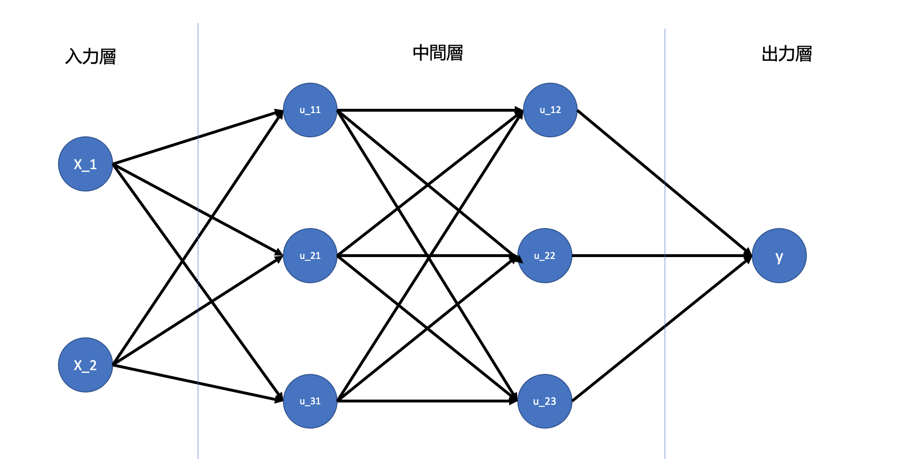
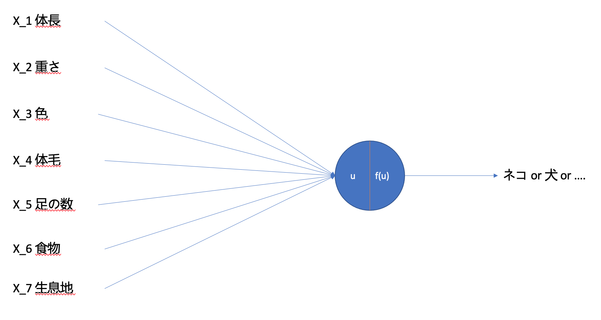

<script type="text/x-mathjax-config">MathJax.Hub.Config({tex2jax:{inlineMath:[['\$','\$'],['\\(','\\)']],processEscapes:true},CommonHTML: {matchFontHeight:false}});</script>
<script type="text/javascript" async src="https://cdnjs.cloudflare.com/ajax/libs/mathjax/2.7.1/MathJax.js?config=TeX-MML-AM_CHTML"></script>

入力層〜中間層
============

# 識別器における生成モデル/識別モデル/識別関数
- 生成モデルはデータのクラス条件付き密度を求めている。
- 計算量が多いので、単に分類結果をえたいだけなら分類結果を得たいだけなら、直接データクラスに属する確率を求める識別モデルで良い。
- 識別モデル（確率的識別モデル）と識別関数（決定的識別モデル）
- 識別モデルは確率を出すので、モデルの信頼度を出すことができる。識別関数ではそれがわからない。
# ニューラルネットワークの全体像
- 入力層、中間層、出力層に大きく分かれる。
- 重みとバイアスを使ってそれぞれの層で変換を行う。
- ディープラーニングは何をしているか？
  - プログラムを自分で複雑に書く代わりにデータを入力することでプログラムを自力で調整するメカニズム
# 確認テスト１
- 次のネットワークを紙にかけ
  - 入力層：２ノード１層
  - 中間層：３ノード２層
  - 出力層：１ノード１層


# NNにできること
- 分類と回帰
- ４つ以上ニューラルネットワークを持つものは深層ニューラルネットワークと呼ばれる。
- 実用例：自動売買、チャットボット、音声解釈などなど
- 数字にできないものは工夫して数字に置き換えることでニューラルネットワークを利用することができる。

# 入力層〜中間層
- 入力層
  - 何かしらの数字を入力する部分（入力x）
  - 各入力の重要度を表す重みwを用いて数値を変換する。
  - 各出力は以下のようになる
  - \\\(\boldsymbol u = w_1x_1 + w_2x_2 + \dots + b = \boldsymbol W\boldsymbol x + \boldsymbol b \\\)
  - wやbがニューラルネットで学習させて変化することになる。
  - \\\(\boldsymbol u\\\)は総入力でこれに活性化関数を通すことで結果が得られる。

# 確認テスト２
- 入力層から中間層の図式に動物分類の例を当てはめてみる。

# 確認テスト３
- \\\(\boldsymbol u = w_1x_1 + w_2x_2 + \dots + b = \boldsymbol W\boldsymbol x + \boldsymbol b \\\)をPythonで記載。
> u = np.dot(W, x) + b
> 
# 確認テスト４ 
[1_1_forward_propagation.ipynb](codes/1_1_forward_propagation.ipynb)の順伝播（3層・複数ユニット）より中間層の出力を定義しているソースを抜き出す。
> \# 2層の総入力
> u2 = np.dot(z1, W2) + b2
> \# 2層の総出力
> z2 = functions.relu(u2)

# 実装演習


```python
# ネットワーク作成用の関数
def init_network():
    network = {}
    #_各パラメータのshapeを表示    
    input_layer_size = 3
    hidden_layer_size= 5
    output_layer_size = 4
    #_ネットワークのウエイトをランダム生成
    network['W1'] = np.random.rand(input_layer_size, hidden_layer_size)
    network['W2'] = np.random.rand(hidden_layer_size,output_layer_size)
    #_ネットワークのバイアスをランダム生成
    network['b1'] =  np.random.rand(hidden_layer_size)
    network['b2'] =  np.random.rand(output_layer_size)
    # 確認用の出力
    print_vec("重み1", network['W1'] )
    print_vec("重み2", network['W2'] )
    print_vec("バイアス1", network['b1'] )
    print_vec("バイアス2", network['b2'] )

    return network

# 上記ネットワークを元に関数を作成。
# x：入力値
def forward(network, x):
    
    print("##### 順伝播開始 #####")
    W1, W2 = network['W1'], network['W2']
    b1, b2 = network['b1'], network['b2']
    
    # 1層の総入力
    u1 = np.dot(x, W1) + b1

    # 1層の総出力
    z1 = functions.relu(u1)

    # 2層の総入力
    u2 = np.dot(z1, W2) + b2
    
    # 出力値
    y = functions.softmax(u2)
    
    print_vec("総入力1", u1)
    print_vec("中間層出力1", z1)
    print_vec("総入力2", u2)
    print_vec("出力1", y)
    print("出力合計: " + str(np.sum(y)))
        
    return y, z1

## 事前データ
# 入力値
x = np.array([1., 2.,  3.])

# 目標出力
d = np.array([0, 0, 0, 1, 0, 0])

# ネットワークの初期化
network =  init_network()

# 出力
y, z1 = forward(network, x)

# 誤差
loss = functions.cross_entropy_error(d, y)

## 表示
print("\n##### 結果表示 #####")
print_vec("出力", y)
print_vec("訓練データ", d)
print_vec("交差エントロピー誤差",  loss)

```