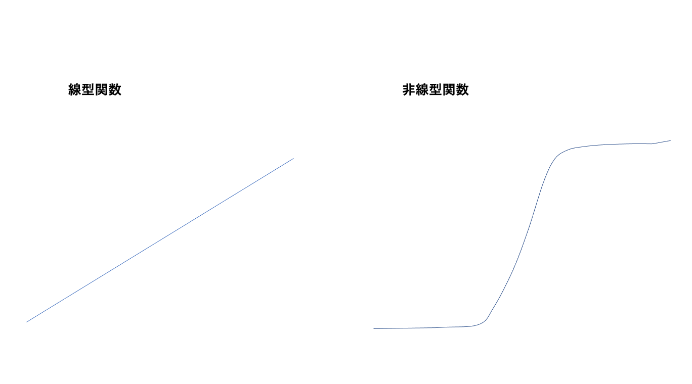
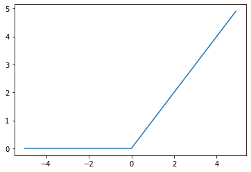
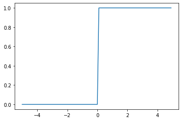
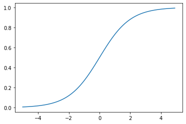

<script type="text/x-mathjax-config">MathJax.Hub.Config({tex2jax:{inlineMath:[['\$','\$'],['\\(','\\)']],processEscapes:true},CommonHTML: {matchFontHeight:false}});</script>
<script type="text/javascript" async src="https://cdnjs.cloudflare.com/ajax/libs/mathjax/2.7.1/MathJax.js?config=TeX-MML-AM_CHTML"></script>

# 活性化関数
- ニューラルネットワークにおいて次の層への出力の大きさを決める非線形の関数。
- 入力値値によって次の層への信号のONOFFや強弱を定める働きを持つ
# 確認テスト５
- 線型と非線形の違いを図を書いて簡潔に説明せよ。

- 線型な関数は加法性(f(x+y)+f(x)+f(y))と斉次性(f(kx)=kf(x))を満たす。

# 活性化関数の種類
-  中間層用
  - ReLU関数
  - シグモイド（ロジスティック）関数
  - ステップ関数
- 出力層用
  - ソフトマックス関数
  - 恒等写像
  - シグモイド（ロジスティック）関数
- シグモイド関数は微分可能なので予想ニューラルネットワーク普及のきっかけとなった。
  - →　一方で、大きな問題では出力の変化が微笑となるので勾配消失問題を起こしやすいという欠点。

#　確認テスト６
-  [1_1_forward_propagation.ipynb](codes/1_1_forward_propagation.ipynb)の順伝播（3層・複数ユニット）より活性化関数を定義しているソースを抜き出す。
> z1 = functions.relu(u1)
- ReLU関数が使われている。（ReLU関数は勾配消失問題に強い）

# 実装演習
- 活性化関数の理解のため、いkつか関数をを書いてみる。
- 利用するデータを作成。

```python
import numpy as np
import matplotlib.pyplot as plt

x = np.arange(-5, 5, 0.1)

```

- ReLU関数の作成

```python
#ReLU
def relu(x):
    return np.maximum(0, x)
plt.plot(x, relu(x))

```




- ステップ関数の作成

```python
#ステップ関数
def step(x):
    return np.where( x > 0, 1, 0) 

plt.plot(x, step(x))

```



- シグモイド関数の作成

```python
#Sigmoid関数
def sigmoid(x):
    return 1 / (1 + np.exp(-x))
```

