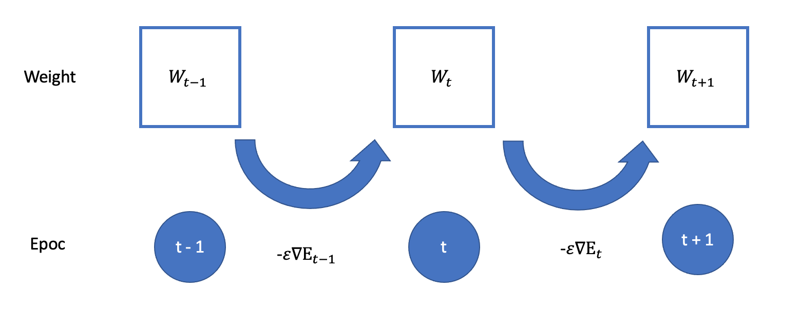

<script type="text/x-mathjax-config">MathJax.Hub.Config({tex2jax:{inlineMath:[['\$','\$'],['\\(','\\)']],processEscapes:true},CommonHTML: {matchFontHeight:false}});</script>
<script type="text/javascript" async src="https://cdnjs.cloudflare.com/ajax/libs/mathjax/2.7.1/MathJax.js?config=TeX-MML-AM_CHTML"></script>

# 勾配降下法
- 誤差関数を最小にする、重み（w）とバイアス（b）を探索する方法の１つ
- 学習率を調整して、前回の学習内容を適切に次の学習に反映させることが重要
# 確認テスト９
- 勾配降下法のソースコードを抜き出す。
```python
    # パラメータに勾配適用
    for key in ('W1', 'W2', 'b1', 'b2'):
        network[key]  -= learning_rate * grad[key]
```
# 学習率決定のためのアルゴリズム
- Momentum, Adagrad, Adadelta, Adamなど。
- Adamが最も有名。
- 詳細はDay2で実施。

# 確率的勾配降下法（SGD）
- バリエーションの１つ目
- 学習用データセットの一部を使って解を更新することを繰り返す。
- メリット
  - データが助長な場合の計算コストの削減
  - 局所解に収束するリスクの低減
  - オンライン学習が可能（都度都度データを与えて学習することができる。最初にデータが全て集まっている必要はない。リアルタイム分析など）
  - インメモリーコンピューティングの観点からも重要

# 確認テスト１０
- オンライン学習とは何か
  - データが来るたびに都度重みなどのパラメータを更新する学習方法。全て事前にデータを用意する必要がない。


# ミニバッチ勾配降下法
- オンラインの学習をバッチ学習に取り入れたもの
> \\\(w^{(t+1)} = w^{(t)} - \epsilon \Delta E_t\\\)<br>
> \\\(\displaystyle E_t = \frac{1}{N_t}\sum_{n \in D_t} E_n\\\)<br>
> \\\(N_t = \|D_t\|\\\)<br>

- ディープラーニングではミニバッジがよく使われる。
- ミニバッジ勾配降下法のメリット
  - 確率的勾配降下法のメリットを損なわず、計算資源の能力の限りまとめて学習することで有効活用できる。
    - CPUを利用したスレッド並列化やGPUを利用したSIMD(Single Instruction Multi Data)並列化など

# 確認テスト１１
- \\\(w^{(t+1)} = w^{(t)} - \epsilon \nabla E_t\\\)の意味を図に書いて説明する。
