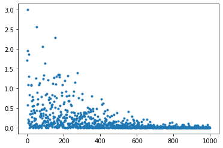
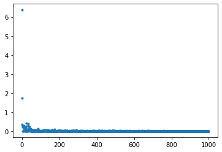

<script type="text/x-mathjax-config">MathJax.Hub.Config({tex2jax:{inlineMath:[['\$','\$'],['\\(','\\)']],processEscapes:true},CommonHTML: {matchFontHeight:false}});</script>
<script type="text/javascript" async src="https://cdnjs.cloudflare.com/ajax/libs/mathjax/2.7.1/MathJax.js?config=TeX-MML-AM_CHTML"></script>


# 誤差逆伝播法

- \\\(\nabla E\\\)をどのように導くか。
- M層のニューラルネットワークであればM箇所に重みが出現
  > \\\(\displaystyle \nabla E = \frac{\partial E}{\partial \boldsymbol w} = \left[ \frac{\partial E}{\partial w_1} \cdot \frac{\partial E}{\partial w_2} \cdots\frac{\partial E}{\partial w_m} \right]\\\)
- 方法１ - 数値微分
  - プログラムで微小な数値を生成し、擬似的に微分を計算する一般的な手法
  > \\\(\displaystyle \frac{\partial E}{\partial w_m} \approx \frac{E(w_m +h)-E(w_m-h)}{2h} \\\)
  - デメリットとして計算量が非常に多くなる。
    - 各wそれぞれについての計算をm回繰り返すため
- 方法２ - 誤差逆伝播法
  - それぞれの場所で計算される重みを結果から逆順に計算することによって再利用する。

# 確認テスト12

- 誤差逆伝播法では不要な再起処理を避けるため、既に行った計算過程を保持しているソースコードを1-3コードより示せ。

```python
    # 出力層でのデルタ
    delta2 = functions.d_mean_squared_error(d, y)
    # b2の勾配
    grad['b2'] = np.sum(delta2, axis=0)
    # W2の勾配
    grad['W2'] = np.dot(z1.T, delta2)
    # 中間層でのデルタ
    #delta1 = np.dot(delta2, W2.T) * functions.d_relu(z1)

    ## 試してみよう
    delta1 = np.dot(delta2, W2.T) * functions.d_sigmoid(z1)

    delta1 = delta1[np.newaxis, :]
    # b1の勾配
    grad['b1'] = np.sum(delta1, axis=0)
    x = x[np.newaxis, :]
    # W1の勾配
    grad['W1'] = np.dot(x.T, delta1)
```

# 確認テスト１３

- \\\(\displaystyle \frac{\partial E}{\partial \boldsymbol y}\\\)を表す部分をソースコード1-3より探すと

```python
delta2 = functions.d_mean_squared_error(d, y)
```

- となる。
- 同様に\\\(\displaystyle \frac{\partial E}{\partial \boldsymbol y}\frac{\partial y}{\partial \boldsymbol u}\\\)、\\\(\displaystyle \frac{\partial E}{\partial \boldsymbol y}\frac{\partial y}{\partial \boldsymbol u}\frac{\partial u}{\partial \boldsymbol w_{ji}^{(2)}}\\\)に該当するソースコードを求めよ。

- \\\(\displaystyle \frac{\partial E}{\partial \boldsymbol y}\frac{\partial y}{\partial \boldsymbol u}\\\)

```python
delta1 = np.dot(delta2, W2.T) * functions.d_sigmoid(z1)
```

- \\\(\displaystyle \frac{\partial E}{\partial \boldsymbol y}\frac{\partial y}{\partial \boldsymbol u}\frac{\partial u}{\partial \boldsymbol w_{ji}^{(2)}}\\\)

```python
grad['W1'] = np.dot(x.T, delta1)
```

# 実装

- 今回は誤差逆伝播法を用いて勾配降下法の実践を行う。
- まずはサンプルデータを下記のように生成する。

```python
# サンプルデータを作成
data_sets_size = 100000
data_sets = [0 for i in range(data_sets_size)]

for i in range(data_sets_size):
    data_sets[i] = {}
    # ランダムな値を設定
    data_sets[i]['x'] = np.random.rand(2)
    # data_sets[i]['x'] = np.random.rand(2) * 10 -5 # -5〜5のランダム数値
    # 目標出力を設定
    data_sets[i]['d'] = f(data_sets[i]['x'])
```

- 次にNNの設定及び準伝播と逆伝播を設定するための関数を定義する。
- 順伝播と誤差逆伝播については活性化関数をsigmoid及びReLUにしたパターンの２通り検討する。

```python

# サンプルとする関数
#yの値を予想するAI
def f(x):
    y = 2 * x[0] + 3 * x[1]
    return y

# 初期設定
def init_network():
    # print("##### ネットワークの初期化 #####")
    network = {}
    nodesNum = 5
    network['W1'] = np.random.randn(2, nodesNum)
    network['W2'] = np.random.randn(nodesNum)
    network['b1'] = np.random.randn(nodesNum)
    network['b2'] = np.random.randn()
    return network

# 順伝播
def forward(network, x):    
    W1, W2 = network['W1'], network['W2']
    b1, b2 = network['b1'], network['b2']
    u1 = np.dot(x, W1) + b1
    z1 = functions.sigmoid(u1)
    u2 = np.dot(z1, W2) + b2
    y = u2
    return z1, y

# 順伝播（活性化関数をReLUにする）
def forward2(network, x):    
    W1, W2 = network['W1'], network['W2']
    b1, b2 = network['b1'], network['b2']
    u1 = np.dot(x, W1) + b1
    z1 = functions.relu(u1)
    u2 = np.dot(z1, W2) + b2
    y = u2
    return z1, y

# 誤差逆伝播
def backward(x, d, z1, y): 
    grad = {}
    W1, W2 = network['W1'], network['W2']
    b1, b2 = network['b1'], network['b2']
    # 出力層における平均二乗誤差の導関数（回帰なので二乗誤差になる。）
    delta2 = functions.d_mean_squared_error(d, y)
    # 中間層〜出力層の勾配の計算
    grad['b2'] = np.sum(delta2, axis=0)
    grad['W2'] = np.dot(z1.T, delta2)
    # 中間層における平均二乗誤差の導関数(ReLU or Sigmoid)
    delta1 = np.dot(delta2, W2.T) * functions.d_sigmoid(z1)
    delta1 = delta1[np.newaxis, :]
    # 入力層〜中間層の勾配の計算
    grad['b1'] = np.sum(delta1, axis=0)
    x = x[np.newaxis, :]
    grad['W1'] = np.dot(x.T, delta1)
    return grad

# 誤差逆伝播(中間層における平均二乗誤差の導関数をReluに)
def backward2(x, d, z1, y): 
    grad = {}
    W1, W2 = network['W1'], network['W2']
    b1, b2 = network['b1'], network['b2']
    delta2 = functions.d_mean_squared_error(d, y)
    grad['b2'] = np.sum(delta2, axis=0)
    grad['W2'] = np.dot(z1.T, delta2)
    delta1 = np.dot(delta2, W2.T) * functions.d_relu(z1)
    delta1 = delta1[np.newaxis, :]
    # 入力層〜中間層の勾配の計算
    grad['b1'] = np.sum(delta1, axis=0)
    x = x[np.newaxis, :]
    grad['W1'] = np.dot(x.T, delta1)
    return grad
```

- 次に①Sigmoid②ReLUの２つのパラメータでの誤差逆伝播法を実装して、値を検証する。

```python
losses = []
# 学習率
learning_rate = 0.07
# 抽出数
epoch = 1000
# パラメータの初期化
network = init_network()
# データのランダム抽出
random_datasets = np.random.choice(data_sets, epoch)

# 勾配降下の繰り返し
for dataset in random_datasets:
    x, d = dataset['x'], dataset['d']
    z1, y = forward(network, x)　
    grad = backward(x, d, z1, y) 
    # 活性化関数をReLUにする場合。
    # z1, y = forward2(network, x)　
    # grad = backward2(x, d, z1, y) 
    # パラメータに勾配適用
    for key in ('W1', 'W2', 'b1', 'b2'):
        network[key]  -= learning_rate * grad[key]
    # 誤差
    loss = functions.mean_squared_error(d, y)
    losses.append(loss)

print("##### 結果表示 #####")    
lists = range(epoch)


plt.plot(lists, losses, '.')
# グラフの表示
plt.show()

```

- 活性化関数に①ReLU②Sigmoidを使った結果、誤差がどのように変化するかを確認する。
- ①Sigmoidの場合
- 順調に学習が1→1000と進む上で進んでいることがわかる。

- ②ReLUの場合
- Sigmoidの場合よりも学習のスピードが早く、このデータにおいては、中間層にReLUがより適している様子が窺える。

