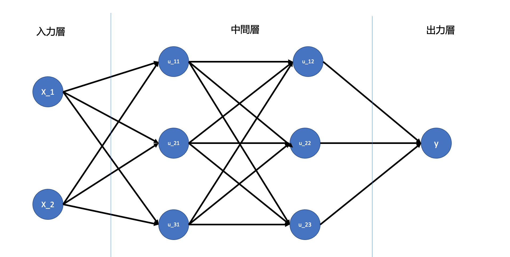
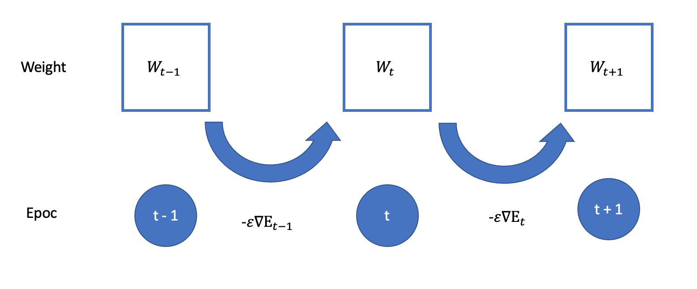
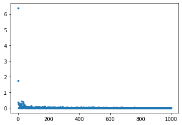

<script type="text/x-mathjax-config">MathJax.Hub.Config({tex2jax:{inlineMath:[['\$','\$'],['\\(','\\)']],processEscapes:true},CommonHTML: {matchFontHeight:false}});</script>
<script type="text/javascript" async src="https://cdnjs.cloudflare.com/ajax/libs/mathjax/2.7.1/MathJax.js?config=TeX-MML-AM_CHTML"></script>

入力層〜中間層
============

# 識別器における生成モデル/識別モデル/識別関数
- 生成モデルはデータのクラス条件付き密度を求めている。
- 計算量が多いので、単に分類結果をえたいだけなら分類結果を得たいだけなら、直接データクラスに属する確率を求める識別モデルで良い。
- 識別モデル（確率的識別モデル）と識別関数（決定的識別モデル）
- 識別モデルは確率を出すので、モデルの信頼度を出すことができる。識別関数ではそれがわからない。
# ニューラルネットワークの全体像
- 入力層、中間層、出力層に大きく分かれる。
- 重みとバイアスを使ってそれぞれの層で変換を行う。
- ディープラーニングは何をしているか？
  - プログラムを自分で複雑に書く代わりにデータを入力することでプログラムを自力で調整するメカニズム
# 確認テスト１
- 次のネットワークを紙にかけ
  - 入力層：２ノード１層
  - 中間層：３ノード２層
  - 出力層：１ノード１層


# NNにできること
- 分類と回帰
- ４つ以上ニューラルネットワークを持つものは深層ニューラルネットワークと呼ばれる。
- 実用例：自動売買、チャットボット、音声解釈などなど
- 数字にできないものは工夫して数字に置き換えることでニューラルネットワークを利用することができる。

# 入力層〜中間層
- 入力層
  - 何かしらの数字を入力する部分（入力x）
  - 各入力の重要度を表す重みwを用いて数値を変換する。
  - 各出力は以下のようになる
  - \(\boldsymbol u = w_1x_1 + w_2x_2 + \dots + b = \boldsymbol W\boldsymbol x + \boldsymbol b \)
  - wやbがニューラルネットで学習させて変化することになる。
  - \(\boldsymbol u\)は総入力でこれに活性化関数を通すことで結果が得られる。

# 確認テスト２
- 入力層から中間層の図式に動物分類の例を当てはめてみる。

# 確認テスト３
- \(\boldsymbol u = w_1x_1 + w_2x_2 + \dots + b = \boldsymbol W\boldsymbol x + \boldsymbol b \)をPythonで記載。
> u = np.dot(W, x) + b
> 
# 確認テスト４ 
[1_1_forward_propagation.ipynb](codes/1_1_forward_propagation.ipynb)の順伝播（3層・複数ユニット）より中間層の出力を定義しているソースを抜き出す。
> \# 2層の総入力
> u2 = np.dot(z1, W2) + b2
> \# 2層の総出力
> z2 = functions.relu(u2)

# 実装演習
- 入力層3、隠れ層5、出力層4のニューラルネットワークを作成する。

```python
# ネットワーク作成用の関数
def init_network():
    network = {}
    #_各パラメータのshapeを表示    
    input_layer_size = 3
    hidden_layer_size= 5
    output_layer_size = 4
    #_ネットワークのウエイトをランダム生成
    network['W1'] = np.random.rand(input_layer_size, hidden_layer_size)
    network['W2'] = np.random.rand(hidden_layer_size,output_layer_size)
    #_ネットワークのバイアスをランダム生成
    network['b1'] =  np.random.rand(hidden_layer_size)
    network['b2'] =  np.random.rand(output_layer_size)
    # 確認用の出力
    print_vec("重み1", network['W1'] )
    print_vec("重み2", network['W2'] )
    print_vec("バイアス1", network['b1'] )
    print_vec("バイアス2", network['b2'] )

    return network

# 上記ネットワークを元に順伝播の関数を作成。
def forward(network, x):
    W1, W2 = network['W1'], network['W2']
    b1, b2 = network['b1'], network['b2']
    # 1層の総入力
    u1 = np.dot(x, W1) + b1
    # 1層の総出力
    z1 = functions.relu(u1)
    # 2層の総入力
    u2 = np.dot(z1, W2) + b2
    # 出力値
    y = functions.softmax(u2)
    # 出力の確認。
    print_vec("総入力1", u1)
    print_vec("中間層出力1", z1)
    print_vec("総入力2", u2)
    print_vec("出力1", y)
    print("出力合計: " + str(np.sum(y)))
        
    return y, z1


# 入力値（３つのインプット）
x = np.array([1., 2.,  3.])

# 目標出力(4つのアウトプット)
d = np.array([0, 0, 0, 1])

# ネットワークの初期化
network =  init_network()

# ニューラルネットワークのアウトプット出力
y, z1 = forward(network, x)

# クロスエントロピー誤差計算
loss = functions.cross_entropy_error(d, y)

## 表示
print("\n##### 結果表示 #####")
print_vec("出力", y)
print_vec("訓練データ", d)
print_vec("交差エントロピー誤差",  loss)

```

- 出力は以下のようになった。

> *** 重み1 ***
> [[0.82170159 0.69423859 0.32978581 0.80963016 0.63349563]
>  [0.303549   0.0483753  0.48834144 0.14278324 0.73894736]
>  [0.97807563 0.32094065 0.25591134 0.61541109 0.92212197]]
> shape: (3, 5)
> 
> *** 重み2 ***
> [[0.24863542 0.8769228  0.24340611 0.82396951]
>  [0.85398749 0.90928363 0.80615185 0.84388483]
>  [0.2422982  0.49443733 0.65472751 0.61487176]
>  [0.03586267 0.62239113 0.53038497 0.22515723]
>  [0.73841218 0.01617789 0.97770196 0.12256726]]
> shape: (5, 4)
> 
> *** バイアス1 ***
> [0.38976826 0.4170236  0.05199498 0.45549633 0.09089713]
> shape: (5,)
> 
> *** バイアス2 ***
> [0.47536492 0.90916441 0.18436067 0.28082877]
> shape: (4,)
> 
> ##### 順伝播開始 #####
> *** 総入力1 ***
> [4.75279476 2.17083474 2.12619768 3.39692624 4.96865338]
> shape: (5,)
> 
> *** 中間層出力1 ***
> [4.75279476 2.17083474 2.12619768 3.39692624 4.96865338]
> shape: (5,)
> 
> *** 総入力2 ***
> [ 7.81685463 10.2967736  11.14286327  8.71009687]
> shape: (4,)
> 
> *** 出力1 ***
> [0.02314258 0.27632932 0.64398989 0.05653821]
> shape: (4,)
> 
> 出力合計: 1.0
> 
> ##### 結果表示 #####
> *** 出力 ***
> [0.02314258 0.27632932 0.64398989 0.05653821]
> shape: (4,)
> 
> *** 訓練データ ***
> [0 0 0 1]
> shape: (4,)
> 
> *** 交差エントロピー誤差 ***
> 2.872836881649026
> shape: ()

- 結果を見ると、訓練データでは1となっている４つの目の値が0.05程度と非常に小さくなってしまい、正確な予測となっていない。そのため、交差エントロピー誤差が非常に高くなってしまっている。
- 現状ではうまく予測できていないことがわかる。


活性化関数
============
# 活性化関数
- ニューラルネットワークにおいて次の層への出力の大きさを決める非線形の関数。
- 入力値値によって次の層への信号のONOFFや強弱を定める働きを持つ
# 確認テスト５
- 線型と非線形の違いを図を書いて簡潔に説明せよ。

- 線型な関数は加法性(f(x+y)+f(x)+f(y))と斉次性(f(kx)=kf(x))を満たす。

# 活性化関数の種類
-  中間層用
  - ReLU関数
  - シグモイド（ロジスティック）関数
  - ステップ関数
- 出力層用
  - ソフトマックス関数
  - 恒等写像
  - シグモイド（ロジスティック）関数
- シグモイド関数は微分可能なので予想ニューラルネットワーク普及のきっかけとなった。
  - →　一方で、大きな問題では出力の変化が微笑となるので勾配消失問題を起こしやすいという欠点。

#　確認テスト６
-  [1_1_forward_propagation.ipynb](codes/1_1_forward_propagation.ipynb)の順伝播（3層・複数ユニット）より活性化関数を定義しているソースを抜き出す。
> z1 = functions.relu(u1)
- ReLU関数が使われている。（ReLU関数は勾配消失問題に強い）

# 実装演習
- 活性化関数の理解のため、いkつか関数をを書いてみる。
- 利用するデータを作成。
```python
import numpy as np
import matplotlib.pyplot as plt

x = np.arange(-5, 5, 0.1)

```

- ReLU関数の作成

```python
#ReLU
def relu(x):
    return np.maximum(0, x)
plt.plot(x, relu(x))

```


- ステップ関数の作成

```python
#ステップ関数
def step(x):
    return np.where( x > 0, 1, 0) 

plt.plot(x, step(x))

```


- シグモイド関数の作成

```python
#Sigmoid関数
def sigmoid(x):
    return 1 / (1 + np.exp(-x))
```


出力層
============
# 中間層と出力層の活性化関数の違い
- 中間層のニューラルネットワークは次の層の入力として適切なもの
- 出力層のニューラルネットワークは求める値を示すもの

# 出力層
- 出力層より計算された予測値が出力される。
- 推測値と正解の隔たりを表す関数を誤差関数という。
  - 自身があるものとないものとで誤差関数の値が違うように表すことができる（ものもある）
  - 単純な誤差関数には２乗和誤差がある。
    - 微分の計算を行いやすくするために1/2が前についている。
  - 実際には分類問題の場合においてはクロスエントロピー誤差を用いる場合が多い。

# 出力層における活性化関数の意味
- 中間層...値の強弱の調整
- 出力層...各値の比率は変えずに問題の出力に合わせる形に変換
# 出力における各活性化関数の使い分け

| | 回帰 | 二値文類 |多クラス分類|
|:---:|:---:|:---:|:---:|
|**活性化関数**|恒等写像<br>\(f(u)=u\) |シグモイド関数<br>\(\displaystyle f(u)=\frac{1}{1+e^{-u}}\)|ソフトマックス関数<br>\(\displaystyle f(\boldsymbol i,\boldsymbol u)=\frac{e^{u_i}}{\sum_{k=1}^Ke^{u_k}}\)|
|**誤差関数**|二乗誤差|交差エントロピー|交差エントロピー|

- シグモイド関数の式
```python
def sigmoid(x):
    return 1/(1+np.exp(-x))
```
- 平均二乗誤差の式
```python
def mean_squared_error(d, y):
    return np.mean(np.square(d - y)) / 2
```
# 確認テスト7
- 上表内のソフトマックス関数の式の①左辺②右辺分子③右辺分母が下記Python式のどこにあるかを示し、１行ずつ処理の説明をせよ

- ソフトマックス関数の式
```python
def softmax(x): #①
    if x.ndim == 2:
        x = x.T
        x = x - np.max(x, axis=0)
        y = np.exp(x) / np.sum(np.exp(x), axis=0)
        return y.T
    x = x - np.max(x) # オーバーフロー対策
    return np.exp(x) / np.sum(np.exp(x))# 分子が②で分母が③　
```
# 確認テスト８
- 交差エントロピーの式\(\displaystyle E_n(w) = \sum_{i=1}^ld_i\log y_i\)の①左辺②右辺が下記Python式のどこにあるかを示し、１行ずつ処理の説明をせよ

- 交差エントロピーの式
```python
def cross_entropy_error(d, y):#①定義部分、関数の出力にあたる。
    if y.ndim == 1:
        d = d.reshape(1, d.size)
        y = y.reshape(1, y.size)
        
    # 教師データがone-hot-vectorの場合、正解ラベルのインデックスに変換
    if d.size == y.size:
        d = d.argmax(axis=1)
             
    batch_size = y.shape[0]
    return -np.sum(np.log(y[np.arange(batch_size), d] + 1e-7)) / batch_size #②のところ
```
# 実装は入力層〜中間層のと部分の実装、及び誤差逆伝播法の実装と合わせて実装することにする。


 勾配降下法
============

# 勾配降下法
- 誤差関数を最小にする、重み（w）とバイアス（b）を探索する方法の１つ
- 学習率を調整して、前回の学習内容を適切に次の学習に反映させることが重要
# 確認テスト９
- 勾配降下法のソースコードを抜き出す。
```python
    # パラメータに勾配適用
    for key in ('W1', 'W2', 'b1', 'b2'):
        network[key]  -= learning_rate * grad[key]
```
# 学習率決定のためのアルゴリズム
- Momentum, Adagrad, Adadelta, Adamなど。
- Adamが最も有名。
- 詳細はDay2で実施。

# 確率的勾配降下法（SGD）
- バリエーションの１つ目
- 学習用データセットの一部を使って解を更新することを繰り返す。
- メリット
  - データが助長な場合の計算コストの削減
  - 局所解に収束するリスクの低減
  - オンライン学習が可能（都度都度データを与えて学習することができる。最初にデータが全て集まっている必要はない。リアルタイム分析など）
  - インメモリーコンピューティングの観点からも重要

# 確認テスト１０
- オンライン学習とは何か
  - データが来るたびに都度重みなどのパラメータを更新する学習方法。全て事前にデータを用意する必要がない。


# ミニバッチ勾配降下法
- オンラインの学習をバッチ学習に取り入れたもの
> \(w^{(t+1)} = w^{(t)} - \epsilon \Delta E_t\)<br>
> \(\displaystyle E_t = \frac{1}{N_t}\sum_{n \in D_t} E_n\)<br>
> \(N_t = \|D_t\|\)<br>

- ディープラーニングではミニバッジがよく使われる。
- ミニバッジ勾配降下法のメリット
  - 確率的勾配降下法のメリットを損なわず、計算資源の能力の限りまとめて学習することで有効活用できる。
    - CPUを利用したスレッド並列化やGPUを利用したSIMD(Single Instruction Multi Data)並列化など

# 確認テスト１１
- \(w^{(t+1)} = w^{(t)} - \epsilon \nabla E_t\)の意味を図に書いて説明する。


# 実装は誤差逆伝播法の実装と合わせて実装することにする。


誤差逆伝播法
============

# 誤差逆伝播法
- \(\nabla E\)をどのように導くか。
- M層のニューラルネットワークであればM箇所に重みが出現
  > \(\displaystyle \nabla E = \frac{\partial E}{\partial \boldsymbol w} = \left[ \frac{\partial E}{\partial w_1} \cdot \frac{\partial E}{\partial w_2} \cdots\frac{\partial E}{\partial w_m} \right]\)
- 方法１ - 数値微分
  - プログラムで微小な数値を生成し、擬似的に微分を計算する一般的な手法
  > \(\displaystyle \frac{\partial E}{\partial w_m} \approx \frac{E(w_m +h)-E(w_m-h)}{2h} \)
  - デメリットとして計算量が非常に多くなる。
    - 各wそれぞれについての計算をm回繰り返すため
- 方法２ - 誤差逆伝播法
  - それぞれの場所で計算される重みを結果から逆順に計算することによって再利用する。

# 確認テスト12
- 誤差逆伝播法では不要な再起処理を避けるため、既に行った計算過程を保持しているソースコードを1-3コードより示せ。
```python
    # 出力層でのデルタ
    delta2 = functions.d_mean_squared_error(d, y)
    # b2の勾配
    grad['b2'] = np.sum(delta2, axis=0)
    # W2の勾配
    grad['W2'] = np.dot(z1.T, delta2)
    # 中間層でのデルタ
    #delta1 = np.dot(delta2, W2.T) * functions.d_relu(z1)

    ## 試してみよう
    delta1 = np.dot(delta2, W2.T) * functions.d_sigmoid(z1)

    delta1 = delta1[np.newaxis, :]
    # b1の勾配
    grad['b1'] = np.sum(delta1, axis=0)
    x = x[np.newaxis, :]
    # W1の勾配
    grad['W1'] = np.dot(x.T, delta1)
```
# 確認テスト１３
- \(\displaystyle \frac{\partial E}{\partial \boldsymbol y}\)を表す部分をソースコード1-3より探すと
```python
delta2 = functions.d_mean_squared_error(d, y)
```
- となる。
- 同様に\(\displaystyle \frac{\partial E}{\partial \boldsymbol y}\frac{\partial y}{\partial \boldsymbol u}\)、\(\displaystyle \frac{\partial E}{\partial \boldsymbol y}\frac{\partial y}{\partial \boldsymbol u}\frac{\partial u}{\partial \boldsymbol w_{ji}^{(2)}}\)に該当するソースコードを求めよ。

- \(\displaystyle \frac{\partial E}{\partial \boldsymbol y}\frac{\partial y}{\partial \boldsymbol u}\)
```python
delta1 = np.dot(delta2, W2.T) * functions.d_sigmoid(z1)
```
- \(\displaystyle \frac{\partial E}{\partial \boldsymbol y}\frac{\partial y}{\partial \boldsymbol u}\frac{\partial u}{\partial \boldsymbol w_{ji}^{(2)}}\)
```python
grad['W1'] = np.dot(x.T, delta1)
```

# 実装
- 今回は誤差逆伝播法を用いて勾配降下法の実践を行う。
- まずはサンプルデータを下記のように生成する。
```python
# サンプルデータを作成
data_sets_size = 100000
data_sets = [0 for i in range(data_sets_size)]

for i in range(data_sets_size):
    data_sets[i] = {}
    # ランダムな値を設定
    data_sets[i]['x'] = np.random.rand(2)
    # data_sets[i]['x'] = np.random.rand(2) * 10 -5 # -5〜5のランダム数値
    # 目標出力を設定
    data_sets[i]['d'] = f(data_sets[i]['x'])
```


- 次にNNの設定及び準伝播と逆伝播を設定するための関数を定義する。
- 順伝播と誤差逆伝播については活性化関数をsigmoid及びReLUにしたパターンの２通り検討する。

```python

# サンプルとする関数
#yの値を予想するAI
def f(x):
    y = 2 * x[0] + 3 * x[1]
    return y

# 初期設定
def init_network():
    # print("##### ネットワークの初期化 #####")
    network = {}
    nodesNum = 5
    network['W1'] = np.random.randn(2, nodesNum)
    network['W2'] = np.random.randn(nodesNum)
    network['b1'] = np.random.randn(nodesNum)
    network['b2'] = np.random.randn()
    return network

# 順伝播
def forward(network, x):    
    W1, W2 = network['W1'], network['W2']
    b1, b2 = network['b1'], network['b2']
    u1 = np.dot(x, W1) + b1
    z1 = functions.sigmoid(u1)
    u2 = np.dot(z1, W2) + b2
    y = u2
    return z1, y

# 順伝播（活性化関数をReLUにする）
def forward2(network, x):    
    W1, W2 = network['W1'], network['W2']
    b1, b2 = network['b1'], network['b2']
    u1 = np.dot(x, W1) + b1
    z1 = functions.relu(u1)
    u2 = np.dot(z1, W2) + b2
    y = u2
    return z1, y

# 誤差逆伝播
def backward(x, d, z1, y): 
    grad = {}
    W1, W2 = network['W1'], network['W2']
    b1, b2 = network['b1'], network['b2']
    # 出力層における平均二乗誤差の導関数（回帰なので二乗誤差になる。）
    delta2 = functions.d_mean_squared_error(d, y)
    # 中間層〜出力層の勾配の計算
    grad['b2'] = np.sum(delta2, axis=0)
    grad['W2'] = np.dot(z1.T, delta2)
    # 中間層における平均二乗誤差の導関数(ReLU or Sigmoid)
    delta1 = np.dot(delta2, W2.T) * functions.d_sigmoid(z1)
    delta1 = delta1[np.newaxis, :]
    # 入力層〜中間層の勾配の計算
    grad['b1'] = np.sum(delta1, axis=0)
    x = x[np.newaxis, :]
    grad['W1'] = np.dot(x.T, delta1)
    return grad

# 誤差逆伝播(中間層における平均二乗誤差の導関数をReluに)
def backward2(x, d, z1, y): 
    grad = {}
    W1, W2 = network['W1'], network['W2']
    b1, b2 = network['b1'], network['b2']
    delta2 = functions.d_mean_squared_error(d, y)
    grad['b2'] = np.sum(delta2, axis=0)
    grad['W2'] = np.dot(z1.T, delta2)
    delta1 = np.dot(delta2, W2.T) * functions.d_relu(z1)
    delta1 = delta1[np.newaxis, :]
    # 入力層〜中間層の勾配の計算
    grad['b1'] = np.sum(delta1, axis=0)
    x = x[np.newaxis, :]
    grad['W1'] = np.dot(x.T, delta1)
    return grad
```

- 次に①Sigmoid②ReLUの２つのパラメータでの誤差逆伝播法を実装して、値を検証する。
- 

```python
losses = []
# 学習率
learning_rate = 0.07
# 抽出数
epoch = 1000
# パラメータの初期化
network = init_network()
# データのランダム抽出
random_datasets = np.random.choice(data_sets, epoch)

# 勾配降下の繰り返し
for dataset in random_datasets:
    x, d = dataset['x'], dataset['d']
    z1, y = forward(network, x)　
    grad = backward(x, d, z1, y) 
    # 活性化関数をReLUにする場合。
    # z1, y = forward2(network, x)　
    # grad = backward2(x, d, z1, y) 
    # パラメータに勾配適用
    for key in ('W1', 'W2', 'b1', 'b2'):
        network[key]  -= learning_rate * grad[key]
    # 誤差
    loss = functions.mean_squared_error(d, y)
    losses.append(loss)

print("##### 結果表示 #####")    
lists = range(epoch)


plt.plot(lists, losses, '.')
# グラフの表示
plt.show()

```

- 活性化関数に①ReLU②Sigmoidを使った結果、誤差がどのように変化するかを確認する。
- ①Sigmoidの場合
- 順調に学習が1→1000と進む上で進んでいることがわかる。

- ②ReLUの場合
- Sigmoidの場合よりも学習のスピードが早く、このデータにおいては、中間層にReLUがより適している様子が窺える。

