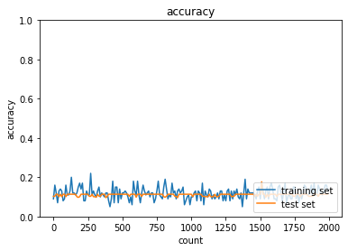
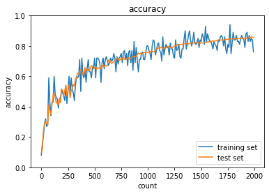
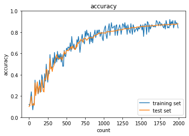
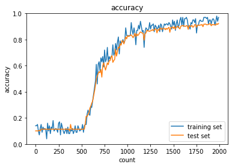
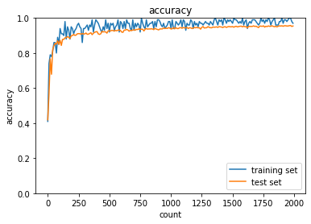
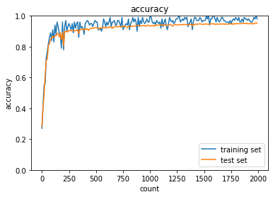
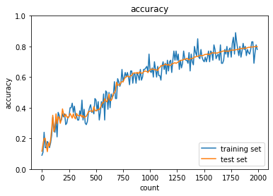

<script type="text/x-mathjax-config">MathJax.Hub.Config({tex2jax:{inlineMath:[['\$','\$'],['\\(','\\)']],processEscapes:true},CommonHTML: {matchFontHeight:false}});</script>
<script type="text/javascript" async src="https://cdnjs.cloudflare.com/ajax/libs/mathjax/2.7.1/MathJax.js?config=TeX-MML-AM_CHTML"></script>

勾配消失問題
============

# 勾配消失問題

- 誤差逆伝播法がうまくいかない現象
  - 誤差逆伝播法では（多くの関数の場合、微分を続けると関数の取り得る値の最大値がどんどん小さくなるため、）下位層に沈んでいくにつれて勾配がどんどん緩やかになっていき、下位層のパラメータでは更新でほとんど値が変わらなくなる。そのため、訓練が最適解に就職しなくなる。

# 確認テスト１４（誤差逆伝播法の復習）

> \\\(\begin{aligned}z &= t^2\cr
t &= x + y\cr
\displaystyle \frac{dz}{dt} &= 2t\cr
\displaystyle \frac{dt}{dx} &= 1\end{aligned}\\\)
> 連鎖率の原理より<br>
> \\\(\displaystyle \frac{dz}{dx} = \frac{dz}{dt}\frac{dt}{dx}\\\)<br>
> \\\(\displaystyle \frac{dz}{dx} = 2t \cdot 1 = 2(x + y)\\\)<br>

#　勾配消失問題（続き）

- シグモイド関数などが代表的な例。
  >（シグモイド関数の微分を記入）

# 確認テスト１５

- シグモイド関数を微分したとき、入力値が0の時に最大値をとる。その値として正しいものを選択肢から選べ。

> \\\(\displaystyle f(u)=\frac{1}{1+e^{-u}}\\\)<br>
> \\\(\begin{aligned}\displaystyle f^\prime(u) &=\frac{1}{1+e^{-u}} \cr &= - \frac{1}{(1+e^{-u})^2}(- e^{-u}) \cr &=\frac{(1 + e^{-u}) -1}{(1+e^{-u})^2} \cr &=\frac{1}{1+e^{-u}}\left(1 - \frac{1}{1+e^{-u}} \right) \cr &=f(u)\left\lbrace 1 - f(u) \right\rbrace \end{aligned} \\\)<br>
> \\\(f(0) = \displaystyle \frac{1}{1+e^{0}} = \frac{1}{2}\\\)<br>
> \\\(\begin{aligned} \displaystyle f^\prime(0) =  f(0) \lbrace1 - f(0) \rbrace =　\frac{1}{4} \end{aligned} \\\)<br>

- よって正解の値は（２）0.25

# 勾配消失問題の解決法

- 以下の３つの方法がある。
  - 活性化関数の選択
  - 重みの初期値設定
  - バッチ正規化

# 活性化関数の選択

- 勾配消失問題が起こりにくい活性化関数の選択
  - 例としてReLU関数（一番使われている）
    - x>０ or notでそのまま伝播するか、全く伝播しないか決まる。
      - 必要な部分だけ選択されるような動きになる。
      - スパース化に貢献

# 重みの初期値設定

- 重みにいろいろな個性を持たせて、様々な観点の特徴量を抽出することが重要。
- Xavierの初期化
  - Xavierの初期化以前は標準化されていた。（勾配消失問題が発生）
  - Xavierは前のレイヤーのノードの数のルートで割ることで重みを初期化し、勾配消失問題を避ける。（なぜか）
  - シグモイド関数のようなS字カーブを描いている活性化関数についてはXavierの初期化はよく働く。
- Heの初期化
  - ReLU関数のようなS字カーブを描かない活性化関数に有効
  - 前のレイヤーのノードの数のルートで割った後、ルート２をかけることで初期化する。

# 確認テスト１６

- 重みの初期値を０にするとどのような問題が発生するか。簡潔に説明せよ。
  - 正しい学習が行えない。
  - 全ての重みの値が均一に更新されるため、多様な重みを持つ意味がなくなる。

# バッチ正規化

- ミニバッチ単位で入力値のデータの偏りを抑制する方法
- 使いどころ
  - 活性化関数に値を渡す前後に、バッチ正規化の処理を含んだ層を加える。
- バッチ正規化を使用することで中間層が安定化して学習がスピードアップする。
- バッチ正規化の数学的記述は以下。

> \\\(\displaystyle \mu_t = \frac{1}{N_t} \sum_{i =1}^{N_t}x_{ni}\\\)<br>
> \\\(\displaystyle \sigma_t^2 = \frac{1}{N_t} \sum_{i =1}^{N_t}(x_{ni} - \mu_t)^2\\\)<br>
> \\\(\displaystyle \hat x_{ni} = \frac{x_{ni}-\mu_t}{\sqrt{\sigma_t^2 + \theta}}\\\)<br>
> \\\(y_{mi} = \gamma x_{ni} + \beta\\\)<br>

# 実装

```python
import numpy as np
from common import layers
from common import functions
from collections import OrderedDict
from data.mnist import load_mnist
import matplotlib.pyplot as plt


class MultiLayerNet:
    '''
    input_size: 入力層のノード数
    hidden_size_list: 隠れ層のノード数のリスト
    output_size: 出力層のノード数
    activation: 活性化関数
    weight_init_std: 重みの初期化方法
    '''
    def __init__(self, input_size, hidden_size_list, output_size, activation='relu', weight_init_std='relu'):
        self.input_size = input_size
        self.output_size = output_size
        self.hidden_size_list = hidden_size_list
        self.hidden_layer_num = len(hidden_size_list)
        self.params = {}

        # 重みの初期化
        self.__init_weight(weight_init_std)

        # レイヤの生成, sigmoidとreluのみ扱う
        activation_layer = {'sigmoid': layers.Sigmoid, 'relu': layers.Relu}
        self.layers = OrderedDict() # 追加した順番に格納
        for idx in range(1, self.hidden_layer_num+1):
            self.layers['Affine' + str(idx)] = layers.Affine(self.params['W' + str(idx)], self.params['b' + str(idx)])
            self.layers['Activation_function' + str(idx)] = activation_layer[activation]()

        idx = self.hidden_layer_num + 1
        self.layers['Affine' + str(idx)] = layers.Affine(self.params['W' + str(idx)], self.params['b' + str(idx)])

        self.last_layer = layers.SoftmaxWithLoss()

    def __init_weight(self, weight_init_std):
        all_size_list = [self.input_size] + self.hidden_size_list + [self.output_size]
        for idx in range(1, len(all_size_list)):
            scale = weight_init_std
            if str(weight_init_std).lower() in ('relu', 'he'):
                scale = np.sqrt(2.0 / all_size_list[idx - 1])
            elif str(weight_init_std).lower() in ('sigmoid', 'xavier'):
                scale = np.sqrt(1.0 / all_size_list[idx - 1])

            self.params['W' + str(idx)] = scale * np.random.randn(all_size_list[idx-1], all_size_list[idx])
            self.params['b' + str(idx)] = np.zeros(all_size_list[idx])

    def predict(self, x):
        for layer in self.layers.values():
            x = layer.forward(x)

        return x

    def loss(self, x, d):
        y = self.predict(x)

        weight_decay = 0
        for idx in range(1, self.hidden_layer_num + 2):
            W = self.params['W' + str(idx)]

        return self.last_layer.forward(y, d) + weight_decay

    def accuracy(self, x, d):
        y = self.predict(x)
        y = np.argmax(y, axis=1)
        if d.ndim != 1 : d = np.argmax(d, axis=1)

        accuracy = np.sum(y == d) / float(x.shape[0])
        return accuracy

    def gradient(self, x, d):
        # forward
        self.loss(x, d)

        # backward
        dout = 1
        dout = self.last_layer.backward(dout)

        layers = list(self.layers.values())
        layers.reverse()
        for layer in layers:
            dout = layer.backward(dout)

        # 設定
        grad = {}
        for idx in range(1, self.hidden_layer_num+2):
            grad['W' + str(idx)] = self.layers['Affine' + str(idx)].dW
            grad['b' + str(idx)] = self.layers['Affine' + str(idx)].db

        return grad

```

- コードは2_2_2の中に、以下３つのニューラルネットワークがある。
  1. Gauss正規化で活性化関数はSigmoid
  2. Gauss正規化で活性化関数はReLU
  3. Xavier正規化で活性化関数はSigmoid
  - １と２の比較から活性化関数の選択
  - １と３の違いから重みの初期値設定の重要性がわかる。

```python
# データの読み込み
(x_train, d_train), (x_test, d_test) = load_mnist(normalize=True, one_hot_label=True)

print("データ読み込み完了")
# 1
network = MultiLayerNet(input_size=784, hidden_size_list=[40, 20], output_size=10, activation='sigmoid', weight_init_std=0.01)

# 2
# network = MultiLayerNet(input_size=784, hidden_size_list=[40, 20], output_size=10, activation='sigmoid', weight_init_std='He')

# 3
# network = MultiLayerNet(input_size=784, hidden_size_list=[40, 20], output_size=10, activation='sigmoid', weight_init_std='Xavier')

# 4
# network = MultiLayerNet(input_size=784, hidden_size_list=[40, 20], output_size=10, activation='relu', weight_init_std=0.01)

# 5
# network = MultiLayerNet(input_size=784, hidden_size_list=[40, 20], output_size=10, activation='relu', weight_init_std='He')

# 6
# network = MultiLayerNet(input_size=784, hidden_size_list=[40, 20], output_size=10, activation='relu', weight_init_std='Xavier')


iters_num = 2000
train_size = x_train.shape[0]
batch_size = 100
learning_rate = 0.1

train_loss_list = []
accuracies_train = []
accuracies_test = []

plot_interval=10

for i in range(iters_num):
    batch_mask = np.random.choice(train_size, batch_size)
    x_batch = x_train[batch_mask]
    d_batch = d_train[batch_mask]

    # 勾配
    grad = network.gradient(x_batch, d_batch)
    
    for key in ('W1', 'W2', 'W3', 'b1', 'b2', 'b3'):
        network.params[key] -= learning_rate * grad[key]
    
    loss = network.loss(x_batch, d_batch)
    train_loss_list.append(loss)
    
    if (i + 1) % plot_interval == 0:
        accr_test = network.accuracy(x_test, d_test)
        accuracies_test.append(accr_test)        
        accr_train = network.accuracy(x_batch, d_batch)
        accuracies_train.append(accr_train)

        print('Generation: ' + str(i+1) + '. 正答率(トレーニング) = ' + str(accr_train))
        print('                : ' + str(i+1) + '. 正答率(テスト) = ' + str(accr_test))
        

lists = range(0, iters_num, plot_interval)
plt.plot(lists, accuracies_train, label="training set")
plt.plot(lists, accuracies_test,  label="test set")
plt.legend(loc="lower right")
plt.title("accuracy")
plt.xlabel("count")
plt.ylabel("accuracy")
plt.ylim(0, 1.0)
# グラフの表示
plt.show()

```

- 活性化関数、初期値の違う下記６種類の結果を出力する。
- 活性化関数、初期値の設定が非常に重要なことがわかる。
- 今回は活性関数はReLU、初期値設定がHeの場合に最も学習がするんでいることがわかる。

# 1 活性化関数 Sigmoid 初期化設定 gauss


# 2 活性化関数 Sigmoid 初期化設定 He


# 3 活性化関数 Sigmoid 初期化設定 Xavier



# 4 活性化関数 relu 初期化設定 gauss


# 5 活性化関数 relu 初期化設定 He


# 6 活性化関数 relu 初期化設定 Xavier



- また隠れ層を[20-40] → [10-20]に変更した活性化関数 Sigmoid 初期化設定 Xavierが下記であり、隠れ層が小さくなった影響で学習が小さくなっていることがわかる。


