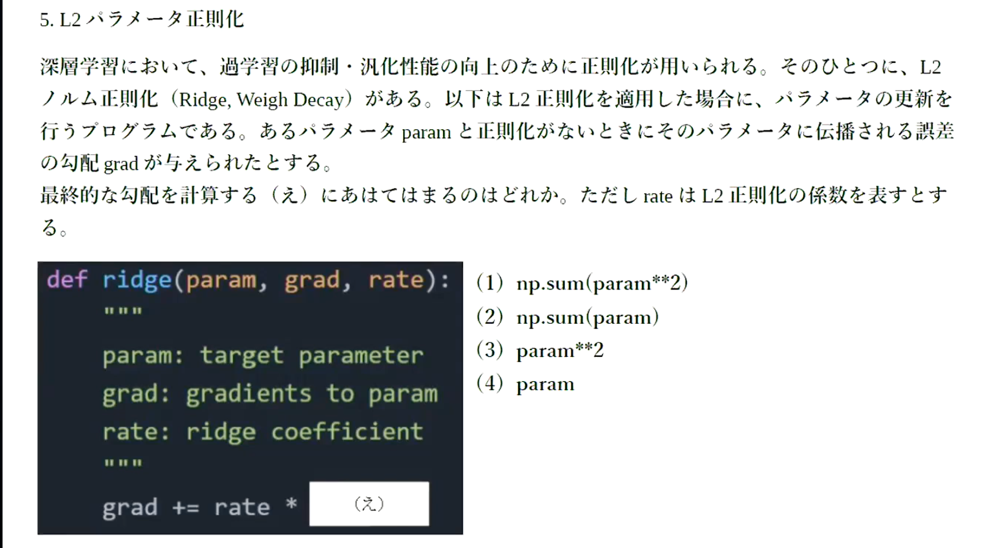
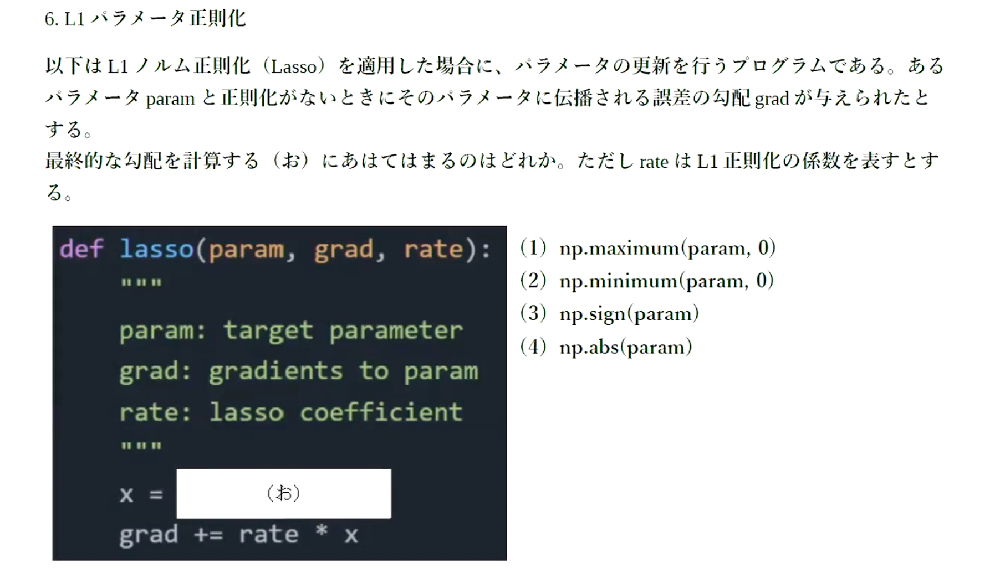

# 過学習
- テスト誤差と訓練誤差とで学習曲線が乖離し、テスト誤差に特化した値で学習を進めてしまうこと
- 原因として、
  - パラメータの数が多い
  - パラメータ設定が適切でない
  - ノードが多い
    - 入力のデータ量に対して、ネットワークの自由度が高い（ニューラルネットワークが大きい、濃度数が高い）場合
      - ニューラルネットワークが無駄に複雑な計算をしてしまう。

# 正則化
- 正則化とは、ネットワークの自由度を制約すること
  - L1正則化（LASSO回帰）
  - L2正則化（リッジ回帰）
  - ドロップアウト（正則化とは違う）
- 過学習しているときは重みが過大になっている
  - 過大評価されている
    - 一部の入力データに対して極端な反応を示す。
- 極端な重みが発生しないように制限するのが、正則化手法の基本的なコンセプト
- 正則化の式(p=1の時、L1正則化、p=2の時、L2正則化)
> \\\(\\\)

- L2正則化・・・重みを全体的に0に近づける
- L1正則化・・・影響度の低い重みを0にする

# 確認テスト１７

- L1正則化は影響度の低い重みを0にするので、右側のスパース推定のグラフが質問の回答。

# 例題チャレンジ

- 正解は４

- 正解は3

# ドロップアウト