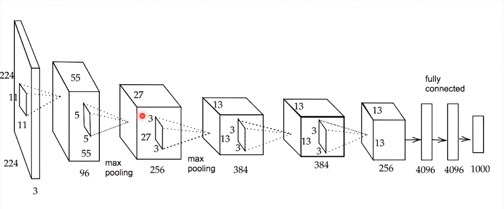

<script type="text/x-mathjax-config">MathJax.Hub.Config({tex2jax:{inlineMath:[['\$','\$'],['\\(','\\)']],processEscapes:true},CommonHTML: {matchFontHeight:false}});</script>
<script type="text/javascript" async src="https://cdnjs.cloudflare.com/ajax/libs/mathjax/2.7.1/MathJax.js?config=TeX-MML-AM_CHTML"></script>

# AlexNetの例
- 最新ではないがAlex Netの例を紹介する。2012年の画像コンペで２位に大差をつけて優勝
 
- 入力には224 x 224の画像を使い、それを11x11のフィルターで畳み込み演算を行う。（多分ストライド４パディング３とか）
- 96(or32*RGB分？)種類のフィルター結果を55 x 55で表す。更に5x5のフィルターでMaxプーリングを行う。
- 96種類を基に256種類のプーリング結果を27x27で表す。更にそれを3x3のフィルターでマックスプーリングして384種類の13x13で表す。
- 更に全体の大きさを変えずに3x3で畳み込み、その後また、3x3畳み込みをして、256種類の13x13の結果をとする。
- その後横方向一列4096（13x13x256）の情報に並び替える。（Fratten）
  - その後のモデルでは、より効果の高いGlobal Average PoolingやGlobal Max Poolingが使われることの方が多い。（この例だと、13*13の情報の中で、最大の情報、あるいは平均の情報を256個並べるようなもの）
- そこから先は普通のニューラルネットワークのような数値の計算を行なっている。
- 全結合層の部分はドロップアウトを用いている。


# 実装

- PyTorchでのAlexNetの実装例を記載する。
（参考）https://pytorch.org/vision/0.12/_modules/torchvision/models/alexnet.html

- 入力は3 X 224 X 224を想定。

```python
class AlexNet(nn.Module):
 
    def __init__(self, num_classes=1000):
        super(AlexNet, self).__init__()
        self.features = nn.Sequential(
            nn.Conv2d(3, 64, kernel_size=11, stride=4, padding=2),
            nn.ReLU(inplace=True),
            nn.MaxPool2d(kernel_size=3, stride=2),
            nn.Conv2d(64, 192, kernel_size=5, padding=2),
            nn.ReLU(inplace=True),
            nn.MaxPool2d(kernel_size=3, stride=2),
            nn.Conv2d(192, 384, kernel_size=3, padding=1),
            nn.ReLU(inplace=True),
            nn.Conv2d(384, 256, kernel_size=3, padding=1),
            nn.ReLU(inplace=True),
            nn.Conv2d(256, 256, kernel_size=3, padding=1),
            nn.ReLU(inplace=True),
            nn.MaxPool2d(kernel_size=3, stride=2),
        )
        self.classifier = nn.Sequential(
            nn.Dropout(),
            nn.Linear(256 * 6 * 6, 4096),
            nn.ReLU(inplace=True),
            nn.Dropout(),
            nn.Linear(4096, 4096),
            nn.ReLU(inplace=True),
            nn.Linear(4096, num_classes),
        )
 
    def forward(self, x):
        x = self.features(x)
        x = x.view(x.size(0), 256 * 6 * 6)
        x = self.classifier(x)
        return x
```