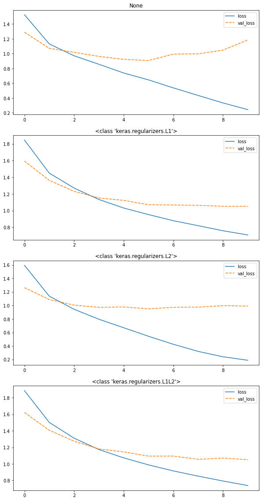
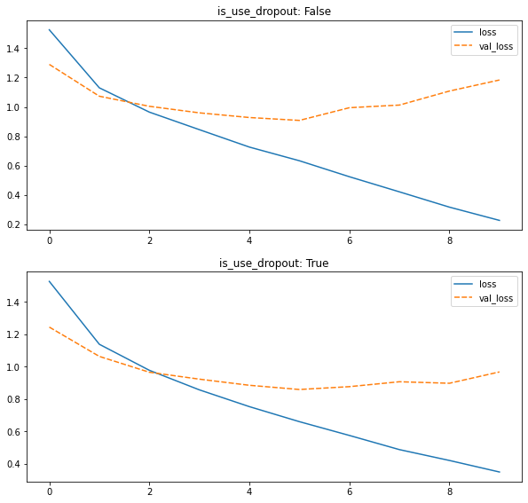
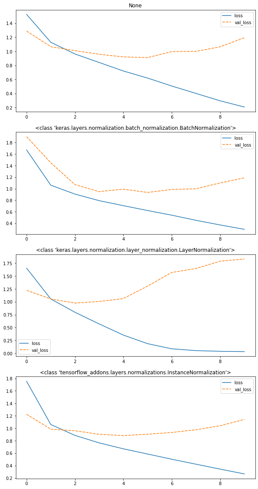

# (パラメータ)正則化に関する追加学習事項（Elastic net）

- 過学習で実施した最適化に関して、いくつかトピックを追加。実装で確認。
- Elastic  Net 
  - L1正則化とL2正則化を組み合わせたもの

> \\\(Elastic Net = \displaystyle \sum_{i=1}^n (y^{(i)} - \hat y^{(i)})^2 + \lambda_1 \sum_{j=1}^m w_j^2 - \lambda_2 \sum_{j=2}^m\|w_j\|\\\)

- \\\(\lambda_1, \lambda_2\\\)はハイパーパラメータ。で、各正規化項の制約の強さを調整する。

# 実装

- 2_9_regularization.ipynbで実装してみる。
- 下記の各結果を比較すると、L2正則化及びElasticNet(L1L2)が評価用データ（val_loss）の損失関数の学習が最も進んでいることがわかる。

# 正則化レイヤー（Dropout）の実装

- 実装については、下記に記載。
- 2_10_dropout.ipynbを使って実装してみる。
- Dropoutを使った方が過学習によるval_lossの上昇が抑えられていることがわかる。

# 正規化レイヤーの実装

- Batch正規化
  - H x Wの大きさのデータでチャネル数をCとして、サンプルがN個あった時、N個の同一チャネルを正規化の単位として、バッチごとにに正規化。（最小はInstance正規化に等しい。）
  - GPUの制約等でミニバッチのサイズが大きく取れない場合は、効果が薄くなる。
- Layer正規化
  - Batch正規化とは異なり、角データのH x W x Cの中で正規化を行う。
  - Batch正規化の効果が薄い、ミニバッチのサイズが多く取れない時などに有効。
- Instance正規化
  - 各サンプル各チャネルのH x W の中で正規化。Batch正規化でバッチサイズが１の時と同一。
  - 2_11_layer_normalization.ipynb

- 今回はBatch正規化及びInstance正規かにおいてval_lossの上昇が抑えられており、正規化の強化ができていることがわかる。

