<script type="text/x-mathjax-config">MathJax.Hub.Config({tex2jax:{inlineMath:[['\$','\$'],['\\(','\\)']],processEscapes:true},CommonHTML: {matchFontHeight:false}});</script>
<script type="text/javascript" async src="https://cdnjs.cloudflare.com/ajax/libs/mathjax/2.7.1/MathJax.js?config=TeX-MML-AM_CHTML"></script>

勾配消失問題
============
# 勾配消失問題
- 誤差逆伝播法がうまくいかない現象
  - 誤差逆伝播法では（多くの関数の場合、微分を続けると関数の取り得る値の最大値がどんどん小さくなるため、）下位層に沈んでいくにつれて勾配がどんどん緩やかになっていき、下位層のパラメータでは更新でほとんど値が変わらなくなる。そのため、訓練が最適解に就職しなくなる。

# 確認テスト１４（誤差逆伝播法の復習）
> \(\begin{aligned}z &= t^2\cr
t &= x + y\cr
\displaystyle \frac{dz}{dt} &= 2t\cr
\displaystyle \frac{dt}{dx} &= 1\end{aligned}\)
> 連鎖率の原理より<br>
> \(\displaystyle \frac{dz}{dx} = \frac{dz}{dt}\frac{dt}{dx}\)<br>
> \(\displaystyle \frac{dz}{dx} = 2t \cdot 1 = 2(x + y)\)<br>
#　勾配消失問題（続き）
- シグモイド関数などが代表的な例。
  >（シグモイド関数の微分を記入）

# 確認テスト１５
- シグモイド関数を微分したとき、入力値が0の時に最大値をとる。その値として正しいものを選択肢から選べ。
> \(\displaystyle f(u)=\frac{1}{1+e^{-u}}\)<br>
> \(\begin{aligned}\displaystyle f^\prime(u) &=\frac{1}{1+e^{-u}} \cr &= - \frac{1}{(1+e^{-u})^2}(- e^{-u}) \cr &=\frac{(1 + e^{-u}) -1}{(1+e^{-u})^2} \cr &=\frac{1}{1+e^{-u}}\left(1 - \frac{1}{1+e^{-u}} \right) \cr &=f(u)\left\lbrace 1 - f(u) \right\rbrace \end{aligned} \)<br>
> \(f(0) = \displaystyle \frac{1}{1+e^{0}} = \frac{1}{2}\)<br>
> \(\begin{aligned} \displaystyle f^\prime(0) =  f(0) \lbrace1 - f(0) \rbrace =　\frac{1}{4} \end{aligned} \)<br>

- よって正解の値は（２）0.25

#　勾配消失問題の解決法
- 以下の３つの方法がある。
  - 活性化関数の選択
  - 重みの初期値設定
  - バッチ正規化

# 活性化関数の選択
- 勾配消失問題が起こりにくい活性化関数の選択
  - 例としてReLU関数（一番使われている）
    - x>０ or notでそのまま伝播するか、全く伝播しないか決まる。
      - 必要な部分だけ選択されるような動きになる。
      - スパース化に貢献

# 重みの初期値設定
- 重みにいろいろな個性を持たせて、様々な観点の特徴量を抽出することが重要。
- Xavierの初期化
  - Xavierの初期化以前は標準化されていた。（勾配消失問題が発生）
  - Xavierは前のレイヤーのノードの数のルートで割ることで重みを初期化し、勾配消失問題を避ける。（なぜか）
  - シグモイド関数のようなS字カーブを描いている活性化関数についてはXavierの初期化はよく働く。
- Heの初期化
  - ReLU関数のようなS字カーブを描かない活性化関数に有効
  - 前のレイヤーのノードの数のルートで割った後、ルート２をかけることで初期化する。

# 確認テスト１６
- 重みの初期値を０にするとどのような問題が発生するか。簡潔に説明せよ。
  - 正しい学習が行えない。
  - 全ての重みの値が均一に更新されるため、多様な重みを持つ意味がなくなる。

# バッチ正規化
- ミニバッチ単位で入力値のデータの偏りを抑制する方法
- 使いどころ
  - 活性化関数に値を渡す前後に、バッチ正規化の処理を含んだ層を加える。
- バッチ正規化を使用することで中間層が安定化して学習がスピードアップする。
- バッチ正規化の数学的記述は以下。
> \(\displaystyle \mu_t = \frac{1}{N_t} \sum_{i =1}^{N_t}x_{ni}\)<br>
> \(\displaystyle \sigma_t^2 = \frac{1}{N_t} \sum_{i =1}^{N_t}(x_{ni} - \mu_t)^2\)<br>
> \(\displaystyle \hat x_{ni} = \frac{x_{ni}-\mu_t}{\sqrt{\sigma_t^2 + \theta}}\)<br>
> \(y_{mi} = \gamma x_{ni} + \beta\)<br>

# 実装

```python
import numpy as np
from common import layers
from common import functions
from collections import OrderedDict
from data.mnist import load_mnist
import matplotlib.pyplot as plt


class MultiLayerNet:
    '''
    input_size: 入力層のノード数
    hidden_size_list: 隠れ層のノード数のリスト
    output_size: 出力層のノード数
    activation: 活性化関数
    weight_init_std: 重みの初期化方法
    '''
    def __init__(self, input_size, hidden_size_list, output_size, activation='relu', weight_init_std='relu'):
        self.input_size = input_size
        self.output_size = output_size
        self.hidden_size_list = hidden_size_list
        self.hidden_layer_num = len(hidden_size_list)
        self.params = {}

        # 重みの初期化
        self.__init_weight(weight_init_std)

        # レイヤの生成, sigmoidとreluのみ扱う
        activation_layer = {'sigmoid': layers.Sigmoid, 'relu': layers.Relu}
        self.layers = OrderedDict() # 追加した順番に格納
        for idx in range(1, self.hidden_layer_num+1):
            self.layers['Affine' + str(idx)] = layers.Affine(self.params['W' + str(idx)], self.params['b' + str(idx)])
            self.layers['Activation_function' + str(idx)] = activation_layer[activation]()

        idx = self.hidden_layer_num + 1
        self.layers['Affine' + str(idx)] = layers.Affine(self.params['W' + str(idx)], self.params['b' + str(idx)])

        self.last_layer = layers.SoftmaxWithLoss()

    def __init_weight(self, weight_init_std):
        all_size_list = [self.input_size] + self.hidden_size_list + [self.output_size]
        for idx in range(1, len(all_size_list)):
            scale = weight_init_std
            if str(weight_init_std).lower() in ('relu', 'he'):
                scale = np.sqrt(2.0 / all_size_list[idx - 1])
            elif str(weight_init_std).lower() in ('sigmoid', 'xavier'):
                scale = np.sqrt(1.0 / all_size_list[idx - 1])

            self.params['W' + str(idx)] = scale * np.random.randn(all_size_list[idx-1], all_size_list[idx])
            self.params['b' + str(idx)] = np.zeros(all_size_list[idx])

    def predict(self, x):
        for layer in self.layers.values():
            x = layer.forward(x)

        return x

    def loss(self, x, d):
        y = self.predict(x)

        weight_decay = 0
        for idx in range(1, self.hidden_layer_num + 2):
            W = self.params['W' + str(idx)]

        return self.last_layer.forward(y, d) + weight_decay

    def accuracy(self, x, d):
        y = self.predict(x)
        y = np.argmax(y, axis=1)
        if d.ndim != 1 : d = np.argmax(d, axis=1)

        accuracy = np.sum(y == d) / float(x.shape[0])
        return accuracy

    def gradient(self, x, d):
        # forward
        self.loss(x, d)

        # backward
        dout = 1
        dout = self.last_layer.backward(dout)

        layers = list(self.layers.values())
        layers.reverse()
        for layer in layers:
            dout = layer.backward(dout)

        # 設定
        grad = {}
        for idx in range(1, self.hidden_layer_num+2):
            grad['W' + str(idx)] = self.layers['Affine' + str(idx)].dW
            grad['b' + str(idx)] = self.layers['Affine' + str(idx)].db

        return grad

```

- コードは2_2_2の中に、以下３つのニューラルネットワークがある。
    1. Gauss正規化で活性化関数はSigmoid
    2. Gauss正規化で活性化関数はReLU
    3. Xavier正規化で活性化関数はSigmoid
    - １と２の比較から活性化関数の選択
    - １と３の違いから重みの初期値設定の重要性がわかる。


```python
# データの読み込み
(x_train, d_train), (x_test, d_test) = load_mnist(normalize=True, one_hot_label=True)

print("データ読み込み完了")
# 1
network = MultiLayerNet(input_size=784, hidden_size_list=[40, 20], output_size=10, activation='sigmoid', weight_init_std=0.01)

# 2
# network = MultiLayerNet(input_size=784, hidden_size_list=[40, 20], output_size=10, activation='sigmoid', weight_init_std='He')

# 3
# network = MultiLayerNet(input_size=784, hidden_size_list=[40, 20], output_size=10, activation='sigmoid', weight_init_std='Xavier')

# 4
# network = MultiLayerNet(input_size=784, hidden_size_list=[40, 20], output_size=10, activation='relu', weight_init_std=0.01)

# 5
# network = MultiLayerNet(input_size=784, hidden_size_list=[40, 20], output_size=10, activation='relu', weight_init_std='He')

# 6
# network = MultiLayerNet(input_size=784, hidden_size_list=[40, 20], output_size=10, activation='relu', weight_init_std='Xavier')


iters_num = 2000
train_size = x_train.shape[0]
batch_size = 100
learning_rate = 0.1

train_loss_list = []
accuracies_train = []
accuracies_test = []

plot_interval=10

for i in range(iters_num):
    batch_mask = np.random.choice(train_size, batch_size)
    x_batch = x_train[batch_mask]
    d_batch = d_train[batch_mask]

    # 勾配
    grad = network.gradient(x_batch, d_batch)
    
    for key in ('W1', 'W2', 'W3', 'b1', 'b2', 'b3'):
        network.params[key] -= learning_rate * grad[key]
    
    loss = network.loss(x_batch, d_batch)
    train_loss_list.append(loss)
    
    if (i + 1) % plot_interval == 0:
        accr_test = network.accuracy(x_test, d_test)
        accuracies_test.append(accr_test)        
        accr_train = network.accuracy(x_batch, d_batch)
        accuracies_train.append(accr_train)

        print('Generation: ' + str(i+1) + '. 正答率(トレーニング) = ' + str(accr_train))
        print('                : ' + str(i+1) + '. 正答率(テスト) = ' + str(accr_test))
        

lists = range(0, iters_num, plot_interval)
plt.plot(lists, accuracies_train, label="training set")
plt.plot(lists, accuracies_test,  label="test set")
plt.legend(loc="lower right")
plt.title("accuracy")
plt.xlabel("count")
plt.ylabel("accuracy")
plt.ylim(0, 1.0)
# グラフの表示
plt.show()

```

- 活性化関数、初期値の違う下記６種類の結果を出力する。
- 活性化関数、初期値の設定が非常に重要なことがわかる。
- 今回は活性関数はReLU、初期値設定がHeの場合に最も学習がするんでいることがわかる。
# 1 活性化関数 Sigmoid 初期化設定 gauss

# 2 活性化関数 Sigmoid 初期化設定 He
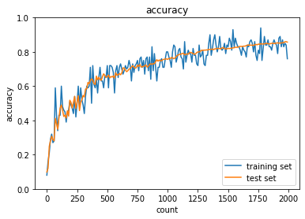
# 3 活性化関数 Sigmoid 初期化設定 Xavier
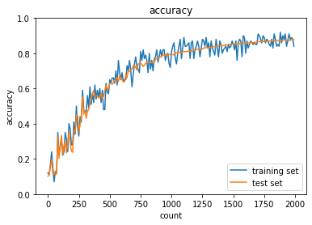

# 4 活性化関数 relu 初期化設定 gauss
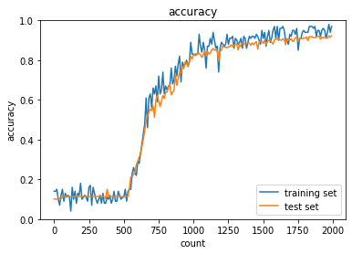
# 5 活性化関数 relu 初期化設定 He

# 6 活性化関数 relu 初期化設定 Xavier


- また隠れ層を[20-40] → [10-20]に変更した活性化関数 Sigmoid 初期化設定 Xavierが下記であり、隠れ層が小さくなった影響で学習が小さくなっていることがわかる。
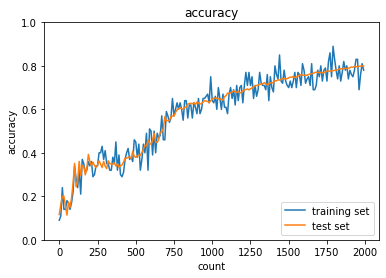


学習率最適化手法
============
# 学習率最適化手法
- 勾配降下法などの学習率をどう決めるかの手法
- 学習率を固定させず変化させていく

# モメンタム
- 勾配降下方がジグザグに動くのに対して、株価の移動平均のような動き方をする。
> \(V_t = \mu V_{t-1} - \epsilon \nabla E\)
> \(w^{(t+1)} = w^{(t)} + V_t\)
- 誤差をパラメータで微分したものと学習率の席を減算した後、現在の重みに前回の重みを減算した値と慣性の積を加算する。
- モメンタムのメリット
  - 局所最適解にならず大域的最適解となる。
  - 谷間についてから最も低い位置（最適値）に行くまでの時間が早い。

# AdaGrad
- 勾配の緩やかな問題に有効だが、鞍点問題に陥る危険性がある。
> \(h_0 = \theta\)
> \(h_t = h_{t-1} + (\nabla E)^2\)
> \(\displaystyle w^{(t+1)} = w^{(t)} - \epsilon \frac{1}{\sqrt{h_t} + \theta} \nabla E\)
- 誤差をパラメータで微分したものと再定義した学習率の積を減算している。
- AdaGradのメリット
  - 勾配の緩やかな斜面に対して、最適値に近づける
- 課題
  - 学習率が徐々に小さくなるので、鞍点問題を引き起こすことがあった。

# RMSProp
- AdaGradを改良したもの
> \(h_t = ah_{t-1} + (1-a)(\nabla E)^2\)
> \(\displaystyle w^{(t+1)} = w^{(t)} - \epsilon \frac{1}{\sqrt{h_t} + \theta} \nabla E\)
- パラメータ更新の式はadagradと同一。
- 学習率更新の工夫により、RMSpropはハイパーパラメータの調整が必要な場合が少ない。

# Adam
- モメンタムとAdaGrad-RMSProp系列のハイブリッド
-  以下のミックス
   - モメンタムの、過去の勾配の指数関数的減衰平均
   - RMSPropの、過去の勾配の２乗の指数関数的減衰平均
- 最も実用的なモデル
- 鞍点問題も抜けることができる
- 学習率が乱高下なく進むのも良いポイント

# 実装

# SGD
```python
import numpy as np
from collections import OrderedDict
from common import layers
from data.mnist import load_mnist
import matplotlib.pyplot as plt
from multi_layer_net import MultiLayerNet


# データの読み込み
(x_train, d_train), (x_test, d_test) = load_mnist(normalize=True, one_hot_label=True)

print("データ読み込み完了")

# batch_normalizationの設定 =======================
# use_batchnorm = True
use_batchnorm = False
# ====================================================


network = MultiLayerNet(input_size=784, hidden_size_list=[40, 20], output_size=10, activation='sigmoid', weight_init_std=0.01,
                       use_batchnorm=use_batchnorm)

iters_num = 1000
train_size = x_train.shape[0]
batch_size = 100
learning_rate = 0.01

train_loss_list = []
accuracies_train = []
accuracies_test = []

plot_interval=10

for i in range(iters_num):
    batch_mask = np.random.choice(train_size, batch_size)
    x_batch = x_train[batch_mask]
    d_batch = d_train[batch_mask]

    # 勾配
    grad = network.gradient(x_batch, d_batch)
    
    for key in ('W1', 'W2', 'W3', 'b1', 'b2', 'b3'):
        network.params[key] -= learning_rate * grad[key]
        
        loss = network.loss(x_batch, d_batch)
        train_loss_list.append(loss)
    
    
    if (i + 1) % plot_interval == 0:
        accr_test = network.accuracy(x_test, d_test)
        accuracies_test.append(accr_test)        
        accr_train = network.accuracy(x_batch, d_batch)
        accuracies_train.append(accr_train)
        
        print('Generation: ' + str(i+1) + '. 正答率(トレーニング) = ' + str(accr_train))
        print('                : ' + str(i+1) + '. 正答率(テスト) = ' + str(accr_test))

        
lists = range(0, iters_num, plot_interval)
plt.plot(lists, accuracies_train, label="training set")
plt.plot(lists, accuracies_test,  label="test set")
plt.legend(loc="lower right")
plt.title("accuracy")
plt.xlabel("count")
plt.ylabel("accuracy")
plt.ylim(0, 1.0)
# グラフの表示
plt.show()
```

# Momentum
```python
# データの読み込み
(x_train, d_train), (x_test, d_test) = load_mnist(normalize=True, one_hot_label=True)

print("データ読み込み完了")

# batch_normalizationの設定 =======================
# use_batchnorm = True
use_batchnorm = False
# ====================================================

network = MultiLayerNet(input_size=784, hidden_size_list=[40, 20], output_size=10, activation='sigmoid', weight_init_std=0.01,
                       use_batchnorm=use_batchnorm)

iters_num = 1000
train_size = x_train.shape[0]
batch_size = 100
learning_rate = 0.3
# 慣性
momentum = 0.9

train_loss_list = []
accuracies_train = []
accuracies_test = []

plot_interval=10

for i in range(iters_num):
    batch_mask = np.random.choice(train_size, batch_size)
    x_batch = x_train[batch_mask]
    d_batch = d_train[batch_mask]

    # 勾配
    grad = network.gradient(x_batch, d_batch)
    if i == 0:
        v = {}
    for key in ('W1', 'W2', 'W3', 'b1', 'b2', 'b3'):
        if i == 0:
            v[key] = np.zeros_like(network.params[key])
        v[key] = momentum * v[key] - learning_rate * grad[key]
        network.params[key] += v[key]

        loss = network.loss(x_batch, d_batch)
        train_loss_list.append(loss)
        
    if (i + 1) % plot_interval == 0:
        accr_test = network.accuracy(x_test, d_test)
        accuracies_test.append(accr_test)        
        accr_train = network.accuracy(x_batch, d_batch)
        accuracies_train.append(accr_train)

        print('Generation: ' + str(i+1) + '. 正答率(トレーニング) = ' + str(accr_train))
        print('                : ' + str(i+1) + '. 正答率(テスト) = ' + str(accr_test))
        
        
lists = range(0, iters_num, plot_interval)
plt.plot(lists, accuracies_train, label="training set")
plt.plot(lists, accuracies_test,  label="test set")
plt.legend(loc="lower right")
plt.title("accuracy")
plt.xlabel("count")
plt.ylabel("accuracy")
plt.ylim(0, 1.0)
# グラフの表示
plt.show()
```

# AdaGrad
```python
# データの読み込み
(x_train, d_train), (x_test, d_test) = load_mnist(normalize=True, one_hot_label=True)

print("データ読み込み完了")

# batch_normalizationの設定 =======================
# use_batchnorm = True
use_batchnorm = False
# ====================================================

network = MultiLayerNet(input_size=784, hidden_size_list=[40, 20], output_size=10, activation='sigmoid', weight_init_std=0.01,
                       use_batchnorm=use_batchnorm)

iters_num = 1000
train_size = x_train.shape[0]
batch_size = 100
learning_rate = 0.1

train_loss_list = []
accuracies_train = []
accuracies_test = []

plot_interval=10

for i in range(iters_num):
    batch_mask = np.random.choice(train_size, batch_size)
    x_batch = x_train[batch_mask]
    d_batch = d_train[batch_mask]

    # 勾配
    grad = network.gradient(x_batch, d_batch)
    if i == 0:
        h = {}
    for key in ('W1', 'W2', 'W3', 'b1', 'b2', 'b3'):
        if i == 0:
            h[key] = np.full_like(network.params[key], 1e-4)
        else:
            h[key] += np.square(grad[key])
        network.params[key] -= learning_rate * grad[key] / (np.sqrt(h[key]))

        loss = network.loss(x_batch, d_batch)
        train_loss_list.append(loss)        
        
        
    if (i + 1) % plot_interval == 0:
        accr_test = network.accuracy(x_test, d_test)
        accuracies_test.append(accr_test)        
        accr_train = network.accuracy(x_batch, d_batch)
        accuracies_train.append(accr_train)
        
        print('Generation: ' + str(i+1) + '. 正答率(トレーニング) = ' + str(accr_train))
        print('                : ' + str(i+1) + '. 正答率(テスト) = ' + str(accr_test))
        
        
lists = range(0, iters_num, plot_interval)
plt.plot(lists, accuracies_train, label="training set")
plt.plot(lists, accuracies_test,  label="test set")
plt.legend(loc="lower right")
plt.title("accuracy")
plt.xlabel("count")
plt.ylabel("accuracy")
plt.ylim(0, 1.0)
# グラフの表示
plt.show()
```


# RMSprop
```python
# データの読み込み
(x_train, d_train), (x_test, d_test) = load_mnist(normalize=True, one_hot_label=True)

print("データ読み込み完了")

# batch_normalizationの設定 =======================
# use_batchnorm = True
use_batchnorm = False
# ====================================================

network = MultiLayerNet(input_size=784, hidden_size_list=[40, 20], output_size=10, activation='sigmoid', weight_init_std=0.01,
                       use_batchnorm=use_batchnorm)

iters_num = 1000
train_size = x_train.shape[0]
batch_size = 100
learning_rate = 0.01
decay_rate = 0.99

train_loss_list = []
accuracies_train = []
accuracies_test = []

plot_interval=10

for i in range(iters_num):
    batch_mask = np.random.choice(train_size, batch_size)
    x_batch = x_train[batch_mask]
    d_batch = d_train[batch_mask]

    # 勾配
    grad = network.gradient(x_batch, d_batch)
    if i == 0:
        h = {}
    for key in ('W1', 'W2', 'W3', 'b1', 'b2', 'b3'):
        if i == 0:
            h[key] = np.zeros_like(network.params[key])
        h[key] *= decay_rate
        h[key] += (1 - decay_rate) * np.square(grad[key])
        network.params[key] -= learning_rate * grad[key] / (np.sqrt(h[key]) + 1e-7)

        loss = network.loss(x_batch, d_batch)
        train_loss_list.append(loss)                
        
    if (i + 1) % plot_interval == 0:
        accr_test = network.accuracy(x_test, d_test)
        accuracies_test.append(accr_test)        
        accr_train = network.accuracy(x_batch, d_batch)
        accuracies_train.append(accr_train)
        
        print('Generation: ' + str(i+1) + '. 正答率(トレーニング) = ' + str(accr_train))
        print('                : ' + str(i+1) + '. 正答率(テスト) = ' + str(accr_test))
        
        
lists = range(0, iters_num, plot_interval)
plt.plot(lists, accuracies_train, label="training set")
plt.plot(lists, accuracies_test,  label="test set")
plt.legend(loc="lower right")
plt.title("accuracy")
plt.xlabel("count")
plt.ylabel("accuracy")
plt.ylim(0, 1.0)
# グラフの表示
plt.show()
```


# Adam
```python
# データの読み込み
(x_train, d_train), (x_test, d_test) = load_mnist(normalize=True, one_hot_label=True)

print("データ読み込み完了")

# batch_normalizationの設定 =======================
# use_batchnorm = True
use_batchnorm = False
# ====================================================

network = MultiLayerNet(input_size=784, hidden_size_list=[40, 20], output_size=10, activation='sigmoid', weight_init_std=0.01,
                       use_batchnorm=use_batchnorm)

iters_num = 1000
train_size = x_train.shape[0]
batch_size = 100
learning_rate = 0.01
beta1 = 0.9
beta2 = 0.999

train_loss_list = []
accuracies_train = []
accuracies_test = []

plot_interval=10

for i in range(iters_num):
    batch_mask = np.random.choice(train_size, batch_size)
    x_batch = x_train[batch_mask]
    d_batch = d_train[batch_mask]

    # 勾配
    grad = network.gradient(x_batch, d_batch)
    if i == 0:
        m = {}
        v = {}
    learning_rate_t  = learning_rate * np.sqrt(1.0 - beta2 ** (i + 1)) / (1.0 - beta1 ** (i + 1))    
    for key in ('W1', 'W2', 'W3', 'b1', 'b2', 'b3'):
        if i == 0:
            m[key] = np.zeros_like(network.params[key])
            v[key] = np.zeros_like(network.params[key])
            
        m[key] += (1 - beta1) * (grad[key] - m[key])
        v[key] += (1 - beta2) * (grad[key] ** 2 - v[key])            
        network.params[key] -= learning_rate_t * m[key] / (np.sqrt(v[key]) + 1e-7)                
        
        loss = network.loss(x_batch, d_batch)
        train_loss_list.append(loss)        
        
    if (i + 1) % plot_interval == 0:
        accr_test = network.accuracy(x_test, d_test)
        accuracies_test.append(accr_test)        
        accr_train = network.accuracy(x_batch, d_batch)
        accuracies_train.append(accr_train)
        
        print('Generation: ' + str(i+1) + '. 正答率(トレーニング) = ' + str(accr_train))
        print('                : ' + str(i+1) + '. 正答率(テスト) = ' + str(accr_test))
                

lists = range(0, iters_num, plot_interval)
plt.plot(lists, accuracies_train, label="training set")
plt.plot(lists, accuracies_test,  label="test set")
plt.legend(loc="lower right")
plt.title("accuracy")
plt.xlabel("count")
plt.ylabel("accuracy")
plt.ylim(0, 1.0)
# グラフの表示
plt.show()
```

- 下記に５つのオプティマイザーを用いた学習結果を表示する。
- この5つの中ではRMSProp及びAdamを用いた場合に効率的に学習が進んでいることがわかる。
# SGD

# Momentum

# AdaGrad

# RMSProp

# Adam


- Adamについてバッチノーマライゼーションを適用した場合の結果は下記に記述する。
- 学習がバッチノーマライゼーションを適用する前よりも早く進んでいることがわかる。
# Adam batchnorm


過学習
============
# 過学習
- テスト誤差と訓練誤差とで学習曲線が乖離し、テスト誤差に特化した値で学習を進めてしまうこと
- 原因として、
  - パラメータの数が多い
  - パラメータ設定が適切でない
  - ノードが多い
    - 入力のデータ量に対して、ネットワークの自由度が高い（ニューラルネットワークが大きい、濃度数が高い）場合
      - ニューラルネットワークが無駄に複雑な計算をしてしまう。

# 正則化
- 正則化とは、ネットワークの自由度を制約すること
  - L1正則化（LASSO回帰）
  - L2正則化（リッジ回帰）
  - ドロップアウト（正則化とは違う）
- 過学習しているときは重みが過大になっている
  - 過大評価されている
    - 一部の入力データに対して極端な反応を示す。
- 極端な重みが発生しないように制限するのが、正則化手法の基本的なコンセプト

- L2正則化・・・重みを全体的に0に近づける
- L1正則化・・・影響度の低い重みを0にする

# 確認テスト１７

- L1正則化は影響度の低い重みを0にするので、右側のスパース推定のグラフが質問の回答。

# 例題チャレンジ
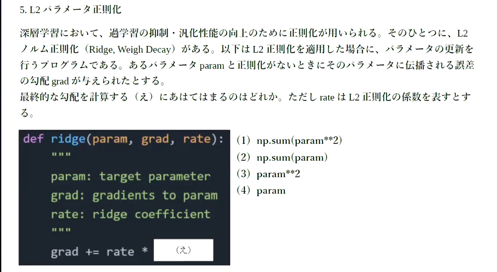
- 正解は４


- 正解は3

# ドロップアウト
- 部分的にニューラルネットワークを切断して学習を進める手法
- 中間層でドロップアウトを行うとデータのバリエーションを増やす効果がある。
- ドロップアウトはデータが増えた状況と同様の状況になるので、学習率の収束が遅くなったりする。


# 実装
# 正則化なし
```python
import numpy as np
from collections import OrderedDict
from common import layers
from data.mnist import load_mnist
import matplotlib.pyplot as plt
from multi_layer_net import MultiLayerNet
from common import optimizer


(x_train, d_train), (x_test, d_test) = load_mnist(normalize=True)

print("データ読み込み完了")

# 過学習を再現するために、学習データを削減
x_train = x_train[:300]
d_train = d_train[:300]

network = MultiLayerNet(input_size=784, hidden_size_list=[100, 100, 100, 100, 100, 100], output_size=10)
optimizer = optimizer.SGD(learning_rate=0.01)

iters_num = 1000
train_size = x_train.shape[0]
batch_size = 100

train_loss_list = []
accuracies_train = []
accuracies_test = []

plot_interval=10


for i in range(iters_num):
    batch_mask = np.random.choice(train_size, batch_size)
    x_batch = x_train[batch_mask]
    d_batch = d_train[batch_mask]

    grad = network.gradient(x_batch, d_batch)
    optimizer.update(network.params, grad)

    loss = network.loss(x_batch, d_batch)
    train_loss_list.append(loss)
        
    if (i+1) % plot_interval == 0:
        accr_train = network.accuracy(x_train, d_train)
        accr_test = network.accuracy(x_test, d_test)
        accuracies_train.append(accr_train)
        accuracies_test.append(accr_test)

        print('Generation: ' + str(i+1) + '. 正答率(トレーニング) = ' + str(accr_train))
        print('                : ' + str(i+1) + '. 正答率(テスト) = ' + str(accr_test))        

lists = range(0, iters_num, plot_interval)
plt.plot(lists, accuracies_train, label="training set")
plt.plot(lists, accuracies_test,  label="test set")
plt.legend(loc="lower right")
plt.title("accuracy")
plt.xlabel("count")
plt.ylabel("accuracy")
plt.ylim(0, 1.0)
# グラフの表示
plt.show()
```

# L2正則化
```python
from common import optimizer

(x_train, d_train), (x_test, d_test) = load_mnist(normalize=True)

print("データ読み込み完了")

# 過学習を再現するために、学習データを削減
x_train = x_train[:300]
d_train = d_train[:300]


network = MultiLayerNet(input_size=784, hidden_size_list=[100, 100, 100, 100, 100, 100], output_size=10)


iters_num = 1000
train_size = x_train.shape[0]
batch_size = 100
learning_rate=0.01

train_loss_list = []
accuracies_train = []
accuracies_test = []

plot_interval=10
hidden_layer_num = network.hidden_layer_num

# 正則化強度設定 ======================================
weight_decay_lambda = 0.1
# =================================================

for i in range(iters_num):
    batch_mask = np.random.choice(train_size, batch_size)
    x_batch = x_train[batch_mask]
    d_batch = d_train[batch_mask]

    grad = network.gradient(x_batch, d_batch)
    weight_decay = 0
    
    for idx in range(1, hidden_layer_num+1):
        grad['W' + str(idx)] = network.layers['Affine' + str(idx)].dW + weight_decay_lambda * network.params['W' + str(idx)]
        grad['b' + str(idx)] = network.layers['Affine' + str(idx)].db
        network.params['W' + str(idx)] -= learning_rate * grad['W' + str(idx)]
        network.params['b' + str(idx)] -= learning_rate * grad['b' + str(idx)]        
        weight_decay += 0.5 * weight_decay_lambda * np.sqrt(np.sum(network.params['W' + str(idx)] ** 2))

    loss = network.loss(x_batch, d_batch) + weight_decay
    train_loss_list.append(loss)        
        
    if (i+1) % plot_interval == 0:
        accr_train = network.accuracy(x_train, d_train)
        accr_test = network.accuracy(x_test, d_test)
        accuracies_train.append(accr_train)
        accuracies_test.append(accr_test)
        
        print('Generation: ' + str(i+1) + '. 正答率(トレーニング) = ' + str(accr_train))
        print('                : ' + str(i+1) + '. 正答率(テスト) = ' + str(accr_test))               


lists = range(0, iters_num, plot_interval)
plt.plot(lists, accuracies_train, label="training set")
plt.plot(lists, accuracies_test,  label="test set")
plt.legend(loc="lower right")
plt.title("accuracy")
plt.xlabel("count")
plt.ylabel("accuracy")
plt.ylim(0, 1.0)
# グラフの表示
plt.show()
```

# L1正則化

```python
(x_train, d_train), (x_test, d_test) = load_mnist(normalize=True)

print("データ読み込み完了")

# 過学習を再現するために、学習データを削減
x_train = x_train[:300]
d_train = d_train[:300]

network = MultiLayerNet(input_size=784, hidden_size_list=[100, 100, 100, 100, 100, 100], output_size=10)


iters_num = 1000
train_size = x_train.shape[0]
batch_size = 100
learning_rate=0.1

train_loss_list = []
accuracies_train = []
accuracies_test = []

plot_interval=10
hidden_layer_num = network.hidden_layer_num

# 正則化強度設定 ======================================
weight_decay_lambda = 0.005
# =================================================

for i in range(iters_num):
    batch_mask = np.random.choice(train_size, batch_size)
    x_batch = x_train[batch_mask]
    d_batch = d_train[batch_mask]

    grad = network.gradient(x_batch, d_batch)
    weight_decay = 0
    
    for idx in range(1, hidden_layer_num+1):
        grad['W' + str(idx)] = network.layers['Affine' + str(idx)].dW + weight_decay_lambda * np.sign(network.params['W' + str(idx)])
        grad['b' + str(idx)] = network.layers['Affine' + str(idx)].db
        network.params['W' + str(idx)] -= learning_rate * grad['W' + str(idx)]
        network.params['b' + str(idx)] -= learning_rate * grad['b' + str(idx)]        
        weight_decay += weight_decay_lambda * np.sum(np.abs(network.params['W' + str(idx)]))

    loss = network.loss(x_batch, d_batch) + weight_decay
    train_loss_list.append(loss)        
        
    if (i+1) % plot_interval == 0:
        accr_train = network.accuracy(x_train, d_train)
        accr_test = network.accuracy(x_test, d_test)
        accuracies_train.append(accr_train)
        accuracies_test.append(accr_test)
        
        print('Generation: ' + str(i+1) + '. 正答率(トレーニング) = ' + str(accr_train))
        print('                : ' + str(i+1) + '. 正答率(テスト) = ' + str(accr_test))               
                
lists = range(0, iters_num, plot_interval)
plt.plot(lists, accuracies_train, label="training set")
plt.plot(lists, accuracies_test,  label="test set")
plt.legend(loc="lower right")
plt.title("accuracy")
plt.xlabel("count")
plt.ylabel("accuracy")
plt.ylim(0, 1.0)
# グラフの表示
plt.show()
```
- 下記に正則化なしとL1正則化、L2正則化を比較する。
- トレーニングデータでの結果をみると、L1正則化・L2正則化によって過学習が押されられていることがわかる。
- L1正則化では学習の結果が時折不安定になる一方、L2正則化では安定している。
- 全体の結果はそれほど正則化によっては向上しなかった。
# 正則化なし
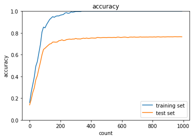
#　L1(0.1)

#　L2(0.005)
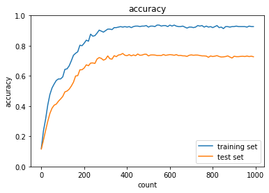

- 正則化率を変えて実践して見る。
- L1正則化を0.1 → 0.125、L2正則化を0.005 →0.001にしたところ、どちらもパフォーマンスが低下した。正則化率を適切にすることが過学習を抑えてパフォーマンスを高めるのに必要だと考える。
#　L1(0.125)
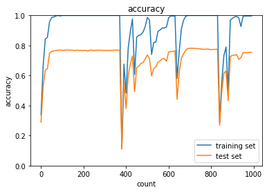
#　L2(0.001)
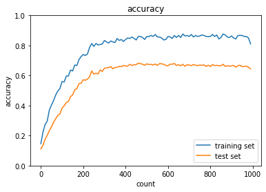
- 最後にドロップアウトを実施した場合の学習の結果を見る。L2正則化と似たような奇跡を描く。学習の進みが少し遅い様子。
#　dropout


畳み込みニューラルネットワークの概念
========
# CNN
- 画像以外にも次元的なつながりのあれば利用できる。例えば音声など。
- 次元数に応じた次元上の点の値（１次元ならx軸のみ、２次元ならx軸とy軸の値）とその点におけるチャネルの値（音の強度、X戦の強度、色）がデータとしては存在する。


# LeNETの例
- 手書き数宇を当てる畳み込みネットワーク
- 32 * 32 の画像、つまり入力は1024
- 出力は10個（0~9の数字の内、どれに該当するか。）
- 中間層の処理（プーリング層や畳み込み層が該当）
  - 畳み込み層
    - フィルター（重み）によって、次元的なつながりの特徴を残しつつサマライズすることができる。（畳み込み層の処理）
    - 実際の処理の際はデータのフィルター対象の領域の部分だけ一列にまとめる処理（2_6ではimg2col処理）を用いる工夫がなされて、その後重みと掛け合わせることで処理を高速化されている。
  - プーリング層
    - 畳み込み層同様にある領域を指定するフィルターを残し、その中の最大値や、平均値を取得する。前者をMaxプーリング、後者をAvgプーリングという。
    - 畳み込み層と同様に、プーリングされる単位ごとに一列にまとめる処理が行われている。

- 全結合層の処理
  - 人間がほしい結果を出力として実装する層

# 確認テスト１８
- サイズ 6*6の入力画像を、サイズ2*2のフィルタで畳み込んだ時の出力画像のサイズを求めよ。なおストライドとパディングは1とする。
- 正解は7*7。


# 実践
- 畳み込みニューラルネットワークの設定

```python
import pickle
import numpy as np
from collections import OrderedDict
from common import layers
from data.mnist import load_mnist
import matplotlib.pyplot as plt
from common import optimizer

class DeepConvNet:
    '''
    認識率99%以上の高精度なConvNet

    conv - relu - conv- relu - pool -
    conv - relu - conv- relu - pool -
    conv - relu - conv- relu - pool -
    affine - relu - dropout - affine - dropout - softmax
    '''
    def __init__(self, input_dim=(1, 28, 28),
                 conv_param_1 = {'filter_num':16, 'filter_size':3, 'pad':1, 'stride':1},
                 conv_param_2 = {'filter_num':16, 'filter_size':3, 'pad':1, 'stride':1},
                 conv_param_3 = {'filter_num':32, 'filter_size':3, 'pad':1, 'stride':1},
                 conv_param_4 = {'filter_num':32, 'filter_size':3, 'pad':2, 'stride':1},
                 conv_param_5 = {'filter_num':64, 'filter_size':3, 'pad':1, 'stride':1},
                 conv_param_6 = {'filter_num':64, 'filter_size':3, 'pad':1, 'stride':1},
                 hidden_size=50, output_size=10):
        # 重みの初期化===========
        # 各層のニューロンひとつあたりが、前層のニューロンといくつのつながりがあるか
        pre_node_nums = np.array([1*3*3, 16*3*3, 16*3*3, 32*3*3, 32*3*3, 64*3*3, 64*4*4, hidden_size])
        wight_init_scales = np.sqrt(2.0 / pre_node_nums)  # Heの初期値
        
        self.params = {}
        pre_channel_num = input_dim[0]
        for idx, conv_param in enumerate([conv_param_1, conv_param_2, conv_param_3, conv_param_4, conv_param_5, conv_param_6]):
            self.params['W' + str(idx+1)] = wight_init_scales[idx] * np.random.randn(conv_param['filter_num'], pre_channel_num, conv_param['filter_size'], conv_param['filter_size'])
            self.params['b' + str(idx+1)] = np.zeros(conv_param['filter_num'])
            pre_channel_num = conv_param['filter_num']
        self.params['W7'] = wight_init_scales[6] * np.random.randn(pre_node_nums[6], hidden_size)
        print(self.params['W7'].shape)
        self.params['b7'] = np.zeros(hidden_size)
        self.params['W8'] = wight_init_scales[7] * np.random.randn(pre_node_nums[7], output_size)
        self.params['b8'] = np.zeros(output_size)

        # レイヤの生成===========
        self.layers = []
        self.layers.append(layers.Convolution(self.params['W1'], self.params['b1'], 
                           conv_param_1['stride'], conv_param_1['pad']))
        self.layers.append(layers.Relu())
        self.layers.append(layers.Convolution(self.params['W2'], self.params['b2'], 
                           conv_param_2['stride'], conv_param_2['pad']))
        self.layers.append(layers.Relu())
        self.layers.append(layers.Pooling(pool_h=2, pool_w=2, stride=2))
        self.layers.append(layers.Convolution(self.params['W3'], self.params['b3'], 
                           conv_param_3['stride'], conv_param_3['pad']))
        self.layers.append(layers.Relu())
        self.layers.append(layers.Convolution(self.params['W4'], self.params['b4'],
                           conv_param_4['stride'], conv_param_4['pad']))
        self.layers.append(layers.Relu())
        self.layers.append(layers.Pooling(pool_h=2, pool_w=2, stride=2))
        self.layers.append(layers.Convolution(self.params['W5'], self.params['b5'],
                           conv_param_5['stride'], conv_param_5['pad']))
        self.layers.append(layers.Relu())
        self.layers.append(layers.Convolution(self.params['W6'], self.params['b6'],
                           conv_param_6['stride'], conv_param_6['pad']))
        self.layers.append(layers.Relu())
        self.layers.append(layers.Pooling(pool_h=2, pool_w=2, stride=2))
        self.layers.append(layers.Affine(self.params['W7'], self.params['b7']))
        self.layers.append(layers.Relu())
        self.layers.append(layers.Dropout(0.5))
        self.layers.append(layers.Affine(self.params['W8'], self.params['b8']))
        self.layers.append(layers.Dropout(0.5))
        
        self.last_layer = layers.SoftmaxWithLoss()

    def predict(self, x, train_flg=False):
        for layer in self.layers:
            if isinstance(layer, layers.Dropout):
                x = layer.forward(x, train_flg)
            else:
                x = layer.forward(x)
        return x

    def loss(self, x, d):
        y = self.predict(x, train_flg=True)
        return self.last_layer.forward(y, d)

    def accuracy(self, x, d, batch_size=100):
        if d.ndim != 1 : d = np.argmax(d, axis=1)

        acc = 0.0

        for i in range(int(x.shape[0] / batch_size)):
            tx = x[i*batch_size:(i+1)*batch_size]
            td = d[i*batch_size:(i+1)*batch_size]
            y = self.predict(tx, train_flg=False)
            y = np.argmax(y, axis=1)
            acc += np.sum(y == td)

        return acc / x.shape[0]

    def gradient(self, x, d):
        # forward
        self.loss(x, d)

        # backward
        dout = 1
        dout = self.last_layer.backward(dout)

        tmp_layers = self.layers.copy()
        tmp_layers.reverse()
        for layer in tmp_layers:
            dout = layer.backward(dout)

        # 設定
        grads = {}
        for i, layer_idx in enumerate((0, 2, 5, 7, 10, 12, 15, 18)):
            grads['W' + str(i+1)] = self.layers[layer_idx].dW
            grads['b' + str(i+1)] = self.layers[layer_idx].db

        return grads
```

- 学習の実践

```python
(x_train, d_train), (x_test, d_test) = load_mnist(flatten=False)

# 処理に時間のかかる場合はデータを削減 
x_train, d_train = x_train[:500], d_train[:500]
x_test, d_test = x_test[:100], d_test[:100]

print("データ読み込み完了")

network = DeepConvNet()  
optimizer = optimizer.Adam()

iters_num = 1000
train_size = x_train.shape[0]
batch_size = 100

train_loss_list = []
accuracies_train = []
accuracies_test = []

plot_interval=10


for i in range(iters_num):
    batch_mask = np.random.choice(train_size, batch_size)
    x_batch = x_train[batch_mask]
    d_batch = d_train[batch_mask]
    
    grad = network.gradient(x_batch, d_batch)
    optimizer.update(network.params, grad)

    loss = network.loss(x_batch, d_batch)
    train_loss_list.append(loss)

    if (i+1) % plot_interval == 0:
        accr_train = network.accuracy(x_train, d_train)
        accr_test = network.accuracy(x_test, d_test)
        accuracies_train.append(accr_train)
        accuracies_test.append(accr_test)
        
        print('Generation: ' + str(i+1) + '. 正答率(トレーニング) = ' + str(accr_train))
        print('                : ' + str(i+1) + '. 正答率(テスト) = ' + str(accr_test))               

lists = range(0, iters_num, plot_interval)
plt.plot(lists, accuracies_train, label="training set")
plt.plot(lists, accuracies_test,  label="test set")
plt.legend(loc="lower right")
plt.title("accuracy")
plt.xlabel("count")
plt.ylabel("accuracy")
plt.ylim(0, 1.0)
# グラフの表示
plt.show()
```

- 上記プログラム学習結果はは以下。
- 学習が（かなり早い速度で）順調に進んでいることがわかる。


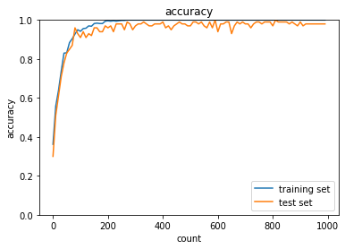

最新のCNN
=====
# AlexNetの例
- 最新ではないがAlex Netの例を紹介する。2012年の画像コンペで２位に大差をつけて優勝
 
- 入力には224 x 224の画像を使い、それを11x11のフィルターで畳み込み演算を行う。（多分ストライド４パディング３とか）
- 96(or32*RGB分？)種類のフィルター結果を55 x 55で表す。更に5x5のフィルターでMaxプーリングを行う。
- 96種類を基に256種類のプーリング結果を27x27で表す。更にそれを3x3のフィルターでマックスプーリングして384種類の13x13で表す。
- 更に全体の大きさを変えずに3x3で畳み込み、その後また、3x3畳み込みをして、256種類の13x13の結果をとする。
- その後横方向一列4096（13x13x256）の情報に並び替える。（Fratten）
  - その後のモデルでは、より効果の高いGlobal Average PoolingやGlobal Max Poolingが使われることの方が多い。（この例だと、13*13の情報の中で、最大の情報、あるいは平均の情報を256個並べるようなもの）
- そこから先は普通のニューラルネットワークのような数値の計算を行なっている。
- 全結合層の部分はドロップアウトを用いている。


# 実装

- PyTorchでのAlexNetの実装例を記載する。
（参考）https://pytorch.org/vision/0.12/_modules/torchvision/models/alexnet.html

- 入力は3 X 224 X 224を想定。

```python
class AlexNet(nn.Module):
 
    def __init__(self, num_classes=1000):
        super(AlexNet, self).__init__()
        self.features = nn.Sequential(
            nn.Conv2d(3, 64, kernel_size=11, stride=4, padding=2),
            nn.ReLU(inplace=True),
            nn.MaxPool2d(kernel_size=3, stride=2),
            nn.Conv2d(64, 192, kernel_size=5, padding=2),
            nn.ReLU(inplace=True),
            nn.MaxPool2d(kernel_size=3, stride=2),
            nn.Conv2d(192, 384, kernel_size=3, padding=1),
            nn.ReLU(inplace=True),
            nn.Conv2d(384, 256, kernel_size=3, padding=1),
            nn.ReLU(inplace=True),
            nn.Conv2d(256, 256, kernel_size=3, padding=1),
            nn.ReLU(inplace=True),
            nn.MaxPool2d(kernel_size=3, stride=2),
        )
        self.classifier = nn.Sequential(
            nn.Dropout(),
            nn.Linear(256 * 6 * 6, 4096),
            nn.ReLU(inplace=True),
            nn.Dropout(),
            nn.Linear(4096, 4096),
            nn.ReLU(inplace=True),
            nn.Linear(4096, num_classes),
        )
 
    def forward(self, x):
        x = self.features(x)
        x = x.view(x.size(0), 256 * 6 * 6)
        x = self.classifier(x)
        return x
```


正則化・最適化の演習
=====
# (パラメータ)正則化に関する追加学習事項（Elastic net）
- 過学習で実施した最適化に関して、いくつかトピックを追加。実装で確認。
- Elastic  Net 
  - L1正則化とL2正則化を組み合わせたもの
> \(Elastic Net = \displaystyle \sum_{i=1}^n (y^{(i)} - \hat y^{(i)})^2 + \lambda_1 \sum_{j=1}^m w_j^2 - \lambda_2 \sum_{j=2}^m\|w_j\|\)
-  \(\lambda_1, \lambda_2\)はハイパーパラメータ。で、各正規化項の制約の強さを調整する。

# 実装
-  2_9_regularization.ipynbで実装してみる。
- 下記の各結果を比較すると、L2正則化及びElasticNet(L1L2)が評価用データ（val_loss）の損失関数の学習が最も進んでいることがわかる。


# 正則化レイヤー（Dropout）の実装
- 実装については、下記に記載。
- 2_10_dropout.ipynbを使って実装してみる。
- Dropoutを使った方が過学習によるval_lossの上昇が抑えられていることがわかる。

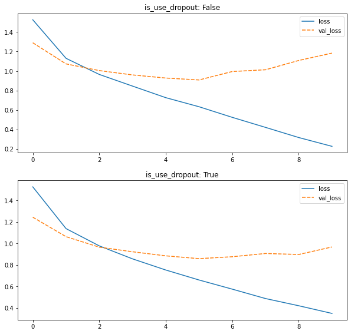

# 正規化レイヤーの実装
- Batch正規化
  - H x Wの大きさのデータでチャネル数をCとして、サンプルがN個あった時、N個の同一チャネルを正規化の単位として、バッチごとにに正規化。（最小はInstance正規化に等しい。）
  - GPUの制約等でミニバッチのサイズが大きく取れない場合は、効果が薄くなる。
- Layer正規化
  - Batch正規化とは異なり、角データのH x W x Cの中で正規化を行う。
  - Batch正規化の効果が薄い、ミニバッチのサイズが多く取れない時などに有効。
- Instance正規化
  - 各サンプル各チャネルのH x W の中で正規化。Batch正規化でバッチサイズが１の時と同一。
  - 2_11_layer_normalization.ipynb

- 今回はBatch正規化及びInstance正規かにおいてval_lossの上昇が抑えられており、正規化の強化ができていることがわかる。
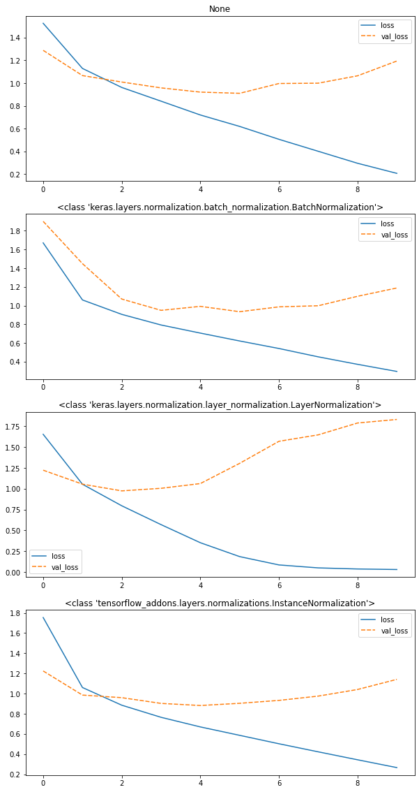
