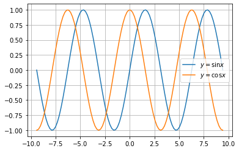
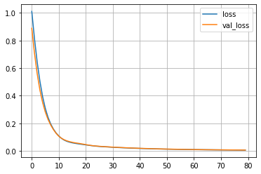
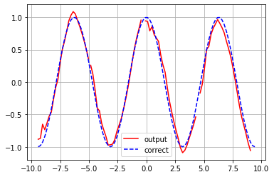

<script type="text/x-mathjax-config">MathJax.Hub.Config({tex2jax:{inlineMath:[['\$','\$'],['\\(','\\)']],processEscapes:true},CommonHTML: {matchFontHeight:false}});</script>
<script type="text/javascript" async src="https://cdnjs.cloudflare.com/ajax/libs/mathjax/2.7.1/MathJax.js?config=TeX-MML-AM_CHTML"></script>

# Seq2Seqの実践。

- sin関数の値からcos関数の値をSeq2Seqモデルに予測させる。
- まず教師データの準備


```python
x = np.linspace(-3 * np.pi, 3 * np.pi, 100)
seq_in = np.sin(x)
seq_out = np.cos(x)
plt.plot(x, seq_in, label='$y=\sin x$')
plt.plot(x, seq_out, label='$y=\cos x$')
plt.legend()
plt.grid()
plt.show()
```


- 次に用意した学習データを用いて学習を行う。
```python
# NUM_ENC_TOKENS: 入力データの次元数
# NUM_DEC_TOKENS: 出力データの次元数
# NUM_HIDDEN_PARAMS: 単純RNN層の出力次元数(コンテキストの次元数にもなる)
# NUM_STEPS: モデルへ入力するデータの時間的なステップ数。

NUM_ENC_TOKENS = 1
NUM_DEC_TOKENS = 1
NUM_HIDDEN_PARAMS = 10
NUM_STEPS = 24

# モデル定義
tf.keras.backend.clear_session()
e_input = tf.keras.layers.Input(shape=(NUM_STEPS, NUM_ENC_TOKENS), name='e_input')
_, e_state = tf.keras.layers.SimpleRNN(NUM_HIDDEN_PARAMS, return_state=True, name='e_rnn')(e_input)

d_input = tf.keras.layers.Input(shape=(NUM_STEPS, NUM_DEC_TOKENS), name='d_input')
d_rnn = tf.keras.layers.SimpleRNN(NUM_HIDDEN_PARAMS, return_sequences=True, return_state=True, name='d_rnn')
d_rnn_out, _ = d_rnn(d_input, initial_state=[e_state])

d_dense = tf.keras.layers.Dense(NUM_DEC_TOKENS, activation='linear', name='d_output')
d_output = d_dense(d_rnn_out)

model_train = tf.keras.models.Model(inputs=[e_input, d_input], outputs=d_output)
model_train.compile(optimizer='adam', loss='mean_squared_error')

model_train.summary()

# モデルの定義に合わせて学習用データを準備する。
# `ex`: エンコーダーの入力として使用する値。
# `dx`: デコーダーの入力として渡す値。最終的に出力したい値の1つ前のステップの値。
# `dy`: 最終的に推論したい値。`dx`と比べて時間的に1ステップ先の値となっている。

n = len(x) - NUM_STEPS
ex = np.zeros((n, NUM_STEPS))
dx = np.zeros((n, NUM_STEPS))
dy = np.zeros((n, NUM_STEPS))

for i in range(0, n):
  ex[i] = seq_in[i:i + NUM_STEPS]
  dx[i, 1:] = seq_out[i:i + NUM_STEPS - 1]
  dy[i] = seq_out[i: i + NUM_STEPS]

ex = ex.reshape(n, NUM_STEPS, 1)
dx = dx.reshape(n, NUM_STEPS, 1)
dy = dy.reshape(n, NUM_STEPS, 1)

# ミニバッチのサイズ: 16
# エポック数: 80回
ATCH_SIZE = 16
EPOCHS = 80
# 学習実行
history = model_train.fit([ex, dx], dy, batch_size=BATCH_SIZE, epochs=EPOCHS, validation_split=0.2, verbose=False)
# 学習過程描画
loss = history.history['loss']
plt.plot(np.arange(len(loss)), loss, label='loss')

loss = history.history['val_loss']
plt.plot(np.arange(len(loss)), loss, label='val_loss')

plt.grid()
plt.legend()
plt.show()
```
- ロス値が学習時と検証用で両方減っているので、順調に学習が進んでいることがわかる。


- 最後に推論を行う。

```python
# 推論用モデルの準備
model_pred_e = tf.keras.models.Model(inputs=[e_input], outputs=[e_state])

pred_d_input = tf.keras.layers.Input(shape=(1, 1))
pred_d_state_in = tf.keras.layers.Input(shape=(NUM_HIDDEN_PARAMS))

pred_d_output, pred_d_state = d_rnn(pred_d_input, initial_state=[pred_d_state_in])
pred_d_output = d_dense(pred_d_output)


pred_d_model = tf.keras.Model(inputs=[pred_d_input, pred_d_state_in], outputs=[pred_d_output, pred_d_state])

def predict(input_data):
  state_value = model_pred_e.predict(input_data)
  _dy = np.zeros((1, 1, 1))
  
  output_data = []
  for i in range(0, NUM_STEPS):
    y_output, state_value = pred_d_model.predict([_dy, state_value])
    
    output_data.append(y_output[0, 0, 0])
    _dy[0, 0, 0] = y_output

  return output_data
# 推論の実行
init_points = [0, 24, 49, 74]

for i in init_points:
  _x = ex[i : i + 1]
  _y = predict(_x)
    
  if i == 0:
    plt.plot(x[i : i + NUM_STEPS], _y, color="red", label='output')
  else:
    plt.plot(x[i : i + NUM_STEPS], _y, color="red")

plt.plot(x, seq_out, color = 'blue', linestyle = "dashed", label = 'correct')
plt.grid()
plt.legend()
plt.show()  
```
- 下記の通り、正しく推測できていることがわかる。
