<script type="text/x-mathjax-config">MathJax.Hub.Config({tex2jax:{inlineMath:[['\$','\$'],['\\(','\\)']],processEscapes:true},CommonHTML: {matchFontHeight:false}});</script>
<script type="text/javascript" async src="https://cdnjs.cloudflare.com/ajax/libs/mathjax/2.7.1/MathJax.js?config=TeX-MML-AM_CHTML"></script>

[フレームワーク演習]データオーギュメンテーション
=========

# data augumentationの実践。
- 画像処理認識精度向上のための画像の水増し処理を以下に記述する。


- 画像表示用の関数定義

```python
def show_images(images):
    """複数の画像を表示する"""
    n = 1
    while n ** 2 < len(images):
        n += 1
    for i, image in enumerate(images):
        plt.subplot(n, n, i + 1)
        plt.imshow(image)
        plt.axis('off')
    plt.show()
```

- 任意の画像を使用して元画像を表示する。

```python
contents = tf.io.read_file("./sample_data/image_origin.jpg")
image_origin = tf.image.decode_jpeg(contents, channels=3)
image = image_origin
show_images([image.numpy()])
```

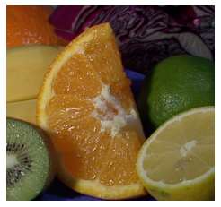

- 以下、データオーギュメンテーションの手法を列挙していく。

1. Horizontal Flip

```python
image = image_origin
image = tf.image.random_flip_left_right(image, seed=123)

show_images([image.numpy()])
```

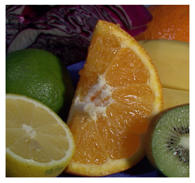

2. Vertial Flip

```python
image = image_origin
image = tf.image.random_flip_up_down(image, seed=123)

show_images([image.numpy()])
```

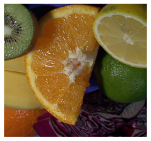


3. Crop

```python
image = image_origin
image = tf.image.random_crop(image, size=(100, 100, 3), seed=123)

show_images([image.numpy()])
```

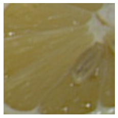

4. Contrast

```python
image = image_origin
image = tf.image.random_contrast(image, lower=0.4, upper=0.6)

show_images([image.numpy()])
```

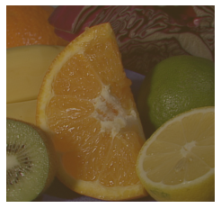

5. Brightness

- 輝度の調整

```python
image = image_origin
image = tf.image.random_brightness(image, max_delta=0.8)

show_images([image.numpy()])

```

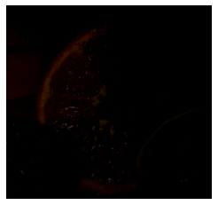


6. Hue

- 色相の調整

```python
image = image_origin
image = tf.image.random_hue(image, max_delta=0.1)

show_images([image.numpy()])
```

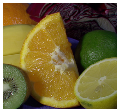

1. Rotate

```python
image = image_origin
image = tf.image.rot90(image, k=1)

show_images([image.numpy()])
```

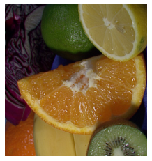

8. Random Erasing

```python
def random_erasing(img, prob = 0.5, sl = 0.02, sh = 0.4, r1 = 0.2, r2 = 0.8):
    if np.random.random() < prob:
        return img
    else:
        H = img.shape[0]
        W = img.shape[1]
        S = H * W
        while True:
            S_e = S * np.random.uniform(low=sl, high=sh)
            r_e = np.random.uniform(low=r1, high=r2)

            H_e = np.sqrt(S_e * r_e)
            W_e = np.sqrt(S_e / r_e)

            x_e = np.random.randint(0, W)
            y_e = np.random.randint(0, H)

            if x_e + W_e <= W and y_e + H_e <= H:
                img_modified = np.copy(img)
                img_modified[y_e:int(y_e + H_e + 1), x_e:int(x_e + W_e + 1), :] = np.random.uniform(0, 1)
                return img_modified
show_images([
             random_erasing(image.numpy()),
             random_erasing(image.numpy()),
             random_erasing(image.numpy()),
             random_erasing(image.numpy()),
             random_erasing(image.numpy()),
             random_erasing(image.numpy()),
             random_erasing(image.numpy()),
             random_erasing(image.numpy()),
             random_erasing(image.numpy()),
             random_erasing(image.numpy()),
             random_erasing(image.numpy()),
             random_erasing(image.numpy()),
             random_erasing(image.numpy()),
             random_erasing(image.numpy()),
             random_erasing(image.numpy()),
             random_erasing(image.numpy()),
             ])

```

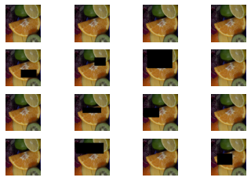


9.  MixUP

- データセットの中の２つの画像・ラベルを混合すること

```python
def sample_beta_distribution(size, concentration_0, concentration_1):
    gamma_1_sample = tf.random.gamma(shape=[size], alpha=concentration_1)
    gamma_2_sample = tf.random.gamma(shape=[size], alpha=concentration_0)
    return gamma_1_sample / (gamma_1_sample + gamma_2_sample)
def mix_up(ds_one, ds_two, alpha=0.4):
    # ds_oneとds_twoは10枚分ずれたmnistのデータセット。
    # どちらのデータセットにも入力データの画像とラベルが含まれている。
    images_one, labels_one = ds_one
    images_two, labels_two = ds_two

    # この後の処理で必要なため、データセットのバッチサイズを取得
    batch_size = tf.shape(images_one)[0]

    # 上で定義したベータ分布に基づくサンプリングで、バッチサイズ分の混合割合を取得。
    l = sample_beta_distribution(batch_size, alpha, alpha)
    x_l = tf.reshape(l, (batch_size, 1, 1, 1))
    y_l = tf.reshape(l, (batch_size, 1))

    # 2つのデータセットを混合割合に基づいて、入力データ･ラベルの両方を混合する。
    images = images_one * x_l + images_two * (1 - x_l)
    labels = labels_one * y_l + labels_two * (1 - y_l)
    return (images, labels)

# mnistデータセットの読み込み
(x_train, y_train), (x_test, y_test) = tf.keras.datasets.mnist.load_data()

# データを正規化し、28x28の画像の形状に変形する。
x_train = x_train.astype("float32") / 255.0
x_train = np.reshape(x_train, (-1, 28, 28, 1))

# ラベルをone-hotラベルの形式に変形する
y_train = tf.one_hot(y_train, 10)

# 10枚分ずれたデータセットを取得する。
# 1つ目のデータセットは、0枚目からmnistの最後から10こ手前まで。
# 2つ目のデータセットは、10枚目からmnistの最後まで。
# また、16枚でミニバッチを構成する
BATCH_SIZE = 16
train_ds_one = (tf.data.Dataset.from_tensor_slices((x_train[:-10], y_train[:-10])).batch(BATCH_SIZE))
train_ds_two = (tf.data.Dataset.from_tensor_slices((x_train[10:], y_train[10:])).batch(BATCH_SIZE))

# 10枚ずれたデータセット同士を連結し、MixUpの組合せを作る。
train_ds = tf.data.Dataset.zip((train_ds_one, train_ds_two))

# 先に定義したMixUpの関数を使って、2つのデータセットを処理する。
train_ds_mu = train_ds.map(lambda ds_one, ds_two: mix_up(ds_one, ds_two, alpha=0.4))

# MixUpされた9枚の画像を表示する。
# One-hot表現されたラベルも混合されていることがわかる。
sample_images, sample_labels = next(iter(train_ds_mu))
plt.figure(figsize=(10, 10))
for i, (image, label) in enumerate(zip(sample_images[:9], sample_labels[:9])):
    ax = plt.subplot(3, 3, i + 1)
    plt.imshow(image.numpy().squeeze())
    print('ラベル: ', label.numpy().tolist())
    plt.axis("off")

```

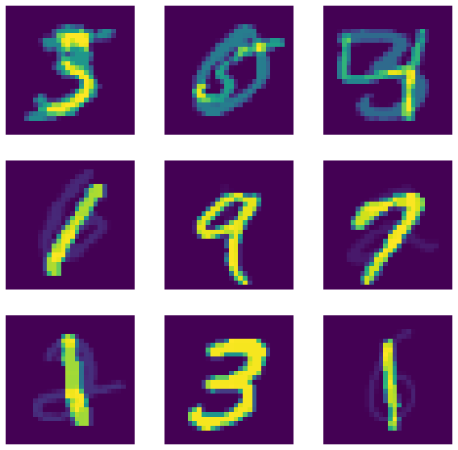

- 文字の重なりを確認することができる。

10.  複数の手法の組み合わせ

```python
def data_augmentation(image):
    image = tf.image.random_flip_left_right(image)
    image = tf.image.random_flip_up_down(image)
    image = tf.image.random_contrast(image, lower=0.4, upper=0.6)
    image = tf.image.random_brightness(image, max_delta=0.8)
    image = tf.image.rot90(image, k=random.choice((0, 1, 2)))
    image = tf.image.random_hue(image, max_delta=0.1)
    return image

image = image_origin

show_images([data_augmentation(image).numpy() for _ in range(36)])
```

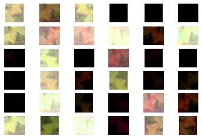
