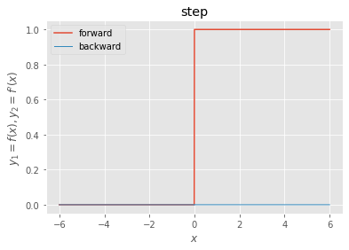
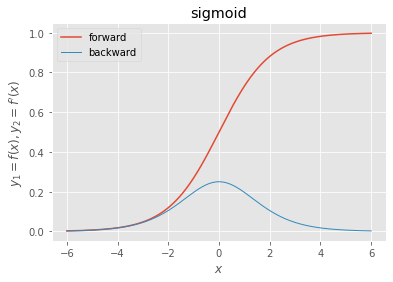
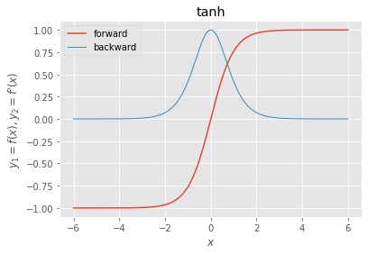
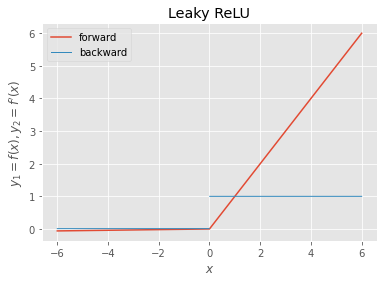
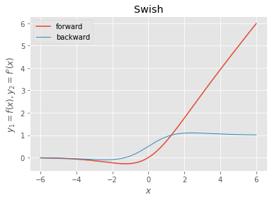
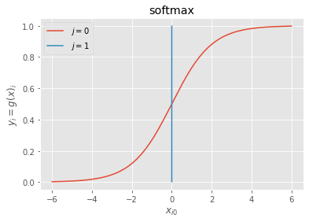
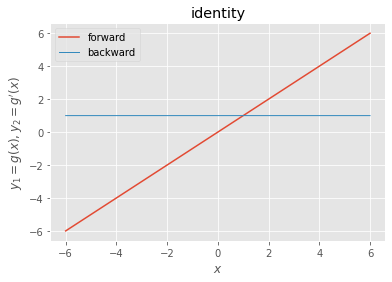

<script type="text/x-mathjax-config">MathJax.Hub.Config({tex2jax:{inlineMath:[['\$','\$'],['\\(','\\)']],processEscapes:true},CommonHTML: {matchFontHeight:false}});</script>
<script type="text/javascript" async src="https://cdnjs.cloudflare.com/ajax/libs/mathjax/2.7.1/MathJax.js?config=TeX-MML-AM_CHTML"></script>

[フレームワーク演習]活性化関数
=========


# 活性化関数の実践。

- 中間層に用いる活性化関数

1. ステップ関数

```python
def step_function(x):
    """forward
       
       step
       ステップ関数
       (閾値0)
    """
    return np.where(x >= 0.0, 1.0, 0.0)

def d_step_function(x):
    """backward
       
       derivative of step
       ステップ関数の導関数
       (閾値0)
    """
    dx = np.where(x == 0.0, np.nan, 0.0)
    return dx

x = np.arange(-600, 601, 1) * 0.01
f, d, = step_function, d_step_function
y1, y2 = f(x), d(x)

_, ax = plt.subplots()
ax.plot(x, y1, label=f.__doc__.split("\n")[0].strip())
ax.plot(x, y2, label=d.__doc__.split("\n")[0].strip(), linewidth=1.0)
ax.set_xlabel("$x$")
ax.set_ylabel("$y_{1}=f(x), y_{2}=f^{\prime}(x)$")
ax.set_title(f.__doc__.split("\n")[2].strip())
ax.legend()

plt.show()

```


2. シグモイド関数

```python
def sigmoid(x):
    """forward
       
       sigmoid
       シグモイド関数
    """
    return 1.0 / (1.0 + np.exp(-x))

def d_sigmoid(x):
    """backward
       
       derivative of sigmoid
       シグモイド関数の導関数
    """
    dx = sigmoid(x) * (1.0 - sigmoid(x))
    return dx
x = np.arange(-600, 601, 1) * 0.01
f, d = sigmoid, d_sigmoid
y1, y2 = f(x), d(x)

_, ax = plt.subplots()
ax.plot(x, y1, label=f.__doc__.split("\n")[0].strip())
ax.plot(x, y2, label=d.__doc__.split("\n")[0].strip(), linewidth=1.0)
ax.set_xlabel("$x$")
ax.set_ylabel("$y_{1}=f(x), y_{2}=f^{\prime}(x)$")
ax.set_title(f.__doc__.split("\n")[2].strip())
ax.legend()

plt.show()

```



1. tanh関数

```python
def tanh(x):
    """forward
       
       tanh
       双曲線正接関数
       (1)
    """
    return np.tanh(x)
def d_tanh(x):
    """backward
       
       derivative of tanh
       双曲線正接関数の導関数
       (1)
    """
    dx = 1.0 / np.square(np.cosh(x))
    return dx

x = np.arange(-600, 601, 1) * 0.01
f, d = tanh, d_tanh
y1, y2 = f(x), d(x)

_, ax = plt.subplots()
ax.plot(x, y1, label=f.__doc__.split("\n")[0].strip())
ax.plot(x, y2, label=d.__doc__.split("\n")[0].strip(), linewidth=1.0)
ax.set_xlabel("$x$")
ax.set_ylabel("$y_{1}=f(x), y_{2}=f^{\prime}(x)$")
ax.set_title(f.__doc__.split("\n")[2].strip())
ax.legend()

plt.show()
```


4. ReLU関数

```python
def relu(x):
    """forward
       
       ReLU
       正規化線形関数
    """
    return np.maximum(0, x)

def d_relu(x):
    """backward
       
       derivative of ReLU
       正規化線形関数の導関数
    """
    dx = np.where(x > 0.0, 1.0, np.where(x < 0.0, 0.0, np.nan))
    return dx
x = np.arange(-600, 601, 1) * 0.01
f, d = relu, d_relu
y1, y2 = f(x), d(x)

_, ax = plt.subplots()
ax.plot(x, y1, label=f.__doc__.split("\n")[0].strip())
ax.plot(x, y2, label=d.__doc__.split("\n")[0].strip(), linewidth=1.0)
ax.set_xlabel("$x$")
ax.set_ylabel("$y_{1}=f(x), y_{2}=f^{\prime}(x)$")
ax.set_title(f.__doc__.split("\n")[2].strip())
ax.legend()

plt.show()
```


1. LeakyReLU関数

```python
alpha = 0.01

def lrelu(x):
    """forward
       
       Leaky ReLU
       漏洩正規化線形関数
    """
    return np.maximum(alpha*x, x)

def d_lrelu(x):
    """backward
       
       derivative of Leaky ReLU
       漏洩正規化線形関数の導関数
    """
    dx = np.where(x > 0.0, 1.0, np.where(x < 0.0, alpha, np.nan))
    return dx
x = np.arange(-600, 601, 1) * 0.01
f, d = lrelu, d_lrelu
y1, y2 = f(x), d(x)

_, ax = plt.subplots()
ax.plot(x, y1, label=f.__doc__.split("\n")[0].strip())
ax.plot(x, y2, label=d.__doc__.split("\n")[0].strip(), linewidth=1.0)
ax.set_xlabel("$x$")
ax.set_ylabel("$y_{1}=f(x), y_{2}=f^{\prime}(x)$")
ax.set_title(f.__doc__.split("\n")[2].strip())
ax.legend()

plt.show()

```


6. Swish関数

- ReLUの次世代のスタンダード候補として注目

```python
beta = 1.0

def swish(x):
    """forward
       
       Swish
       シグモイド加重線形関数
    """
    return x * sigmoid(beta*x)

def d_swish(x):
    """backward
       
       derivative of Swish
       シグモイド加重線形関数の導関数
    """
    dx = beta*swish(x) + sigmoid(beta*x)*(1.0 - beta*swish(x)) 
    return dx
x = np.arange(-600, 601, 1) * 0.01
f, d = swish, d_swish
y1, y2 = f(x), d(x)

_, ax = plt.subplots()
ax.plot(x, y1, label=f.__doc__.split("\n")[0].strip())
ax.plot(x, y2, label=d.__doc__.split("\n")[0].strip(), linewidth=1.0)
ax.set_xlabel("$x$")
ax.set_ylabel("$y_{1}=f(x), y_{2}=f^{\prime}(x)$")
ax.set_title(f.__doc__.split("\n")[2].strip())
ax.legend()

plt.show()

```



- 出力層に用いる活性化関数

1. sigmoid関数（略）
   - 2値分類用
2. softmax関数
   - 多値分類用

```python
def softmax(x):
    """forward
       
       softmax
       ソフトマックス関数
    """
    if x.ndim == 2:
        x = x.T
        x = x - np.max(x, axis=0)
        y = np.exp(x) / np.sum(np.exp(x), axis=0)
        return y.T

    x = x - np.max(x)  # オーバーフロー対策
    return np.exp(x) / np.sum(np.exp(x))

def d_softmax(x):
    """backward
       
       derivative of softmax
       ソフトマックス関数の導関数
    """
    y = softmax(x)
    dx = -y[:,:,None] * y[:,None,:]       # ヤコビ行列を計算 (i≠jの場合)
    iy, ix = np.diag_indices_from(dx[0])  # 対角要素の添字を取得
    dx[:,iy,ix] = y * (1.0 - y)           # 対角要素値を修正 (i＝jの場合)
    return dx
x = np.pad(np.arange(-600, 601, 1).reshape((-1, 1)) * 0.01, ((0, 0), (0, 1)), 'constant')
g = softmax
y = g(x)

_, ax = plt.subplots()
for j in range(x.shape[1]):
    ax.plot(x[:,j], y[:,j], label=r" $j={}$".format(j))
ax.set_xlabel("$x_{i0}$")
ax.set_ylabel("$y_{i}=g(x)_{i}$")
ax.set_title(g.__doc__.split("\n")[2].strip())
ax.legend()

plt.show()

```



1. 恒等関数
   - 回帰用

```python
def identity(x):
    """forward
       
       identity
       恒等関数
    """
    return x

def d_identity(x):
    """backward
       
       derivative of identity
       恒等関数の導関数
    """
    dx = np.ones_like(x)
    return dx
    
x = np.arange(-600, 601, 1) * 0.01
g, d = identity, d_identity
y1, y2 = g(x), d(x)

_, ax = plt.subplots()
ax.plot(x, y1, label=g.__doc__.split("\n")[0].strip())
ax.plot(x, y2, label=d.__doc__.split("\n")[0].strip(), linewidth=1.0)
ax.set_xlabel("$x$")
ax.set_ylabel("$y_{1}=g(x), y_{2}=g^{\prime}(x)$")
ax.set_title(g.__doc__.split("\n")[2].strip())
ax.legend()

plt.show()

```


