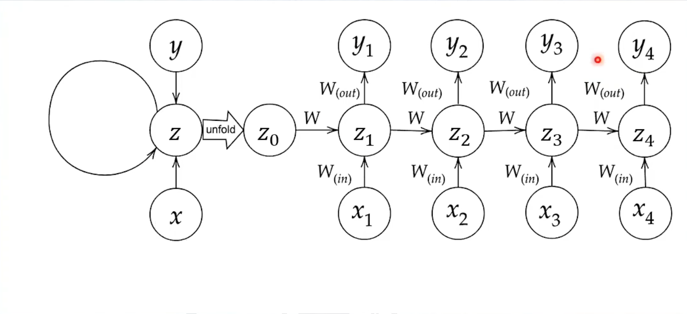
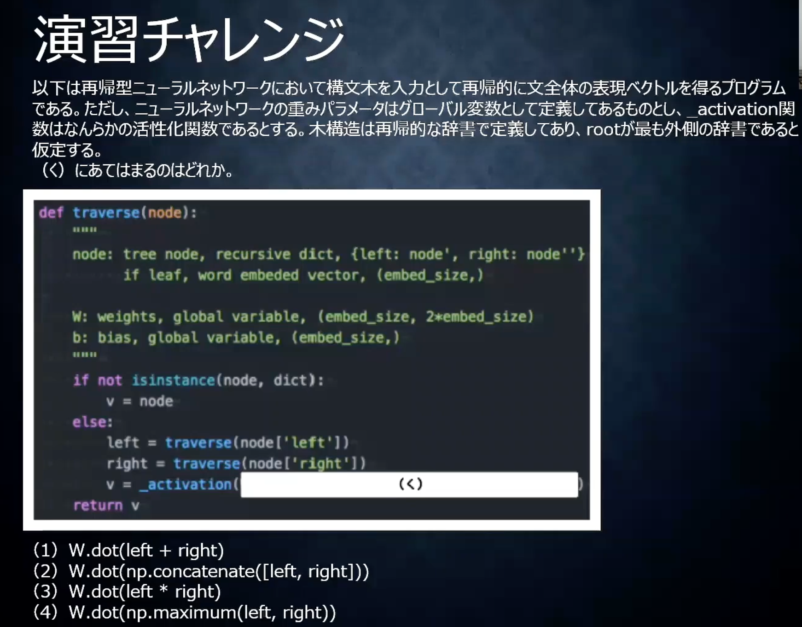
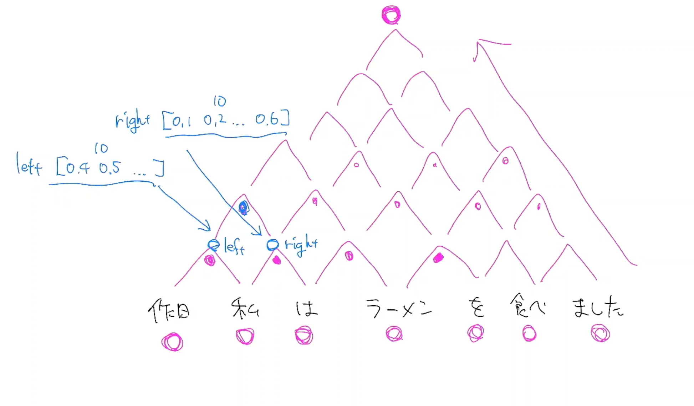
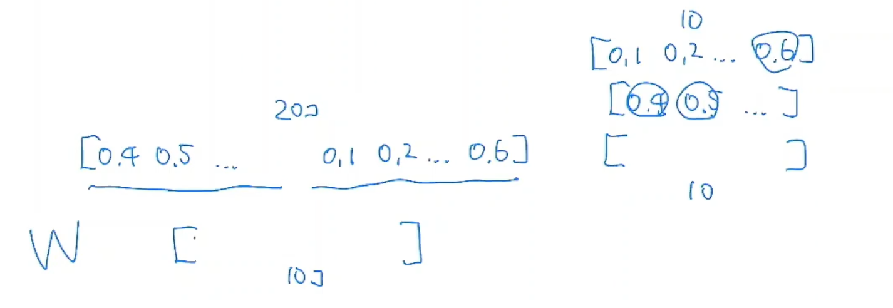
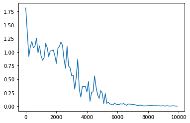
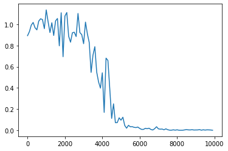
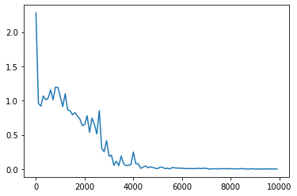
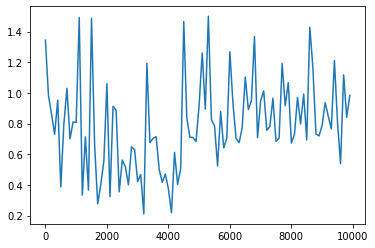
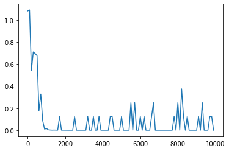

<script type="text/x-mathjax-config">MathJax.Hub.Config({tex2jax:{inlineMath:[['\$','\$'],['\\(','\\)']],processEscapes:true},CommonHTML: {matchFontHeight:false}});</script>
<script type="text/javascript" async src="https://cdnjs.cloudflare.com/ajax/libs/mathjax/2.7.1/MathJax.js?config=TeX-MML-AM_CHTML"></script>

# 確認テスト１９
- サイズ 5*5の入力画像を、サイズ3*3のフィルタで畳み込んだ時の出力画像のサイズを求めよ。なおストライド2パディングは1とする。
- 正解は3*3。

# 再帰型ニューラルネットワーク(RNN)
- 前後のデータに関係性がある、時系列データ・自然言語データなどに使用される。
- RNNでは入力層から中間層（W_in）、中間層から出力層(W_out)、１つ前の学習での中間層から中間層（W）という３つの重みがあり、それをうまく学習することが重要である。

# 確認テスト２０
- RNNのネットワークには大きく分けて３つの重みがある。
  - １つは入力から現在の中間層を定義する際にかけられて重み、
  - １つは中間層から出力を定義する際にかけられた重み、
- 残り１つの重みについて説明せよ。
  - 残り１つは１つ前の中間層から中間層を定義する際にかけられた重み。

# RNN続き
- プログラムは3_1参照
- バイナリ加算
  - 過去から未来への情報の遷移を繰り上がりによって表現している。
- 時系列ループ
  - RNNでは1回の学習で、分析機関の学習を一旦全て死してしまう。それを学習の数繰り返すことで、モデルの制度を高めていく。（一回の学習で必要な1年のモデルなら1年分の予測をす全てしてしまう。）
# 演習チャレンジ

- 構文器の問題
  - 隣同士の単語をつなぎ合わせて行って、一つの特徴量にしていく木構造のプロセスを構文器という。


- 演習の正解は2
- 重みをうまく準備することによって、特徴量を構成する数字の数は調整できる。

# 確認テスト２１（誤差逆伝播法の復習）
> \\\(\begin{aligned}z &= t^2\cr
t &= x + y\cr
\displaystyle \frac{dz}{dt} &= 2t\cr
\displaystyle \frac{dt}{dx} &= 1\end{aligned}\\\)
> 連鎖率の原理より<br>
> \\\(\displaystyle \frac{dz}{dx} = \frac{dz}{dt}\frac{dt}{dx}\\\)<br>
> \\\(\displaystyle \frac{dz}{dx} = 2t \cdot 1 = 2(x + y)\\\)<br>

# RNNにおける逆伝播(BPTT)
- 3_1_Simple_RNNの当該部分
```python
delta[:,t] = (np.dot(delta[:,t+1].T, W.T) + np.dot(delta_out[:,t].T, W_out.T)) * functions.d_sigmoid(u[:,t+1])
```
- deltaの定義(E（もしくはy）をuまで順次微分したよというのを表す。)
```python
delta = np.zeros((hidden_layer_size, binary_dim + 1))
```
# BPTTの数学的説明

- 上記のような形をイメージしつつ、まず以下のように変数を定義する。f, gは活性化関数、b、cはバイアス。
- yが中間層の出力、zが中間層の入力とする。
> \\\(\begin{aligned}
u_t &= W_{(in)}x^t + Wz^{t-1} + b \cr
z_t &= f \left( W_{(in)}x^t + Wz^{t-1} + b \right) \cr
v_t &= W_{(out)}z^t + c \cr
y_t &=g \left( W_{(out)}z^t + c\right) \end{aligned}\\\)
- また、
> \\\(\begin{aligned}\frac{\partial E}{\partial u^t} &= \delta^t \cr
\frac{\partial E}{\partial v^t} &= \delta^{out,t}\end{aligned}\\\)
- と定義する。
- すると、他の偏微分を以下のように表せる。
>\\\(\begin{aligned}
\frac{\partial E}{\partial W_{(in)}} &= \frac{\partial E}{\partial u^t} \left[ \frac{\partial u^t}{\partial W_{(in)}} \right]^T = \delta^t\left[ x^t \right]^T \cr
\frac{\partial E}{\partial W_{(out)}} &= \frac{\partial E}{\partial v^t} \left[ \frac{\partial v^t}{\partial W_{(out)}} \right]^T = \delta^{out,t}\left[ z^t \right]^T \cr
\frac{\partial E}{\partial W} &= \frac{\partial E}{\partial u^t} \left[ \frac{\partial u^t}{\partial W} \right]^T = \delta^t\left[ z^{t-1} \right]^T \cr
\frac{\partial E}{\partial b} &= \frac{\partial E}{\partial u^t}  \frac{\partial u^t}{\partial b} = \delta^t \cr
\frac{\partial E}{\partial c} &= \frac{\partial E}{\partial v^t}  \frac{\partial v^t}{\partial c} = \delta^{out,t}
\end{aligned}\\\)


# 確認テスト２２
- 下図の\\\(y_1\\\)を\\\(x \cdot z_0 \cdot z_1 \cdot W_{in} \cdot W \cdot W_{out}\\\)を用いて数式で表せ。
  - バイアスは任意の文字で定義せよ。 
  - ※また中間層の出力にシグモイド関数g(x)を作用させよ。

- 上図より適当なバイアス c を置いて、
  > \\\(y_1 = g \left( W_{out} z_1 + c \right)\\\)
- 同様に適当なバイアスb、中間層の入力に関する活性化関数fを置いて、
  >\\\(z_1 = f \left( W z_0 + W_{(in)} x_1 + b \right)\\\)
- よって、
  > \\\(y_1 = g \left( W_{out} f \left( W z_0 + W_{(in)} x_1 + b \right) + c \right)\\\)

# BPTTの数学的説明続き(各時点のdeltaの関係性)
- \\\(v^t\\\)は\\\(u^t\\\)の関数であることから、\\\(\delta^t\\\)と\\\(\delta^{out,t}\\\)の関係を以下のように導くことができる。
> \\\(\displaystyle \frac{\partial E}{\partial u^t} = \frac{\partial E}{\partial v^t} \frac{\partial v^t}{\partial u_t}  = \frac{\partial E}{\partial v^t} \frac{\partial \lbrace W_{(out)}f(u^t) + c\rbrace}{\partial u_t} = f^{\prime}(u^t) W_{(out)}^T \delta^{out,t} =\delta^t\\\)
- また一時点離れたdelta_t とdelta_{t-1}の時間的なつながりは以下のように表される。
> \\\(\displaystyle \delta^{t-1} = \frac{\partial E}{\partial u^{t-1}} = \frac{\partial E}{\partial u^t} \frac{\partial u^t}{\partial u^{t-1}} = \delta^t \left\lbrace \frac{\partial u^t}{\partial z^{t-1}}   \frac{\partial z^{t-1}}{\partial u^{t-1}}\right\rbrace = \delta^t \left\lbrace Wf^{\prime} \left(u^{t-1}\right) \right\rbrace\\\)
- 上記からt-1をt-z-1とすることで以下のように1時店前との関係について、一般に以下のような関係がなりたつ。
> \\\(\displaystyle \delta^{t-z-1} = \delta^{t-z} \left\lbrace Wf^{\prime} \left(u^{t-z-1}\right) \right\rbrace\\\)

# BPTTの数学的説明続きの続き(重みとバイアスの更新式)
- ２番目の式は中間層から先のプロセスなので、時間的に前の式を考慮しなくて良いものになっている。（sumの表現がそこだけない。）
- εは学習率（ハイパーパラメータなので、時間的に本質ではない。）
> \\\(\displaystyle W_{(in)}^{t+1} = W_{(in)}^t - \epsilon \frac{\partial E}{\partial W_{(in)}} = W_{(in)}^t - \epsilon \sum_{z=0}^{T_t} \delta^{t-z}\left[x^{t-z} \right]^T\\\)
> \\\(\displaystyle W_{(out)}^{t+1} = W_{(out)}^t - \epsilon \frac{\partial E}{\partial W_{(out)}} = W_{(out)}^t - \epsilon  \delta^{out,t}\left[z^{t} \right]^T\\\)
> \\\(\displaystyle W^{t+1} = W^t - \epsilon \frac{\partial E}{\partial W} = W^t - \epsilon \sum_{z=0}^{T_t} \delta^{t-z}\left[z^{t-z+1} \right]^T\\\)
> \\\(\displaystyle b^{t+1} = b^t - \epsilon \frac{\partial E}{\partial b} = b^t - \epsilon \sum_{z=0}^{T_t} \delta^{t-z}\\\)
> \\\(\displaystyle c^{t+1} = c^t - \epsilon \frac{\partial E}{\partial c} = c^t - \epsilon \delta^{out,t}\\\)
# BPTTの全体像
- どうしてBPTTで時間的な考慮ができるのか数式を通じて確認できる。
- T時刻の誤差関数クロスエントロピー
- 誤差関数はニューラルネットワークの出力であるyと教師データであるeから構成される
> \\\(\begin{aligned}
E^t &= loss(y^t, d^t) \cr
&= loss \left(g(W_{(out)}z^t + c),d^t  \right) \cr
&= loss \left(g(W_{(out)}f(u^t) + c),d^t  \right) \cr
&= loss \left(g(W_{(out)}f(W_{(in)}x^t + Wz^{t-1} + b) + c),d^t  \right) \cr
&= loss \left(g(W_{(out)}f(W_{(in)}x^t + Wf(u^{t-1}) + b) + c),d^t  \right) \cr
&=loss \left(g(W_{(out)}f(W_{(in)}x^t + Wf(W_{(in)}x^{t-1} + Wz^{t-2} + b) + c) + b) + c),d^t  \right) \cr
&\vdots
\end{aligned}\\\)

# 実装演習

```python
import numpy as np
from common import functions
import matplotlib.pyplot as plt


def d_tanh(x):
    return 1/(np.cosh(x) ** 2)

# データを用意
# 2進数の桁数
binary_dim = 8
# 最大値 + 1
largest_number = pow(2, binary_dim)
# largest_numberまで2進数を用意
binary = np.unpackbits(np.array([range(largest_number)],dtype=np.uint8).T,axis=1)

input_layer_size = 2
hidden_layer_size = 16
output_layer_size = 1

weight_init_std = 1
learning_rate = 0.1

iters_num = 10000
plot_interval = 100

# ウェイト初期化 (バイアスは簡単のため省略)
W_in = weight_init_std * np.random.randn(input_layer_size, hidden_layer_size)
W_out = weight_init_std * np.random.randn(hidden_layer_size, output_layer_size)
W = weight_init_std * np.random.randn(hidden_layer_size, hidden_layer_size)
# Xavier
# W_in = np.random.randn(input_layer_size, hidden_layer_size) / (np.sqrt(input_layer_size))
# W_out = np.random.randn(hidden_layer_size, output_layer_size) / (np.sqrt(hidden_layer_size))
# W = np.random.randn(hidden_layer_size, hidden_layer_size) / (np.sqrt(hidden_layer_size))
# He
# W_in = np.random.randn(input_layer_size, hidden_layer_size) / (np.sqrt(input_layer_size)) * np.sqrt(2)
# W_out = np.random.randn(hidden_layer_size, output_layer_size) / (np.sqrt(hidden_layer_size)) * np.sqrt(2)
# W = np.random.randn(hidden_layer_size, hidden_layer_size) / (np.sqrt(hidden_layer_size)) * np.sqrt(2)


# 勾配
W_in_grad = np.zeros_like(W_in)
W_out_grad = np.zeros_like(W_out)
W_grad = np.zeros_like(W)

u = np.zeros((hidden_layer_size, binary_dim + 1))
z = np.zeros((hidden_layer_size, binary_dim + 1))
y = np.zeros((output_layer_size, binary_dim))

delta_out = np.zeros((output_layer_size, binary_dim))
delta = np.zeros((hidden_layer_size, binary_dim + 1))

all_losses = []

for i in range(iters_num):
    
    # A, B初期化 (a + b = d)
    a_int = np.random.randint(largest_number/2)
    a_bin = binary[a_int] # binary encoding
    b_int = np.random.randint(largest_number/2)
    b_bin = binary[b_int] # binary encoding
    
    # 正解データ
    d_int = a_int + b_int
    d_bin = binary[d_int]
    
    # 出力バイナリ
    out_bin = np.zeros_like(d_bin)
    
    # 時系列全体の誤差
    all_loss = 0    
    
    # 時系列ループ
    for t in range(binary_dim):
        # 入力値
        X = np.array([a_bin[ - t - 1], b_bin[ - t - 1]]).reshape(1, -1)
        # 時刻tにおける正解データ
        dd = np.array([d_bin[binary_dim - t - 1]])
        
        u[:,t+1] = np.dot(X, W_in) + np.dot(z[:,t].reshape(1, -1), W)
        z[:,t+1] = functions.sigmoid(u[:,t+1])
#         z[:,t+1] = functions.relu(u[:,t+1])
#         z[:,t+1] = np.tanh(u[:,t+1])    
        y[:,t] = functions.sigmoid(np.dot(z[:,t+1].reshape(1, -1), W_out))


        #誤差
        loss = functions.mean_squared_error(dd, y[:,t])
        
        delta_out[:,t] = functions.d_mean_squared_error(dd, y[:,t]) * functions.d_sigmoid(y[:,t])        
        
        all_loss += loss

        out_bin[binary_dim - t - 1] = np.round(y[:,t])
    
    
    for t in range(binary_dim)[::-1]:
        X = np.array([a_bin[-t-1],b_bin[-t-1]]).reshape(1, -1)        

        delta[:,t] = (np.dot(delta[:,t+1].T, W.T) + np.dot(delta_out[:,t].T, W_out.T)) * functions.d_sigmoid(u[:,t+1])
#         delta[:,t] = (np.dot(delta[:,t+1].T, W.T) + np.dot(delta_out[:,t].T, W_out.T)) * functions.d_relu(u[:,t+1])
#         delta[:,t] = (np.dot(delta[:,t+1].T, W.T) + np.dot(delta_out[:,t].T, W_out.T)) * d_tanh(u[:,t+1])    

        # 勾配更新
        W_out_grad += np.dot(z[:,t+1].reshape(-1,1), delta_out[:,t].reshape(-1,1))
        W_grad += np.dot(z[:,t].reshape(-1,1), delta[:,t].reshape(1,-1))
        W_in_grad += np.dot(X.T, delta[:,t].reshape(1,-1))
    
    # 勾配適用
    W_in -= learning_rate * W_in_grad
    W_out -= learning_rate * W_out_grad
    W -= learning_rate * W_grad
    
    W_in_grad *= 0
    W_out_grad *= 0
    W_grad *= 0
    

    if(i % plot_interval == 0):
        all_losses.append(all_loss)        
        print("iters:" + str(i))
        print("Loss:" + str(all_loss))
        print("Pred:" + str(out_bin))
        print("True:" + str(d_bin))
        out_int = 0
        for index,x in enumerate(reversed(out_bin)):
            out_int += x * pow(2, index)
        print(str(a_int) + " + " + str(b_int) + " = " + str(out_int))
        print("------------")

lists = range(0, iters_num, plot_interval)
plt.plot(lists, all_losses, label="loss")
plt.show()
```

- 重みの初期化方法:なし 活性化関数: Sigmoid

- 重みの初期化方法:Xavier 活性化関数: Sigmoid

- 重みの初期化方法:He 活性化関数: Sigmoid

- 重みの初期化方法:He 活性化関数: ReLU

- 重みの初期化方法:He 活性化関数: Tanh

