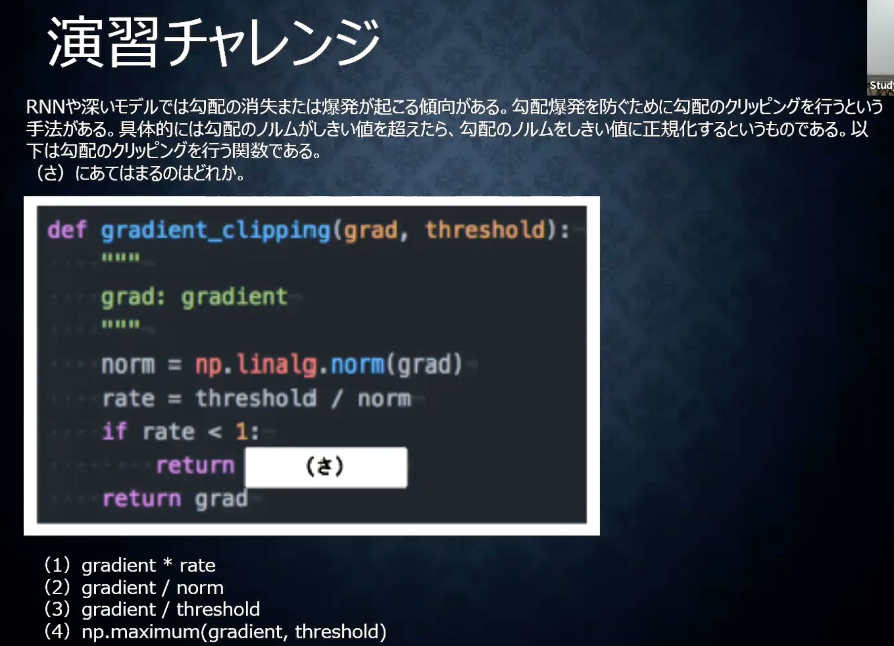
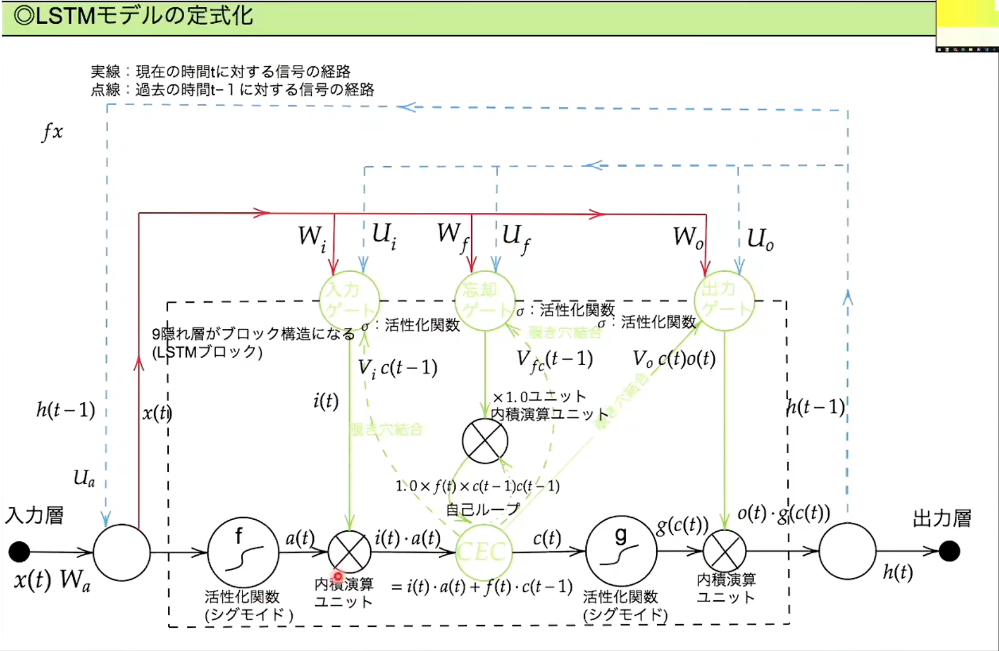
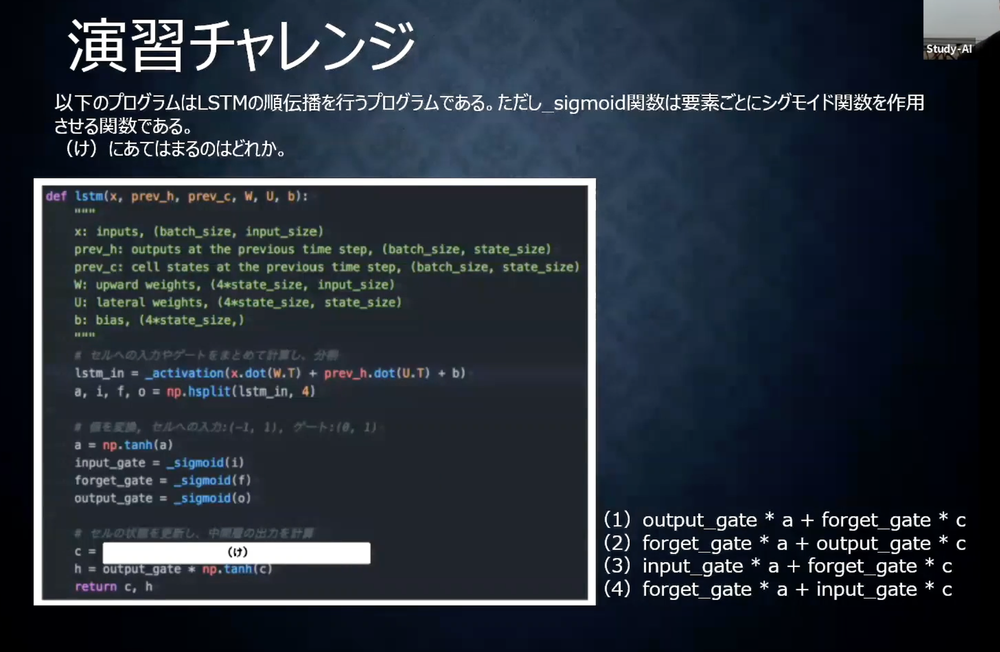

<script type="text/x-mathjax-config">MathJax.Hub.Config({tex2jax:{inlineMath:[['\$','\$'],['\\(','\\)']],processEscapes:true},CommonHTML: {matchFontHeight:false}});</script>
<script type="text/javascript" async src="https://cdnjs.cloudflare.com/ajax/libs/mathjax/2.7.1/MathJax.js?config=TeX-MML-AM_CHTML"></script>

LSTM
=========


- RNNの課題
  - 時間を遡れば遡るほど、勾配が消失して、長い時間の学習が困難。
    - シグモイド関数は勾配消失問題が起きやすい。
  - その解決策として、構造自体を変えてしまったのが、LSTM

# 確認テスト２３
- シグモイド関数を微分した時、入力値は0で最大値を取る。
- その値は何か。
> \\\(sigmoid(x) = \displaystyle \frac{1}{1 + e^{-x}}\\\)
> \\\(\displaystyle sigmoid(x)^\prime = (1 - sigmoid(x))sigmoid(x)\\\)
> \\\(sigmoid(0)= 0.5\\\) より \\\(sigmoid(x)^\prime = 0.25\\\)

# LSTM続き
- 勾配爆発
  - 購買消失と逆の現象である勾配爆発も起こり得る。
  - 学習率を推奨値でない値に設定するとよく発生する。

# 演習チャレンジ

- 正解は１。勾配のノルムを計算してそれが閾値より大きい時は勾配のノルムが閾値の範囲に入るように正規化する。そのためには、ノルムが１より大きい場合、勾配に閾値/ノルムを掛け算することで値を小さくし、閾値から超えないような処理をしている。（閾値から超える場合、それを繰り返す。）

# CEC

- RNNで重要な過去からの情報をLSTNで一元管理しているのが、CEC(Constant Error Carousel)
  - これまでの入力値や中間層の出力値だけをCECに持たせている。
    - RNNは学習と記憶を同じ中間層が持っていた
  - 時系列を遡らせないためには、\\\(\displaystyle \delta^{t-z-1} = \delta^{t-z} \left\lbrace Wf^{\prime} \left(u^{t-z-1}\right) \right\rbrace　=1\\\)となれば良いという発想。
    - ただ勾配が１ということは覚えた結果をそのまま返すということで学習特性がないということ。
    - そのため、CECの周囲に学習機能を持たせ、適切な情報をCECから伝播することでうまく機能するのではないか、という発送に至る。
      - 入力ゲートや出力ゲート

# 入力ゲートとと出力ゲート
- 入力ゲート
  - 入力ゲートはCECに入力情報を記憶するように指示を送る。
  - 入力ゲートは何をCECに覚えさせるのかを学習していく。
- 出力ゲート
  - 出力ゲートはCECの情報をどう使うかの指示を送る。
  - 出力ゲートはCECをどう使うかを学習する。
- 重みは入力ゲート出力ゲートそれぞれにWとUを持つ。
  -  Wは今回の入力をどれくらい判断材料として使うか。Uは前回の出力をどれくらい判断材料として使うか。
  -  WとUより求めたVをCUCに送付する。

# 忘却ゲート
- CECで過去の情報が使われなくなったタイミングで記憶を消去する機能が必要。
- CECの記憶を忘れさせるかどうかを判断するのが忘却ゲート
- CECからの出力であるCは、c(t)= i(t)a(t) + f(t)c(t-1)と計算される。
  - aが今回の入力の計算結果、iが入力ゲートからくる、今回の入力をどれくらい使うかの情報。
  - fが忘却ゲートから来る、前回の情報をどれくらい忘れさせるか。

# 確認テスト２４
- LSTMを用いて、以下の空欄に当てはまる単語を予測したいとする。
- 文中の「とても」という言葉は空欄の予測においてなくなっても影響はないと学習の中で判断されたとする。
- このような場合、どのゲートが作用するのが正しいのか。
  - 作用するのは忘却ゲート。とてもの部分を忘れさせることで学習に必要なもののみをCECに残す。
  
# 演習チャレンジ

- 正解はウ

# 覗き穴結合
- 入力ゲート、出力ゲート、忘却ゲートがCECの中身を見えるようにしている機構。
- CECの中身を見て、インプットの量を調整する。
- あまり効果的な仕組みでは結果としてなかった。

# 実装
- tensorflowを用いて実装した例を記載。

```python
import numpy as np
import re
import glob
import collections
import pickle

class Corpus:
    def __init__(self):
        self.unknown_word_symbol = "<???>" # 出現回数の少ない単語は未知語として定義しておく
        self.unknown_word_threshold = 3 # 未知語と定義する単語の出現回数の閾値
        self.corpus_file = "./corpus/**/*.txt"
        self.corpus_encoding = "utf-8"
        self.dictionary_filename = "./data_for_predict/word_dict.dic"
        self.chunk_size = 5
        self.load_dict()
        words = []
        for filename in glob.glob(self.corpus_file, recursive=True):
            with open(filename, "r", encoding=self.corpus_encoding) as f:
                # word breaking
                text = f.read()
                # 全ての文字を小文字に統一し、改行をスペースに変換
                text = text.lower().replace("\n", " ")
                # 特定の文字以外の文字を空文字に置換する
                text = re.sub(r"[^a-z '\-]", "", text)
                # 複数のスペースはスペース一文字に変換
                text = re.sub(r"[ ]+", " ", text)

                # 前処理： '-' で始まる単語は無視する
                words = [ word for word in text.split() if not word.startswith("-")]

        self.data_n = len(words) - self.chunk_size
        self.data = self.seq_to_matrix(words)

    def prepare_data(self):
        """
        訓練データとテストデータを準備する。
        data_n = ( text データの総単語数 ) - chunk_size
        input: (data_n, chunk_size, vocabulary_size)
        output: (data_n, vocabulary_size)
        """

        # 入力と出力の次元テンソルを準備
        all_input = np.zeros([self.chunk_size, self.vocabulary_size, self.data_n])
        all_output = np.zeros([self.vocabulary_size, self.data_n])

        # 準備したテンソルに、コーパスの one-hot 表現(self.data) のデータを埋めていく
        # i 番目から ( i + chunk_size - 1 ) 番目までの単語が１組の入力となる
        # このときの出力は ( i + chunk_size ) 番目の単語
        for i in range(self.data_n):
            all_output[:, i] = self.data[:, i + self.chunk_size] # (i + chunk_size) 番目の単語の one-hot ベクトル
            for j in range(self.chunk_size):
                all_input[j, :, i] = self.data[:, i + self.chunk_size - j - 1]

        # 後に使うデータ形式に合わせるために転置を取る
        all_input = all_input.transpose([2, 0, 1])
        all_output = all_output.transpose()

        # 訓練データ：テストデータを 4 : 1 に分割する
        training_num = ( self.data_n * 4 ) // 5
        return all_input[:training_num], all_output[:training_num], all_input[training_num:], all_output[training_num:]


    def build_dict(self):
        # コーパス全体を見て、単語の出現回数をカウントする
        counter = collections.Counter()
        for filename in glob.glob(self.corpus_file, recursive=True):
            with open(filename, "r", encoding=self.corpus_encoding) as f:

                # word breaking
                text = f.read()
                # 全ての文字を小文字に統一し、改行をスペースに変換
                text = text.lower().replace("\n", " ")
                # 特定の文字以外の文字を空文字に置換する
                text = re.sub(r"[^a-z '\-]", "", text)
                # 複数のスペースはスペース一文字に変換
                text = re.sub(r"[ ]+", " ", text)

                # 前処理： '-' で始まる単語は無視する
                words = [word for word in text.split() if not word.startswith("-")]

                counter.update(words)

        # 出現頻度の低い単語を一つの記号にまとめる
        word_id = 0
        dictionary = {}
        for word, count in counter.items():
            if count <= self.unknown_word_threshold:
                continue

            dictionary[word] = word_id
            word_id += 1
        dictionary[self.unknown_word_symbol] = word_id

        print("総単語数：", len(dictionary))

        # 辞書を pickle を使って保存しておく
        with open(self.dictionary_filename, "wb") as f:
            pickle.dump(dictionary, f)
            print("Dictionary is saved to", self.dictionary_filename)

        self.dictionary = dictionary
        print(self.dictionary)

    def load_dict(self):
        with open(self.dictionary_filename, "rb") as f:
            self.dictionary = pickle.load(f)
            self.vocabulary_size = len(self.dictionary)
            self.input_layer_size = len(self.dictionary)
            self.output_layer_size = len(self.dictionary)
            print("総単語数: ", self.input_layer_size)

    def get_word_id(self, word):
        # print(word)
        # print(self.dictionary)
        # print(self.unknown_word_symbol)
        # print(self.dictionary[self.unknown_word_symbol])
        # print(self.dictionary.get(word, self.dictionary[self.unknown_word_symbol]))
        return self.dictionary.get(word, self.dictionary[self.unknown_word_symbol])

    # 入力された単語を one-hot ベクトルにする
    def to_one_hot(self, word):
        index = self.get_word_id(word)
        data = np.zeros(self.vocabulary_size)
        data[index] = 1
        return data

    def seq_to_matrix(self, seq):
        # print(seq)
        data = np.array([self.to_one_hot(word) for word in seq]) # (data_n, vocabulary_size)
        return data.transpose() # (vocabulary_size, data_n)

def build_dict():
    cp = Corpus()
    cp.build_dict()

```

```python
import time
import datetime

class Language:
    """
    input layer: self.vocabulary_size
    hidden layer: rnn_size = 30
    output layer: self.vocabulary_size
    """

    def __init__(self):
        self.corpus = Corpus()
        self.dictionary = self.corpus.dictionary
        self.vocabulary_size = len(self.dictionary) # 単語数
        self.input_layer_size = self.vocabulary_size # 入力層の数
        self.hidden_layer_size = 30 # 隠れ層の RNN ユニットの数
        self.output_layer_size = self.vocabulary_size # 出力層の数
        self.batch_size = 128 # バッチサイズ
        self.chunk_size = 5 # 展開するシーケンスの数。c_0, c_1, ..., c_(chunk_size - 1) を入力し、c_(chunk_size) 番目の単語の確率が出力される。
        self.learning_rate = 0.001 # 学習率
        self.epochs = 50 # 学習するエポック数
        self.forget_bias = 1.0 # LSTM における忘却ゲートのバイアス
        self.model_filename = "./data_for_predict/predict_model.ckpt"
        self.unknown_word_symbol = self.corpus.unknown_word_symbol

        # RNN 入力前の Embedding のパラメータ　
        self.hidden_w = tf.Variable(tf.random.truncated_normal([self.input_layer_size, self.hidden_layer_size], stddev=0.01))
        self.hidden_b = tf.Variable(tf.ones([self.hidden_layer_size]))

        # RNN 出力後の 全結合層のパラメータ
        self.output_w = tf.Variable(tf.random.truncated_normal([self.hidden_layer_size, self.output_layer_size], stddev=0.01))
        self.output_b = tf.Variable(tf.ones([self.output_layer_size]))

        # RNN 
        #self.rnn = tf.keras.layers.SimpleRNN(self.hidden_layer_size, activation='tanh', return_sequences=True)
        self.rnn = tf.keras.layers.SimpleRNN(self.hidden_layer_size, activation='tanh')
        # SimpleRNN Layer の weight を 強制的に生成させる 
        self.rnn(np.zeros((self.chunk_size, self.batch_size, self.hidden_layer_size),np.float32)) 

        self.trainable_variables = [self.hidden_w, self.hidden_b, self.output_w, self.output_b, *self.rnn.trainable_variables]

        self.optimizer = None

    def load_weights(self, ckpt_path):
        ckpt = tf.train.load_checkpoint(ckpt_path)

        # checkpoint から明示的に変数名を指定して保存
        self.hidden_w=tf.Variable(ckpt.get_tensor("hidden_w/.ATTRIBUTES/VARIABLE_VALUE"))
        self.hidden_b=tf.Variable(ckpt.get_tensor("hidden_b/.ATTRIBUTES/VARIABLE_VALUE"))
        self.output_w=tf.Variable(ckpt.get_tensor("output_w/.ATTRIBUTES/VARIABLE_VALUE"))
        self.output_b=tf.Variable(ckpt.get_tensor("output_b/.ATTRIBUTES/VARIABLE_VALUE"))
        k1 = tf.Variable(ckpt.get_tensor("rnn_kernel/.ATTRIBUTES/VARIABLE_VALUE"))
        k2 = tf.Variable(ckpt.get_tensor("rnn_reccurent_kernel/.ATTRIBUTES/VARIABLE_VALUE"))
        b  = tf.Variable(ckpt.get_tensor("rnn_bias/.ATTRIBUTES/VARIABLE_VALUE"))
        self.rnn.set_weights([k1,k2,b])
        return
    
    def save_weights(self, model_file):
        ckpt_tf2 = tf.train.Checkpoint(hidden_w=self.hidden_w, hidden_b=self.hidden_b, 
                               output_w=self.output_w, output_b=self.output_b, 
                               rnn_kernel=self.rnn.weights[0], rnn_reccurent_kernel=self.rnn.weights[1], rnn_bias=self.rnn.weights[2])
        save_path = ckpt_tf2.save(model_file)
        print(save_path, "was saved")
        return
        
    @tf.function
    def inference(self, input_data, initial_state):
        """
        :param input_data: (batch_size, chunk_size, vocabulary_size) 次元のテンソル
        :param initial_state: (batch_size, hidden_layer_size) 次元の行列
        :return:
        """
        batch_size, chunk_size, vocab_size = input_data.shape
        
        # 現時点での入力データは (batch_size, chunk_size, input_layer_size) という３次元のテンソル
        # chunkc_size * batch_size 分の単語に対して一気に 演算を行うため tf.transpose, tf.reshape を駆使してサイズ調整する

        # shape 調整
        input_data = tf.transpose(a=input_data, perm=[1, 0, 2]) # 転置。(chunk_size, batch_size, vocabulary_size)
        input_data = tf.reshape(input_data, [-1, self.input_layer_size]) # 変形。(chunk_size * batch_size, input_layer_size)
        # 単語(シンボル)の ベクトル化
        input_data = tf.matmul(input_data, self.hidden_w) + self.hidden_b # 重みWとバイアスBを適用。 (chunk_size * batch_size, hidden_layer_size)
        # shape を 元に戻す
        input_data = tf.reshape(input_data, [chunk_size, batch_size, self.hidden_layer_size]) # 変形。(chunk_size,  batch_size, hidden_layer_size)
        input_data = tf.transpose(a=input_data, perm=[1, 0, 2]) # 転置。(batch_size, chunk_size, hidden_layer_size)
            
        # RNN の演算 予測が行えればよいので 最後の単語のみ得る
        output = self.rnn(input_data, initial_state=initial_state)
        
        # 最後に隠れ層から出力層につながる重みとバイアスを処理する
        # 最終的に softmax 関数で処理し、確率として解釈される。
        # softmax 関数はこの関数の外で定義する。
        output = tf.matmul(output, self.output_w) + self.output_b

        # # print weights
        # print(self.hidden_w[0,0]) 
        # print(self.hidden_b[0]) 
        # print(self.output_w[0,0]) 
        # print(self.output_b[0]) 
        # print(self.rnn.weights[0][0,0]) 
        # print(self.rnn.weights[1][0,0]) 
        # print(self.rnn.weights[2][0]) 
                 
        return output

    def training(self):
        # 今回は最適化手法として Adam を選択する。
        # ここの Adam の部分を変えることで、Adagrad, Adadelta などの他の最適化手法を選択することができる
        optimizer = tf.optimizers.Adam(learning_rate=self.learning_rate)
        return optimizer

    @tf.function
    def loss(self, logits, labels):
        cost = tf.reduce_mean(input_tensor=tf.nn.softmax_cross_entropy_with_logits(logits=logits, labels=tf.stop_gradient(labels)))
        return cost

    @tf.function
    def accuracy(self, prediction, labels):
        correct = tf.equal(tf.argmax(input=prediction, axis=1), tf.argmax(input=labels, axis=1))
        accuracy = tf.reduce_mean(input_tensor=tf.cast(correct, tf.float32))
        return accuracy

    @tf.function
    def train_step(self, inputs, labels, initial_state):
        with tf.GradientTape() as tape:
            prediction = self.inference(inputs, initial_state)
            loss = self.loss(prediction, labels)

        gradients = tape.gradient(loss, self.trainable_variables)
        self.optimizer.apply_gradients(zip(gradients, self.trainable_variables))
        acc  = self.accuracy(prediction, labels)
        return loss, acc

    def train(self, model_file):
        """
        :param save_ckpt: 学習した重み係数を保存する checkpoint の名前
        :return:
        """
        # 訓練・テストデータの用意
        trX, trY, teX, teY = self.corpus.prepare_data()
        training_num = trX.shape[0]

        # ここから実際に学習を走らせる
        # エポックを回す
        log_train_acc = []
        log_train_loss = []
        # log_val_acc = []
        # log_val_loss = [] 
        self.optimizer = self.training()
        for epoch in range(self.epochs):
            step = 0
            epoch_loss = 0
            epoch_acc = 0

            # 訓練データをバッチサイズごとに分けて学習させる (= optimizer を走らせる)
            # エポックごとの損失関数の合計値や（訓練データに対する）精度も計算しておく
            while (step + 1) * self.batch_size < training_num:
                start_idx = step * self.batch_size
                end_idx = (step + 1) * self.batch_size

                batch_xs = tf.Variable(trX[start_idx:end_idx, :, :].astype(np.float32))
                batch_ys = tf.Variable(trY[start_idx:end_idx, :].astype(np.float32))
                initial_state = tf.Variable(np.zeros([self.batch_size, self.hidden_layer_size],dtype=np.float32))
                c, a = self.train_step(batch_xs, batch_ys, initial_state)
                # print("Epoch:", epoch, ", step:", step, "-- loss:", c, " -- accuracy:", a)
                epoch_loss += c
                epoch_acc += a
                step += 1
            # コンソールに損失関数の値や精度を出力しておく
            print("Epoch", epoch, "completed ouf of", self.epochs, "-- loss:", epoch_loss/step, " -- accuracy:",
                    epoch_acc / step)
            log_train_acc.append( (epoch_acc / step).numpy())
            log_train_loss.append((epoch_loss/step ).numpy() )
            
        # 最後にテストデータでの精度を計算して表示する
        inputs = tf.Variable(teX.astype(np.float32))
        initial_state = tf.Variable(np.zeros([teX.shape[0], self.hidden_layer_size],dtype=np.float32))
        labels = tf.Variable(teY.astype(np.float32))
        prediction = self.inference(inputs,initial_state)
        a = self.accuracy(prediction, labels)
        c = self.loss(prediction ,labels)
        # log_val_acc.append( a.numpy() )
        # log_val_loss.append( c.numpy() )

        history = {"train_acc": log_train_acc, "train_loss": log_train_loss
        #, "val_acc":log_val_acc, "val_loss":log_val_loss
        }
        print("Accuracy on test:", a.numpy())
        
        # 学習したモデルも保存しておく
        self.save_weights(model_file)
        return history
    
    def predict(self, seq):
        """
        文章を入力したときに次に来る単語を予測する
        :param seq: 予測したい単語の直前の文字列。chunk_size 以上の単語数が必要。
        :return: 
        """
        @tf.function
        def get_predictions(input_data, initial_state):
            return tf.nn.softmax(self.inference(input_data, initial_state))

        @tf.function
        def get_predicted_labels(predictions):
            return tf.argmax(predictions, axis=1)    

        # ----------- 入力データの作成
        # seq を one-hot 表現に変換する。
        words = [word for word in seq.split() if not word.startswith("-")]
        x = np.zeros([1, self.chunk_size, self.input_layer_size], dtype=np.float32)
        for i in range(self.chunk_size):
            word = seq[len(words) - self.chunk_size + i]
            index = self.dictionary.get(word, self.dictionary[self.unknown_word_symbol])
            x[0][i][index] = 1
        x = tf.Variable(x)
        initial_state = tf.Variable(np.zeros((1,self.hidden_layer_size), dtype=np.float32))
        
        # ----------- ロードしたモデルを使って各単語の出力確率を計算 (tensorflow による計算)
        u = get_predictions(x, initial_state)
         
        # ----------  結果表示
        keys = list(self.dictionary.keys())    

        # 各単語の確率の表示
        display_num = self.vocabulary_size # 10        
        print("各単語の出現確率 (降順)")
        sorted_index = np.argsort(-u[0])
        for i in sorted_index[:display_num]:
            c = self.unknown_word_symbol if i == (self.vocabulary_size - 1) else keys[i]
            print(c, ":", u[0][i].numpy())

        # 最も確率が大きいものを予測結果とする
        v = get_predicted_labels(u)
        print()
        print("Prediction:", seq + " " + ("<???>" if v[0] == (self.vocabulary_size - 1) else keys[v[0]]))


        return

```

```python
ln = Language()

# 学習済みのパラメータをロード
ln.load_weights("./data_for_predict/predict_model")

# 保存したモデルを使って単語の予測をする
ln.predict("some of them looks like")
```

- google collaboratory で実行した結果を下記に記載する
- LSTMでの次の単語についての推論が実施されて"et"と予測されたことを確認できた。

> Output exceeds the size limit. Open the full output data in a text editor
> ストリーミング出力は最後の 5000 行に切り捨てられました。
> matrix : 1.4417909e-14
> heston's : 1.441769e-14
> pif : 1.4416892e-14
> hm : 1.4416809e-14
> outer : 1.4416726e-14
> mortgages : 1.4416672e-14
> newest : 1.4416562e-14
> evolution : 1.4416535e-14
> occupation : 1.441615e-14
> scores : 1.4416121e-14
> personally : 1.4416094e-14
> paste : 1.4415764e-14
> units : 1.4415298e-14
> civilian : 1.4414388e-14
> sarah : 1.4414334e-14
> imagined : 1.441428e-14
> appearance : 1.4414058e-14
> sign : 1.4413866e-14
> vary : 1.4413565e-14
> transformation : 1.4413538e-14
> stlp : 1.441329e-14
> quoted : 1.4412549e-14
> slower : 1.4412521e-14
> accident : 1.4412494e-14
> ...
> fair : 6.3085305e-22
> below : 2.9081657e-23
> 
> Prediction: some of them looks like et
