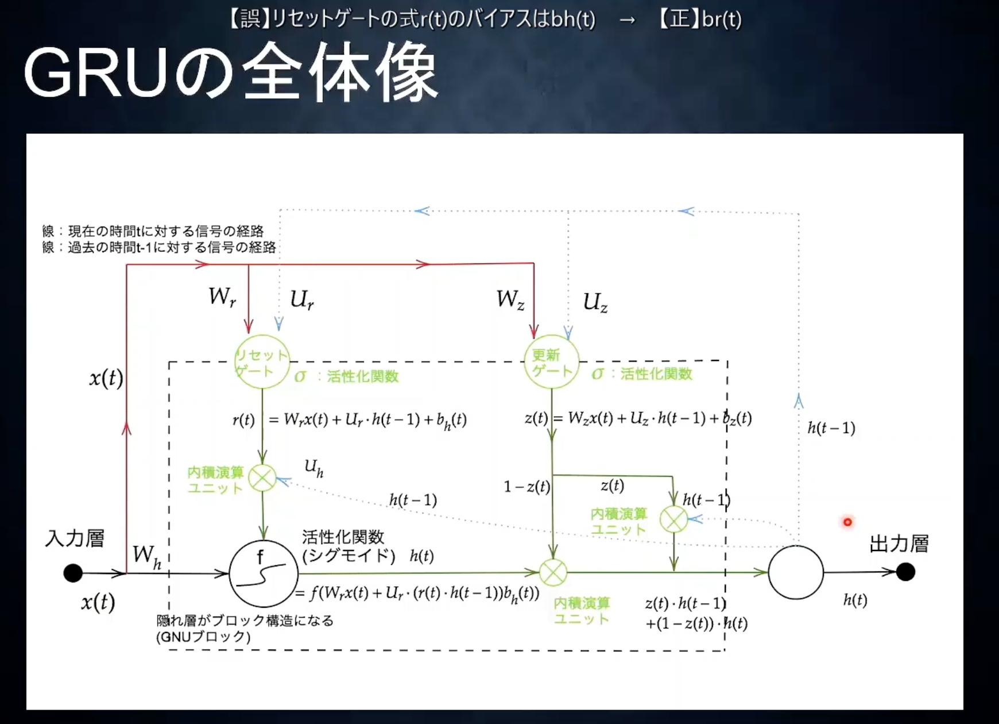
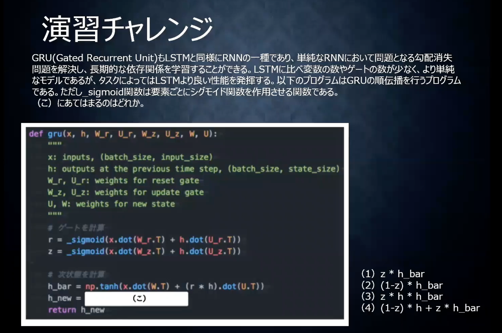

<script type="text/x-mathjax-config">MathJax.Hub.Config({tex2jax:{inlineMath:[['\$','\$'],['\\(','\\)']],processEscapes:true},CommonHTML: {matchFontHeight:false}});</script>
<script type="text/javascript" async src="https://cdnjs.cloudflare.com/ajax/libs/mathjax/2.7.1/MathJax.js?config=TeX-MML-AM_CHTML"></script>

GRU
=========

# GRU

- LSTMの改良版
  - LSTMは複雑すぎて学習に時間がかかる
  - パラメータを減らさず精度を保持しようというのが、GRU
  - 隠れ層h(t)に計算状態を保存するのがGRUの特徴
  - リセットゲートは隠れ層をどのような状態で保持するのかを管理する。
  - 更新ゲートは今回の記憶と前回の記憶を元に今回の最終アウトプットを制御する。

# 確認テスト２５
- LSTMとCECが抱える課題についてそれぞれ簡潔に述べよ。
  - LSTMは入力ゲート、出力ゲート、忘却ゲート、CECと４つのパラメータがあって、計算量が多くなることが課題。
  - 原因としてはCECに学習機能がないため、他の３つの機能が必要になってしまっている。

# GRU続き
- tensorflowを使用した実装を見る。
  - 3_2を見る。

# 演習チャレンジ

- 正解は4

# 確認テスト２６
- LSTMとGRUの違いを簡潔に述べよ。
- LSTMは入力ゲート、出力ゲート、忘却ゲート、そしてCECと４つのパラメータがある。
- 一方で、GRUはリセットゲート、更新ゲートと２つのパラメータがある。
- GRUの方がパラメータが少なく計算量が少なく済むため、LSTMの処理速度の問題を解消している。

# 実装演習
- ネットを参照して実装例と実装結果を記載。

```python
def sigmoid(x):
    return 1 / (1 + np.exp(-x))

# GRUモデル
# N:バッチサイズ、D:入力単語数、H:中間層の出力次元数
class GRU:
    def __init__(self, wx, wh, b):
        self.params = wx, wh, b     # # wx[D,3H], wh[H,3H], b[3H]
        
    def forward(self, x, h_prev):
        wx, wh, b = self.params
        H = wh.shape[0]

        wxz, wxr, wxh = wx[:, :H], wx[:, H:2*H], wx[:, 2*H:]    # 入力用重み
        whz, whr, whh = wh[:, :H], wh[:, H:2*H], wh[:, 2*H:]    # 前の時刻出力用重み
        bz, br, bh = b[:H], b[H:2*H], b[2*H:]                   # バイアス

        z = sigmoid(np.dot(h_prev, whz) + np.dot(x, wxz) + bz)  # updateゲート
        r = sigmoid(np.dot(h_prev, whr) + np.dot(x, wxr) + br)  # resetゲート
        h_hat = sigmoid(np.dot(r*h_prev, whh) + np.dot(x, wxh) + bh )
        h_next = (1-z) * h_prev + z * h_hat

        return h_next

```

```python
import numpy as np

# 入力を適当に定義
x = np.arange(25).reshape(5,5)
h_prev = np.ones((5,10))

# 重みを初期化
wx = np.random.randn(5, 30)
wh = np.random.randn(10, 30)
b = np.zeros(30)

# モデルインスタンス
gru = GRU(wx, wh, b)

# 順伝播
gru.forward(x, h_prev)
```

実行すると以下の結果を得ることができた。
> array([[8.97162999e-01, 9.51946567e-01, 9.40813925e-01, 3.89420704e-01,
>         1.30922893e-01, 3.78348888e-01, 8.73888777e-01, 8.47888307e-01,
>         3.21626557e-03, 9.99999999e-01],
>        [9.99424863e-01, 5.88506584e-03, 9.84042737e-01, 4.32849428e-05,
>         3.27377542e-02, 8.69721516e-01, 9.98324843e-01, 8.98370417e-01,
>         1.99970678e-06, 1.00000000e+00],
>        [9.99999798e-01, 1.64162703e-04, 9.96068315e-01, 1.26379480e-08,
>         7.12168692e-03, 9.86527923e-01, 9.99980523e-01, 9.66112207e-01,
>         1.84501465e-09, 1.00000000e+00],
>        [1.00000000e+00, 1.03099148e-05, 9.99040118e-01, 3.53402748e-12,
>         1.58634281e-03, 9.98756581e-01, 9.99999774e-01, 9.97111096e-01,
>         1.43704392e-12, 1.00000000e+00],
>        [1.00000000e+00, 6.48062532e-07, 9.99766182e-01, 9.03320330e-16,
>         3.73073699e-04, 9.99886514e-01, 9.99999997e-01, 9.99868169e-01,
>         8.95201054e-16, 1.00000000e+00]])