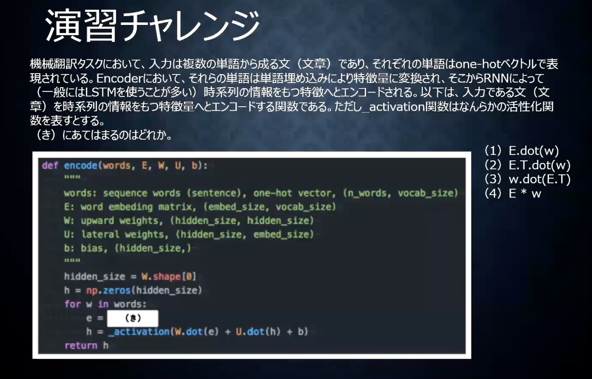

Seq2Seq
=========

# Seq2Seq

- RNNの応用例の１つ
- 機械翻訳などに用いられる。
- 隠れ層Cに入力側のNNより得た文脈がベクトル表現として保存される。
- 保持された文脈を別のNNにつなげて、別の出力に作り替える。
- 入力を取るほうをエンコーダー、出力を取る方をデコーダーという。

# Encoder RNN
- 文章を単語ごとに順番に取り込んでいく。
- 隠れ層には最終的に文の全体の意味が一つのベクトル表現として保存される。
- 自然言語のベクトル表現について
  - 単語１つ１つに番号をふれば、one-hot vectorとして保持できる。（通常数万のone-hot vectorで表す。つまり数万語に単語を制限する。）
  - ほとんどゼロのベクトルはメモリの無駄なので、embedding表現として、数百程度の大きさにできる。
    - embedding表現は似た意味の単語が似たベクトルになるように機械学習したもの。
    - つまりembedding表現は単語の意味をベクトル化したもの
  - 自然言語に限らず、このembedding表現のようにベクトル化（＝特徴量抽出）できれば、なんでも機械学習可能。
    - ただし、その特徴量抽出をうまく実施するのはなかなか難しい。
    - googleのBERTなど高度なモデルではMASKED LANGUAGE MODEL（MLM）が使われる。
      - 文章に穴あき部分を作り、単語を予測するように学習させることで特徴量抽出ができる。
      - このモデルの良い点は、教師なしデータでも学習を進めることができる点。
      - 画像にもこのような流れはある。
  
# Decoder RNN
- Encoderが獲得したベクトルを元に別のベクトル表現を作成する。
  - 例えば、インプットへの返答となるようなアウトプット
  - あるいは翻訳
- Encoder RNNのfinal stateをinitial stateとして使用。
- stateを元にトークン（単語）を次々に生成する。
- embedding → one-hot → 単語というように出力する。（tokenize）

# 確認テスト２７

- 答えは２番。
- 1番は双方向RNN。３番は構文機、4番はLSTMの内容。

# 演習チャレンジ

- word embedding matrix(embeddding表現と単語の対応表)から単語を取り出すのはどれか。
- 回答は１番。

# 文脈の処理（HRED、VHRED）
- Seq2Seqは１問１答で、過去の文脈は考慮されない。
- 過去の文脈を読ませるために考えられたのがHRED、VHRED
- HREDではSeq2Seqにおいて、中間層で保持された文の意味ベクトルを次の層に引き継いでいく。
- ただし以下のような課題が出た
  - 毎回同じようなありがちな答えしか出さなくなる。
    - 確率的な多様性が字面にしかなく会話の「流れ」のような多様性がない
    - 短く情報量に乏しい答えを返しがち。
  - →VHREDの登場
- VHREDはHREDにVAEの潜在変数の概念を加えたもの。

# オートエンコーダー
- 教師なし学習の１つ
- mnistなどの例が有名。
- 入力ネットワークから潜在変数zに変換するニューラルネットワークをEncoder、逆に潜在変数zをインプットとして元画像を復元するニューラルネットワークをDecoderとする。
- zの次元が入力より小さい場合、zは入力の次元削減と捉えることができる。

# VAE
- Variational Auto Encoder
- オートエンコダーで潜在変数zを作るときに正則化を行う。
- 平均0確率1になるようにする。
- 正則化によって、極端な学習を防ぐことができる。
- ノイズがつくことによって、より汎用的になる。

# 確認テスト
- VAEの説明の以下の「」内に当てはまる言葉を述べよ。
  - 自己符号化機（オートエンコーダー）の潜在変数に確率分布を導入したもの。

# フレームワーク演習の際に実装演習は実施。