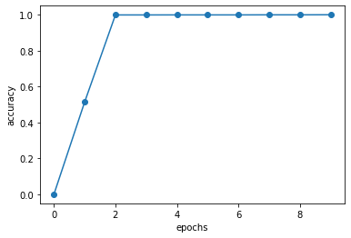

<script type="text/x-mathjax-config">MathJax.Hub.Config({tex2jax:{inlineMath:[['\$','\$'],['\\(','\\)']],processEscapes:true},CommonHTML: {matchFontHeight:false}});</script>
<script type="text/javascript" async src="https://cdnjs.cloudflare.com/ajax/libs/mathjax/2.7.1/MathJax.js?config=TeX-MML-AM_CHTML"></script>

Attention Mechanism
=========


# Attention Mechanism

- Seq2Seqの問題点
- 長い表現に対応できない。
  - 長い意味をベクトルに格納しきれない。
- Attention Mechanism
  - 文中の重要な情報を自力で取得する機構。
  - 近年評価が高い自然言語のモデルは全てAttention Mechanism

# 確認テスト２８

- RNNとword2vec、Seq2SeqとAttention Mechanismの違いを簡潔に述べよ。
  - RNNは時系列データを処理するのに適したニューラルネットワーク 
  - word2Vecは単語の分散表現ベクトルを得る手法
  - seq2seqは１つの時系列データから別の時系列データを得る手法。
  - Attentinon Mechanismは時系列データの中身のそれぞれの関連性について、重みをつける手法。

# 確認テスト２９

- Seq2SeqとHRED,HREDとVREDの違いについて簡潔に述べよ。
  - Seq2Seqは一問一答のようにある時系列データからある時系列データを作り出すネットワーク
  - HREDはSeqSeq２Seqに文脈の意味を足すことで、文脈の意味を汲み取ったENCODEとDECODEを可能にしている。
  - VHREはHREDが当たり障りのない文脈しか出さないことを修正するためにVAEの考えを取り入れて改良したもの。

# 実装演習

ぜろつく②の８章 Attentionの実装を実施。 

```python
# coding: utf-8
import sys
sys.path.append('..')
import numpy as np
import matplotlib.pyplot as plt
from dataset import sequence
from common.optimizer import Adam
from common.trainer import Trainer
from common.util import eval_seq2seq
from attention_seq2seq import AttentionSeq2seq
from ch07.seq2seq import Seq2seq
from ch07.peeky_seq2seq import PeekySeq2seq


# データの読み込み
(x_train, t_train), (x_test, t_test) = sequence.load_data('date.txt')
char_to_id, id_to_char = sequence.get_vocab()

# 入力文を反転
x_train, x_test = x_train[:, ::-1], x_test[:, ::-1]

# ハイパーパラメータの設定
vocab_size = len(char_to_id)
wordvec_size = 16
hidden_size = 256
batch_size = 128
max_epoch = 10
max_grad = 5.0

model = AttentionSeq2seq(vocab_size, wordvec_size, hidden_size)
# model = Seq2seq(vocab_size, wordvec_size, hidden_size)
# model = PeekySeq2seq(vocab_size, wordvec_size, hidden_size)

optimizer = Adam()
trainer = Trainer(model, optimizer)

acc_list = []
for epoch in range(max_epoch):
    trainer.fit(x_train, t_train, max_epoch=1,
                batch_size=batch_size, max_grad=max_grad)

    correct_num = 0
    for i in range(len(x_test)):
        question, correct = x_test[[i]], t_test[[i]]
        verbose = i < 10
        correct_num += eval_seq2seq(model, question, correct,
                                    id_to_char, verbose, is_reverse=True)

    acc = float(correct_num) / len(x_test)
    acc_list.append(acc)
    print('val acc %.3f%%' % (acc * 100))


model.save_params()

# グラフの描画
x = np.arange(len(acc_list))
plt.plot(x, acc_list, marker='o')
plt.xlabel('epochs')
plt.ylabel('accuracy')
plt.ylim(-0.05, 1.05)
plt.show()

```

- 結果は以下。Attentionを適用することで、２回のEPOCHで十分なAccuracyを得ることができている。

