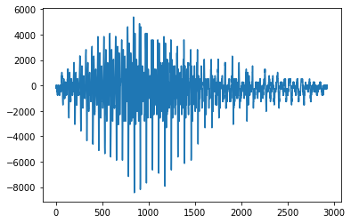
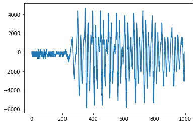

<script type="text/x-mathjax-config">MathJax.Hub.Config({tex2jax:{inlineMath:[['\$','\$'],['\\(','\\)']],processEscapes:true},CommonHTML: {matchFontHeight:false}});</script>
<script type="text/javascript" async src="https://cdnjs.cloudflare.com/ajax/libs/mathjax/2.7.1/MathJax.js?config=TeX-MML-AM_CHTML"></script>

[フレームワーク演習]双方向RNN_勾配のリッピング
=========


# 3_4_spoken_digit.ipynbを実践しつつspoken_digitデータセットを例にした再起ニューラルネットワークの構築方法を学ぶ。

`spoken_digit`データセットは、`mnist`の音声版。
データの特徴は、


*   **長さがバラバラ**の2500個の音声ファイルが入っています。
*   それぞれの音声ファイルは、0から9の数字を読み上げたものです。
*   5人の話者が、各数字を50回ずつ読み上げています。
*   各音声ファイルには、対応する数字がラベルとして収録されています。

データセットの読込は、`tensorflow_datasets`を使って行います。`tensorflow_datasets`は予めある程度の前処理を行ったデータを手軽にダウンロード･準備･使用することができるライブラリです。

ライブラリの機能で、ダウンロードしたデータセットを、シャッフルすることや、分割することができます。

ここでは、データセットの全体の、


*   70%をトレーニング用
*   15%を検証用
*   15%をテスト用

として分割します。

# 実装
- 元データ表示
```python
plt.plot(next(original_iter)['audio'])
```


- 前処理
  - 音声データを８つに分ける。
  - また、８個でミニバッジを構成する。

```python
NUM_DATA_POINTS = 1000
BATCH_SIZE = 8
def cut_if_longer(el):
  return (
          tf.reshape(
              tf.cond(
                tf.greater(tf.shape(el['audio']), NUM_DATA_POINTS),
                true_fn=lambda: tf.slice(el['audio'], begin=[0], size=[NUM_DATA_POINTS]),
                false_fn=lambda: tf.slice(tf.concat([el['audio'], tf.zeros(NUM_DATA_POINTS, tf.int64)], axis=0), begin=[0], size=[NUM_DATA_POINTS])
              ),
              shape=(-1, 1)
          ),
          [el['label']]
        )


dataset_prep_train = dataset_train.map(cut_if_longer).batch(BATCH_SIZE)
dataset_prep_valid = dataset_valid.map(cut_if_longer).batch(BATCH_SIZE)

sample = next(iter(dataset_prep_valid))
plt.plot(sample[0][0])
```


- 作った音声データについて様々なモデルが適用できることを確認する。
- まず単純な畳み込みネットワークでの実装。

```python
import tensorflow as tf
from tensorflow.keras.models import Sequential
from tensorflow.keras import layers

tf.keras.backend.clear_session()
model_1 = tf.keras.models.Sequential()
model_1.add(layers.Input((NUM_DATA_POINTS, 1)))
model_1.add(layers.Conv1D(32, 4, strides=2, activation='relu'))
model_1.add(layers.MaxPooling1D(2))
model_1.add(layers.GlobalAveragePooling1D())
model_1.add(layers.Dense(10, activation='softmax'))
model_1.summary()
model_1.predict(sample[0])

model_1.compile(
    loss=tf.keras.losses.SparseCategoricalCrossentropy(),
    optimizer=tf.keras.optimizers.Adam(),
    metrics=['accuracy']
)

model_1.fit(
    dataset_prep_train,
    validation_data=dataset_prep_valid,
)

print('loss / accuracy')
model_1.evaluate(dataset_prep_valid)
```

- 結果
> loss / accuracy
> 47/47 [==============================] - 0s 3ms/step - loss: 16.6344 - accuracy: 0.2107
> [16.63435173034668, 0.21066667139530182]

- 次に単純RNN


```python
import tensorflow as tf
from tensorflow.keras.models import Sequential
from tensorflow.keras import layers

tf.keras.backend.clear_session()
model_2 = tf.keras.models.Sequential()
model_2.add(layers.Input((NUM_DATA_POINTS, 1)))
model_2.add(layers.SimpleRNN(128))
model_2.add(layers.Dense(10, activation='softmax'))
model_2.summary()
model_2.predict(sample[0]).shape

model_2.compile(
    loss=tf.keras.losses.SparseCategoricalCrossentropy(),
    optimizer=tf.keras.optimizers.Adam(),
    metrics=['accuracy']
)

model_2.fit(
    dataset_prep_train,
    validation_data=dataset_prep_valid,
)
```
- 結果
> 219/219 [==============================] - 149s 679ms/step - loss: 2.3706 - accuracy: 0.1029 - val_loss: 2.3637 - val_accuracy: 0.0693
> <keras.callbacks.History at 0x7f4bd60fb150>

- 次にGRU

```python
import tensorflow as tf
from tensorflow.keras.models import Sequential
from tensorflow.keras import layers

tf.keras.backend.clear_session()
model_3 = tf.keras.models.Sequential()
model_3.add(layers.Input((NUM_DATA_POINTS, 1)))
model_3.add(layers.GRU(128))
model_3.add(layers.Dense(10, activation='softmax'))
model_3.summary()
model_3.predict(sample[0]).shape

model_3.compile(
    loss=tf.keras.losses.SparseCategoricalCrossentropy(),
    optimizer=tf.keras.optimizers.Adam(),
    metrics=['accuracy']
)

model_3.fit(
    dataset_prep_train,
    validation_data=dataset_prep_valid,
)
```
- 結果
> 219/219 [==============================] - 11s 44ms/step - loss: 2.3715 - accuracy: 0.1069 - val_loss: 2.3022 - val_accuracy: 0.1387
> <keras.callbacks.History at 0x7f4bd61e9650>

- 最後に双方向RNN

```python
import tensorflow as tf
from tensorflow.keras.models import Sequential
from tensorflow.keras import layers

tf.keras.backend.clear_session()
model_4 = tf.keras.models.Sequential()
model_4.add(layers.Input((NUM_DATA_POINTS, 1)))
model_4.add(layers.Bidirectional(layers.LSTM(64)))
model_4.add(layers.Dense(10, activation='softmax'))
model_4.summary()
model_4.predict(sample[0]).shape

model_4.compile(
    loss=tf.keras.losses.SparseCategoricalCrossentropy(),
    optimizer=tf.keras.optimizers.Adam(),
    metrics=['accuracy']
)

model_4.fit(
    dataset_prep_train,
    validation_data=dataset_prep_valid,
)
```
> 219/219 [==============================] - 17s 66ms/step - loss: 2.2814 - accuracy: 0.1509 - val_loss: 2.1504 - val_accuracy: 0.2293
> <keras.callbacks.History at 0x7f4bce706590>

- ４つのモデルの単純比較はできないが、双方向RNNが単純RNNと比べて高速なことを体感することができた。
- 勾配のクリッピングについての実装もついでに記載する。

```python
import tensorflow as tf
from tensorflow.keras.models import Sequential
from tensorflow.keras import layers


tf.keras.backend.clear_session()

model_5 = tf.keras.models.Sequential()
model_5.add(layers.Input((NUM_DATA_POINTS, 1)))
model_5.add(layers.LSTM(64))
model_5.add(layers.Dense(10, activation='softmax'))
model_5.summary()
model_5.predict(sample[0]).shape

model_5.compile(
    loss=tf.keras.losses.SparseCategoricalCrossentropy(),
    optimizer=tf.keras.optimizers.Adam(clipvalue=0.5),
    metrics=['accuracy']
)

model_5.fit(
    dataset_prep_train,
    validation_data=dataset_prep_valid,
)
```
- 結果
> 219/219 [==============================] - 10s 37ms/step - loss: 2.3386 - accuracy: 0.1109 - val_loss: 2.2980 - val_accuracy: 0.1387
> <keras.callbacks.History at 0x7f4bce636390>