<script type="text/x-mathjax-config">MathJax.Hub.Config({tex2jax:{inlineMath:[['\$','\$'],['\\(','\\)']],processEscapes:true},CommonHTML: {matchFontHeight:false}});</script>
<script type="text/javascript" async src="https://cdnjs.cloudflare.com/ajax/libs/mathjax/2.7.1/MathJax.js?config=TeX-MML-AM_CHTML"></script>

深層学習Day3

studyai0029063
松尾総一郎

再帰型ニューラルネットワーク(RNN)
=========
# 確認テスト１９
- サイズ 5*5の入力画像を、サイズ3*3のフィルタで畳み込んだ時の出力画像のサイズを求めよ。なおストライド2パディングは1とする。
- 正解は3*3。

# 再帰型ニューラルネットワーク(RNN)
- 前後のデータに関係性がある、時系列データ・自然言語データなどに使用される。
- RNNでは入力層から中間層（W_in）、中間層から出力層(W_out)、１つ前の学習での中間層から中間層（W）という３つの重みがあり、それをうまく学習することが重要である。

# 確認テスト２０
- RNNのネットワークには大きく分けて３つの重みがある。
  - １つは入力から現在の中間層を定義する際にかけられて重み、
  - １つは中間層から出力を定義する際にかけられた重み、
- 残り１つの重みについて説明せよ。
  - 残り１つは１つ前の中間層から中間層を定義する際にかけられた重み。

# RNN続き
- プログラムは3_1参照
- バイナリ加算
  - 過去から未来への情報の遷移を繰り上がりによって表現している。
- 時系列ループ
  - RNNでは1回の学習で、分析機関の学習を一旦全て死してしまう。それを学習の数繰り返すことで、モデルの制度を高めていく。（一回の学習で必要な1年のモデルなら1年分の予測をす全てしてしまう。）
# 演習チャレンジ

- 構文器の問題
  - 隣同士の単語をつなぎ合わせて行って、一つの特徴量にしていく木構造のプロセスを構文器という。


- 演習の正解は2
- 重みをうまく準備することによって、特徴量を構成する数字の数は調整できる。

# 確認テスト２１（誤差逆伝播法の復習）
> \(\begin{aligned}z &= t^2\cr
t &= x + y\cr
\displaystyle \frac{dz}{dt} &= 2t\cr
\displaystyle \frac{dt}{dx} &= 1\end{aligned}\)
> 連鎖率の原理より<br>
> \(\displaystyle \frac{dz}{dx} = \frac{dz}{dt}\frac{dt}{dx}\)<br>
> \(\displaystyle \frac{dz}{dx} = 2t \cdot 1 = 2(x + y)\)<br>

# RNNにおける逆伝播(BPTT)
- 3_1_Simple_RNNの当該部分
```python
delta[:,t] = (np.dot(delta[:,t+1].T, W.T) + np.dot(delta_out[:,t].T, W_out.T)) * functions.d_sigmoid(u[:,t+1])
```
- deltaの定義(E（もしくはy）をuまで順次微分したよというのを表す。)
```python
delta = np.zeros((hidden_layer_size, binary_dim + 1))
```
# BPTTの数学的説明

- 上記のような形をイメージしつつ、まず以下のように変数を定義する。f, gは活性化関数、b、cはバイアス。
- yが中間層の出力、zが中間層の入力とする。
> \(\begin{aligned}
u_t &= W_{(in)}x^t + Wz^{t-1} + b \cr
z_t &= f \left( W_{(in)}x^t + Wz^{t-1} + b \right) \cr
v_t &= W_{(out)}z^t + c \cr
y_t &=g \left( W_{(out)}z^t + c\right) \end{aligned}\)
- また、
> \(\begin{aligned}\frac{\partial E}{\partial u^t} &= \delta^t \cr
\frac{\partial E}{\partial v^t} &= \delta^{out,t}\end{aligned}\)
- と定義する。
- すると、他の偏微分を以下のように表せる。
>\(\begin{aligned}
\frac{\partial E}{\partial W_{(in)}} &= \frac{\partial E}{\partial u^t} \left[ \frac{\partial u^t}{\partial W_{(in)}} \right]^T = \delta^t\left[ x^t \right]^T \cr
\frac{\partial E}{\partial W_{(out)}} &= \frac{\partial E}{\partial v^t} \left[ \frac{\partial v^t}{\partial W_{(out)}} \right]^T = \delta^{out,t}\left[ z^t \right]^T \cr
\frac{\partial E}{\partial W} &= \frac{\partial E}{\partial u^t} \left[ \frac{\partial u^t}{\partial W} \right]^T = \delta^t\left[ z^{t-1} \right]^T \cr
\frac{\partial E}{\partial b} &= \frac{\partial E}{\partial u^t}  \frac{\partial u^t}{\partial b} = \delta^t \cr
\frac{\partial E}{\partial c} &= \frac{\partial E}{\partial v^t}  \frac{\partial v^t}{\partial c} = \delta^{out,t}
\end{aligned}\)


# 確認テスト２２
- 下図の\(y_1\)を\(x \cdot z_0 \cdot z_1 \cdot W_{in} \cdot W \cdot W_{out}\)を用いて数式で表せ。
  - バイアスは任意の文字で定義せよ。 
  - ※また中間層の出力にシグモイド関数g(x)を作用させよ。

- 上図より適当なバイアス c を置いて、
  > \(y_1 = g \left( W_{out} z_1 + c \right)\)
- 同様に適当なバイアスb、中間層の入力に関する活性化関数fを置いて、
  >\(z_1 = f \left( W z_0 + W_{(in)} x_1 + b \right)\)
- よって、
  > \(y_1 = g \left( W_{out} f \left( W z_0 + W_{(in)} x_1 + b \right) + c \right)\)

# BPTTの数学的説明続き(各時点のdeltaの関係性)
- \(v^t\)は\(u^t\)の関数であることから、\(\delta^t\)と\(\delta^{out,t}\)の関係を以下のように導くことができる。
> \(\displaystyle \frac{\partial E}{\partial u^t} = \frac{\partial E}{\partial v^t} \frac{\partial v^t}{\partial u_t}  = \frac{\partial E}{\partial v^t} \frac{\partial \lbrace W_{(out)}f(u^t) + c\rbrace}{\partial u_t} = f^{\prime}(u^t) W_{(out)}^T \delta^{out,t} =\delta^t\)
- また一時点離れたdelta_t とdelta_{t-1}の時間的なつながりは以下のように表される。
> \(\displaystyle \delta^{t-1} = \frac{\partial E}{\partial u^{t-1}} = \frac{\partial E}{\partial u^t} \frac{\partial u^t}{\partial u^{t-1}} = \delta^t \left\lbrace \frac{\partial u^t}{\partial z^{t-1}}   \frac{\partial z^{t-1}}{\partial u^{t-1}}\right\rbrace = \delta^t \left\lbrace Wf^{\prime} \left(u^{t-1}\right) \right\rbrace\)
- 上記からt-1をt-z-1とすることで以下のように1時店前との関係について、一般に以下のような関係がなりたつ。
> \(\displaystyle \delta^{t-z-1} = \delta^{t-z} \left\lbrace Wf^{\prime} \left(u^{t-z-1}\right) \right\rbrace\)

# BPTTの数学的説明続きの続き(重みとバイアスの更新式)
- ２番目の式は中間層から先のプロセスなので、時間的に前の式を考慮しなくて良いものになっている。（sumの表現がそこだけない。）
- εは学習率（ハイパーパラメータなので、時間的に本質ではない。）
> \(\displaystyle W_{(in)}^{t+1} = W_{(in)}^t - \epsilon \frac{\partial E}{\partial W_{(in)}} = W_{(in)}^t - \epsilon \sum_{z=0}^{T_t} \delta^{t-z}\left[x^{t-z} \right]^T\)
> \(\displaystyle W_{(out)}^{t+1} = W_{(out)}^t - \epsilon \frac{\partial E}{\partial W_{(out)}} = W_{(out)}^t - \epsilon  \delta^{out,t}\left[z^{t} \right]^T\)
> \(\displaystyle W^{t+1} = W^t - \epsilon \frac{\partial E}{\partial W} = W^t - \epsilon \sum_{z=0}^{T_t} \delta^{t-z}\left[z^{t-z+1} \right]^T\)
> \(\displaystyle b^{t+1} = b^t - \epsilon \frac{\partial E}{\partial b} = b^t - \epsilon \sum_{z=0}^{T_t} \delta^{t-z}\)
> \(\displaystyle c^{t+1} = c^t - \epsilon \frac{\partial E}{\partial c} = c^t - \epsilon \delta^{out,t}\)
# BPTTの全体像
- どうしてBPTTで時間的な考慮ができるのか数式を通じて確認できる。
- T時刻の誤差関数クロスエントロピー
- 誤差関数はニューラルネットワークの出力であるyと教師データであるeから構成される
> \(\begin{aligned}
E^t &= loss(y^t, d^t) \cr
&= loss \left(g(W_{(out)}z^t + c),d^t  \right) \cr
&= loss \left(g(W_{(out)}f(u^t) + c),d^t  \right) \cr
&= loss \left(g(W_{(out)}f(W_{(in)}x^t + Wz^{t-1} + b) + c),d^t  \right) \cr
&= loss \left(g(W_{(out)}f(W_{(in)}x^t + Wf(u^{t-1}) + b) + c),d^t  \right) \cr
&=loss \left(g(W_{(out)}f(W_{(in)}x^t + Wf(W_{(in)}x^{t-1} + Wz^{t-2} + b) + c) + b) + c),d^t  \right) \cr
&\vdots
\end{aligned}\)

# 実装演習

- 再帰型ニューラルネットワークの学習過程を重みの初期化方法や活性化関数を変更しながら実装し、結果を比較する。

```python
import numpy as np
from common import functions
import matplotlib.pyplot as plt


def d_tanh(x):
    return 1/(np.cosh(x) ** 2)

# データを用意
# 2進数の桁数
binary_dim = 8
# 最大値 + 1
largest_number = pow(2, binary_dim)
# largest_numberまで2進数を用意
binary = np.unpackbits(np.array([range(largest_number)],dtype=np.uint8).T,axis=1)

input_layer_size = 2
hidden_layer_size = 16
output_layer_size = 1

weight_init_std = 1
learning_rate = 0.1

iters_num = 10000
plot_interval = 100

# ウェイト初期化 (バイアスは簡単のため省略)
W_in = weight_init_std * np.random.randn(input_layer_size, hidden_layer_size)
W_out = weight_init_std * np.random.randn(hidden_layer_size, output_layer_size)
W = weight_init_std * np.random.randn(hidden_layer_size, hidden_layer_size)
# Xavier
# W_in = np.random.randn(input_layer_size, hidden_layer_size) / (np.sqrt(input_layer_size))
# W_out = np.random.randn(hidden_layer_size, output_layer_size) / (np.sqrt(hidden_layer_size))
# W = np.random.randn(hidden_layer_size, hidden_layer_size) / (np.sqrt(hidden_layer_size))
# He
# W_in = np.random.randn(input_layer_size, hidden_layer_size) / (np.sqrt(input_layer_size)) * np.sqrt(2)
# W_out = np.random.randn(hidden_layer_size, output_layer_size) / (np.sqrt(hidden_layer_size)) * np.sqrt(2)
# W = np.random.randn(hidden_layer_size, hidden_layer_size) / (np.sqrt(hidden_layer_size)) * np.sqrt(2)


# 勾配
W_in_grad = np.zeros_like(W_in)
W_out_grad = np.zeros_like(W_out)
W_grad = np.zeros_like(W)

u = np.zeros((hidden_layer_size, binary_dim + 1))
z = np.zeros((hidden_layer_size, binary_dim + 1))
y = np.zeros((output_layer_size, binary_dim))

delta_out = np.zeros((output_layer_size, binary_dim))
delta = np.zeros((hidden_layer_size, binary_dim + 1))

all_losses = []

for i in range(iters_num):
    
    # A, B初期化 (a + b = d)
    a_int = np.random.randint(largest_number/2)
    a_bin = binary[a_int] # binary encoding
    b_int = np.random.randint(largest_number/2)
    b_bin = binary[b_int] # binary encoding
    
    # 正解データ
    d_int = a_int + b_int
    d_bin = binary[d_int]
    
    # 出力バイナリ
    out_bin = np.zeros_like(d_bin)
    
    # 時系列全体の誤差
    all_loss = 0    
    
    # 時系列ループ
    for t in range(binary_dim):
        # 入力値
        X = np.array([a_bin[ - t - 1], b_bin[ - t - 1]]).reshape(1, -1)
        # 時刻tにおける正解データ
        dd = np.array([d_bin[binary_dim - t - 1]])
        
        u[:,t+1] = np.dot(X, W_in) + np.dot(z[:,t].reshape(1, -1), W)
        z[:,t+1] = functions.sigmoid(u[:,t+1])
#         z[:,t+1] = functions.relu(u[:,t+1])
#         z[:,t+1] = np.tanh(u[:,t+1])    
        y[:,t] = functions.sigmoid(np.dot(z[:,t+1].reshape(1, -1), W_out))


        #誤差
        loss = functions.mean_squared_error(dd, y[:,t])
        
        delta_out[:,t] = functions.d_mean_squared_error(dd, y[:,t]) * functions.d_sigmoid(y[:,t])        
        
        all_loss += loss

        out_bin[binary_dim - t - 1] = np.round(y[:,t])
    
    
    for t in range(binary_dim)[::-1]:
        X = np.array([a_bin[-t-1],b_bin[-t-1]]).reshape(1, -1)        

        delta[:,t] = (np.dot(delta[:,t+1].T, W.T) + np.dot(delta_out[:,t].T, W_out.T)) * functions.d_sigmoid(u[:,t+1])
#         delta[:,t] = (np.dot(delta[:,t+1].T, W.T) + np.dot(delta_out[:,t].T, W_out.T)) * functions.d_relu(u[:,t+1])
#         delta[:,t] = (np.dot(delta[:,t+1].T, W.T) + np.dot(delta_out[:,t].T, W_out.T)) * d_tanh(u[:,t+1])    

        # 勾配更新
        W_out_grad += np.dot(z[:,t+1].reshape(-1,1), delta_out[:,t].reshape(-1,1))
        W_grad += np.dot(z[:,t].reshape(-1,1), delta[:,t].reshape(1,-1))
        W_in_grad += np.dot(X.T, delta[:,t].reshape(1,-1))
    
    # 勾配適用
    W_in -= learning_rate * W_in_grad
    W_out -= learning_rate * W_out_grad
    W -= learning_rate * W_grad
    
    W_in_grad *= 0
    W_out_grad *= 0
    W_grad *= 0
    

    if(i % plot_interval == 0):
        all_losses.append(all_loss)        
        print("iters:" + str(i))
        print("Loss:" + str(all_loss))
        print("Pred:" + str(out_bin))
        print("True:" + str(d_bin))
        out_int = 0
        for index,x in enumerate(reversed(out_bin)):
            out_int += x * pow(2, index)
        print(str(a_int) + " + " + str(b_int) + " = " + str(out_int))
        print("------------")

lists = range(0, iters_num, plot_interval)
plt.plot(lists, all_losses, label="loss")
plt.show()
```

- 重みの初期化方法:なし 活性化関数: Sigmoid
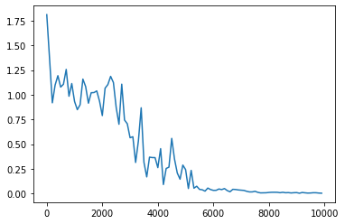
- 重みの初期化方法:Xavier 活性化関数: Sigmoid
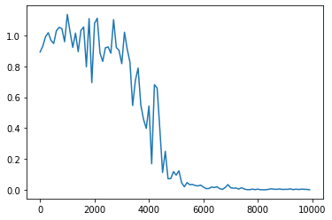
- 重みの初期化方法:He 活性化関数: Sigmoid
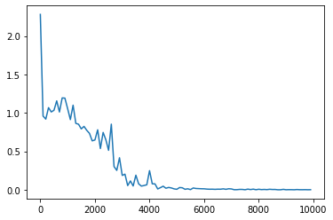
  - 上記３つを比較するとXavierの初期化のパフォーマンスが学習の進みが遅いことがわかる。しかし、iterationが6000を超えればどこも収束している様子。
  - 今後は活性化関数について、初期化方法を最もパフォーマンスの良かったHeに統一して比較。 
- 重みの初期化方法:He 活性化関数: ReLU

- 重みの初期化方法:He 活性化関数: Tanh

  - 今回の場合はsigmoidが最もパフォーマンスが良いように思えた。
  - ReLUは学習が進んでおらず（勾配爆発）、Tanhは学習が収束しない。


LSTM
=========


- RNNの課題
  - 時間を遡れば遡るほど、勾配が消失して、長い時間の学習が困難。
    - シグモイド関数は勾配消失問題が起きやすい。
  - その解決策として、構造自体を変えてしまったのが、LSTM

# 確認テスト２３
- シグモイド関数を微分した時、入力値は0で最大値を取る。
- その値は何か。
> \(sigmoid(x) = \displaystyle \frac{1}{1 + e^{-x}}\)
> \(\displaystyle sigmoid(x)^\prime = (1 - sigmoid(x))sigmoid(x)\)
> \(sigmoid(0)= 0.5\) より \(sigmoid(x)^\prime = 0.25\)

# LSTM続き
- 勾配爆発
  - 購買消失と逆の現象である勾配爆発も起こり得る。
  - 学習率を推奨値でない値に設定するとよく発生する。

# 演習チャレンジ

- 正解は１。勾配のノルムを計算してそれが閾値より大きい時は勾配のノルムが閾値の範囲に入るように正規化する。そのためには、ノルムが１より大きい場合、勾配に閾値/ノルムを掛け算することで値を小さくし、閾値から超えないような処理をしている。（閾値から超える場合、それを繰り返す。）

# CEC

- RNNで重要な過去からの情報をLSTNで一元管理しているのが、CEC(Constant Error Carousel)
  - これまでの入力値や中間層の出力値だけをCECに持たせている。
    - RNNは学習と記憶を同じ中間層が持っていた
  - 時系列を遡らせないためには、\(\displaystyle \delta^{t-z-1} = \delta^{t-z} \left\lbrace Wf^{\prime} \left(u^{t-z-1}\right) \right\rbrace　=1\)となれば良いという発想。
    - ただ勾配が１ということは覚えた結果をそのまま返すということで学習特性がないということ。
    - そのため、CECの周囲に学習機能を持たせ、適切な情報をCECから伝播することでうまく機能するのではないか、という発送に至る。
      - 入力ゲートや出力ゲート

# 入力ゲートとと出力ゲート
- 入力ゲート
  - 入力ゲートはCECに入力情報を記憶するように指示を送る。
  - 入力ゲートは何をCECに覚えさせるのかを学習していく。
- 出力ゲート
  - 出力ゲートはCECの情報をどう使うかの指示を送る。
  - 出力ゲートはCECをどう使うかを学習する。
- 重みは入力ゲート出力ゲートそれぞれにWとUを持つ。
  -  Wは今回の入力をどれくらい判断材料として使うか。Uは前回の出力をどれくらい判断材料として使うか。
  -  WとUより求めたVをCUCに送付する。

# 忘却ゲート
- CECで過去の情報が使われなくなったタイミングで記憶を消去する機能が必要。
- CECの記憶を忘れさせるかどうかを判断するのが忘却ゲート
- CECからの出力であるCは、c(t)= i(t)a(t) + f(t)c(t-1)と計算される。
  - aが今回の入力の計算結果、iが入力ゲートからくる、今回の入力をどれくらい使うかの情報。
  - fが忘却ゲートから来る、前回の情報をどれくらい忘れさせるか。

# 確認テスト２４
- LSTMを用いて、以下の空欄に当てはまる単語を予測したいとする。
- 文中の「とても」という言葉は空欄の予測においてなくなっても影響はないと学習の中で判断されたとする。
- このような場合、どのゲートが作用するのが正しいのか。
  - 作用するのは忘却ゲート。とてもの部分を忘れさせることで学習に必要なもののみをCECに残す。
  
# 演習チャレンジ

- 正解はウ

# 覗き穴結合
- 入力ゲート、出力ゲート、忘却ゲートがCECの中身を見えるようにしている機構。
- CECの中身を見て、インプットの量を調整する。
- あまり効果的な仕組みでは結果としてなかった。

# 実装
- tensorflowを用いて実装した例を記載。

```python
import numpy as np
import re
import glob
import collections
import pickle

class Corpus:
    def __init__(self):
        self.unknown_word_symbol = "<???>" # 出現回数の少ない単語は未知語として定義しておく
        self.unknown_word_threshold = 3 # 未知語と定義する単語の出現回数の閾値
        self.corpus_file = "./corpus/**/*.txt"
        self.corpus_encoding = "utf-8"
        self.dictionary_filename = "./data_for_predict/word_dict.dic"
        self.chunk_size = 5
        self.load_dict()
        words = []
        for filename in glob.glob(self.corpus_file, recursive=True):
            with open(filename, "r", encoding=self.corpus_encoding) as f:
                # word breaking
                text = f.read()
                # 全ての文字を小文字に統一し、改行をスペースに変換
                text = text.lower().replace("\n", " ")
                # 特定の文字以外の文字を空文字に置換する
                text = re.sub(r"[^a-z '\-]", "", text)
                # 複数のスペースはスペース一文字に変換
                text = re.sub(r"[ ]+", " ", text)

                # 前処理： '-' で始まる単語は無視する
                words = [ word for word in text.split() if not word.startswith("-")]

        self.data_n = len(words) - self.chunk_size
        self.data = self.seq_to_matrix(words)

    def prepare_data(self):
        """
        訓練データとテストデータを準備する。
        data_n = ( text データの総単語数 ) - chunk_size
        input: (data_n, chunk_size, vocabulary_size)
        output: (data_n, vocabulary_size)
        """

        # 入力と出力の次元テンソルを準備
        all_input = np.zeros([self.chunk_size, self.vocabulary_size, self.data_n])
        all_output = np.zeros([self.vocabulary_size, self.data_n])

        # 準備したテンソルに、コーパスの one-hot 表現(self.data) のデータを埋めていく
        # i 番目から ( i + chunk_size - 1 ) 番目までの単語が１組の入力となる
        # このときの出力は ( i + chunk_size ) 番目の単語
        for i in range(self.data_n):
            all_output[:, i] = self.data[:, i + self.chunk_size] # (i + chunk_size) 番目の単語の one-hot ベクトル
            for j in range(self.chunk_size):
                all_input[j, :, i] = self.data[:, i + self.chunk_size - j - 1]

        # 後に使うデータ形式に合わせるために転置を取る
        all_input = all_input.transpose([2, 0, 1])
        all_output = all_output.transpose()

        # 訓練データ：テストデータを 4 : 1 に分割する
        training_num = ( self.data_n * 4 ) // 5
        return all_input[:training_num], all_output[:training_num], all_input[training_num:], all_output[training_num:]


    def build_dict(self):
        # コーパス全体を見て、単語の出現回数をカウントする
        counter = collections.Counter()
        for filename in glob.glob(self.corpus_file, recursive=True):
            with open(filename, "r", encoding=self.corpus_encoding) as f:

                # word breaking
                text = f.read()
                # 全ての文字を小文字に統一し、改行をスペースに変換
                text = text.lower().replace("\n", " ")
                # 特定の文字以外の文字を空文字に置換する
                text = re.sub(r"[^a-z '\-]", "", text)
                # 複数のスペースはスペース一文字に変換
                text = re.sub(r"[ ]+", " ", text)

                # 前処理： '-' で始まる単語は無視する
                words = [word for word in text.split() if not word.startswith("-")]

                counter.update(words)

        # 出現頻度の低い単語を一つの記号にまとめる
        word_id = 0
        dictionary = {}
        for word, count in counter.items():
            if count <= self.unknown_word_threshold:
                continue

            dictionary[word] = word_id
            word_id += 1
        dictionary[self.unknown_word_symbol] = word_id

        print("総単語数：", len(dictionary))

        # 辞書を pickle を使って保存しておく
        with open(self.dictionary_filename, "wb") as f:
            pickle.dump(dictionary, f)
            print("Dictionary is saved to", self.dictionary_filename)

        self.dictionary = dictionary
        print(self.dictionary)

    def load_dict(self):
        with open(self.dictionary_filename, "rb") as f:
            self.dictionary = pickle.load(f)
            self.vocabulary_size = len(self.dictionary)
            self.input_layer_size = len(self.dictionary)
            self.output_layer_size = len(self.dictionary)
            print("総単語数: ", self.input_layer_size)

    def get_word_id(self, word):
        # print(word)
        # print(self.dictionary)
        # print(self.unknown_word_symbol)
        # print(self.dictionary[self.unknown_word_symbol])
        # print(self.dictionary.get(word, self.dictionary[self.unknown_word_symbol]))
        return self.dictionary.get(word, self.dictionary[self.unknown_word_symbol])

    # 入力された単語を one-hot ベクトルにする
    def to_one_hot(self, word):
        index = self.get_word_id(word)
        data = np.zeros(self.vocabulary_size)
        data[index] = 1
        return data

    def seq_to_matrix(self, seq):
        # print(seq)
        data = np.array([self.to_one_hot(word) for word in seq]) # (data_n, vocabulary_size)
        return data.transpose() # (vocabulary_size, data_n)

def build_dict():
    cp = Corpus()
    cp.build_dict()

```

```python
import time
import datetime

class Language:
    """
    input layer: self.vocabulary_size
    hidden layer: rnn_size = 30
    output layer: self.vocabulary_size
    """

    def __init__(self):
        self.corpus = Corpus()
        self.dictionary = self.corpus.dictionary
        self.vocabulary_size = len(self.dictionary) # 単語数
        self.input_layer_size = self.vocabulary_size # 入力層の数
        self.hidden_layer_size = 30 # 隠れ層の RNN ユニットの数
        self.output_layer_size = self.vocabulary_size # 出力層の数
        self.batch_size = 128 # バッチサイズ
        self.chunk_size = 5 # 展開するシーケンスの数。c_0, c_1, ..., c_(chunk_size - 1) を入力し、c_(chunk_size) 番目の単語の確率が出力される。
        self.learning_rate = 0.001 # 学習率
        self.epochs = 50 # 学習するエポック数
        self.forget_bias = 1.0 # LSTM における忘却ゲートのバイアス
        self.model_filename = "./data_for_predict/predict_model.ckpt"
        self.unknown_word_symbol = self.corpus.unknown_word_symbol

        # RNN 入力前の Embedding のパラメータ　
        self.hidden_w = tf.Variable(tf.random.truncated_normal([self.input_layer_size, self.hidden_layer_size], stddev=0.01))
        self.hidden_b = tf.Variable(tf.ones([self.hidden_layer_size]))

        # RNN 出力後の 全結合層のパラメータ
        self.output_w = tf.Variable(tf.random.truncated_normal([self.hidden_layer_size, self.output_layer_size], stddev=0.01))
        self.output_b = tf.Variable(tf.ones([self.output_layer_size]))

        # RNN 
        #self.rnn = tf.keras.layers.SimpleRNN(self.hidden_layer_size, activation='tanh', return_sequences=True)
        self.rnn = tf.keras.layers.SimpleRNN(self.hidden_layer_size, activation='tanh')
        # SimpleRNN Layer の weight を 強制的に生成させる 
        self.rnn(np.zeros((self.chunk_size, self.batch_size, self.hidden_layer_size),np.float32)) 

        self.trainable_variables = [self.hidden_w, self.hidden_b, self.output_w, self.output_b, *self.rnn.trainable_variables]

        self.optimizer = None

    def load_weights(self, ckpt_path):
        ckpt = tf.train.load_checkpoint(ckpt_path)

        # checkpoint から明示的に変数名を指定して保存
        self.hidden_w=tf.Variable(ckpt.get_tensor("hidden_w/.ATTRIBUTES/VARIABLE_VALUE"))
        self.hidden_b=tf.Variable(ckpt.get_tensor("hidden_b/.ATTRIBUTES/VARIABLE_VALUE"))
        self.output_w=tf.Variable(ckpt.get_tensor("output_w/.ATTRIBUTES/VARIABLE_VALUE"))
        self.output_b=tf.Variable(ckpt.get_tensor("output_b/.ATTRIBUTES/VARIABLE_VALUE"))
        k1 = tf.Variable(ckpt.get_tensor("rnn_kernel/.ATTRIBUTES/VARIABLE_VALUE"))
        k2 = tf.Variable(ckpt.get_tensor("rnn_reccurent_kernel/.ATTRIBUTES/VARIABLE_VALUE"))
        b  = tf.Variable(ckpt.get_tensor("rnn_bias/.ATTRIBUTES/VARIABLE_VALUE"))
        self.rnn.set_weights([k1,k2,b])
        return
    
    def save_weights(self, model_file):
        ckpt_tf2 = tf.train.Checkpoint(hidden_w=self.hidden_w, hidden_b=self.hidden_b, 
                               output_w=self.output_w, output_b=self.output_b, 
                               rnn_kernel=self.rnn.weights[0], rnn_reccurent_kernel=self.rnn.weights[1], rnn_bias=self.rnn.weights[2])
        save_path = ckpt_tf2.save(model_file)
        print(save_path, "was saved")
        return
        
    @tf.function
    def inference(self, input_data, initial_state):
        """
        :param input_data: (batch_size, chunk_size, vocabulary_size) 次元のテンソル
        :param initial_state: (batch_size, hidden_layer_size) 次元の行列
        :return:
        """
        batch_size, chunk_size, vocab_size = input_data.shape
        
        # 現時点での入力データは (batch_size, chunk_size, input_layer_size) という３次元のテンソル
        # chunkc_size * batch_size 分の単語に対して一気に 演算を行うため tf.transpose, tf.reshape を駆使してサイズ調整する

        # shape 調整
        input_data = tf.transpose(a=input_data, perm=[1, 0, 2]) # 転置。(chunk_size, batch_size, vocabulary_size)
        input_data = tf.reshape(input_data, [-1, self.input_layer_size]) # 変形。(chunk_size * batch_size, input_layer_size)
        # 単語(シンボル)の ベクトル化
        input_data = tf.matmul(input_data, self.hidden_w) + self.hidden_b # 重みWとバイアスBを適用。 (chunk_size * batch_size, hidden_layer_size)
        # shape を 元に戻す
        input_data = tf.reshape(input_data, [chunk_size, batch_size, self.hidden_layer_size]) # 変形。(chunk_size,  batch_size, hidden_layer_size)
        input_data = tf.transpose(a=input_data, perm=[1, 0, 2]) # 転置。(batch_size, chunk_size, hidden_layer_size)
            
        # RNN の演算 予測が行えればよいので 最後の単語のみ得る
        output = self.rnn(input_data, initial_state=initial_state)
        
        # 最後に隠れ層から出力層につながる重みとバイアスを処理する
        # 最終的に softmax 関数で処理し、確率として解釈される。
        # softmax 関数はこの関数の外で定義する。
        output = tf.matmul(output, self.output_w) + self.output_b

        # # print weights
        # print(self.hidden_w[0,0]) 
        # print(self.hidden_b[0]) 
        # print(self.output_w[0,0]) 
        # print(self.output_b[0]) 
        # print(self.rnn.weights[0][0,0]) 
        # print(self.rnn.weights[1][0,0]) 
        # print(self.rnn.weights[2][0]) 
                 
        return output

    def training(self):
        # 今回は最適化手法として Adam を選択する。
        # ここの Adam の部分を変えることで、Adagrad, Adadelta などの他の最適化手法を選択することができる
        optimizer = tf.optimizers.Adam(learning_rate=self.learning_rate)
        return optimizer

    @tf.function
    def loss(self, logits, labels):
        cost = tf.reduce_mean(input_tensor=tf.nn.softmax_cross_entropy_with_logits(logits=logits, labels=tf.stop_gradient(labels)))
        return cost

    @tf.function
    def accuracy(self, prediction, labels):
        correct = tf.equal(tf.argmax(input=prediction, axis=1), tf.argmax(input=labels, axis=1))
        accuracy = tf.reduce_mean(input_tensor=tf.cast(correct, tf.float32))
        return accuracy

    @tf.function
    def train_step(self, inputs, labels, initial_state):
        with tf.GradientTape() as tape:
            prediction = self.inference(inputs, initial_state)
            loss = self.loss(prediction, labels)

        gradients = tape.gradient(loss, self.trainable_variables)
        self.optimizer.apply_gradients(zip(gradients, self.trainable_variables))
        acc  = self.accuracy(prediction, labels)
        return loss, acc

    def train(self, model_file):
        """
        :param save_ckpt: 学習した重み係数を保存する checkpoint の名前
        :return:
        """
        # 訓練・テストデータの用意
        trX, trY, teX, teY = self.corpus.prepare_data()
        training_num = trX.shape[0]

        # ここから実際に学習を走らせる
        # エポックを回す
        log_train_acc = []
        log_train_loss = []
        # log_val_acc = []
        # log_val_loss = [] 
        self.optimizer = self.training()
        for epoch in range(self.epochs):
            step = 0
            epoch_loss = 0
            epoch_acc = 0

            # 訓練データをバッチサイズごとに分けて学習させる (= optimizer を走らせる)
            # エポックごとの損失関数の合計値や（訓練データに対する）精度も計算しておく
            while (step + 1) * self.batch_size < training_num:
                start_idx = step * self.batch_size
                end_idx = (step + 1) * self.batch_size

                batch_xs = tf.Variable(trX[start_idx:end_idx, :, :].astype(np.float32))
                batch_ys = tf.Variable(trY[start_idx:end_idx, :].astype(np.float32))
                initial_state = tf.Variable(np.zeros([self.batch_size, self.hidden_layer_size],dtype=np.float32))
                c, a = self.train_step(batch_xs, batch_ys, initial_state)
                # print("Epoch:", epoch, ", step:", step, "-- loss:", c, " -- accuracy:", a)
                epoch_loss += c
                epoch_acc += a
                step += 1
            # コンソールに損失関数の値や精度を出力しておく
            print("Epoch", epoch, "completed ouf of", self.epochs, "-- loss:", epoch_loss/step, " -- accuracy:",
                    epoch_acc / step)
            log_train_acc.append( (epoch_acc / step).numpy())
            log_train_loss.append((epoch_loss/step ).numpy() )
            
        # 最後にテストデータでの精度を計算して表示する
        inputs = tf.Variable(teX.astype(np.float32))
        initial_state = tf.Variable(np.zeros([teX.shape[0], self.hidden_layer_size],dtype=np.float32))
        labels = tf.Variable(teY.astype(np.float32))
        prediction = self.inference(inputs,initial_state)
        a = self.accuracy(prediction, labels)
        c = self.loss(prediction ,labels)
        # log_val_acc.append( a.numpy() )
        # log_val_loss.append( c.numpy() )

        history = {"train_acc": log_train_acc, "train_loss": log_train_loss
        #, "val_acc":log_val_acc, "val_loss":log_val_loss
        }
        print("Accuracy on test:", a.numpy())
        
        # 学習したモデルも保存しておく
        self.save_weights(model_file)
        return history
    
    def predict(self, seq):
        """
        文章を入力したときに次に来る単語を予測する
        :param seq: 予測したい単語の直前の文字列。chunk_size 以上の単語数が必要。
        :return: 
        """
        @tf.function
        def get_predictions(input_data, initial_state):
            return tf.nn.softmax(self.inference(input_data, initial_state))

        @tf.function
        def get_predicted_labels(predictions):
            return tf.argmax(predictions, axis=1)    

        # ----------- 入力データの作成
        # seq を one-hot 表現に変換する。
        words = [word for word in seq.split() if not word.startswith("-")]
        x = np.zeros([1, self.chunk_size, self.input_layer_size], dtype=np.float32)
        for i in range(self.chunk_size):
            word = seq[len(words) - self.chunk_size + i]
            index = self.dictionary.get(word, self.dictionary[self.unknown_word_symbol])
            x[0][i][index] = 1
        x = tf.Variable(x)
        initial_state = tf.Variable(np.zeros((1,self.hidden_layer_size), dtype=np.float32))
        
        # ----------- ロードしたモデルを使って各単語の出力確率を計算 (tensorflow による計算)
        u = get_predictions(x, initial_state)
         
        # ----------  結果表示
        keys = list(self.dictionary.keys())    

        # 各単語の確率の表示
        display_num = self.vocabulary_size # 10        
        print("各単語の出現確率 (降順)")
        sorted_index = np.argsort(-u[0])
        for i in sorted_index[:display_num]:
            c = self.unknown_word_symbol if i == (self.vocabulary_size - 1) else keys[i]
            print(c, ":", u[0][i].numpy())

        # 最も確率が大きいものを予測結果とする
        v = get_predicted_labels(u)
        print()
        print("Prediction:", seq + " " + ("<???>" if v[0] == (self.vocabulary_size - 1) else keys[v[0]]))


        return

```

```python
ln = Language()

# 学習済みのパラメータをロード
ln.load_weights("./data_for_predict/predict_model")

# 保存したモデルを使って単語の予測をする
ln.predict("some of them looks like")
```

- google collaboratory で実行した結果を下記に記載する
- LSTMでの次の単語についての推論が実施されて"et"と予測されたことを確認できた。

> Output exceeds the size limit. Open the full output data in a text editor
> ストリーミング出力は最後の 5000 行に切り捨てられました。
> matrix : 1.4417909e-14
> heston's : 1.441769e-14
> pif : 1.4416892e-14
> hm : 1.4416809e-14
> outer : 1.4416726e-14
> mortgages : 1.4416672e-14
> newest : 1.4416562e-14
> evolution : 1.4416535e-14
> occupation : 1.441615e-14
> scores : 1.4416121e-14
> personally : 1.4416094e-14
> paste : 1.4415764e-14
> units : 1.4415298e-14
> civilian : 1.4414388e-14
> sarah : 1.4414334e-14
> imagined : 1.441428e-14
> appearance : 1.4414058e-14
> sign : 1.4413866e-14
> vary : 1.4413565e-14
> transformation : 1.4413538e-14
> stlp : 1.441329e-14
> quoted : 1.4412549e-14
> slower : 1.4412521e-14
> accident : 1.4412494e-14
> ...
> fair : 6.3085305e-22
> below : 2.9081657e-23
> 
> Prediction: some of them looks like et


GRU
=========

# GRU
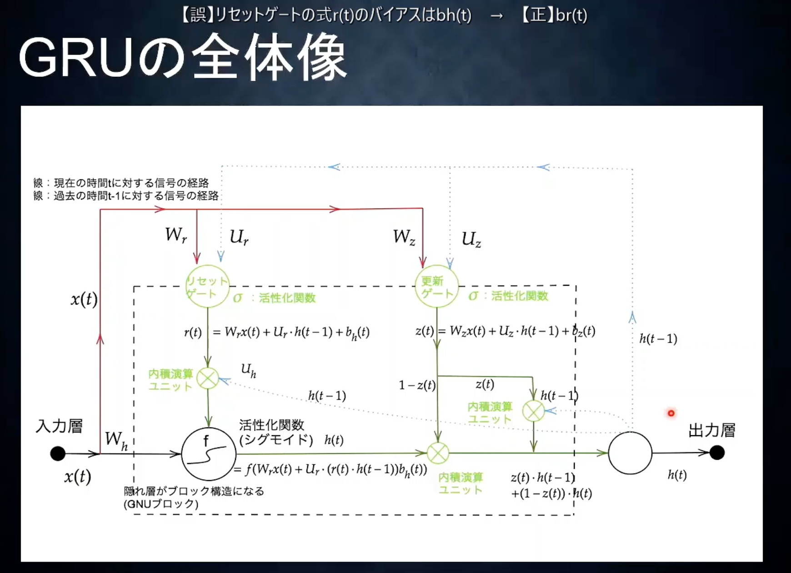
- LSTMの改良版
  - LSTMは複雑すぎて学習に時間がかかる
  - パラメータを減らさず精度を保持しようというのが、GRU
  - 隠れ層h(t)に計算状態を保存するのがGRUの特徴
  - リセットゲートは隠れ層をどのような状態で保持するのかを管理する。
  - 更新ゲートは今回の記憶と前回の記憶を元に今回の最終アウトプットを制御する。

# 確認テスト２５
- LSTMとCECが抱える課題についてそれぞれ簡潔に述べよ。
  - LSTMは入力ゲート、出力ゲート、忘却ゲート、CECと４つのパラメータがあって、計算量が多くなることが課題。
  - 原因としてはCECに学習機能がないため、他の３つの機能が必要になってしまっている。

# GRU続き
- tensorflowを使用した実装を見る。
  - 3_2を見る。

# 演習チャレンジ

- 正解は4

# 確認テスト２６
- LSTMとGRUの違いを簡潔に述べよ。
- LSTMは入力ゲート、出力ゲート、忘却ゲート、そしてCECと４つのパラメータがある。
- 一方で、GRUはリセットゲート、更新ゲートと２つのパラメータがある。
- GRUの方がパラメータが少なく計算量が少なく済むため、LSTMの処理速度の問題を解消している。

# 実装演習
- ネットを参照して実装例と実装結果を記載。

```python
def sigmoid(x):
    return 1 / (1 + np.exp(-x))

# GRUモデル
# N:バッチサイズ、D:入力単語数、H:中間層の出力次元数
class GRU:
    def __init__(self, wx, wh, b):
        self.params = wx, wh, b     # # wx[D,3H], wh[H,3H], b[3H]
        
    def forward(self, x, h_prev):
        wx, wh, b = self.params
        H = wh.shape[0]

        wxz, wxr, wxh = wx[:, :H], wx[:, H:2*H], wx[:, 2*H:]    # 入力用重み
        whz, whr, whh = wh[:, :H], wh[:, H:2*H], wh[:, 2*H:]    # 前の時刻出力用重み
        bz, br, bh = b[:H], b[H:2*H], b[2*H:]                   # バイアス

        z = sigmoid(np.dot(h_prev, whz) + np.dot(x, wxz) + bz)  # updateゲート
        r = sigmoid(np.dot(h_prev, whr) + np.dot(x, wxr) + br)  # resetゲート
        h_hat = sigmoid(np.dot(r*h_prev, whh) + np.dot(x, wxh) + bh )
        h_next = (1-z) * h_prev + z * h_hat

        return h_next

```

```python
import numpy as np

# 入力を適当に定義
x = np.arange(25).reshape(5,5)
h_prev = np.ones((5,10))

# 重みを初期化
wx = np.random.randn(5, 30)
wh = np.random.randn(10, 30)
b = np.zeros(30)

# モデルインスタンス
gru = GRU(wx, wh, b)

# 順伝播
gru.forward(x, h_prev)
```

実行すると以下の結果を得ることができた。
> array([[8.97162999e-01, 9.51946567e-01, 9.40813925e-01, 3.89420704e-01,
>         1.30922893e-01, 3.78348888e-01, 8.73888777e-01, 8.47888307e-01,
>         3.21626557e-03, 9.99999999e-01],
>        [9.99424863e-01, 5.88506584e-03, 9.84042737e-01, 4.32849428e-05,
>         3.27377542e-02, 8.69721516e-01, 9.98324843e-01, 8.98370417e-01,
>         1.99970678e-06, 1.00000000e+00],
>        [9.99999798e-01, 1.64162703e-04, 9.96068315e-01, 1.26379480e-08,
>         7.12168692e-03, 9.86527923e-01, 9.99980523e-01, 9.66112207e-01,
>         1.84501465e-09, 1.00000000e+00],
>        [1.00000000e+00, 1.03099148e-05, 9.99040118e-01, 3.53402748e-12,
>         1.58634281e-03, 9.98756581e-01, 9.99999774e-01, 9.97111096e-01,
>         1.43704392e-12, 1.00000000e+00],
>        [1.00000000e+00, 6.48062532e-07, 9.99766182e-01, 9.03320330e-16,
>         3.73073699e-04, 9.99886514e-01, 9.99999997e-01, 9.99868169e-01,
>         8.95201054e-16, 1.00000000e+00]])


双方向RNN
=========

# 双方向RNN

- RNNのモデルのより強力な改良その１
- 過去の情報とともに未来の情報を加味することで精度改良する。（文章などで適用可能。）

# 演習チャレンジ
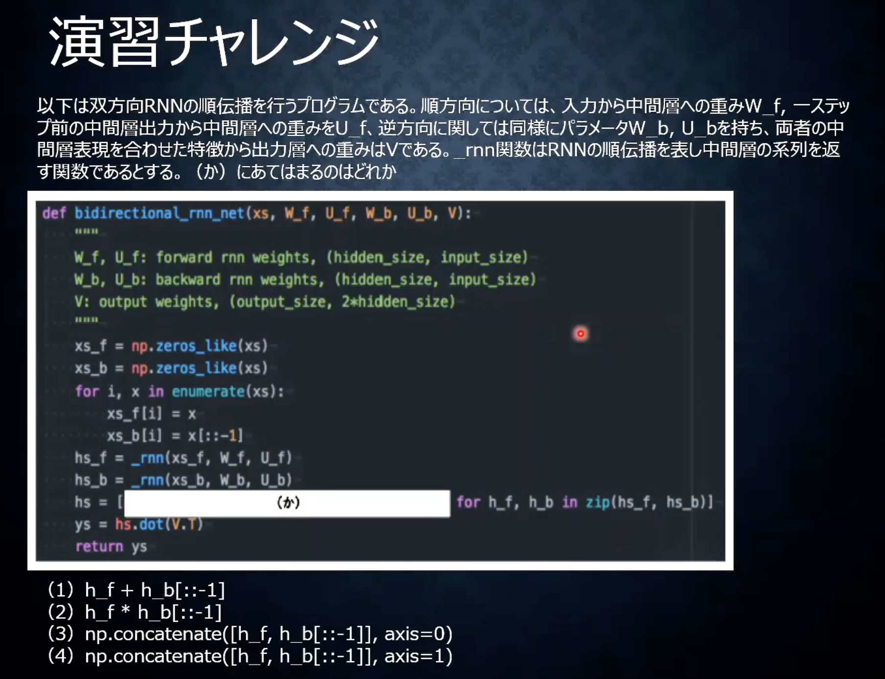
- 正解は4。２つの特徴ベクトルを時間が同じものがペアになるように作成するため。

# フレームワーク演習の際に実装演習は実施。


Seq2Seq
=========

# Seq2Seq

- RNNの応用例の１つ
- 機械翻訳などに用いられる。
- 隠れ層Cに入力側のNNより得た文脈がベクトル表現として保存される。
- 保持された文脈を別のNNにつなげて、別の出力に作り替える。
- 入力を取るほうをエンコーダー、出力を取る方をデコーダーという。

# Encoder RNN
- 文章を単語ごとに順番に取り込んでいく。
- 隠れ層には最終的に文の全体の意味が一つのベクトル表現として保存される。
- 自然言語のベクトル表現について
  - 単語１つ１つに番号をふれば、one-hot vectorとして保持できる。（通常数万のone-hot vectorで表す。つまり数万語に単語を制限する。）
  - ほとんどゼロのベクトルはメモリの無駄なので、embedding表現として、数百程度の大きさにできる。
    - embedding表現は似た意味の単語が似たベクトルになるように機械学習したもの。
    - つまりembedding表現は単語の意味をベクトル化したもの
  - 自然言語に限らず、このembedding表現のようにベクトル化（＝特徴量抽出）できれば、なんでも機械学習可能。
    - ただし、その特徴量抽出をうまく実施するのはなかなか難しい。
    - googleのBERTなど高度なモデルではMASKED LANGUAGE MODEL（MLM）が使われる。
      - 文章に穴あき部分を作り、単語を予測するように学習させることで特徴量抽出ができる。
      - このモデルの良い点は、教師なしデータでも学習を進めることができる点。
      - 画像にもこのような流れはある。
  
# Decoder RNN
- Encoderが獲得したベクトルを元に別のベクトル表現を作成する。
  - 例えば、インプットへの返答となるようなアウトプット
  - あるいは翻訳
- Encoder RNNのfinal stateをinitial stateとして使用。
- stateを元にトークン（単語）を次々に生成する。
- embedding → one-hot → 単語というように出力する。（tokenize）

# 確認テスト２７
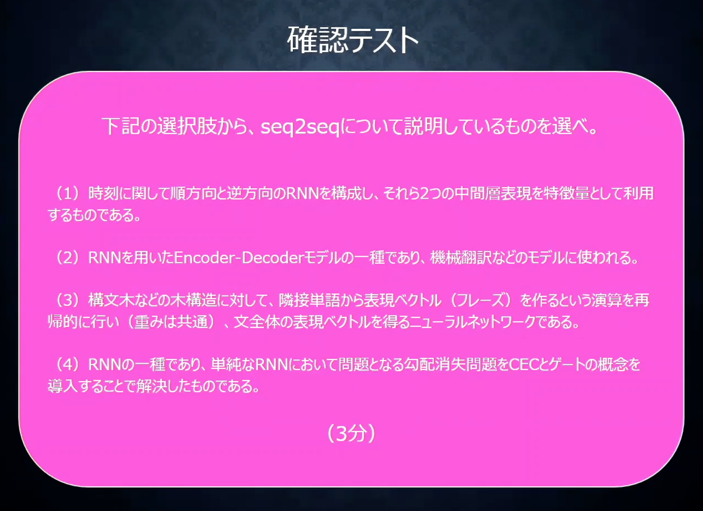
- 答えは２番。
- 1番は双方向RNN。３番は構文機、4番はLSTMの内容。

# 演習チャレンジ

- word embedding matrix(embeddding表現と単語の対応表)から単語を取り出すのはどれか。
- 回答は１番。

# 文脈の処理（HRED、VHRED）
- Seq2Seqは１問１答で、過去の文脈は考慮されない。
- 過去の文脈を読ませるために考えられたのがHRED、VHRED
- HREDではSeq2Seqにおいて、中間層で保持された文の意味ベクトルを次の層に引き継いでいく。
- ただし以下のような課題が出た
  - 毎回同じようなありがちな答えしか出さなくなる。
    - 確率的な多様性が字面にしかなく会話の「流れ」のような多様性がない
    - 短く情報量に乏しい答えを返しがち。
  - →VHREDの登場
- VHREDはHREDにVAEの潜在変数の概念を加えたもの。

# オートエンコーダー
- 教師なし学習の１つ
- mnistなどの例が有名。
- 入力ネットワークから潜在変数zに変換するニューラルネットワークをEncoder、逆に潜在変数zをインプットとして元画像を復元するニューラルネットワークをDecoderとする。
- zの次元が入力より小さい場合、zは入力の次元削減と捉えることができる。

# VAE
- Variational Auto Encoder
- オートエンコダーで潜在変数zを作るときに正則化を行う。
- 平均0確率1になるようにする。
- 正則化によって、極端な学習を防ぐことができる。
- ノイズがつくことによって、より汎用的になる。

# 確認テスト
- VAEの説明の以下の「」内に当てはまる言葉を述べよ。
  - 自己符号化機（オートエンコーダー）の潜在変数に確率分布を導入したもの。


# フレームワーク演習の際に実装演習は実施。


Word2vec
=========

# Word2Vec
- ニューラルネットワークを通して、単語の分散表現を獲得するための手法
  - 単語をone-hotベクトルで表現する
  - 次元数が多くメモリを大量に消費したり、似た単語の類似度を測ることができなかったりするなどの問題がある
  - より少ない次元数で単語の意味を数値で表現でき、現実的な計算量で省メモリ化を実現することができる。
  - RNN系のモデルでは通常、Word2Vecにより単語を分散表現に変換したものを入力として扱う。

# 実装
- LSTMのところで一度実装済みだが、簡易のものを再度実装する。
- 前処理
```
curl http://public.shiroyagi.s3.amazonaws.com/latest-ja-word2vec-gensim-model.zip > latest-ja-word2vec-gensim-model.zip
unzip latest-ja-word2vec-gensim-model.zip
```

- gensim3.8.3を使用して実装
```python
from gensim.models.word2vec import Word2Vec
model_path = 'word2vec.gensim.model'
model = Word2Vec.load(model_path)
for r in model.wv.most_similar(positive=['野球']):
    print(r)
```
- 下記のように単語をone-hotベクトルで表現できた。

> ('ソフトボール', 0.8520911931991577)
> ('ラグビー', 0.8089540600776672)
> ('サッカー', 0.7957996726036072)
> ('軟式野球', 0.7862450480461121)
> ('少年野球', 0.7850692868232727)
> ('アメフト', 0.7838374972343445)
> ('プロ野球', 0.7779729962348938)
> ('リトルリーグ', 0.7625014781951904)
> ('ホッケー', 0.7582970261573792)
> ('フットサル', 0.7554671764373779)


<script type="text/x-mathjax-config">MathJax.Hub.Config({tex2jax:{inlineMath:[['\$','\$'],['\\(','\\)']],processEscapes:true},CommonHTML: {matchFontHeight:false}});</script>
<script type="text/javascript" async src="https://cdnjs.cloudflare.com/ajax/libs/mathjax/2.7.1/MathJax.js?config=TeX-MML-AM_CHTML"></script>

Attention Mechanism
=========


# Attention Mechanism
- Seq2Seqの問題点
- 長い表現に対応できない。
  - 長い意味をベクトルに格納しきれない。
- Attention Mechanism
  - 文中の重要な情報を自力で取得する機構。
  - 近年評価が高い自然言語のモデルは全てAttention Mechanism

# 確認テスト２８
- RNNとword2vec、Seq2SeqとAttention Mechanismの違いを簡潔に述べよ。
  - RNNは時系列データを処理するのに適したニューラルネットワーク 
  - word2Vecは単語の分散表現ベクトルを得る手法
  - seq2seqは１つの時系列データから別の時系列データを得る手法。
  - Attentinon Mechanismは時系列データの中身のそれぞれの関連性について、重みをつける手法。

# 確認テスト２９
- Seq2SeqとHRED,HREDとVREDの違いについて簡潔に述べよ。
  - Seq2Seqは一問一答のようにある時系列データからある時系列データを作り出すネットワーク
  - HREDはSeqSeq２Seqに文脈の意味を足すことで、文脈の意味を汲み取ったENCODEとDECODEを可能にしている。
  - VHREはHREDが当たり障りのない文脈しか出さないことを修正するためにVAEの考えを取り入れて改良したもの。

# 実装演習
ぜろつく②の８章 Attentionの実装を実施。 

```python
# coding: utf-8
import sys
sys.path.append('..')
import numpy as np
import matplotlib.pyplot as plt
from dataset import sequence
from common.optimizer import Adam
from common.trainer import Trainer
from common.util import eval_seq2seq
from attention_seq2seq import AttentionSeq2seq
from ch07.seq2seq import Seq2seq
from ch07.peeky_seq2seq import PeekySeq2seq


# データの読み込み
(x_train, t_train), (x_test, t_test) = sequence.load_data('date.txt')
char_to_id, id_to_char = sequence.get_vocab()

# 入力文を反転
x_train, x_test = x_train[:, ::-1], x_test[:, ::-1]

# ハイパーパラメータの設定
vocab_size = len(char_to_id)
wordvec_size = 16
hidden_size = 256
batch_size = 128
max_epoch = 10
max_grad = 5.0

model = AttentionSeq2seq(vocab_size, wordvec_size, hidden_size)
# model = Seq2seq(vocab_size, wordvec_size, hidden_size)
# model = PeekySeq2seq(vocab_size, wordvec_size, hidden_size)

optimizer = Adam()
trainer = Trainer(model, optimizer)

acc_list = []
for epoch in range(max_epoch):
    trainer.fit(x_train, t_train, max_epoch=1,
                batch_size=batch_size, max_grad=max_grad)

    correct_num = 0
    for i in range(len(x_test)):
        question, correct = x_test[[i]], t_test[[i]]
        verbose = i < 10
        correct_num += eval_seq2seq(model, question, correct,
                                    id_to_char, verbose, is_reverse=True)

    acc = float(correct_num) / len(x_test)
    acc_list.append(acc)
    print('val acc %.3f%%' % (acc * 100))


model.save_params()

# グラフの描画
x = np.arange(len(acc_list))
plt.plot(x, acc_list, marker='o')
plt.xlabel('epochs')
plt.ylabel('accuracy')
plt.ylim(-0.05, 1.05)
plt.show()

```
- 結果は以下。Attentionを適用することで、２回のEPOCHで十分なAccuracyを得ることができている。


VQ-VAE
=========


# VQ-VAE

- VQ-VAEは、VAE (Variational AutoEncoder)の派生技術にあたる生成モデルです。
- 「自然界の様々な事物の特徴を捉えるには離散変数の方が適している」という発想から、潜在変数が離散値となるように学習が行われます。
- 従来のVAEで起こりやすいとされる\posteriorcollapse"の問題を回避し、高品質のデータを生成することが可能となります。

- 両者の最大の違いは、
- VAE
  - 潜在変数zがGauss分布に従うベクトルになるように学習を行う
- VQ-VAE
  - 潜在変数zが離散的な数値となるように学習を行うという点です。
- VQ-VAEでは、EncoderとDecoderの間にEncoderの出力を離散的な潜在変数に対応させる「ベクトル量子化処理(VQ: Vector Quantization)」が行われます


<script type="text/x-mathjax-config">MathJax.Hub.Config({tex2jax:{inlineMath:[['\$','\$'],['\\(','\\)']],processEscapes:true},CommonHTML: {matchFontHeight:false}});</script>
<script type="text/javascript" async src="https://cdnjs.cloudflare.com/ajax/libs/mathjax/2.7.1/MathJax.js?config=TeX-MML-AM_CHTML"></script>

[フレームワーク演習]双方向RNN_勾配のリッピング
=========


# 3_4_spoken_digit.ipynbを実践しつつspoken_digitデータセットを例にした再起ニューラルネットワークの構築方法を学ぶ。

`spoken_digit`データセットは、`mnist`の音声版。
データの特徴は、


*   **長さがバラバラ**の2500個の音声ファイルが入っています。
*   それぞれの音声ファイルは、0から9の数字を読み上げたものです。
*   5人の話者が、各数字を50回ずつ読み上げています。
*   各音声ファイルには、対応する数字がラベルとして収録されています。

データセットの読込は、`tensorflow_datasets`を使って行います。`tensorflow_datasets`は予めある程度の前処理を行ったデータを手軽にダウンロード･準備･使用することができるライブラリです。

ライブラリの機能で、ダウンロードしたデータセットを、シャッフルすることや、分割することができます。

ここでは、データセットの全体の、


*   70%をトレーニング用
*   15%を検証用
*   15%をテスト用

として分割します。

# 実装
- 元データ表示
```python
plt.plot(next(original_iter)['audio'])
```


- 前処理
  - 音声データを８つに分ける。
  - また、８個でミニバッジを構成する。

```python
NUM_DATA_POINTS = 1000
BATCH_SIZE = 8
def cut_if_longer(el):
  return (
          tf.reshape(
              tf.cond(
                tf.greater(tf.shape(el['audio']), NUM_DATA_POINTS),
                true_fn=lambda: tf.slice(el['audio'], begin=[0], size=[NUM_DATA_POINTS]),
                false_fn=lambda: tf.slice(tf.concat([el['audio'], tf.zeros(NUM_DATA_POINTS, tf.int64)], axis=0), begin=[0], size=[NUM_DATA_POINTS])
              ),
              shape=(-1, 1)
          ),
          [el['label']]
        )


dataset_prep_train = dataset_train.map(cut_if_longer).batch(BATCH_SIZE)
dataset_prep_valid = dataset_valid.map(cut_if_longer).batch(BATCH_SIZE)

sample = next(iter(dataset_prep_valid))
plt.plot(sample[0][0])
```


- 作った音声データについて様々なモデルが適用できることを確認する。
- まず単純な畳み込みネットワークでの実装。

```python
import tensorflow as tf
from tensorflow.keras.models import Sequential
from tensorflow.keras import layers

tf.keras.backend.clear_session()
model_1 = tf.keras.models.Sequential()
model_1.add(layers.Input((NUM_DATA_POINTS, 1)))
model_1.add(layers.Conv1D(32, 4, strides=2, activation='relu'))
model_1.add(layers.MaxPooling1D(2))
model_1.add(layers.GlobalAveragePooling1D())
model_1.add(layers.Dense(10, activation='softmax'))
model_1.summary()
model_1.predict(sample[0])

model_1.compile(
    loss=tf.keras.losses.SparseCategoricalCrossentropy(),
    optimizer=tf.keras.optimizers.Adam(),
    metrics=['accuracy']
)

model_1.fit(
    dataset_prep_train,
    validation_data=dataset_prep_valid,
)

print('loss / accuracy')
model_1.evaluate(dataset_prep_valid)
```

- 結果
> loss / accuracy
> 47/47 [==============================] - 0s 3ms/step - loss: 16.6344 - accuracy: 0.2107
> [16.63435173034668, 0.21066667139530182]

- 次に単純RNN


```python
import tensorflow as tf
from tensorflow.keras.models import Sequential
from tensorflow.keras import layers

tf.keras.backend.clear_session()
model_2 = tf.keras.models.Sequential()
model_2.add(layers.Input((NUM_DATA_POINTS, 1)))
model_2.add(layers.SimpleRNN(128))
model_2.add(layers.Dense(10, activation='softmax'))
model_2.summary()
model_2.predict(sample[0]).shape

model_2.compile(
    loss=tf.keras.losses.SparseCategoricalCrossentropy(),
    optimizer=tf.keras.optimizers.Adam(),
    metrics=['accuracy']
)

model_2.fit(
    dataset_prep_train,
    validation_data=dataset_prep_valid,
)
```
- 結果
> 219/219 [==============================] - 149s 679ms/step - loss: 2.3706 - accuracy: 0.1029 - val_loss: 2.3637 - val_accuracy: 0.0693
> <keras.callbacks.History at 0x7f4bd60fb150>

- 次にGRU

```python
import tensorflow as tf
from tensorflow.keras.models import Sequential
from tensorflow.keras import layers

tf.keras.backend.clear_session()
model_3 = tf.keras.models.Sequential()
model_3.add(layers.Input((NUM_DATA_POINTS, 1)))
model_3.add(layers.GRU(128))
model_3.add(layers.Dense(10, activation='softmax'))
model_3.summary()
model_3.predict(sample[0]).shape

model_3.compile(
    loss=tf.keras.losses.SparseCategoricalCrossentropy(),
    optimizer=tf.keras.optimizers.Adam(),
    metrics=['accuracy']
)

model_3.fit(
    dataset_prep_train,
    validation_data=dataset_prep_valid,
)
```
- 結果
> 219/219 [==============================] - 11s 44ms/step - loss: 2.3715 - accuracy: 0.1069 - val_loss: 2.3022 - val_accuracy: 0.1387
> <keras.callbacks.History at 0x7f4bd61e9650>

- 最後に双方向RNN

```python
import tensorflow as tf
from tensorflow.keras.models import Sequential
from tensorflow.keras import layers

tf.keras.backend.clear_session()
model_4 = tf.keras.models.Sequential()
model_4.add(layers.Input((NUM_DATA_POINTS, 1)))
model_4.add(layers.Bidirectional(layers.LSTM(64)))
model_4.add(layers.Dense(10, activation='softmax'))
model_4.summary()
model_4.predict(sample[0]).shape

model_4.compile(
    loss=tf.keras.losses.SparseCategoricalCrossentropy(),
    optimizer=tf.keras.optimizers.Adam(),
    metrics=['accuracy']
)

model_4.fit(
    dataset_prep_train,
    validation_data=dataset_prep_valid,
)
```
> 219/219 [==============================] - 17s 66ms/step - loss: 2.2814 - accuracy: 0.1509 - val_loss: 2.1504 - val_accuracy: 0.2293
> <keras.callbacks.History at 0x7f4bce706590>

- ４つのモデルの単純比較はできないが、双方向RNNが単純RNNと比べて高速なことを体感することができた。
- 勾配のクリッピングについての実装もついでに記載する。

```python
import tensorflow as tf
from tensorflow.keras.models import Sequential
from tensorflow.keras import layers


tf.keras.backend.clear_session()

model_5 = tf.keras.models.Sequential()
model_5.add(layers.Input((NUM_DATA_POINTS, 1)))
model_5.add(layers.LSTM(64))
model_5.add(layers.Dense(10, activation='softmax'))
model_5.summary()
model_5.predict(sample[0]).shape

model_5.compile(
    loss=tf.keras.losses.SparseCategoricalCrossentropy(),
    optimizer=tf.keras.optimizers.Adam(clipvalue=0.5),
    metrics=['accuracy']
)

model_5.fit(
    dataset_prep_train,
    validation_data=dataset_prep_valid,
)
```
- 結果
> 219/219 [==============================] - 10s 37ms/step - loss: 2.3386 - accuracy: 0.1109 - val_loss: 2.2980 - val_accuracy: 0.1387
> <keras.callbacks.History at 0x7f4bce636390>


<script type="text/x-mathjax-config">MathJax.Hub.Config({tex2jax:{inlineMath:[['\$','\$'],['\\(','\\)']],processEscapes:true},CommonHTML: {matchFontHeight:false}});</script>
<script type="text/javascript" async src="https://cdnjs.cloudflare.com/ajax/libs/mathjax/2.7.1/MathJax.js?config=TeX-MML-AM_CHTML"></script>

[フレームワーク演習] Seq2Seq
=========


# Seq2Seqの実践。

- sin関数の値からcos関数の値をSeq2Seqモデルに予測させる。
- まず教師データの準備


```python
x = np.linspace(-3 * np.pi, 3 * np.pi, 100)
seq_in = np.sin(x)
seq_out = np.cos(x)
plt.plot(x, seq_in, label='$y=\sin x$')
plt.plot(x, seq_out, label='$y=\cos x$')
plt.legend()
plt.grid()
plt.show()
```


- 次に用意した学習データを用いて学習を行う。

```python
# NUM_ENC_TOKENS: 入力データの次元数
# NUM_DEC_TOKENS: 出力データの次元数
# NUM_HIDDEN_PARAMS: 単純RNN層の出力次元数(コンテキストの次元数にもなる)
# NUM_STEPS: モデルへ入力するデータの時間的なステップ数。

NUM_ENC_TOKENS = 1
NUM_DEC_TOKENS = 1
NUM_HIDDEN_PARAMS = 10
NUM_STEPS = 24

# モデル定義
tf.keras.backend.clear_session()
e_input = tf.keras.layers.Input(shape=(NUM_STEPS, NUM_ENC_TOKENS), name='e_input')
_, e_state = tf.keras.layers.SimpleRNN(NUM_HIDDEN_PARAMS, return_state=True, name='e_rnn')(e_input)

d_input = tf.keras.layers.Input(shape=(NUM_STEPS, NUM_DEC_TOKENS), name='d_input')
d_rnn = tf.keras.layers.SimpleRNN(NUM_HIDDEN_PARAMS, return_sequences=True, return_state=True, name='d_rnn')
d_rnn_out, _ = d_rnn(d_input, initial_state=[e_state])

d_dense = tf.keras.layers.Dense(NUM_DEC_TOKENS, activation='linear', name='d_output')
d_output = d_dense(d_rnn_out)

model_train = tf.keras.models.Model(inputs=[e_input, d_input], outputs=d_output)
model_train.compile(optimizer='adam', loss='mean_squared_error')

model_train.summary()

# モデルの定義に合わせて学習用データを準備する。
# `ex`: エンコーダーの入力として使用する値。
# `dx`: デコーダーの入力として渡す値。最終的に出力したい値の1つ前のステップの値。
# `dy`: 最終的に推論したい値。`dx`と比べて時間的に1ステップ先の値となっている。

n = len(x) - NUM_STEPS
ex = np.zeros((n, NUM_STEPS))
dx = np.zeros((n, NUM_STEPS))
dy = np.zeros((n, NUM_STEPS))

for i in range(0, n):
  ex[i] = seq_in[i:i + NUM_STEPS]
  dx[i, 1:] = seq_out[i:i + NUM_STEPS - 1]
  dy[i] = seq_out[i: i + NUM_STEPS]

ex = ex.reshape(n, NUM_STEPS, 1)
dx = dx.reshape(n, NUM_STEPS, 1)
dy = dy.reshape(n, NUM_STEPS, 1)

# ミニバッチのサイズ: 16
# エポック数: 80回
ATCH_SIZE = 16
EPOCHS = 80
# 学習実行
history = model_train.fit([ex, dx], dy, batch_size=BATCH_SIZE, epochs=EPOCHS, validation_split=0.2, verbose=False)
# 学習過程描画
loss = history.history['loss']
plt.plot(np.arange(len(loss)), loss, label='loss')

loss = history.history['val_loss']
plt.plot(np.arange(len(loss)), loss, label='val_loss')

plt.grid()
plt.legend()
plt.show()
```

- ロス値が学習時と検証用で両方減っているので、順調に学習が進んでいることがわかる。
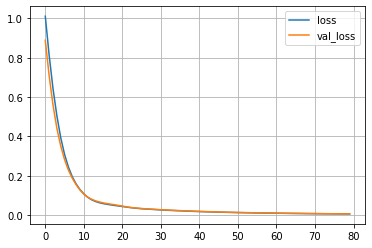

- 最後に推論を行う。

```python
# 推論用モデルの準備
model_pred_e = tf.keras.models.Model(inputs=[e_input], outputs=[e_state])

pred_d_input = tf.keras.layers.Input(shape=(1, 1))
pred_d_state_in = tf.keras.layers.Input(shape=(NUM_HIDDEN_PARAMS))

pred_d_output, pred_d_state = d_rnn(pred_d_input, initial_state=[pred_d_state_in])
pred_d_output = d_dense(pred_d_output)


pred_d_model = tf.keras.Model(inputs=[pred_d_input, pred_d_state_in], outputs=[pred_d_output, pred_d_state])

def predict(input_data):
  state_value = model_pred_e.predict(input_data)
  _dy = np.zeros((1, 1, 1))
  
  output_data = []
  for i in range(0, NUM_STEPS):
    y_output, state_value = pred_d_model.predict([_dy, state_value])
    
    output_data.append(y_output[0, 0, 0])
    _dy[0, 0, 0] = y_output

  return output_data
# 推論の実行
init_points = [0, 24, 49, 74]

for i in init_points:
  _x = ex[i : i + 1]
  _y = predict(_x)
    
  if i == 0:
    plt.plot(x[i : i + NUM_STEPS], _y, color="red", label='output')
  else:
    plt.plot(x[i : i + NUM_STEPS], _y, color="red")

plt.plot(x, seq_out, color = 'blue', linestyle = "dashed", label = 'correct')
plt.grid()
plt.legend()
plt.show()  
```

- 下記の通り、正しく推測できていることがわかる。


[フレームワーク演習]データオーギュメンテーション
=========

# data augumentationの実践。
- 画像処理認識精度向上のための画像の水増し処理を以下に記述する。


- 画像表示用の関数定義
```python
def show_images(images):
    """複数の画像を表示する"""
    n = 1
    while n ** 2 < len(images):
        n += 1
    for i, image in enumerate(images):
        plt.subplot(n, n, i + 1)
        plt.imshow(image)
        plt.axis('off')
    plt.show()
```

- 任意の画像を使用して元画像を表示する。
```python
contents = tf.io.read_file("./sample_data/image_origin.jpg")
image_origin = tf.image.decode_jpeg(contents, channels=3)
image = image_origin
show_images([image.numpy()])
```


- 以下、データオーギュメンテーションの手法を列挙していく。
1. Horizontal Flip
```python
image = image_origin
image = tf.image.random_flip_left_right(image, seed=123)

show_images([image.numpy()])
```


2. Vertial Flip
```python
image = image_origin
image = tf.image.random_flip_up_down(image, seed=123)

show_images([image.numpy()])
```


3. Crop
```python
image = image_origin
image = tf.image.random_crop(image, size=(100, 100, 3), seed=123)

show_images([image.numpy()])
```


4. Contrast
```python
image = image_origin
image = tf.image.random_contrast(image, lower=0.4, upper=0.6)

show_images([image.numpy()])
```


5. Brightness
- 輝度の調整
```python
image = image_origin
image = tf.image.random_brightness(image, max_delta=0.8)

show_images([image.numpy()])

```


6. Hue
- 色相の調整

```python
image = image_origin
image = tf.image.random_hue(image, max_delta=0.1)

show_images([image.numpy()])
```


7. Rotate

```python
image = image_origin
image = tf.image.rot90(image, k=1)

show_images([image.numpy()])
```


8. Random Erasing

```python
def random_erasing(img, prob = 0.5, sl = 0.02, sh = 0.4, r1 = 0.2, r2 = 0.8):
    if np.random.random() < prob:
        return img
    else:
        H = img.shape[0]
        W = img.shape[1]
        S = H * W
        while True:
            S_e = S * np.random.uniform(low=sl, high=sh)
            r_e = np.random.uniform(low=r1, high=r2)

            H_e = np.sqrt(S_e * r_e)
            W_e = np.sqrt(S_e / r_e)

            x_e = np.random.randint(0, W)
            y_e = np.random.randint(0, H)

            if x_e + W_e <= W and y_e + H_e <= H:
                img_modified = np.copy(img)
                img_modified[y_e:int(y_e + H_e + 1), x_e:int(x_e + W_e + 1), :] = np.random.uniform(0, 1)
                return img_modified
show_images([
             random_erasing(image.numpy()),
             random_erasing(image.numpy()),
             random_erasing(image.numpy()),
             random_erasing(image.numpy()),
             random_erasing(image.numpy()),
             random_erasing(image.numpy()),
             random_erasing(image.numpy()),
             random_erasing(image.numpy()),
             random_erasing(image.numpy()),
             random_erasing(image.numpy()),
             random_erasing(image.numpy()),
             random_erasing(image.numpy()),
             random_erasing(image.numpy()),
             random_erasing(image.numpy()),
             random_erasing(image.numpy()),
             random_erasing(image.numpy()),
             ])

```


9.  MixUP
- データセットの中の２つの画像・ラベルを混合すること

```python
def sample_beta_distribution(size, concentration_0, concentration_1):
    gamma_1_sample = tf.random.gamma(shape=[size], alpha=concentration_1)
    gamma_2_sample = tf.random.gamma(shape=[size], alpha=concentration_0)
    return gamma_1_sample / (gamma_1_sample + gamma_2_sample)
def mix_up(ds_one, ds_two, alpha=0.4):
    # ds_oneとds_twoは10枚分ずれたmnistのデータセット。
    # どちらのデータセットにも入力データの画像とラベルが含まれている。
    images_one, labels_one = ds_one
    images_two, labels_two = ds_two

    # この後の処理で必要なため、データセットのバッチサイズを取得
    batch_size = tf.shape(images_one)[0]

    # 上で定義したベータ分布に基づくサンプリングで、バッチサイズ分の混合割合を取得。
    l = sample_beta_distribution(batch_size, alpha, alpha)
    x_l = tf.reshape(l, (batch_size, 1, 1, 1))
    y_l = tf.reshape(l, (batch_size, 1))

    # 2つのデータセットを混合割合に基づいて、入力データ･ラベルの両方を混合する。
    images = images_one * x_l + images_two * (1 - x_l)
    labels = labels_one * y_l + labels_two * (1 - y_l)
    return (images, labels)

# mnistデータセットの読み込み
(x_train, y_train), (x_test, y_test) = tf.keras.datasets.mnist.load_data()

# データを正規化し、28x28の画像の形状に変形する。
x_train = x_train.astype("float32") / 255.0
x_train = np.reshape(x_train, (-1, 28, 28, 1))

# ラベルをone-hotラベルの形式に変形する
y_train = tf.one_hot(y_train, 10)

# 10枚分ずれたデータセットを取得する。
# 1つ目のデータセットは、0枚目からmnistの最後から10こ手前まで。
# 2つ目のデータセットは、10枚目からmnistの最後まで。
# また、16枚でミニバッチを構成する
BATCH_SIZE = 16
train_ds_one = (tf.data.Dataset.from_tensor_slices((x_train[:-10], y_train[:-10])).batch(BATCH_SIZE))
train_ds_two = (tf.data.Dataset.from_tensor_slices((x_train[10:], y_train[10:])).batch(BATCH_SIZE))

# 10枚ずれたデータセット同士を連結し、MixUpの組合せを作る。
train_ds = tf.data.Dataset.zip((train_ds_one, train_ds_two))

# 先に定義したMixUpの関数を使って、2つのデータセットを処理する。
train_ds_mu = train_ds.map(lambda ds_one, ds_two: mix_up(ds_one, ds_two, alpha=0.4))

# MixUpされた9枚の画像を表示する。
# One-hot表現されたラベルも混合されていることがわかる。
sample_images, sample_labels = next(iter(train_ds_mu))
plt.figure(figsize=(10, 10))
for i, (image, label) in enumerate(zip(sample_images[:9], sample_labels[:9])):
    ax = plt.subplot(3, 3, i + 1)
    plt.imshow(image.numpy().squeeze())
    print('ラベル: ', label.numpy().tolist())
    plt.axis("off")

```

- 文字の重なりを確認することができる。

10.  複数の手法の組み合わせ

```python
def data_augmentation(image):
    image = tf.image.random_flip_left_right(image)
    image = tf.image.random_flip_up_down(image)
    image = tf.image.random_contrast(image, lower=0.4, upper=0.6)
    image = tf.image.random_brightness(image, max_delta=0.8)
    image = tf.image.rot90(image, k=random.choice((0, 1, 2)))
    image = tf.image.random_hue(image, max_delta=0.1)
    return image

image = image_origin

show_images([data_augmentation(image).numpy() for _ in range(36)])
```

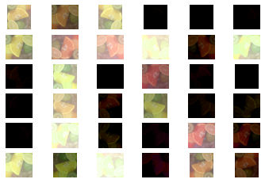


[フレームワーク演習]活性化関数
=========


# 活性化関数の実践。
- 中間層に用いる活性化関数
1. ステップ関数
```python
def step_function(x):
    """forward
       
       step
       ステップ関数
       (閾値0)
    """
    return np.where(x >= 0.0, 1.0, 0.0)

def d_step_function(x):
    """backward
       
       derivative of step
       ステップ関数の導関数
       (閾値0)
    """
    dx = np.where(x == 0.0, np.nan, 0.0)
    return dx

x = np.arange(-600, 601, 1) * 0.01
f, d, = step_function, d_step_function
y1, y2 = f(x), d(x)

_, ax = plt.subplots()
ax.plot(x, y1, label=f.__doc__.split("\n")[0].strip())
ax.plot(x, y2, label=d.__doc__.split("\n")[0].strip(), linewidth=1.0)
ax.set_xlabel("$x$")
ax.set_ylabel("$y_{1}=f(x), y_{2}=f^{\prime}(x)$")
ax.set_title(f.__doc__.split("\n")[2].strip())
ax.legend()

plt.show()

```

2. シグモイド関数
```python
def sigmoid(x):
    """forward
       
       sigmoid
       シグモイド関数
    """
    return 1.0 / (1.0 + np.exp(-x))

def d_sigmoid(x):
    """backward
       
       derivative of sigmoid
       シグモイド関数の導関数
    """
    dx = sigmoid(x) * (1.0 - sigmoid(x))
    return dx
x = np.arange(-600, 601, 1) * 0.01
f, d = sigmoid, d_sigmoid
y1, y2 = f(x), d(x)

_, ax = plt.subplots()
ax.plot(x, y1, label=f.__doc__.split("\n")[0].strip())
ax.plot(x, y2, label=d.__doc__.split("\n")[0].strip(), linewidth=1.0)
ax.set_xlabel("$x$")
ax.set_ylabel("$y_{1}=f(x), y_{2}=f^{\prime}(x)$")
ax.set_title(f.__doc__.split("\n")[2].strip())
ax.legend()

plt.show()

```


3. tanh関数

```python
def tanh(x):
    """forward
       
       tanh
       双曲線正接関数
       (1)
    """
    return np.tanh(x)
def d_tanh(x):
    """backward
       
       derivative of tanh
       双曲線正接関数の導関数
       (1)
    """
    dx = 1.0 / np.square(np.cosh(x))
    return dx

x = np.arange(-600, 601, 1) * 0.01
f, d = tanh, d_tanh
y1, y2 = f(x), d(x)

_, ax = plt.subplots()
ax.plot(x, y1, label=f.__doc__.split("\n")[0].strip())
ax.plot(x, y2, label=d.__doc__.split("\n")[0].strip(), linewidth=1.0)
ax.set_xlabel("$x$")
ax.set_ylabel("$y_{1}=f(x), y_{2}=f^{\prime}(x)$")
ax.set_title(f.__doc__.split("\n")[2].strip())
ax.legend()

plt.show()
```
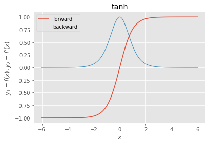
4. ReLU関数

```python
def relu(x):
    """forward
       
       ReLU
       正規化線形関数
    """
    return np.maximum(0, x)

def d_relu(x):
    """backward
       
       derivative of ReLU
       正規化線形関数の導関数
    """
    dx = np.where(x > 0.0, 1.0, np.where(x < 0.0, 0.0, np.nan))
    return dx
x = np.arange(-600, 601, 1) * 0.01
f, d = relu, d_relu
y1, y2 = f(x), d(x)

_, ax = plt.subplots()
ax.plot(x, y1, label=f.__doc__.split("\n")[0].strip())
ax.plot(x, y2, label=d.__doc__.split("\n")[0].strip(), linewidth=1.0)
ax.set_xlabel("$x$")
ax.set_ylabel("$y_{1}=f(x), y_{2}=f^{\prime}(x)$")
ax.set_title(f.__doc__.split("\n")[2].strip())
ax.legend()

plt.show()
```

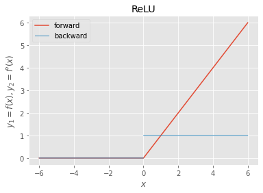
1. LeakyReLU関数

```python
alpha = 0.01

def lrelu(x):
    """forward
       
       Leaky ReLU
       漏洩正規化線形関数
    """
    return np.maximum(alpha*x, x)

def d_lrelu(x):
    """backward
       
       derivative of Leaky ReLU
       漏洩正規化線形関数の導関数
    """
    dx = np.where(x > 0.0, 1.0, np.where(x < 0.0, alpha, np.nan))
    return dx
x = np.arange(-600, 601, 1) * 0.01
f, d = lrelu, d_lrelu
y1, y2 = f(x), d(x)

_, ax = plt.subplots()
ax.plot(x, y1, label=f.__doc__.split("\n")[0].strip())
ax.plot(x, y2, label=d.__doc__.split("\n")[0].strip(), linewidth=1.0)
ax.set_xlabel("$x$")
ax.set_ylabel("$y_{1}=f(x), y_{2}=f^{\prime}(x)$")
ax.set_title(f.__doc__.split("\n")[2].strip())
ax.legend()

plt.show()

```


6. Swish関数
- ReLUの次世代のスタンダード候補として注目

```python
beta = 1.0

def swish(x):
    """forward
       
       Swish
       シグモイド加重線形関数
    """
    return x * sigmoid(beta*x)

def d_swish(x):
    """backward
       
       derivative of Swish
       シグモイド加重線形関数の導関数
    """
    dx = beta*swish(x) + sigmoid(beta*x)*(1.0 - beta*swish(x)) 
    return dx
x = np.arange(-600, 601, 1) * 0.01
f, d = swish, d_swish
y1, y2 = f(x), d(x)

_, ax = plt.subplots()
ax.plot(x, y1, label=f.__doc__.split("\n")[0].strip())
ax.plot(x, y2, label=d.__doc__.split("\n")[0].strip(), linewidth=1.0)
ax.set_xlabel("$x$")
ax.set_ylabel("$y_{1}=f(x), y_{2}=f^{\prime}(x)$")
ax.set_title(f.__doc__.split("\n")[2].strip())
ax.legend()

plt.show()

```

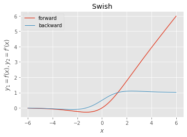
- 出力層に用いる活性化関数
1. sigmoid関数（略）
   - 2値分類用 
2. softmax関数
   - 多値分類用

```python
def softmax(x):
    """forward
       
       softmax
       ソフトマックス関数
    """
    if x.ndim == 2:
        x = x.T
        x = x - np.max(x, axis=0)
        y = np.exp(x) / np.sum(np.exp(x), axis=0)
        return y.T

    x = x - np.max(x)  # オーバーフロー対策
    return np.exp(x) / np.sum(np.exp(x))

def d_softmax(x):
    """backward
       
       derivative of softmax
       ソフトマックス関数の導関数
    """
    y = softmax(x)
    dx = -y[:,:,None] * y[:,None,:]       # ヤコビ行列を計算 (i≠jの場合)
    iy, ix = np.diag_indices_from(dx[0])  # 対角要素の添字を取得
    dx[:,iy,ix] = y * (1.0 - y)           # 対角要素値を修正 (i＝jの場合)
    return dx
x = np.pad(np.arange(-600, 601, 1).reshape((-1, 1)) * 0.01, ((0, 0), (0, 1)), 'constant')
g = softmax
y = g(x)

_, ax = plt.subplots()
for j in range(x.shape[1]):
    ax.plot(x[:,j], y[:,j], label=r" $j={}$".format(j))
ax.set_xlabel("$x_{i0}$")
ax.set_ylabel("$y_{i}=g(x)_{i}$")
ax.set_title(g.__doc__.split("\n")[2].strip())
ax.legend()

plt.show()

```


1. 恒等関数
   - 回帰用

```python
def identity(x):
    """forward
       
       identity
       恒等関数
    """
    return x

def d_identity(x):
    """backward
       
       derivative of identity
       恒等関数の導関数
    """
    dx = np.ones_like(x)
    return dx
    
x = np.arange(-600, 601, 1) * 0.01
g, d = identity, d_identity
y1, y2 = g(x), d(x)

_, ax = plt.subplots()
ax.plot(x, y1, label=g.__doc__.split("\n")[0].strip())
ax.plot(x, y2, label=d.__doc__.split("\n")[0].strip(), linewidth=1.0)
ax.set_xlabel("$x$")
ax.set_ylabel("$y_{1}=g(x), y_{2}=g^{\prime}(x)$")
ax.set_title(g.__doc__.split("\n")[2].strip())
ax.legend()

plt.show()

```

