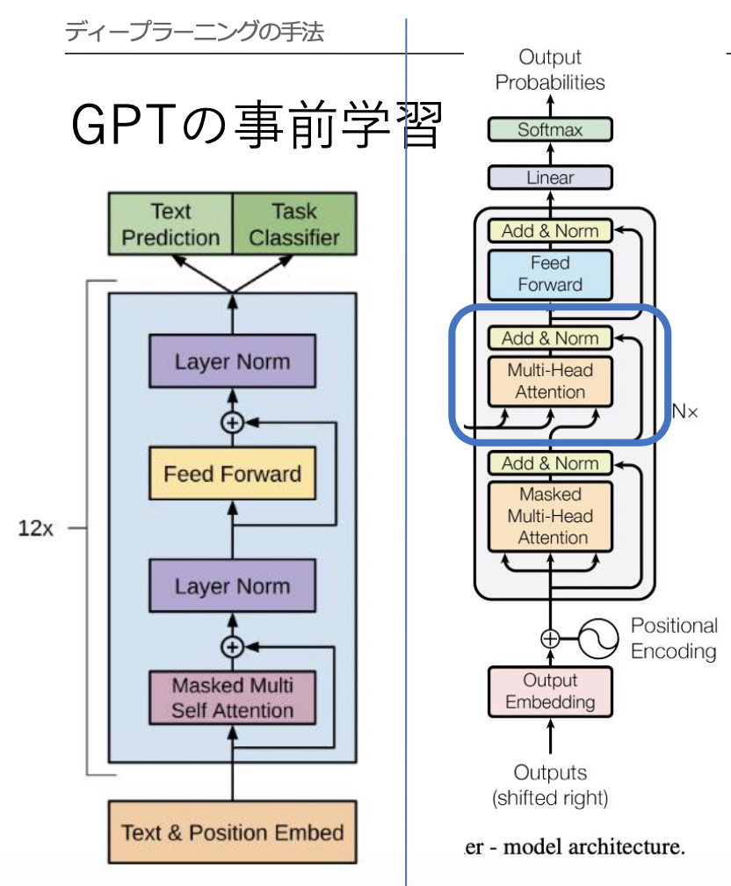

# GPT
- GPT（Generative Pre-Training）
  - 2019年にOpenAIが開発した有名な事前学習モデル
  - その後、GPT-2、GPT-3が相次いで発表
    - GPT-3のパラメータ数は1750億個にもなり、約45TBのコーパスで事前学習を行う
  - GPTの構造はトランスフォーマーを基本とし、「ある単語の次に来る単語」を予測し、自動的に文章を完成できるように、教師なし学習を行う
    - 出力値は「その単語が次に来る確率」
- BERTと違い、双方向Transformerではない。

# GPT-3について報告されている問題点
- 社会の安全に関する課題
- 学習や運用のコストの制約
- 機能の限界（人間社会の慣習や常識を認識できないことに起因）

# GPTの事前学習
- 以下の式を最大化するように学習する
  > \\\(\displaystyle l_1(u) = \sum_i \log P(u_i \| u_{i-k}, \cdots ,u_{i-1}; \Theta)\\\)
- \\\(U = \lbrace u_1, \cdots , u_n\rbrace\\\)が言語データセット(ラベルなし)で、{}の中はそのデータセットの一つ一つの単語を示している
- k:コンテキストウィンドウ。何単語前まで使うか。
- \\\(\Theta\\\):ニューラルネットワークのパラメーター
- GPTの事前学習に使われるモデルとTransformerのデコーダーの違い

- 青で囲まれている部分がGPTで減っている以外は同じ。

# GPT-1のファインチューニング
- 転移学習では、始まりを表す記号、文と文を区切る記号、終わりを表す記号を使う
  - テキスト分類(classification)
    - 区切りの記号は使わず、テキストをTransformerに入れ、線形結合、softmaxに通し答えを得る
  - 文の関連度予測(entailment)
    - 文同士の関係を予測する場合は区切り記号を使って、前提(premise)と仮説(hypothesis)を分けて、予測する
  - 文の類似度予測(Similarity)
    - 二つの文を区切り文字で区切り、順番を入れ替えた入力をもう一つ用意する
    - それぞれTransformerに入力し、その出力を足して線形結合-> softmaxで類似度を得る
  - 複数の文から一つを選ぶ(Multiple Choices)
    - 線形結合層もそれぞれ分かれていて、それぞれの出力を比較して最終的な答えとするGPTの事前学習

# GPT2での変更点
- GPT-2での変更点
  - Layer Normの位置を前にずらしたこと最後のself-attentionブロックの後にもLayer Norm層を入れたこと
  - バッチサイズやデータセットを大きくした

# GPT3での変更点
- GPT-3の変更点
  - 埋め込みサイズ、層、Multi-Head Attentionの数、コンテキストウィンドウの数を増やした
- GPT-3では、fine-tuningをしない改めて勾配を更新し直すことをしない
- GPT-3の推論は、zero-shot、one-shot、few-shotに分類できる
  - zero-shotでは、なんのタスクか（翻訳なのか、文生成なのかなど）を指定した後、すぐ推論させる
  - one-shotでは、なんのタスクかを指定したあと一つだけラベル付きの例を教え、その後推論させる
  - few-shotでは、なんのタスクかを指定した後、2つ以上の例を教え、そのあと推論する

# BERTとGPTの比較
- BERTは、Tranformerのエンコーダー部分を使っている
- GPTはTransformerのデコーダー部分を使っている
- BERTは、新しいタスクに対してファインチューニングが必要
- GPT-3はファインチューニングをしない
- BERTは双方向Transformer
- GPTは単一方向のTransformerである
- BERTは文の中のどの位置の単語もマスクされる可能性があり、マスクした前の単語も後ろの単語にも注目する必要がある
- GPTは常に次の単語を予測するため、双方向ではない

# 