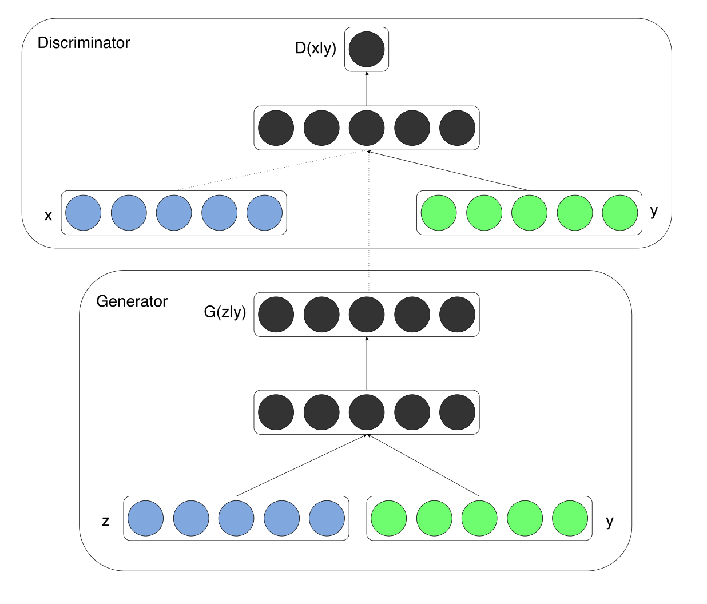

<script type="text/x-mathjax-config">MathJax.Hub.Config({tex2jax:{inlineMath:[['\$','\$'],['\\(','\\)']],processEscapes:true},CommonHTML: {matchFontHeight:false}});</script>
<script type="text/javascript" async src="https://cdnjs.cloudflare.com/ajax/libs/mathjax/2.7.1/MathJax.js?config=TeX-MML-AM_CHTML"></script>

14 GAN
==========
# GAN（Generative Adversarial Nets）
- 生成器と識別器を競わせて学習する生成&識別モデル
  - nGenerator:乱数からデータを生成
  - nDiscriminator: 入力データが真データ(学習データ)であるかを識別
- 2人のプレイヤーがミニマックスゲームを繰り返すと考えることができる。
  - GANでは価値関数𝑉に対し, 𝐷が最大化, 𝐺が最小化を行う
  > \\\(\displaystyle \min_g \max_d V(G,D)\\\)
  > \\\(V(D,G) = \mathbb{E}_{x \sim P_{data}(x)} \left[ logD(x)\right] + \mathbb{E}_{z \sim P_{z}(Z)} \left[ log\left(1 - D(G(z))\right)\right]\\\))
  - GANの価値関数はバイナリークロスエントロピーと考えることができる。
- 最適化方法
  - Discriminatorの更新
    - Generatorパラメータ\\\(\theta_g\\\)を固定
    - 真データと生成データを𝑚個ずつサンプル
    - \\\(\theta_d\\\)を勾配上昇法(Gradient Ascent)で更新
    > \\\(\displaystyle \frac{\partial}{\partial \theta_d}\frac{1}{m}[ log[ D(x) ]+log[ 1−D(G(z) ]]\\\)
    - \\\(\theta_d\\\)をk回更新
  - Generatorの更新
    - Discriminatorパラメータ\\\(\theta_d\\\)を固定
    - 生成データを𝑚個ずつサンプル
    - \\\(\theta_g\\\)を勾配降下法(Gradient Descent)で更新
    > \\\(\displaystyle \frac{\partial}{\partial \theta_g}\frac{1}{m}[ log[ 1−D(G(z) ]]\\\)
    - \\\(\theta_g\\\)を1回更新。
- なぜGeneratorは本物のようなデータを生成するのか︖
  - 生成データが本物とそっくりな状況とは\\\(p_{data} =p_g\\\)であるはず
  - 価値関数が\\\(p_{data} =p_g\\\)時に最適化されていることを示せばよい
- 二つのステップにより確認する
  - 1.Gを固定し、価値関数が最大値を取るときのD(x)を算出
    > \\\(\begin{aligned} V(D,G) &= \mathbb{E}_{x \sim P_{data}(x)} \left[ logD(x)\right] + \mathbb{E}_{z \sim P_{z}(Z)} \left[ log\left(1 - D(G(z))\right)\right] \cr &= \int_x P_{data}(x) \left[ logD(x)\right]dx + \int_z P_{z}(Z) \left[ log\left(1 - D(G(z))\right)\right]dz\end{aligned}\\\)
    - Gを固定しているので、G(z)=xと考えて、
    > \\\(\displaystyle V(D,G) = \int_x \left\lbrace P_{data}(x)logD(x) + P_{g}(x)  log\left(1 - D(x)\right) \right\rbrace dx \\\)
    - y = D(x), a= P_{data}(x), b = p_g(x)とすれば、上の式は a log(y) + b log(1 - y)とおけ、この極地を求めることで価値関数が最大値を取るときのD(x)を算出する。
      - その時のD(x)は計算すると、\\\(D(x) = \dfrac{P_{data}(x)}{P_{data}(x) + P_g(x)}\\\)
  - 2.上記のD(x)を価値関数に代入し、Gが価値関数を最小化する条件を算出
    > \\\(\begin{aligned}V &= \mathbb{E}_{x \sim P_{data}(x)} \left[ log\dfrac{P_{data}(x)}{P_{data}(x) + P_g(x)}\right] + \mathbb{E}_{g \sim P_g} \left[ log\left(1 - \dfrac{P_{data}(x)}{P_{data}(x) + P_g(x)}\right)\right] \cr
    &= \mathbb{E}_{x \sim P_{data}(x)} \left[ log\dfrac{P_{data}(x)}{P_{data}(x) + P_g(x)}\right] + \mathbb{E}_{g \sim P_g} \left[ log\left(\dfrac{P_g(x)}{P_{data}(x) + P_g(x)}\right)\right] \cr
    &= \mathbb{E}_{x \sim P_{data}(x)} \left[ log\dfrac{2P_{data}(x)}{P_{data}(x) + P_g(x)}\right] + \mathbb{E}_{g \sim P_g} \left[ log\left(\dfrac{2P_g(x)}{P_{data}(x) + P_g(x)}\right)\right] - 2 log2 \cr
    &= 2JS( p_{data}\||p_g) - 2 log2
    \end{aligned}\\\)
    - JSは非負で分布が一致する時のみ0を取るから、\\\(p_{data} =p_g\\\)の時に最小値をとる。
  - よって、価値関数が\\\(p_{data} =p_g\\\)の時に最適化されるので、Generatorは本物とそっくりなデータを出力できる。

# DCGAN
- DCGANとは？
  - GANを利用した画像生成モデル
    - いくつかの構造制約により生成品質を向上
      - Generator
        - Pooling層の代わりに転置畳み込み層を使用
          - 転置畳み込み層により乱数を画像にアップサンプリング 
        - 最終層はtanh、その他はReLU関数で活性化
      - Discriminator
        - Pooling層の代わりに畳み込み層を使用
          - 畳み込み層により画像から特徴量を抽出し、最終層をsigmoid関数で活性化
        - Leaky ReLU関数で活性化
      - 共通事項
        - 中間層に全結合層を使わない
        - バッチノーマライゼーションを適用
- 応用技術
  - Fast Bi-layer Neural Synthesis ofOne-Shot Realistic Head Avatars
  - 1枚の顔画像から動画像(Avatar)を高速に生成するモデル
  - 推論時の処理を高速化することにより、リアルタイムの処理を可能にした。


# Conditional GAN
- 学習時にラベルを与えることで、種類を指定したデータの生成を可能にします。通常のGANでは、ランダムなサンプリングを行っているため生成されるデータの種類を指定することはできない。
- 学習時にラベルを与えているため、ネットワークの概略は以下となる。（[元論文](https://arxiv.org/abs/1411.1784)より取得）



# 実装（リソースがないため実装時のポイントのみ記述）

- 下記はtensorflowで実施したDCGANのアーキテクチャ
- 下記事項がそれぞれ適用されていることを確認できる。
  - 【Generator】
    - Pooling層の代わりに転置畳み込み層を使用
    - 最終層はtanh、その他はReLU関数で活性化
  - 【Discriminator】
    - Pooling層の代わりに畳み込み層を使用
    - Leaky ReLU関数で活性化
  - 【共通事項】
    - 中間層に全結合層を使わない
    - バッチノーマライゼーションを適用


```python
import tensorflow as tf
from tensorflow.keras import Model
from tensorflow.keras.initializers import RandomNormal
from tensorflow.keras.layers import (
    BatchNormalization,
    Conv2D,
    Conv2DTranspose,
    Dense,
    Flatten,
    Input,
    LeakyReLU,
    Reshape,
)


class DCGAN_Generator(object):
    def __init__(self, batch_size, noize_dim=100):
        self.batch_size = batch_size
        self.noize_dim = noize_dim
        self.w_init = RandomNormal(mean=0.0, stddev=0.02)

    def build(self):
        noize = Input(batch_shape=(self.batch_size, self.noize_dim))

        densed = Dense(4 * 4 * 1024, "relu", kernel_initializer=self.w_init)(noize)
        densed = BatchNormalization()(densed)
        reshaped = Reshape((4, 4, 1024))(densed)

        # 引数：(チャンネル数、カーネルサイズ、ストライド、活性化関数)
        conv_1 = Conv2DTranspose(512, (5, 5), (2, 2), "same", activation="relu", kernel_initializer=self.w_init)(reshaped)
        conv_1 = BatchNormalization()(conv_1)
        conv_2 = Conv2DTranspose(256, (5, 5), (2, 2), "same", activation="relu", kernel_initializer=self.w_init)(conv_1)
        conv_2 = BatchNormalization()(conv_2)
        conv_3 = Conv2DTranspose(128, (5, 5), (2, 2), "same", activation="relu", kernel_initializer=self.w_init)(conv_2)
        conv_3 = BatchNormalization()(conv_3)
        conv_4 = Conv2DTranspose(3, (5, 5), (2, 2), "same", activation="tanh", kernel_initializer=self.w_init)(conv_3)

        generator = Model(inputs=noize, outputs=conv_4)

        return generator


class DCGAN_Discriminator(object):
    def __init__(self, batch_size):
        self.batch_size = batch_size
        self.w_init = RandomNormal(mean=0.0, stddev=0.02)

    def build(self):
        images = Input(batch_shape=(self.batch_size, 64, 64, 3))
        conv_1 = Conv2D(128, (5, 5), (2, 2), "same", kernel_initializer=self.w_init)(images)
        conv_1 = LeakyReLU(alpha=0.2)(conv_1)

        conv_2 = Conv2D(256, (5, 5), (2, 2), "same", kernel_initializer=self.w_init)(conv_1)
        conv_2 = LeakyReLU(alpha=0.2)(conv_2)
        conv_2 = BatchNormalization()(conv_2)

        conv_3 = Conv2D(512, (5, 5), (2, 2), "same", kernel_initializer=self.w_init)(conv_2)
        conv_3 = LeakyReLU(alpha=0.2)(conv_3)
        conv_3 = BatchNormalization()(conv_3)

        conv_4 = Conv2D(1024, (5, 5), (2, 2), "same", kernel_initializer=self.w_init)(conv_2)
        conv_4 = LeakyReLU(alpha=0.2)(conv_4)
        conv_4 = BatchNormalization()(conv_4)

        flatten = Flatten()(conv_3)
        densed = Dense(1, "sigmoid", kernel_initializer=self.w_init)(flatten)

        discriminator = Model(inputs=images, outputs=densed)
        return discriminator

```


- 一度実行しようとしてみて、cifar-10のデータを利用しようとしてサイズが合わないことがあった。（cifar-10は32*32で今回の以下の実装は64*64を前提。）
  - 画像のリサイズなどをして、インプットを調整するための前処理の重要性について確認できた。
  - また、大きな画像を利用した学習を行いたい場合は、ニューラルネットワークの形を下記からうまく調節する必要があることも確認できた。