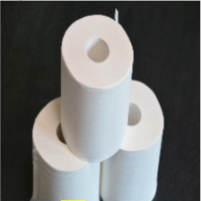
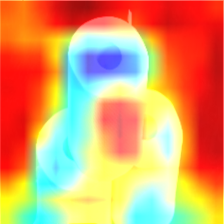

<script type="text/x-mathjax-config">MathJax.Hub.Config({tex2jax:{inlineMath:[['\$','\$'],['\\(','\\)']],processEscapes:true},CommonHTML: {matchFontHeight:false}});</script>
<script type="text/javascript" async src="https://cdnjs.cloudflare.com/ajax/libs/mathjax/2.7.1/MathJax.js?config=TeX-MML-AM_CHTML"></script>


20 GRAD-CAM/LIME/SHAP
==========

# モデルの解釈性への挑戦

- なぜ解釈性が重要なのか
  - ディープラーニング活用の難しいことの１つは「ブラックボックス性」
  - 判断の根拠を説明できない
  - 実社会に実装する後に不安が発生「なぜ予測が当たっているのか」を説明できない
    - 例:「AIによる医療診断の結果、腫瘍は悪性ですが、AIがそう判断した根拠は解明できません」
  - モデルの解釈性に注目し、「ブラックボックス性」の解消を目指した研究が進められている
  - CAM,Grad CAM, LIME, SHAPの４つについて説明していく。

1. CAM
   - ネットワークの大部分が畳み込み層で構成されているネットワークかつ最終的な出力の前にGlobal Average Poolingを実施していれば実装可能。
   - \\\(\displaystyle M_c(x, y) = \sum_k w_k^c f_k (x,y)\\\)
   - 出力層につながっている重みのうちどのクラスかを指定し、最後の畳み込み層の特徴マップとの内積をとる
   - 同じ写真でもクラスによって注目している部分が異なる

2. Grad-CAM
   - CNNモデルに判断根拠を持たせ、モデルの予測根拠を可視化する手法
   - 名称の由来は”Gradient” = 「勾配情報」
   - 最後の畳み込み層の予測クラスの出力値に対する勾配を使用
   - 勾配が大きいピクセルに重みを増やす：予測クラスの出力に大きく影響する重要な場所
   - CNNが分類のために重視している範囲を、ヒートーマップで表示「画像のどこに注目してクラス分類しているのか」や「正しく認識しているか」を目視できる
   - クラスcのスコアを\\\(y_c\\\)とし、k番目の特徴マップの座標(i,j)における値を\\\(A_{ij}^k\\\) とする
   - \\\(y_c\\\)の\\\(A_k\\\)における勾配を、特徴マップの全要素についてGlobal Average Poolingを施す
   - クラスCのk番目のフィルタに関する重み係数
     - \\\(\displaystyle \alpha_k^c = \frac{1}{Z} \sum_i \sum_j \frac{\partial y^c}{\partial A_{ij}}\\\)
   - 重みが大きいほど、特徴マップkがクラスcの予測にとって重要であると解釈できる
   - 特徴マップと重み係数を線形結合し、ReLU関数で出力した値とする。
     - \\\(\displaystyle L_{Grad-CAM}^C = ReLU(\sum_k)\\\)
   - CAMはモデルのアーキテクチャにGAPがないと可視化できなかったのに対し、Grad-CAMはGAPがなくても可視化できるまた、出力層が画像分類でなくてもよく、様々なタスクで使える

3. LIME
   - 特定の入力データに対する予測について、その判断根拠を解釈・可視化するツール
     - 表形式データ：「どの変数が予測に効いたのか」
     - 画像データ：「画像のどの部分が予測に効いたのか」
   - 単純で解釈しやすいモデルを用いて、複雑なモデルを近似することで解釈を行う
   - LIMEへの入力は１つの個別の予測結果（モデル全体の近似は複雑すぎる）
   - 対象サンプルの周辺のデータ空間からサンプリングして集めたデータセットを教師データとして、データ空間の対象範囲内でのみ有効な近似用モデルを作成
   - 近似用モデルから予測に寄与した特徴量を選び、解釈を行うことで、本来の難解なモデルの方を解釈したことと見なす
   - \\\( \displaystyle \xi(x) = \arg\min_{g \in G}  L(f,g,\pi_x) + \Omega(g) \\\)
     - Gが線形モデル、決定木などで、データを解釈するのに使われるモデル
     - gはGの中の解釈可能なモデルのうちいずれかを表す
     - fは解釈したい結果を予測するモデル（解釈したいモデル）
     - πはfへの入力データxとどれだけあるデータが離れているかを表す。データとxとの類似度とも言える
     - Ωは、使っているモデルgがどれだけ複雑か、つまり解釈可能性のなさ、解釈のしづらさを表している
     - Lはpiが定義するxとの距離の指標を使って、gがfを近似する際どれだけ不正確かを表す
     - 解釈可能性と忠実性(gがfを近似する際の正確さ）の二つの質を保証するため、LとΩの両方を小さくしなければならない。
   - 損失関数Lは以下のように表す。
     - \\\(\displaystyle L(f,g,\pi_x) = \sum_{z,z^\prime \in Z} \pi_x(z)(f(z) - g(z^\prime))^2\\\)
       - \\\(\displaystyle \pi_x(z) = exp\left(\frac{-D(x,z)^2}{\sigma^2}\right)\\\)
       - piはxとzの距離関数（テキストであればコサイン類似度、画像であればユークリッド距離など）にマイナスをかけたものをカーネル幅で割ったもの
     - カーネル幅(σ)はハイパーパラメーターで、それを決める明確な方法がない
     - 解釈したいモデルにzを入れた結果と解釈可能なモデルにを入れた結果の差にzとxとの類似度で重み付けする
   - 実装の参考
     - https://github.com/marcotcr/lime
     - Pythonを用いたLIMEの実装ライブラリは、データ形式（表形式、テキスト、画像）によってアルゴリズムが異なる

4. SHAP

- 協力ゲーム理論の概念であるshapley value（シャープレイ値）を機械学習に応用
- shapley valueが想定する状況：プレイヤーが協力し、それによって獲得した報酬を分配する
- 「平均的な限界貢献度」のことをShapley Value（シャープレイ値)という

# 実践

- 4_8_interoperability

- GradCamを実装してDeepLearningの判断根拠部分を勾配情報から求めて可視化する。

```python
import numpy as np
import cv2
import tensorflow as tf

from tensorflow.keras.applications import VGG16

class GradCam:
	def __init__(self, model):
		self.model = model
    # 畳み込み最終層の名前を確認するため
		print([layer.name for layer in self.model.layers]) 

	def gradcam_func(self, x, layer_name):
		#　一枚の画像だと、バッチの次元がないので足す
		X = x[np.newaxis, ...]
		# 正規化
		X = X / 255.

		# 畳み込み層の最後の層の出力を受け取る
		conv_feature = self.model.get_layer(layer_name).output
		model = tf.keras.Model([self.model.inputs], [conv_feature, self.model.output])

		# 勾配を記録するために tf.GradientTape() を使う
		with tf.GradientTape() as tape:
			# numpy配列を勾配を計算するためにtfの型に変換する
			X = tf.cast(X, tf.float32)
			conv_feature, outputs = model(X)

			# どのクラスを予測したか
			predicted_class = tf.math.argmax(outputs[0])
			# 予測したクラスの出力を取得する
			class_outputs = outputs[:, predicted_class]
		# 勾配を計算する
		grads = tape.gradient(class_outputs, conv_feature)
  
		print('予測クラス', predicted_class.numpy())
  
		# 平均を取る(GAP)
		weights = tf.math.reduce_mean(grads, axis=(1, 2))
		cam = conv_feature @ weights[..., tf.newaxis]
		cam = tf.squeeze(cam)

		# reluに通す
		cam = tf.nn.relu(cam)
		cam = cam / tf.math.reduce_max(cam)
		# 正規化を戻す
		cam = 255. * cam 

		# numpy配列にする
		cam = cam.numpy()
		cam = cam.astype('uint8')
		
		# カラーマップを作る
		jetcam = cv2.applyColorMap(cam, cv2.COLORMAP_JET) 
		# BGRからRGBに変換
		jetcam = cv2.cvtColor(jetcam, cv2.COLOR_BGR2RGB)  
		jetcam = cv2.resize(jetcam, (224, 224))
		jetcam = jetcam + x / 2 

		return jetcam

model = VGG16(weights='imagenet')
gradcam = GradCam(model)
image = cv2.imread('../data/interpretability_example_input.png')
image = cv2.resize(image, (224, 224))
cam = gradcam.gradcam_func(image, 'block5_conv3')


if ENV_COLAB:
    from google.colab.patches import cv2_imshow
    cv2_imshow(image)
    cv2_imshow(cam)
else: # Jupyter  
    from matplotlib import pyplot as plt
    cv2.imshow('',image)
    cv2.waitKey(0)
    cv2.destroyAllWindows()
    cv2.imwrite('../data/interpretability_example_output.png', cam)
    cam_read = cv2.imread('../data/interpretability_example_output.png')
    cv2.imshow('',cam_read)
    cv2.waitKey(0)
    cv2.destroyAllWindows()            

```

> 予測クラス 999

- トイレットペーパは予測クラス999に設定されているので正しい。
- 判断根拠を可視化した図から見ていく。
- ちょっとトリッキーだが、この場合青くなっているトイレットペーパの穴の部分がポイントとなっていると思われるので、ここがトイレットペーパーの判断根拠と推測される。



- GradCamを用いたカラーマップ

