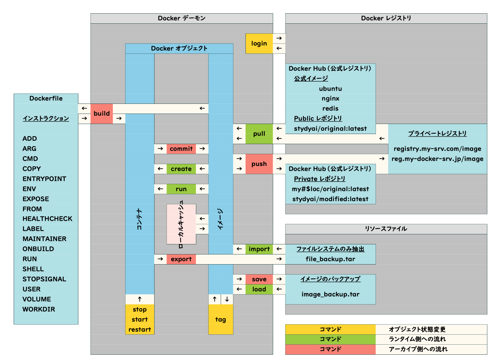
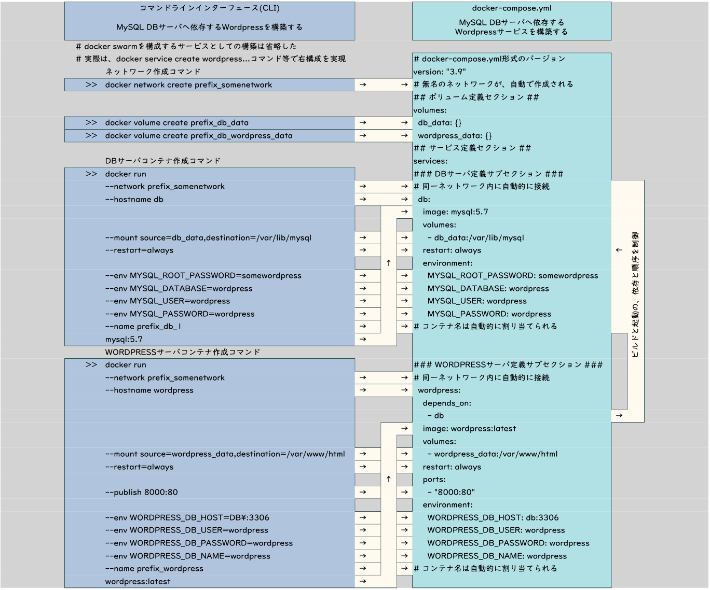

21 Docker
=========
# コンテナ技術の利用価値
- 運用コスト、構築コスト、維持コストを抑えられる。
  - 細かくは、各コストは、ハードウェアインフラ・開発環境・開発サイクル・サービスのデプロイメント・サービスの運用によって変化する。
- 仮想マシンに比べ基本的に軽量

# コンテナ型の仮想化
- サービスやOSの容易な移動が可能になるため、効率化が実現できる。
- VMにはOSを仮想化する完全VMとCPUを仮想化するプロセスVMがあるが、コンテナはそのどちらでもない。（つまりVMではない。）
- コンテナ型仮想化はOS上でアプリケーションを仮想化するもの。
- VM vs コンテナ
  - VMのメリット
    - 起動速度は数分
    - ハードウェアを効率的に利用
    - 高い計算力
      - 高負荷・高効率サービス向き
  - コンテナのメリット
    - 起動、再起動速度は数秒
    - 可搬性が高い
    - 早い運用サイクルが可能
      - マイクロサービス、DevOps向き
# Dockerの仮想化
- コンテナはOSのインスタンス数を増やさないので、顕著に軽量
- 多くのWebアプリケーションがコンテナを利用したマイクロサービスの手法へと移りつつある。
- Dockerにおける仮想化の注意点
  - カーネルの共有におけるトレードオフ
    - コンテナOSが非LinuxOSの場合、カーネルバージョンの互換性の配慮が必要な場合がある。
    - またホストOSとカーネルが共有されるので、ホストOSと共有しているカーネル部分の攻撃に対するセキュリティ対策をこうじている必要がある。
      - 論理的隔離の度合いがVMより低い。
# Dockerによる具体的なオペレーション
- オブジェクト操作の流れ

- ネットワークおよびファイルシステムの共有

- docker composeの書き方
