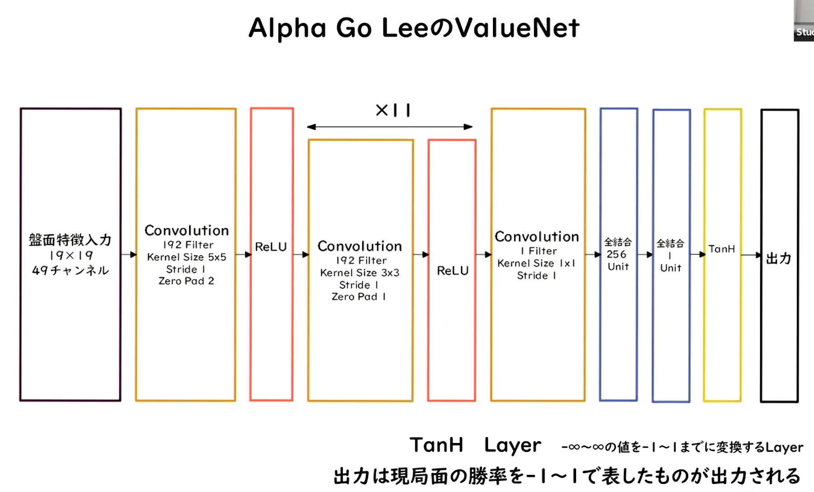
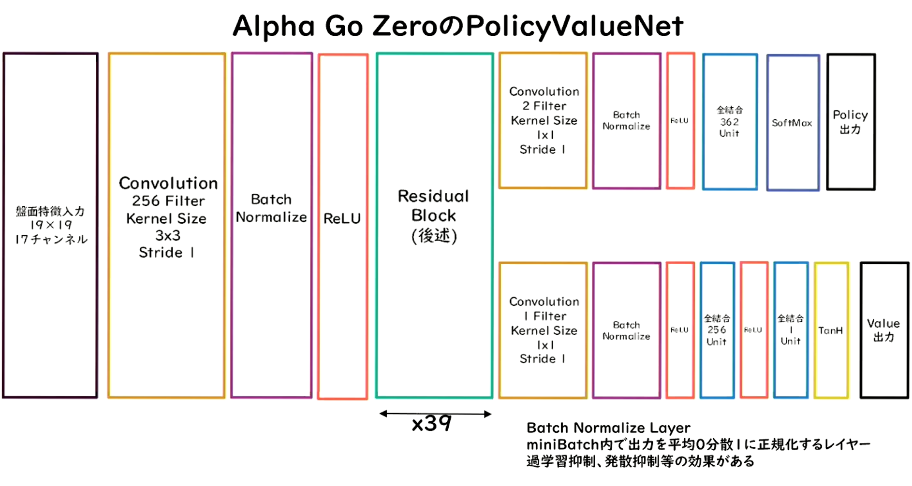

2 Alpha GO
==========

# Alpha GO

- ２種類のAlpha GO
  - Alpha Go Lee
  - Alpha Go zero

# Alpha Go lee

- Value NetとPolicy Netという２つのNNを使う。
- Policy Netは方策関数に相当。

- Value Netは価値関数に相当。

- データは双方とも碁盤のマスの合計にあたる19 X 19のデータで、チャネルはそれぞれのんでともに４８チャンネル存在する。

# Alpha GO Leeの学習ステップ

1. 教師あり学習によるRollOutPolicyとPolicyNetの学習
   - RollOutPolicyは扇形の方策関数。
   - PolicyNetの千倍高速で学習を進めることができるため、探索中に高速に着手確率を出すために使用される。
   - PolicyNetの学習はKGS Go Serverの棋譜データから3000万局分の寄付データを用意し、教師と同じ手をさせるように学習を行う。57%の精度になる。
   - RollOutPolicyにも同様のことを行う。RollOutPolicyの精度は24%程度。
   - この学習で作成したPolicy Netは57%ほどの精度。
   - 作成したRollOutPolicyはモンテカルロ木探索で利用する。
2. 強化学習によるPolicyNetの学習
   - 現状のPolicyNetとPolicyPoolからランダムに選択されたPolicyNetと対局シミュレーションを行い、その結果を用いて方策勾配法で学習を行なう。
     - PolicyPoolは、PolicyNetの強化学習の過程を500Iterationごとに記録し保存しておいたものである。
     - 現状のPolicyNet同士ではなく、PolicyPoolに保存されているものとの対局を使用する理由は、対局に幅を持たせて過学習を防ぐため。
   - 学習はmini batch size 128で１万回行う。
3. 強化学習によるValueNetの学習
   - PolicyNetを使用して対局シミュレーションを行い、その結果の勝敗を教師として学習する。
   - 教師データ作成の手順は以下。
     1. SL PolicyNet(教師あり学習で作成したPolicyNet)でN手まで打つ。
     2. N＋１手目の手をランダムに選択し、その手で進めた局面をS(N + 1)とする。
     3. S(N+1)からRL Policy Net（強化学習で作成したPolicyNet）で終局まで打ち、その勝敗候補をRとする。
   - S(N+1)とRが教師データ対とし、損失関数を平均二乗誤差とし、回帰問題として学習する。
     - mini batch size 32で5000万回実施。
   - N手までとN+1手からのPolicy Netを別々にしてある理由は、過学習を防ぐためであると論文では説明されている。

# Alpha Go Zero

- Alpha Go ZeroはAlpha Go Leeと以下の違いがある。
  1. 教師あり学習を一切行わず、強化学習のみで作成。
  2. 特徴量入力からヒューリスティックな要素を排除し石の配置のみ行うこととした。
  3. PolicyNetとValueNetを１つのネットワークに統合

  4. ResidualNetを導入
     - ネットワークにしショートカット構造を追加して、勾配の爆発、消失を抑える効果を狙ったもの
     - Residual Networkを使うことにより100層を超えるネットワークでの安定した学習が可能となった。
     - また（実証されているのか不明だが）、Residual Networkを使うことにより、総数の違うネットワークでのアンサンブル効果が生まれているという説もある。
     - Residual Networkの工夫として論文内で紹介されているものは以下。
       - Residual Blockの工夫
         - Bottleneck
         - PreActivation
       - Network構造の工夫
         - WideResNet
         - PyramidNet

  5. モンテカルロ木探索からRollOutSimulationをなくした。

- 深層学習のNNで重要な基本ポイントは大体以下の４つ
  - 畳み込み
  - プーリング
  - RNN
  - アテンション
- とその基本となる活性化関数
