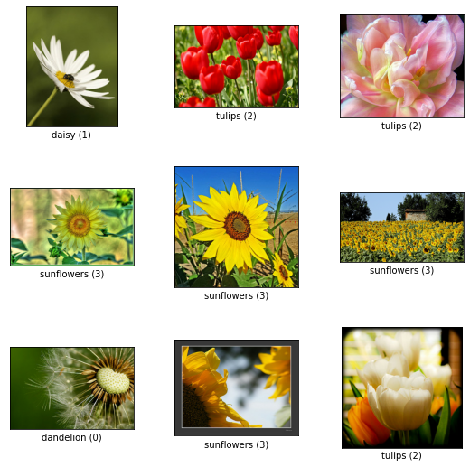
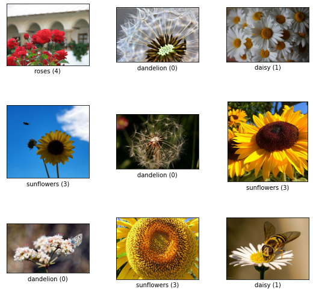
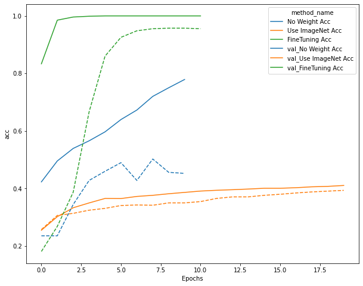
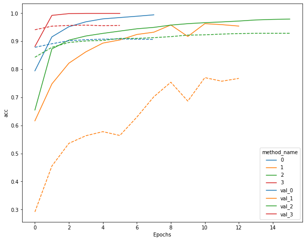

<script type="text/x-mathjax-config">MathJax.Hub.Config({tex2jax:{inlineMath:[['\$','\$'],['\\(','\\)']],processEscapes:true},CommonHTML: {matchFontHeight:false}});</script>
<script type="text/javascript" async src="https://cdnjs.cloudflare.com/ajax/libs/mathjax/2.7.1/MathJax.js?config=TeX-MML-AM_CHTML"></script>

5 ResNet
==========
# 画像識別モデルの実利用
- 転移学習などを紹介する。
- ImageNetは事前学習によく使われる。
- モデルとしてはRESNETを事前学習で使用。
## Resnet
- RESNET50, RESNET101, RESNET152などパラメータの数が違うモデルが複数あるが、RESNET50をメインに説明。
- RESNETは中間層にSKIP CONNECTIONを用いることで、勾配消失や勾配爆発を防いでいる。
- SKIP CONNECTIONのBOTTLENECKアーキテクチャ
  - 層をPLAINアーキテクチャより１つ増やすことができる。
## WideResnet
- Resnetよりも層を浅くしつつも良い精度が出るように工夫したもの。（層を広くした。）
- フィルタ数をK倍にすることで、畳込チャネル数の増加、高速・高精度の学習が可能に、GPUの特性に合った動作を行える。
- RESIDUALブロックにドロップアウトを導入している。

## ハンズオン
- 前処理
  - 画像のクロッピングと正規化
- 事前学習利用しない場合と利用する場合の比較
- 事前学習をするとして、ファインチューニング有無を比較する。（ファインチューニングなしは全結合層のみ比較する）
- tensorflow提供の花のデータを利用


```python
tf_flowers = tfds.image_classification.TFFlowers()
tf_flowers.download_and_prepare()
(train_ds, test_ds) = tf_flowers.as_dataset(as_supervised=True, split=['train[:70%]', 'train[70%:]'], shuffle_files=True)
fig = tfds.show_examples(train_ds, tf_flowers.info)
```



- 検証用データ

```python
fig = tfds.show_examples(test_ds, tf_flowers.info)
```



- クラスの数

```python
class_num = tf_flowers.info.features['label'].num_classes
class_num
```
> 5

- データを利用できる形に変更

```python
IMAGE_RES = 224

def format_image(image, label):
    image = tf.image.resize(image, (IMAGE_RES, IMAGE_RES)) / 255.0
    label = tf.one_hot(label, depth=class_num)

    return image, label

BATCH_SIZE = 16

train_batches = train_ds.map(format_image).batch(BATCH_SIZE).prefetch(1)
test_batches = test_ds.map(format_image).batch(BATCH_SIZE).prefetch(1)

print(train_batches)
print(test_batches)
```

1. 事前学習なしの場合

```python
resnet = tf.keras.applications.resnet.ResNet50(weights=None)
resnet.trainable = True
x1 = resnet.layers[-2].output # avg_poolまでのoutputを取得します。
out = tf.keras.layers.Dense(class_num, activation='softmax')(x1) # avg_poolから出力層に繋げます。
model = tf.keras.models.Model(inputs=resnet.input, outputs=out)

model.compile(optimizer=tf.keras.optimizers.Adam(learning_rate=0.0001), loss='categorical_crossentropy', metrics=['acc'])
model.summary()

histories = []

EPOCHS = 20

history = model.fit(train_batches,
                    epochs=EPOCHS,
                    batch_size=BATCH_SIZE,
                    validation_data=test_batches,
                    callbacks=[
                               tf.keras.callbacks.EarlyStopping(monitor='val_acc', patience=2, mode='max')
                    ])
histories.append(history)
```

- output(20th epochのみ)

> Epoch 20/20
> 161/161 [==============================] - 12s 76ms/step - loss: 1.4393 - acc: 0.4103 - val_loss: 1.4514 - val_acc: 0.3933

2. ImageNetによる事前学習を利用する場合（ファインチューニング）

```python
resnet = tf.keras.applications.resnet.ResNet50(weights='imagenet')
resnet.trainable = True
x1 = resnet.layers[-2].output
out = tf.keras.layers.Dense(class_num, activation='softmax')(x1)
model = tf.keras.models.Model(inputs=resnet.input, outputs=out)

model.compile(optimizer=tf.keras.optimizers.Adam(learning_rate=0.0001), loss='categorical_crossentropy', metrics=['acc'])
model.summary()


history = model.fit(train_batches,
                    epochs=EPOCHS,
                    batch_size=BATCH_SIZE,
                    validation_data=test_batches,
                    callbacks=[
                               tf.keras.callbacks.EarlyStopping(monitor='val_acc', patience=2, mode='max')
                    ])
histories.append(history)
```

- 結果(11epoch目で学習しきったためこれが最後。)
> Epoch 11/20
> 161/161 [==============================] - 33s 205ms/step - loss: 1.4347e-04 - acc: 1.0000 - val_loss: 0.1632 - val_acc: 0.9555

- それぞれの学習曲線を確認する。

```python
import pandas as pd
import seaborn as sns
import matplotlib.pyplot as plt

fig = plt.figure(figsize=(10, 8))
method_names = [
                'No Weight Acc',
                'Use ImageNet Acc',
                'FineTuning Acc'
]

plot_df = pd.DataFrame()

for i, history in enumerate(histories):
    method_name = str(method_names[i])
    history_df = pd.DataFrame(history.history)
    history_df['method_name'] = method_name
    history_df['Epochs'] = history_df.index
    plot_df = pd.concat([plot_df, history_df], ignore_index= True)
    
sns.lineplot(data=plot_df, x=plot_df['Epochs'], y='acc', hue='method_name')
val_plot_df = plot_df
val_plot_df['method_name'] = plot_df['method_name'].apply(lambda x: 'val_' + x)
sns.lineplot(data=val_plot_df, x=plot_df['Epochs'], y='val_acc', hue='method_name', linestyle='dashed')
```

- 下記を見ると、事前学習、ファインチューニングありの場合の方が事前学習なしの場合よりも学習が早く進んでおり、学習ののびも良いことがわかる。



3. 転移学習 (Weightを再利用、事前学習部分のWeightは固定)

```python
model = tf.keras.Sequential([
    tf.keras.layers.InputLayer(input_shape=(224, 224, 3)),
    hub.KerasLayer("https://tfhub.dev/google/imagenet/resnet_v1_50/feature_vector/5", trainable=False),
    tf.keras.layers.Dense(class_num, activation='softmax')
])
model.compile(optimizer=tf.keras.optimizers.Adam(), loss='categorical_crossentropy', metrics=['acc'])
model.summary()

history = model.fit(
    train_batches,
    epochs=EPOCHS,
    batch_size=BATCH_SIZE,
    validation_data=test_batches,
    callbacks=[
        tf.keras.callbacks.EarlyStopping(monitor='val_acc', patience=2, mode='max')
    ]
)
histories.append(history)

```

- 結果（ラストのみ）
> 161/161 [==============================] - 9s 58ms/step - loss: 0.0555 - acc: 0.9942 - val_loss: 0.2716 - val_acc: 0.9064

4. ファインチューニング (事前学習部分のWeightも再調整)
- ResNetにおけるファインチューニングの注意点としては、BatchNorm層の存在がある。
- ファインチューニングで重みを再調整する場合でも、BatchNorm層に存在する平均や分散の値は更新しない。そのため、どういう場合でも`Non-trainable params`が存在する。


```python
model = tf.keras.Sequential([
    tf.keras.layers.InputLayer(input_shape=(224, 224, 3)),
    hub.KerasLayer("https://tfhub.dev/google/imagenet/resnet_v1_50/feature_vector/5", trainable=True),
    tf.keras.layers.Dense(class_num, activation='softmax')
])
model.compile(optimizer=tf.keras.optimizers.Adam(), loss='categorical_crossentropy', metrics=['acc'])
model.summary()

history = model.fit(
    train_batches,
    epochs=EPOCHS,
    batch_size=BATCH_SIZE,
    validation_data=test_batches,
    callbacks=[
        tf.keras.callbacks.EarlyStopping(monitor='val_acc', patience=2, mode='max')
    ]
)
histories.append(history)
```

- 結果（ラストのみ）
> 161/161 [==============================] - 30s 187ms/step - loss: 0.5846 - acc: 0.9541 - val_loss: 1.2773 - val_acc: 0.7675

- 次の5と6ではWideResNetの構造を用いる。
5. 転移学習 WideResNet

```python
model = tf.keras.Sequential([
    tf.keras.layers.InputLayer(input_shape=(224, 224, 3)),
    hub.KerasLayer("https://tfhub.dev/google/bit/s-r50x3/1", trainable=False),
    tf.keras.layers.Dense(class_num, activation='softmax')
])
model.compile(optimizer=tf.keras.optimizers.Adam(learning_rate=0.0001), loss='categorical_crossentropy', metrics=['acc'])
model.summary()

history = model.fit(
    train_batches,
    epochs=EPOCHS,
    batch_size=BATCH_SIZE,
    validation_data=test_batches,
    callbacks=[
        tf.keras.callbacks.EarlyStopping(monitor='val_acc', patience=2, mode='max')
    ]
)
histories.append(history)
```

- 結果（ラストのみ）
> Epoch 16/20
> 161/161 [==============================] - 119s 743ms/step - loss: 0.0981 - acc: 0.9790 - val_loss: 0.2056 - val_acc: 0.9282

6. ファインチューニング WideResNet

```python
model = tf.keras.Sequential([
    tf.keras.layers.InputLayer(input_shape=(224, 224, 3)),
    hub.KerasLayer("https://tfhub.dev/google/bit/s-r50x3/1", trainable=True),
    tf.keras.layers.Dense(class_num, activation='softmax')
])
model.compile(optimizer=tf.keras.optimizers.Adam(learning_rate=0.00001), loss='categorical_crossentropy', metrics=['acc']) # learning_rateを調整しています。
model.summary()

history = model.fit(
    train_batches,
    epochs=EPOCHS,
    batch_size=BATCH_SIZE,
    validation_data=test_batches,
    callbacks=[
        tf.keras.callbacks.EarlyStopping(monitor='val_acc', patience=2, mode='max')
    ]
)
histories.append(history)
```

- 結果（ラストのみ）
> Epoch 6/20
> 161/161 [==============================] - 297s 2s/step - loss: 0.0017 - acc: 0.9992 - val_loss: 0.1248 - val_acc: 0.9564


- 3〜6の結果を図示する。

```python
import pandas as pd
import seaborn as sns
import matplotlib.pyplot as plt

fig = plt.figure(figsize=(10, 8))
method_names = [
  'ResNet Transfer lerning',
  'ResNet Fine-Tune',
  'ResNetWide Transfer lerning',
  'ResNetWide Fine-Tune',
]

plot_df = pd.DataFrame()

for i, history in enumerate(histories):
    # method_name = str(method_names[i])
    method_name = str(i)
    history_df = pd.DataFrame(history.history)
    history_df['method_name'] = method_name
    history_df['Epochs'] = history_df.index
    plot_df = pd.concat([plot_df, history_df], ignore_index=True)

sns.lineplot(data=plot_df, x=plot_df['Epochs'], y='acc', hue='method_name')
val_plot_df = plot_df
val_plot_df['method_name'] = plot_df['method_name'].apply(lambda x: 'val_' + x)
sns.lineplot(data=val_plot_df, x=plot_df['Epochs'], y='val_acc', hue='method_name', linestyle='dashed')
```

- 項番3〜6が下記0〜3にそれぞれ対応する。
- WideResNet(下記2,3)の方がResNet（下記0,1）よりも良いパフォーマンスをしていることがわかる。
- 同様にファインチューニング（下記1,3）の方がファインチューニングなしの転移学習（下記0,2）よりも今回はパフォーマンスが良かったことがわかる。

