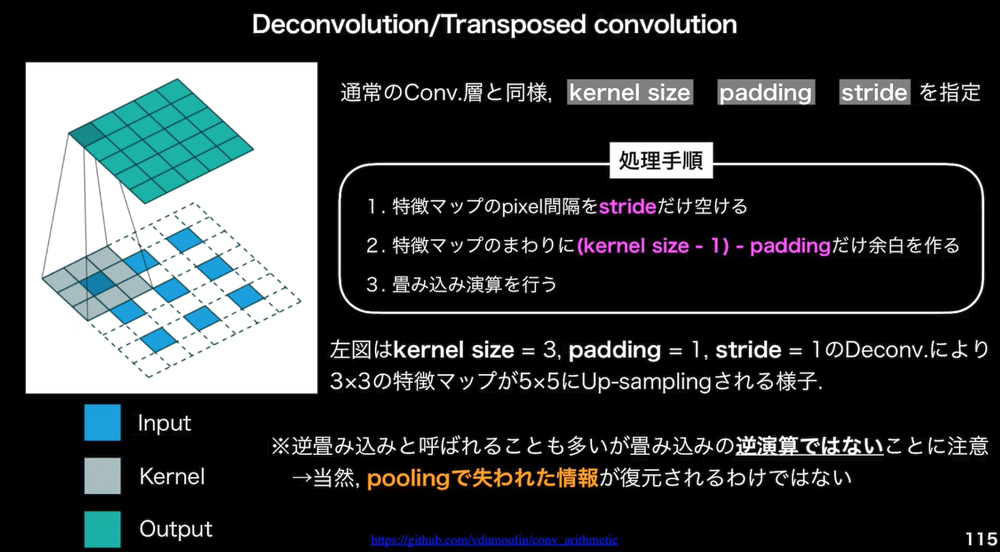
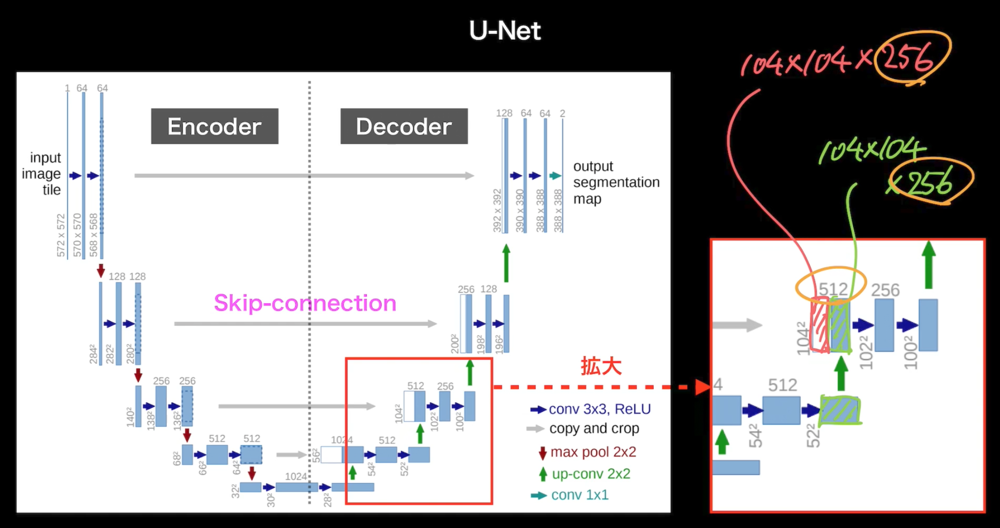
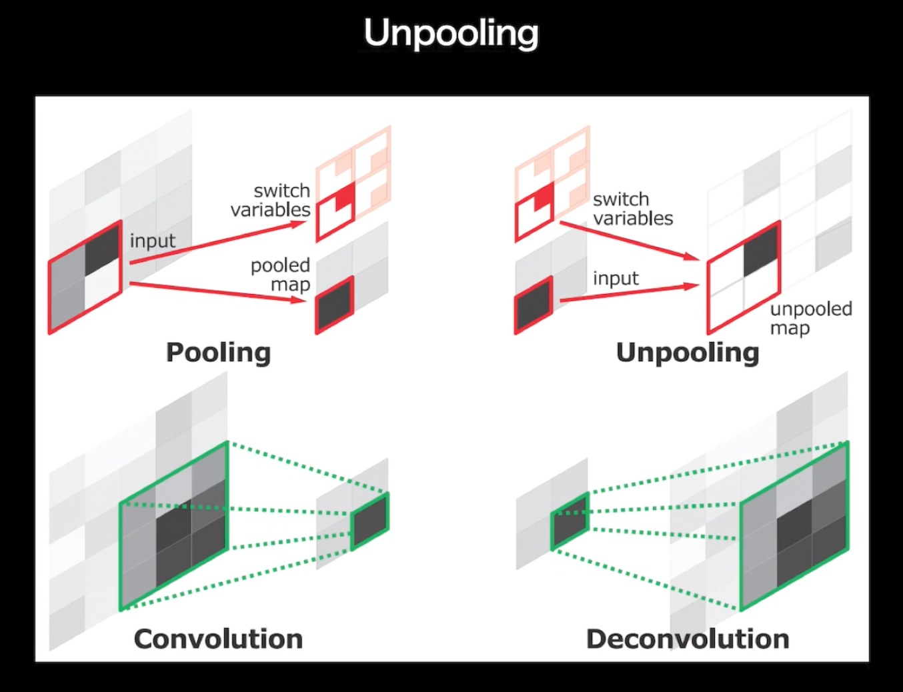
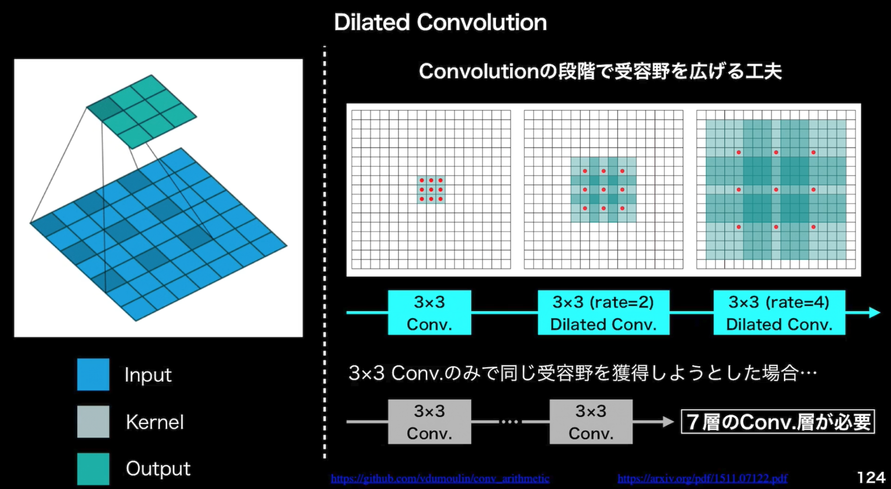

# 物体検知
- 最新手法だけ学んでも半年後、1年後、新しい手法に取って変わられることも多い。アルゴリズムの精度と評価を重点的に話す。
- 画像分類関連のタスク種類
  - 分類
    - 何の画像か
  - 物体検知
    - 画像内の物体・個体の識別
  - セマンティックセグメンテーション
    - 各ピクセルレベルの属性
  - インスタンスセグメンテーション
    - 各ピクセルレベルの属性＋属性内での個体の差異
- 画像分類関連タスクの性能を測るための指標
  - 代表的データセット
    - VOC12
      - PASCAL VOC Object Detection Challangeで使用されていたデータセット。主要貢献者が2012年に亡くなったため、コンペもそこで終了。
      - VOCはVisual Object Classesの意味
      - INSTANCE ANNOTATION（物体個々にラベリングが与えられている。）
      - クラス
        - 20
      - Train + Val
        - 11540
      - ???
        - 2.4
      - サイズ
        - 470 X 380
    - ILSVRC17
      - ILSVRC Object Detection Challangeで使用されていたデータセット
      - ILSVRCはImageNet Large Scale Visual Recognition Challangeの略
      - ImageNetのサブクラス
      - コンペは2017年に終了し、後継として、Open Images Challangeが誕生。（ある程度の精度が出てしまったため。）
      - クラス
        - 200
      - Train + Val
        - 476668
      - ???
        - 1.1
      - サイズ
        - 500 X 400

    - MS COCO18
      - MS COCO Object Detection Challangeで使用されたデータセット
      - 物体位置推定に対する新たな指標を提案している。
      - INSTANCE ANNOTATION（物体個々にラベリングが与えられている。）
      - クラス
        - 80
      - Train + Val
        - 123287
      - ???
        - 7.3
      - サイズ
        - 640 X 480
    - OICOD18
      - INSTANCE ANNOTATION（物体個々にラベリングが与えられている） 
      - Open Image Challange Object Detectionで使用されたデータセット
      - ILSVRCやMS COCOとは異なるアノテーションプロセス
      - Open Image V4（6000クラス以上/900万枚以上）のサブセット
      - クラス
        - 500
      - Train + Val
        - 1743042
      - ???
        - 7.0
      - サイズ
        -  バラバラ
- ???は画像あたりのBBoxの数（一枚当たりの物体数）
  - 数が大きいというのはいろんな物体が写真に入っているので、アイコン的な写りではなく、日常生活の風景に近いと考えられる。
- 用途に応じてBox /画像の選択をするのが望ましい。
- クラス数が多いことは良いことか？
  - ImageNetなどで無意味なクラス分けをしている場合もある。

# 分類問題における精度評価指標
混同行列の理解
 - True Positive
 - False Negative
 - False Positive
 - True Negative
 - Precision = TP / (TP + FP)
 - Recall = TP / (TP + FN)
 - Confidenceの閾値を変化させることでPrecision-Recall Curveが描ける
   - 閾値（threshold）を変化させたときのPR Curveを見て、どのように閾値を置くのが正しいいのか検討することができる。
 - 物体検出におけるconfidence matrixに関する注意点
   - 画像分類含むクラス分類では、閾値を変化させても、混同行列内の総数は変化しない。
   - 一方で物体検出では、混同行列内の総数が閾値を上げると減っていく。
     - 上記の点を理解して、閾値を設定する必要あり
 - IoU
   - 近藤行列によるラベルの精度とは別に物体検出においてはラベルの位置も重要
     - その指標として使われているのがIoU(Area of Overlap / Area of Union)
     - IoUを物体の位置に関する混同行列で表すと、IoU = TP/(TP+FP+FN)。Jaccord係数ともいう。
 - ラベルのコンフィデンスおよびIoUにおいてそれぞれ閾値を設定する必要がある。
 - AP
   - 定義は以下(意味はPR曲線の下側面積)
   > \\\(\displaystyle AP=\int_0^1 P(R)dR\\\)
 - mAP（ラベルごとに計算されるAPの平均がmAP）
   >\\\(\displaystyle mAP = \frac{1}{C} \sum_{i=1}^c {AP}_i\\\)
 - \\\(mAP_{COCO}\\\)
   - IoU閾値をここまでは0.5で固定していたものを0.5から0.95まで0.05刻みでAP&mAPを計算し、算術平均を撮ったもの
   > \\\(\displaystyle mAP_{COCO} = \frac{mAP_{0.5} + mAP_{0.55} + \cdots + mAP_{0.95} }{10}\\\)

# 検出速度の指標
- FPS(Flames Per Second)
- 使用するデータも重要

# 物体検出のフレームワーク
- 2段階検出器
  - 候補領域と検出とクラス推定を別々に行う。
  - 相対的に精度が高い
  - 相対的に計算量が多い推論も遅い傾向
- 1段階検出器
  - 候補領域と検出とクラス推定を同時に行う。
  - 相対的に精度が低い
  - 相対的に計算量が少なく推論も速い傾向
# YOLO
- RCNN系以外の物体検知手法として、YOLO系統やSSD系統がある。
  - これらはRCNN系統と違い、1段階検出器である。
- YOLOの手法は以下のようになる
 1. 入力画像をグリッドに分割
 2. A. バウンディングボックスで候補領域を抽出すると同時に、物体なのか背景なのかを表す信頼度スコアを抽出。
 3. B.各グリッドでクラス分類を行う。
 4. AとBの情報を組み合わせて物体認識を行う。
- YOLOのメリット
  - 処理が相対的に早い。（一段階検出器）
  - 画像全体を見て予測することができるのでFast RCNNの半分以下の誤検出。(物体と背景を間違えにくい。)
- Grid cell
  - 入力画像をS ×　S のGridsに分割
  - 候補領域の提案：各Grid において，そのGridの真ん中を中心とするB個のBounding Boxを生成
  - クラス分類：各Grid ごとに，含む物体のクラスを分類
- 何が出力されるか
  - 各Gridにおける各バウンディングボックスの中心，高さ，横(x, y, w, h)，信頼度スコアの５つと各クラスに対応する特徴マップを同時に出力
    - →S = 7，B = 2，クラス数= 20の例
      - →7 × 7 × ( 2 × 5 + 20) = 7 × 7 × 30
# SSD
- SSDは一段階検出器
- SSDの元ネットワークはVGG16
  - 16というのはConvolution層とFully Connected層の合計であり、max poolingやsoftmaxは含んでいないことに注意。
  - max poolingを通して、サイズやチャネル数を変化させていることがわかる。
- SSDのネットワーク構造のVGG16からの変更点
（画像）
- ネットワーク内の画像のサイズは、実際のサイズではなく、解像度を変えている点に注意。解像度を徐々に下げることで小さい物体の検知→大きい物体の検知を実現している。
- BBoxに関する工夫
  - Non Maximum Supression
  - Hard Negative Mining
- 損失関数について
- SSDの進化について

# FCOS
- Fully Convolutional One-Stage Object Detection
- その他の検出器が持つアンカーボックスの下記の課題に対応するため、アンカーボックスフリーの手法を提案している。
  - アンカーボックスの数・大きさ・比はハイパーパラメータであり、その設定で精度が4%程度左右されるという実験結果もある。
  - サイズやアスペクト比が固定化されているため、向きや角度などにより形の変化が大きい物体や小型の動物に対応できない。
- FCOSは全てのピクセルから四次元ベクトルを予測する
  - YOLOv1は中央付近の点のみ
  - FCOSは全てのピクセルから四次元ベクトルを予測する
- FCOSではFPN（Feature Pyramid Networks）を使い、ambiguous sampleの問題を解消している。
  - ambiguous sampleは一つのピクセルが複数の領域を表す場合に起こる現象。（人と持っているテニスラケットを別々に予測したい時など）FPNを利用して、異なる大きさの物体は異なる特徴レベルで予測するようにできる。
- ネットワークの出力
  - クラスラベルの出力
    - H x W x C の大きさのテンソルが出力
      - ピクセルごとに各クラスごとのスコアが出力される
  - 四次元ベクトルの出力
    - 全てのピクセルからの四次元ベクトルを予測する。（H x W x 4）
  - ポジティブサンプルとネガティブサンプルの見分け方
    - 中央の点x, yがラベルのボックスの中に入っていて、なおかつその位置の予測されたクラスとラベルのクラスが一致した場合、ポジティブサンプルとみなす
- Centernessの損失関数への採用
  - どのくらいx,yの座標が物体の中央から離れているかを正規化して表している
- 後処理（Non-Maximum-Suppression）
  - 一番スコアが高いバウンディングボックスをまず出力とする。
  - 次に、出力としたバウンディングボックスと他のもののIoUを計算する
  - そして、IoUの値が閾値より低かった場合削除する
- 損失関数
  > \\\(\displaystyle L(\lbrace p_{x,y} \rbrace ,\lbrace t_{x,y} \rbrace) + \frac{1}{N_{pos}}\sum_{x,y} L_{xls} (p_{x,y}, c_{x,y}^*) + \frac{\lambda}{N_{pos}}\sum_{x,y} \mathbb{1}_{c_{x,y}^* > 0} L_{reg} (t_{x,y}, t_{x,y}^*)\\\)
  - clsはfocal loss
  - regはIOU loss
  - posはポジティブサンプル
- まとめ
  - FCOSの手法は、アンカーベースの手法のデメリットを回避し、アンカーベースに匹敵もしくは超える精度を出している

# Semantic Segmentationの概略
- Upsamplingを以下に実施していくかが重要なポイントだった。
  - なぜUpsamplingが重要か
    - 受容野を広げるため
      - 需要やを広げる手段
        - ①深いConvolution層
        - ②プーリング（ストライド）
          - ①は多層化に伴う演算量やメモリの問題が常に発生するため、②が採用されることも多い。
- Upsamplingの手法 
  - Deconvolution/Transposed Convolution

  - U-Net

  - Unpooling

- Upsampling以外で受容野を広げる方法
  - Dilated Convolution
