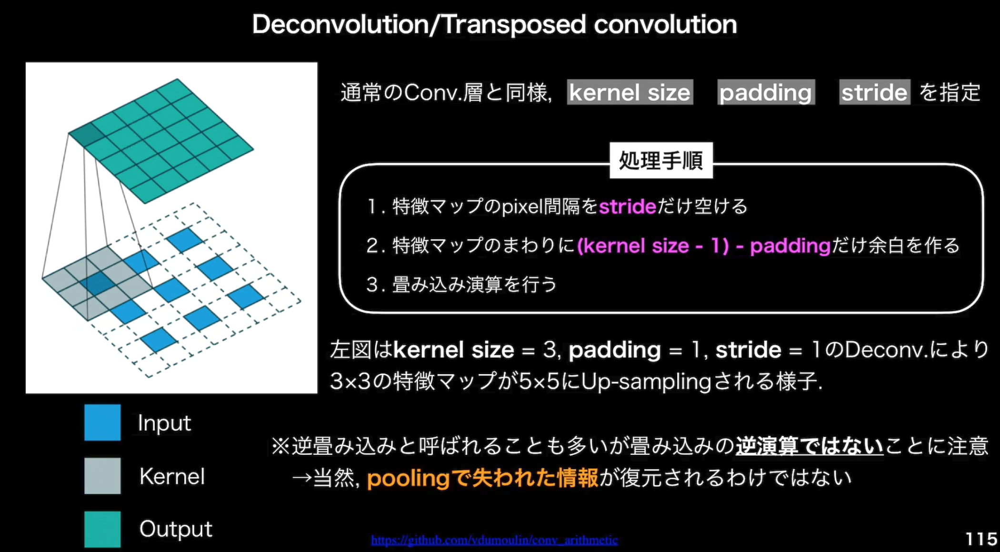
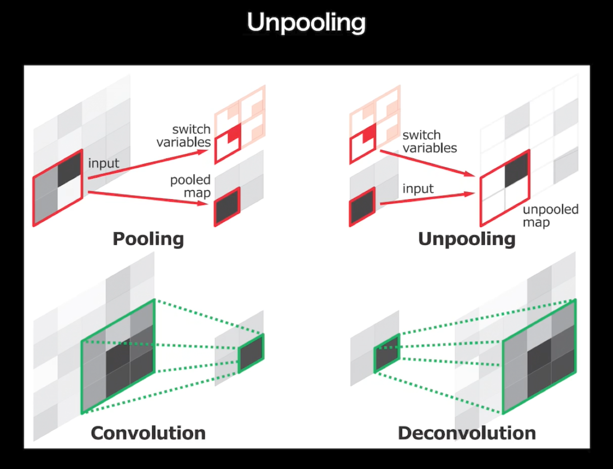
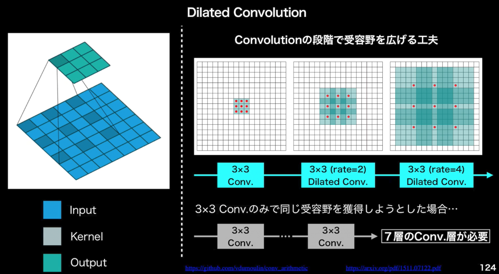
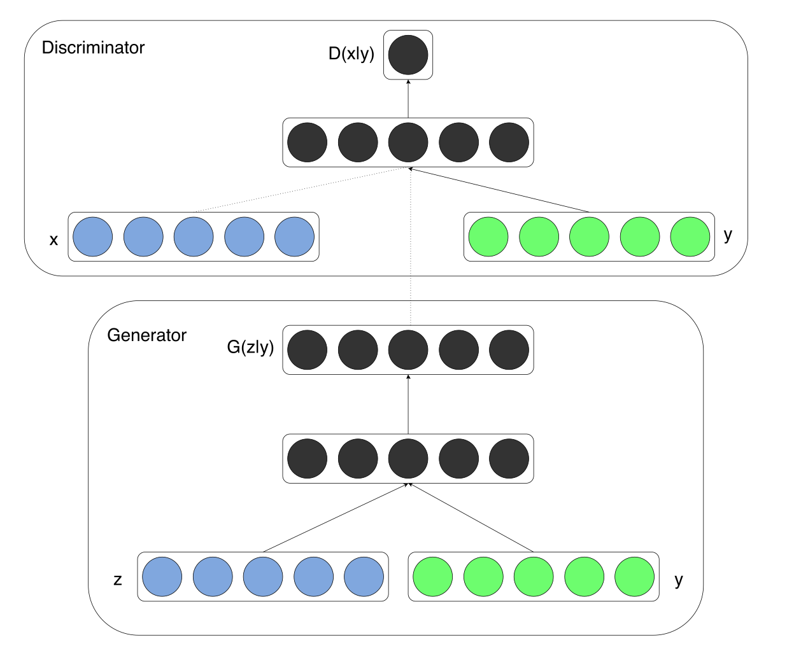
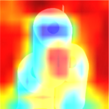

<script type="text/x-mathjax-config">MathJax.Hub.Config({tex2jax:{inlineMath:[['\$','\$'],['\\(','\\)']],processEscapes:true},CommonHTML: {matchFontHeight:false}});</script>
<script type="text/javascript" async src="https://cdnjs.cloudflare.com/ajax/libs/mathjax/2.7.1/MathJax.js?config=TeX-MML-AM_CHTML"></script>

### Rabbit Challange
### 深層学習Day4
### studyai0029063
### 松尾総一郎

1 強化学習
==========

# 強化学習とは
- 強化学習の応用例
  - キャンペーンの案内
    - コストを小さくしつつ、売り上げを最大化する。
    - 不完全な知識を元にしながらも行動してトライアル＆エラーして最適な行動を見つけていく
    - 強化学習は方策価値関数と行動価値関数を両方学習する。
      - 現在人間が実施している作業である、法則やルールを発見していく作業ができる。

- 強化学習と教師あり学習の違い。
  - 強化学習は方策（ルール）を見つける動き
  - 深層学習は特徴量を見つける動き

- 強化学習のアイデアは昔からあったが、コンピュータの計算速度が向上したことで実現可能になってきた。
  - Q学習と関数近似法を組み合わせる手法の登場（近年の理論的に重要）。
    - Q学習
      - 行動価値関数を使う学習の方法
    - 関数近似法
      - ルールベースを一部使っていた部分を関数に置き換えた物（つまりニューラルネットワーク）にした。


# 価値関数
- 状態価値関数と行動価値関数
  - 状態価値観数
    - 環境の状態が良ければ価値が上がる。エージェントの行動は関係ない。
  - 行動価値関数
    - 環境を元にして、エージェントの行動を元にして価値を出す。
- アルファ碁などでは行動価値関数が使われている。
# 方策関数
- ある状態でどのような行動をとるのか（その確率を）決める関数
  - \(π(s)=a\)

関数の関係
- \(π(s,a) \cdots\) VやQを元にどのように行動するか。
  - その瞬間その瞬間の行動を決定する関数
- \(V(s) \cdots\) 状態関数
- \(Q(s,a) \cdots\)状態 + 行動関数
  - ゴールまで今の方策を続けた時の報酬の予測値が得られる
    - やり続けたら最終的にどうなるか

- 強化学習は価値関数と方策関数の２つが優秀ならうまくいく
  - 将来のことを考えながら、今の行動を選べる人


# 方策反復法
- 方策をモデル化(NN化)して学習する方法
  - 方策勾配法\(π(s,a|θ）\)
    - \(θ_{t+1} =θ_t + \theta \nabla_\theta J(θ)\)
      - \(\pi \)を学習するための式。学習を進めたいので、プラスが使われている。
    - 平均報酬と割引報酬和の定義に対応して、行動価値関数Qの定義を行い、以下のような方策勾配定理が成り立つ。
    - \(\displaystyle \begin{aligned} \nabla_\theta J(θ) &=\nabla_\theta \sum_{a \in A} \pi_\theta (a|s) Q_\pi(s,a) \cr &= E_{\pi_\theta}\left[\nabla_\theta log \pi_\theta (a|s) Q_\pi(s,a) \right] \end{aligned}\)
    - J(θ)はNNでは誤差関数だったが、ここでは機体収益を表す（NNでは誤差を小さく、ここでは機体収益を大きくしないといけない）
J 方策の良さ
θ 方策関数のパラメータ


# 実装
- cartpoleをQ学習で実装したものをサンプルとして以下に記載。
- 倒立振子問題ともいう。
  - カートの位置、カート速度、棒の角度、棒の角速度の４変数で振り子の状態を表し、行動としてはカードを右に押す、左に押すという動作を実施して振り子を立ち続けるようにすることを目指します。
  
```python
# coding:utf-8
# [0]ライブラリのインポート
import gym  #倒立振子(cartpole)の実行環境
from gym import wrappers  #gymの画像保存
import numpy as np
import time


# [1]Q関数を離散化して定義する関数　------------
# 観測した状態を離散値にデジタル変換する
def bins(clip_min, clip_max, num):
    return np.linspace(clip_min, clip_max, num + 1)[1:-1]

# 各値を離散値に変換
def digitize_state(observation):
    cart_pos, cart_v, pole_angle, pole_v = observation
    digitized = [
        np.digitize(cart_pos, bins=bins(-2.4, 2.4, num_dizitized)),
        np.digitize(cart_v, bins=bins(-3.0, 3.0, num_dizitized)),
        np.digitize(pole_angle, bins=bins(-0.5, 0.5, num_dizitized)),
        np.digitize(pole_v, bins=bins(-2.0, 2.0, num_dizitized))
    ]
    return sum([x * (num_dizitized**i) for i, x in enumerate(digitized)])


# [2]行動a(t)を求める関数 -------------------------------------
def get_action(next_state, episode):
           #徐々に最適行動のみをとる、ε-greedy法
    epsilon = 0.5 * (1 / (episode + 1))
    if epsilon <= np.random.uniform(0, 1):
        next_action = np.argmax(q_table[next_state])
    else:
        next_action = np.random.choice([0, 1])
    return next_action


# [3]Qテーブルを更新する関数 -------------------------------------
def update_Qtable(q_table, state, action, reward, next_state):
    gamma = 0.99
    alpha = 0.5
    next_Max_Q=max(q_table[next_state][0],q_table[next_state][1] )
    q_table[state, action] = (1 - alpha) * q_table[state, action] +\
            alpha * (reward + gamma * next_Max_Q)

    return q_table

# [4]. メイン関数開始 パラメータ設定--------------------------------------------------------
env = gym.make('CartPole-v0')
max_number_of_steps = 200  #1試行のstep数
num_consecutive_iterations = 100  #学習完了評価に使用する平均試行回数
num_episodes = 2000  #総試行回数
goal_average_reward = 195  #この報酬を超えると学習終了（中心への制御なし）
# 状態を6分割^（4変数）にデジタル変換してQ関数（表）を作成
num_dizitized = 6  #分割数
q_table = np.random.uniform(
    low=-1, high=1, size=(num_dizitized**4, env.action_space.n))

total_reward_vec = np.zeros(num_consecutive_iterations)  #各試行の報酬を格納
final_x = np.zeros((num_episodes, 1))  #学習後、各試行のt=200でのｘの位置を格納
islearned = 0  #学習が終わったフラグ
isrender = 0  #描画フラグ


# [5] メインルーチン--------------------------------------------------
for episode in range(num_episodes):  #試行数分繰り返す
    # 環境の初期化
    observation = env.reset()
    state = digitize_state(observation)
    action = np.argmax(q_table[state])
    episode_reward = 0

    for t in range(max_number_of_steps):  #1試行のループ
        if islearned == 1:  #学習終了したらcartPoleを描画する
            env.render()
            time.sleep(0.1)
            print (observation[0])  #カートのx位置を出力

        # 行動a_tの実行により、s_{t+1}, r_{t}などを計算する
        observation, reward, done, info = env.step(action)

        # 報酬を設定し与える
        if done:
            if t < 195:
                reward = -200  #こけたら罰則
            else:
                reward = 1  #立ったまま終了時は罰則はなし
        else:
            reward = 1  #各ステップで立ってたら報酬追加

        episode_reward += reward  #報酬を追加

        # 離散状態s_{t+1}を求め、Q関数を更新する
        next_state = digitize_state(observation)  #t+1での観測状態を、離散値に変換
        q_table = update_Qtable(q_table, state, action, reward, next_state)

        #  次の行動a_{t+1}を求める 
        action = get_action(next_state, episode)    # a_{t+1} 

        state = next_state

        #終了時の処理
        if done:
            print('%d Episode finished after %f time steps / mean %f' %
                  (episode, t + 1, total_reward_vec.mean()))
            total_reward_vec = np.hstack((total_reward_vec[1:],
                                          episode_reward))  #報酬を記録
            if islearned == 1:  #学習終わってたら最終のx座標を格納
                final_x[episode, 0] = observation[0]
            break

    if (total_reward_vec.mean() >=
            goal_average_reward):  # 直近の100エピソードが規定報酬以上であれば成功
        print('Episode %d train agent successfuly!' % episode)
        islearned = 1
        #np.savetxt('learned_Q_table.csv',q_table, delimiter=",") #Qtableの保存する場合
        if isrender == 0:
            #env = wrappers.Monitor(env, './movie/cartpole-experiment-1') #動画保存する場合
            isrender = 1
    #10エピソードだけでどんな挙動になるのか見たかったら、以下のコメントを外す
    #if episode>10:
    #    if isrender == 0:
    #        env = wrappers.Monitor(env, './movie/cartpole-experiment-1') #動画保存する場合
    #        isrender = 1
    #    islearned=1;

if islearned:
    np.savetxt('final_x.csv', final_x, delimiter=",")

```

結果のキャプチャは以下。(実行後に別ウィンドウが開いて動きを確認できる。)


2 Alpha GO
==========

# Alpha GO
- ２種類のAlpha GO
  - Alpha Go Lee
  - Alpha Go zero
# Alpha Go lee
- Value NetとPolicy Netという２つのNNを使う。
- Policy Netは方策関数に相当。

- Value Netは価値関数に相当。

- データは双方とも碁盤のマスの合計にあたる19 X 19のデータで、チャネルはそれぞれのんでともに４８チャンネル存在する。


# Alpha GO Leeの学習ステップ
1. 教師あり学習によるRollOutPolicyとPolicyNetの学習
   - RollOutPolicyは扇形の方策関数。
   - PolicyNetの千倍高速で学習を進めることができるため、探索中に高速に着手確率を出すために使用される。
   - PolicyNetの学習はKGS Go Serverの棋譜データから3000万局分の寄付データを用意し、教師と同じ手をさせるように学習を行う。57%の精度になる。
   - RollOutPolicyにも同様のことを行う。RollOutPolicyの精度は24%程度。
   - この学習で作成したPolicy Netは57%ほどの精度。
   - 作成したRollOutPolicyはモンテカルロ木探索で利用する。
2. 強化学習によるPolicyNetの学習
   - 現状のPolicyNetとPolicyPoolからランダムに選択されたPolicyNetと対局シミュレーションを行い、その結果を用いて方策勾配法で学習を行なう。
     - PolicyPoolは、PolicyNetの強化学習の過程を500Iterationごとに記録し保存しておいたものである。
     - 現状のPolicyNet同士ではなく、PolicyPoolに保存されているものとの対局を使用する理由は、対局に幅を持たせて過学習を防ぐため。
   - 学習はmini batch size 128で１万回行う。
3. 強化学習によるValueNetの学習
   - PolicyNetを使用して対局シミュレーションを行い、その結果の勝敗を教師として学習する。
   - 教師データ作成の手順は以下。
     1. SL PolicyNet(教師あり学習で作成したPolicyNet)でN手まで打つ。
     2. N＋１手目の手をランダムに選択し、その手で進めた局面をS(N + 1)とする。
     3. S(N+1)からRL Policy Net（強化学習で作成したPolicyNet）で終局まで打ち、その勝敗候補をRとする。
   - S(N+1)とRが教師データ対とし、損失関数を平均二乗誤差とし、回帰問題として学習する。
     - mini batch size 32で5000万回実施。
   - N手までとN+1手からのPolicy Netを別々にしてある理由は、過学習を防ぐためであると論文では説明されている。
# Alpha Go Zero
- Alpha Go ZeroはAlpha Go Leeと以下の違いがある。
  1. 教師あり学習を一切行わず、強化学習のみで作成。
  2. 特徴量入力からヒューリスティックな要素を排除し石の配置のみ行うこととした。
  3. PolicyNetとValueNetを１つのネットワークに統合

  4. ResidualNetを導入
     - ネットワークにしショートカット構造を追加して、勾配の爆発、消失を抑える効果を狙ったもの
     - Residual Networkを使うことにより100層を超えるネットワークでの安定した学習が可能となった。
     - また（実証されているのか不明だが）、Residual Networkを使うことにより、総数の違うネットワークでのアンサンブル効果が生まれているという説もある。
     - Residual Networkの工夫として論文内で紹介されているものは以下。
       - Residual Blockの工夫
         - Bottleneck
         - PreActivation
       - Network構造の工夫
         - WideResNet
         - PyramidNet


  5. モンテカルロ木探索からRollOutSimulationをなくした。


- 深層学習のNNで重要な基本ポイントは大体以下の４つ
  - 畳み込み
  - プーリング
  - RNN
  - アテンション
- とその基本となる活性化関数


3 軽量化・高速化技術
==========
# 軽量化・高速化技術
- 分散深層学習
  - 高速な計算が求められる深層学習において、複数の計算資源を利用した並列処理は重要
  - 主に以下の３つ
    - データ並列化
    - モデル並列化
    - GPU
  - マシンの性能によらず処理を進めるためのメモリや計算量の節約
  - 主に以下の３つ
    - 量子化
    - 蒸留
    - プルーニング
## データ並列
- 同期型
  - 別々のデータを使って並列で処理した結果を一回集めて平均を取って、親のモデルの更新を行い、その更新済みモデルを使って学習を各子ノードが再開する。
- 非同期型
  - 終わった順に親のパラメータを更新してその親のパラメータを持ってきて、各ノードは次の学習を即座に開始する。
  - 非同期型は最新のモデルのパラメータを利用できないので学習が不安定になりやすい（Stale Gradient Problem）
- 現在は同期型が主流（精度が非同期型が多いため）
  - ただ分散の方法によっては非同期型にすることもある。（世界中の提供されたパソコンを使って学習させるようなプロジェクトの場合）

## モデル並列
- NNのモデルを縦に区切った理、分岐しているNNの場合は横方向に分割して、各部分について、子ノードに学習させる方法。
- 実際には枝分かれ部分を分割して学習させることが多い。
- モデル並列化は１台のパソコンで複数のGPUに作業を分割させることが多い。
  - 最終的な出力を元にパラメータの更新を行うので、１台のパソコンにまとめた方が効率が良い。
- 当然だが、大きなモデルでないと効果は薄い。
## GPU
- CPU
  - 高性能なコアが少数
  - 性能向上が計算量の需要に追いついていない
- GPU
  - 低性能なコア（計算できる種類が少ないコア）が多数
  - NNと非常に相性が良い。（NNは行列演算、つまり四則演算ができれば良いから）
- GPGPU
  - 元々GPUはゲーム用途などグラフィック処理のために用いられていたが、NNと非常に相性が良いということで用途をより一般的にしたGeneral Purpose GPUというものが出て狂うようになった。
- GPGPU開発環境
  - CUDA
    - NVIDIA社開発GPUのみで使用可能。
    - DeepLearning用に提供されているので使いやすい。DeepLearning用GPGPU環境のデファクトスタンダード
  - OpenCL
    - NVIDIA以外のGPUメーカー（Intel, AMD, ARM）などで使用できる。
    - Deep Learning用としてはほぼ使われない。
  - CUDA利用の際はTensorflowやPyTorchで利用できるような実装がなされているので、、GPUを指定して使用できるようにしておけば意識せず使える。
## 量子化（Quantization）
- 64bit →  32bitなどパラメータの不動小数点精度を下位のものに移す。（省力化）
  - 基本的に16bit（半精度） or 32bit（単精度） or 64bit（倍精度）
  - bit数を少なくすると少数の精度が悪くなる。
  - 計算は当然量子化が少ない単位の方が高速化する。
- 省力化・高速化　←→ 精度　のトレードオフ
- 機械学習は16bitで良い場合は多い。
##　蒸留
- 精度の高い大きなモデルの知見やネットワークから軽量なモデルを作成する。
- 教師モデル（大きいモデル）と生徒モデル（程々の良い性能で軽い）
- 蒸留の性能
- 150層から11層にしてもある程度の性能が出ることがcifar10データを使った実験で出ている。
  - Adriana et all. (2015) - "FITNETS: HINTS FOR THIN DEEP NETS"
## プルーニング
- 役に立たないパラメータを削除する。
  - 大きいNNでも使われないパラメータが出ることがわかっている。
- やり方としては、重みの小さいニューロンを削除し、際学習を行う。
- 割と消せる上に意外と性能が変わらない。
  - 佐々木 et al. 「ニューラルネットワークの全結合層におけるパラメータ削減手法の比較」
    - ５割削除しても元のネットワークの91%、94%削除しても、元のネットワークの90％の精度

# 実装

- pytorchの場合、以下のようにdataloaderの"num_workers"変数をコントロールすることでモデルの並列化を任意に実現できる。

```python
# デフォルト設定のDataLoaderの場合
train_loader_default = torch.utils.data.DataLoader(dataset1,batch_size=mini_batch_size)
test_loader_default = torch.utils.data.DataLoader(dataset2,batch_size=mini_batch_size)

# データローダー：2
train_loader_nworker = torch.utils.data.DataLoader(
    dataset1, batch_size=mini_batch_size, num_workers=2)
test_loader_nworker = torch.utils.data.DataLoader(
    dataset2, batch_size=mini_batch_size, num_workers=2)


# データローダー：フル
train_loader_nworker = torch.utils.data.DataLoader(
    dataset1, batch_size=mini_batch_size, num_workers=os.cpu_count())
test_loader_nworker = torch.utils.data.DataLoader(
    dataset2, batch_size=mini_batch_size, num_workers=os.cpu_count())

```


4 応用技術
==========

# 応用技術
## MobileNet
- 畳み込み演算の工夫
  - Depthwise ConvolutionとPointwiseConvolutionを組み合わせれば、通常の畳み込みと同様のことができるのではないのかという発想。
    - Depthwise Convolution
    - Pointwise Convolution
  - Mobile Netのアーキテクチャ
    - Depthwise Separable Convolutionおいう手法を持ちいいて計算量を削減している。通常の
    - 普通のネットワークはかけ算のところを足し算にしている。
  - モバイルネットはメモリ量も少なくて済む。

## DenseNet
- Mobile Netと同じく画像認識のネットワーク


## BatchNorm
- 以前にも説明しているのでポイントだけ説明。
- Batch Normalizationは実際には使いたくない手法
  - なぜならコンピュータの性能によってミニバッチのサイズは変える必要があるから。
  - 追実験ができず、効果が出ないなどが考えられる。
- Layer NormやInstance Normならミニバッチのサイズに影響を受けないので、そちらを使うのが望ましい。
## LayerNorm
- 1つの画像の中で正規化。
- 統計的な考えでは、Batch Normが普通に考えつくが、そこまで各画像に統計分布的な違いがないのでは、という発想の元、画像内での正規化のみ実施している。
## InstanceNorm
- 1つの画像の１つのチャネルのなかで正規化。

## WaveNet
- Wavenetは音声生成モデル。
  - 時系列データに対して畳み込み（Dilated convolution）を適用。
  - 層が深くなるにつれて畳み込むリンクを離すということを行っている。これによってより長い範囲の情報をうまく使えるようにしている。

# 実装
- RESNETやGANのところでBatch Noramalizationを含むコードは記載しているので、ここでは実装を省略する。


5 ResNet
==========
# 画像識別モデルの実利用
- 転移学習などを紹介する。
- ImageNetは事前学習によく使われる。
- モデルとしてはRESNETを事前学習で使用。
## Resnet
- RESNET50, RESNET101, RESNET152などパラメータの数が違うモデルが複数あるが、RESNET50をメインに説明。
- RESNETは中間層にSKIP CONNECTIONを用いることで、勾配消失や勾配爆発を防いでいる。
- SKIP CONNECTIONのBOTTLENECKアーキテクチャ
  - 層をPLAINアーキテクチャより１つ増やすことができる。
## WideResnet
- Resnetよりも層を浅くしつつも良い精度が出るように工夫したもの。（層を広くした。）
- フィルタ数をK倍にすることで、畳込チャネル数の増加、高速・高精度の学習が可能に、GPUの特性に合った動作を行える。
- RESIDUALブロックにドロップアウトを導入している。

## ハンズオン
- 前処理
  - 画像のクロッピングと正規化
- 事前学習利用しない場合と利用する場合の比較
- 事前学習をするとして、ファインチューニング有無を比較する。（ファインチューニングなしは全結合層のみ比較する）
- tensorflow提供の花のデータを利用


```python
tf_flowers = tfds.image_classification.TFFlowers()
tf_flowers.download_and_prepare()
(train_ds, test_ds) = tf_flowers.as_dataset(as_supervised=True, split=['train[:70%]', 'train[70%:]'], shuffle_files=True)
fig = tfds.show_examples(train_ds, tf_flowers.info)
```


- 検証用データ

```python
fig = tfds.show_examples(test_ds, tf_flowers.info)
```


- クラスの数

```python
class_num = tf_flowers.info.features['label'].num_classes
class_num
```
> 5

- データを利用できる形に変更

```python
IMAGE_RES = 224

def format_image(image, label):
    image = tf.image.resize(image, (IMAGE_RES, IMAGE_RES)) / 255.0
    label = tf.one_hot(label, depth=class_num)

    return image, label

BATCH_SIZE = 16

train_batches = train_ds.map(format_image).batch(BATCH_SIZE).prefetch(1)
test_batches = test_ds.map(format_image).batch(BATCH_SIZE).prefetch(1)

print(train_batches)
print(test_batches)
```

1. 事前学習なしの場合

```python
resnet = tf.keras.applications.resnet.ResNet50(weights=None)
resnet.trainable = True
x1 = resnet.layers[-2].output # avg_poolまでのoutputを取得します。
out = tf.keras.layers.Dense(class_num, activation='softmax')(x1) # avg_poolから出力層に繋げます。
model = tf.keras.models.Model(inputs=resnet.input, outputs=out)

model.compile(optimizer=tf.keras.optimizers.Adam(learning_rate=0.0001), loss='categorical_crossentropy', metrics=['acc'])
model.summary()

histories = []

EPOCHS = 20

history = model.fit(train_batches,
                    epochs=EPOCHS,
                    batch_size=BATCH_SIZE,
                    validation_data=test_batches,
                    callbacks=[
                               tf.keras.callbacks.EarlyStopping(monitor='val_acc', patience=2, mode='max')
                    ])
histories.append(history)
```

- output(20th epochのみ)

> Epoch 20/20
> 161/161 [==============================] - 12s 76ms/step - loss: 1.4393 - acc: 0.4103 - val_loss: 1.4514 - val_acc: 0.3933

2. ImageNetによる事前学習を利用する場合（ファインチューニング）

```python
resnet = tf.keras.applications.resnet.ResNet50(weights='imagenet')
resnet.trainable = True
x1 = resnet.layers[-2].output
out = tf.keras.layers.Dense(class_num, activation='softmax')(x1)
model = tf.keras.models.Model(inputs=resnet.input, outputs=out)

model.compile(optimizer=tf.keras.optimizers.Adam(learning_rate=0.0001), loss='categorical_crossentropy', metrics=['acc'])
model.summary()


history = model.fit(train_batches,
                    epochs=EPOCHS,
                    batch_size=BATCH_SIZE,
                    validation_data=test_batches,
                    callbacks=[
                               tf.keras.callbacks.EarlyStopping(monitor='val_acc', patience=2, mode='max')
                    ])
histories.append(history)
```

- 結果(11epoch目で学習しきったためこれが最後。)
> Epoch 11/20
> 161/161 [==============================] - 33s 205ms/step - loss: 1.4347e-04 - acc: 1.0000 - val_loss: 0.1632 - val_acc: 0.9555

- それぞれの学習曲線を確認する。

```python
import pandas as pd
import seaborn as sns
import matplotlib.pyplot as plt

fig = plt.figure(figsize=(10, 8))
method_names = [
                'No Weight Acc',
                'Use ImageNet Acc',
                'FineTuning Acc'
]

plot_df = pd.DataFrame()

for i, history in enumerate(histories):
    method_name = str(method_names[i])
    history_df = pd.DataFrame(history.history)
    history_df['method_name'] = method_name
    history_df['Epochs'] = history_df.index
    plot_df = pd.concat([plot_df, history_df], ignore_index= True)
    
sns.lineplot(data=plot_df, x=plot_df['Epochs'], y='acc', hue='method_name')
val_plot_df = plot_df
val_plot_df['method_name'] = plot_df['method_name'].apply(lambda x: 'val_' + x)
sns.lineplot(data=val_plot_df, x=plot_df['Epochs'], y='val_acc', hue='method_name', linestyle='dashed')
```

- 下記を見ると、事前学習、ファインチューニングありの場合の方が事前学習なしの場合よりも学習が早く進んでおり、学習ののびも良いことがわかる。


3. 転移学習 (Weightを再利用、事前学習部分のWeightは固定)

```python
model = tf.keras.Sequential([
    tf.keras.layers.InputLayer(input_shape=(224, 224, 3)),
    hub.KerasLayer("https://tfhub.dev/google/imagenet/resnet_v1_50/feature_vector/5", trainable=False),
    tf.keras.layers.Dense(class_num, activation='softmax')
])
model.compile(optimizer=tf.keras.optimizers.Adam(), loss='categorical_crossentropy', metrics=['acc'])
model.summary()

history = model.fit(
    train_batches,
    epochs=EPOCHS,
    batch_size=BATCH_SIZE,
    validation_data=test_batches,
    callbacks=[
        tf.keras.callbacks.EarlyStopping(monitor='val_acc', patience=2, mode='max')
    ]
)
histories.append(history)

```

- 結果（ラストのみ）
> 161/161 [==============================] - 9s 58ms/step - loss: 0.0555 - acc: 0.9942 - val_loss: 0.2716 - val_acc: 0.9064

4. ファインチューニング (事前学習部分のWeightも再調整)
- ResNetにおけるファインチューニングの注意点としては、BatchNorm層の存在がある。
- ファインチューニングで重みを再調整する場合でも、BatchNorm層に存在する平均や分散の値は更新しない。そのため、どういう場合でも`Non-trainable params`が存在する。


```python
model = tf.keras.Sequential([
    tf.keras.layers.InputLayer(input_shape=(224, 224, 3)),
    hub.KerasLayer("https://tfhub.dev/google/imagenet/resnet_v1_50/feature_vector/5", trainable=True),
    tf.keras.layers.Dense(class_num, activation='softmax')
])
model.compile(optimizer=tf.keras.optimizers.Adam(), loss='categorical_crossentropy', metrics=['acc'])
model.summary()

history = model.fit(
    train_batches,
    epochs=EPOCHS,
    batch_size=BATCH_SIZE,
    validation_data=test_batches,
    callbacks=[
        tf.keras.callbacks.EarlyStopping(monitor='val_acc', patience=2, mode='max')
    ]
)
histories.append(history)
```

- 結果（ラストのみ）
> 161/161 [==============================] - 30s 187ms/step - loss: 0.5846 - acc: 0.9541 - val_loss: 1.2773 - val_acc: 0.7675

- 次の5と6ではWideResNetの構造を用いる。
5. 転移学習 WideResNet

```python
model = tf.keras.Sequential([
    tf.keras.layers.InputLayer(input_shape=(224, 224, 3)),
    hub.KerasLayer("https://tfhub.dev/google/bit/s-r50x3/1", trainable=False),
    tf.keras.layers.Dense(class_num, activation='softmax')
])
model.compile(optimizer=tf.keras.optimizers.Adam(learning_rate=0.0001), loss='categorical_crossentropy', metrics=['acc'])
model.summary()

history = model.fit(
    train_batches,
    epochs=EPOCHS,
    batch_size=BATCH_SIZE,
    validation_data=test_batches,
    callbacks=[
        tf.keras.callbacks.EarlyStopping(monitor='val_acc', patience=2, mode='max')
    ]
)
histories.append(history)
```

- 結果（ラストのみ）
> Epoch 16/20
> 161/161 [==============================] - 119s 743ms/step - loss: 0.0981 - acc: 0.9790 - val_loss: 0.2056 - val_acc: 0.9282

6. ファインチューニング WideResNet

```python
model = tf.keras.Sequential([
    tf.keras.layers.InputLayer(input_shape=(224, 224, 3)),
    hub.KerasLayer("https://tfhub.dev/google/bit/s-r50x3/1", trainable=True),
    tf.keras.layers.Dense(class_num, activation='softmax')
])
model.compile(optimizer=tf.keras.optimizers.Adam(learning_rate=0.00001), loss='categorical_crossentropy', metrics=['acc']) # learning_rateを調整しています。
model.summary()

history = model.fit(
    train_batches,
    epochs=EPOCHS,
    batch_size=BATCH_SIZE,
    validation_data=test_batches,
    callbacks=[
        tf.keras.callbacks.EarlyStopping(monitor='val_acc', patience=2, mode='max')
    ]
)
histories.append(history)
```

- 結果（ラストのみ）
> Epoch 6/20
> 161/161 [==============================] - 297s 2s/step - loss: 0.0017 - acc: 0.9992 - val_loss: 0.1248 - val_acc: 0.9564


- 3〜6の結果を図示する。

```python
import pandas as pd
import seaborn as sns
import matplotlib.pyplot as plt

fig = plt.figure(figsize=(10, 8))
method_names = [
  'ResNet Transfer lerning',
  'ResNet Fine-Tune',
  'ResNetWide Transfer lerning',
  'ResNetWide Fine-Tune',
]

plot_df = pd.DataFrame()

for i, history in enumerate(histories):
    # method_name = str(method_names[i])
    method_name = str(i)
    history_df = pd.DataFrame(history.history)
    history_df['method_name'] = method_name
    history_df['Epochs'] = history_df.index
    plot_df = pd.concat([plot_df, history_df], ignore_index=True)

sns.lineplot(data=plot_df, x=plot_df['Epochs'], y='acc', hue='method_name')
val_plot_df = plot_df
val_plot_df['method_name'] = plot_df['method_name'].apply(lambda x: 'val_' + x)
sns.lineplot(data=val_plot_df, x=plot_df['Epochs'], y='val_acc', hue='method_name', linestyle='dashed')
```

- 項番3〜6が下記0〜3にそれぞれ対応する。
- WideResNet(下記2,3)の方がResNet（下記0,1）よりも良いパフォーマンスをしていることがわかる。
- 同様にファインチューニング（下記1,3）の方がファインチューニングなしの転移学習（下記0,2）よりも今回はパフォーマンスが良かったことがわかる。


6 EfficientNet
==========
# EfficientNet
- AlexNet以降、CNNを大規模にすることで制度を改善するアプローチが主流
  - 例えば、RESNETはRESNET18からRESNET200
- 幅、深さ、画像の解像度をスケールアップすることで精度は向上したもののモデルが複雑になった
- EfficientNetモデル群は効率的なスケールアップの規則を採用することで、精度を高めると同時にパラメータ数を大幅に減少させた。
- 具体的にはモデルスケーリングの法則として、複合係数（Compound Coefficient）を導入して幅、深さ、画像の解像度の最適化を実施。
  - 詳細は論文を参照。（https://arxiv.org/abs/1905.11946）
- 精度はResnet50に比べてEfficientNet-B4は同程度の処理速度と計算量で精度が6.4%改善。
- 転移学習にも有効。

## Compund Scaringの詳細
- 幅(w)、深さ(d)、画像の解像度(r)はある程度まで増やすと精度は横這いになる。
- 一方で畳み込み演算のFLOPSは\(d, w^2, h^2\)に比例して増加。
- Compound Scaling Methodとして最適化問題を解くことで最適なd, w, rを導くことができる。


7 物体検知とセマンティックセグメンテーション
==========


# 物体検知
- 最新手法だけ学んでも半年後、1年後、新しい手法に取って変わられることも多い。アルゴリズムの精度と評価を重点的に話す。
- 画像分類関連のタスク種類
  - 分類
    - 何の画像か
  - 物体検知
    - 画像内の物体・個体の識別
  - セマンティックセグメンテーション
    - 各ピクセルレベルの属性
  - インスタンスセグメンテーション
    - 各ピクセルレベルの属性＋属性内での個体の差異
- 画像分類関連タスクの性能を測るための指標
  - 代表的データセット
    - VOC12
      - PASCAL VOC Object Detection Challangeで使用されていたデータセット。主要貢献者が2012年に亡くなったため、コンペもそこで終了。
      - VOCはVisual Object Classesの意味
      - INSTANCE ANNOTATION（物体個々にラベリングが与えられている。）
      - クラス
        - 20
      - Train + Val
        - 11540
      - ???
        - 2.4
      - サイズ
        - 470 X 380
    - ILSVRC17
      - ILSVRC Object Detection Challangeで使用されていたデータセット
      - ILSVRCはImageNet Large Scale Visual Recognition Challangeの略
      - ImageNetのサブクラス
      - コンペは2017年に終了し、後継として、Open Images Challangeが誕生。（ある程度の精度が出てしまったため。）
      - クラス
        - 200
      - Train + Val
        - 476668
      - ???
        - 1.1
      - サイズ
        - 500 X 400

    - MS COCO18
      - MS COCO Object Detection Challangeで使用されたデータセット
      - 物体位置推定に対する新たな指標を提案している。
      - INSTANCE ANNOTATION（物体個々にラベリングが与えられている。）
      - クラス
        - 80
      - Train + Val
        - 123287
      - ???
        - 7.3
      - サイズ
        - 640 X 480
    - OICOD18
      - INSTANCE ANNOTATION（物体個々にラベリングが与えられている） 
      - Open Image Challange Object Detectionで使用されたデータセット
      - ILSVRCやMS COCOとは異なるアノテーションプロセス
      - Open Image V4（6000クラス以上/900万枚以上）のサブセット
      - クラス
        - 500
      - Train + Val
        - 1743042
      - ???
        - 7.0
      - サイズ
        -  バラバラ
- ???は画像あたりのBBoxの数（一枚当たりの物体数）
  - 数が大きいというのはいろんな物体が写真に入っているので、アイコン的な写りではなく、日常生活の風景に近いと考えられる。
- 用途に応じてBox /画像の選択をするのが望ましい。
- クラス数が多いことは良いことか？
  - ImageNetなどで無意味なクラス分けをしている場合もある。

# 分類問題における精度評価指標
混同行列の理解
 - True Positive
 - False Negative
 - False Positive
 - True Negative
 - Precision = TP / (TP + FP)
 - Recall = TP / (TP + FN)
 - Confidenceの閾値を変化させることでPrecision-Recall Curveが描ける
   - 閾値（threshold）を変化させたときのPR Curveを見て、どのように閾値を置くのが正しいいのか検討することができる。
 - 物体検出におけるconfidence matrixに関する注意点
   - 画像分類含むクラス分類では、閾値を変化させても、混同行列内の総数は変化しない。
   - 一方で物体検出では、混同行列内の総数が閾値を上げると減っていく。
     - 上記の点を理解して、閾値を設定する必要あり
 - IoU
   - 近藤行列によるラベルの精度とは別に物体検出においてはラベルの位置も重要
     - その指標として使われているのがIoU(Area of Overlap / Area of Union)
     - IoUを物体の位置に関する混同行列で表すと、IoU = TP/(TP+FP+FN)。Jaccord係数ともいう。
 - ラベルのコンフィデンスおよびIoUにおいてそれぞれ閾値を設定する必要がある。
 - AP
   - 定義は以下(意味はPR曲線の下側面積)
   > \(\displaystyle AP=\int_0^1 P(R)dR\)
 - mAP（ラベルごとに計算されるAPの平均がmAP）
   >\(\displaystyle mAP = \frac{1}{C} \sum_{i=1}^c {AP}_i\)
 - \(mAP_{COCO}\)
   - IoU閾値をここまでは0.5で固定していたものを0.5から0.95まで0.05刻みでAP&mAPを計算し、算術平均を撮ったもの
   > \(\displaystyle mAP_{COCO} = \frac{mAP_{0.5} + mAP_{0.55} + \cdots + mAP_{0.95} }{10}\)

# 検出速度の指標
- FPS(Flames Per Second)
- 使用するデータも重要

# 物体検出のフレームワーク
- 2段階検出器
  - 候補領域と検出とクラス推定を別々に行う。
  - 相対的に精度が高い
  - 相対的に計算量が多い推論も遅い傾向
- 1段階検出器
  - 候補領域と検出とクラス推定を同時に行う。
  - 相対的に精度が低い
  - 相対的に計算量が少なく推論も速い傾向
# YOLO
- RCNN系以外の物体検知手法として、YOLO系統やSSD系統がある。
  - これらはRCNN系統と違い、1段階検出器である。
- YOLOの手法は以下のようになる
 1. 入力画像をグリッドに分割
 2. A. バウンディングボックスで候補領域を抽出すると同時に、物体なのか背景なのかを表す信頼度スコアを抽出。
 3. B.各グリッドでクラス分類を行う。
 4. AとBの情報を組み合わせて物体認識を行う。
- YOLOのメリット
  - 処理が相対的に早い。（一段階検出器）
  - 画像全体を見て予測することができるのでFast RCNNの半分以下の誤検出。(物体と背景を間違えにくい。)
- Grid cell
  - 入力画像をS ×　S のGridsに分割
  - 候補領域の提案：各Grid において，そのGridの真ん中を中心とするB個のBounding Boxを生成
  - クラス分類：各Grid ごとに，含む物体のクラスを分類
- 何が出力されるか
  - 各Gridにおける各バウンディングボックスの中心，高さ，横(x, y, w, h)，信頼度スコアの５つと各クラスに対応する特徴マップを同時に出力
    - →S = 7，B = 2，クラス数= 20の例
      - →7 × 7 × ( 2 × 5 + 20) = 7 × 7 × 30
# SSD
- SSDは一段階検出器
- SSDの元ネットワークはVGG16
  - 16というのはConvolution層とFully Connected層の合計であり、max poolingやsoftmaxは含んでいないことに注意。
  - max poolingを通して、サイズやチャネル数を変化させていることがわかる。
- SSDのネットワーク構造のVGG16からの変更点
（画像）
- ネットワーク内の画像のサイズは、実際のサイズではなく、解像度を変えている点に注意。解像度を徐々に下げることで小さい物体の検知→大きい物体の検知を実現している。
- BBoxに関する工夫
  - Non Maximum Supression
  - Hard Negative Mining
- 損失関数について
- SSDの進化について

# FCOS
- Fully Convolutional One-Stage Object Detection
- その他の検出器が持つアンカーボックスの下記の課題に対応するため、アンカーボックスフリーの手法を提案している。
  - アンカーボックスの数・大きさ・比はハイパーパラメータであり、その設定で精度が4%程度左右されるという実験結果もある。
  - サイズやアスペクト比が固定化されているため、向きや角度などにより形の変化が大きい物体や小型の動物に対応できない。
- FCOSは全てのピクセルから四次元ベクトルを予測する
  - YOLOv1は中央付近の点のみ
  - FCOSは全てのピクセルから四次元ベクトルを予測する
- FCOSではFPN（Feature Pyramid Networks）を使い、ambiguous sampleの問題を解消している。
  - ambiguous sampleは一つのピクセルが複数の領域を表す場合に起こる現象。（人と持っているテニスラケットを別々に予測したい時など）FPNを利用して、異なる大きさの物体は異なる特徴レベルで予測するようにできる。
- ネットワークの出力
  - クラスラベルの出力
    - H x W x C の大きさのテンソルが出力
      - ピクセルごとに各クラスごとのスコアが出力される
  - 四次元ベクトルの出力
    - 全てのピクセルからの四次元ベクトルを予測する。（H x W x 4）
  - ポジティブサンプルとネガティブサンプルの見分け方
    - 中央の点x, yがラベルのボックスの中に入っていて、なおかつその位置の予測されたクラスとラベルのクラスが一致した場合、ポジティブサンプルとみなす
- Centernessの損失関数への採用
  - どのくらいx,yの座標が物体の中央から離れているかを正規化して表している
- 後処理（Non-Maximum-Suppression）
  - 一番スコアが高いバウンディングボックスをまず出力とする。
  - 次に、出力としたバウンディングボックスと他のもののIoUを計算する
  - そして、IoUの値が閾値より低かった場合削除する
- 損失関数
  > \(\displaystyle L(\lbrace p_{x,y} \rbrace ,\lbrace t_{x,y} \rbrace) + \frac{1}{N_{pos}}\sum_{x,y} L_{xls} (p_{x,y}, c_{x,y}^*) + \frac{\lambda}{N_{pos}}\sum_{x,y} \mathbb{1}_{c_{x,y}^* > 0} L_{reg} (t_{x,y}, t_{x,y}^*)\)
  - clsはfocal loss
  - regはIOU loss
  - posはポジティブサンプル
- まとめ
  - FCOSの手法は、アンカーベースの手法のデメリットを回避し、アンカーベースに匹敵もしくは超える精度を出している


# Semantic Segmentationの概略
- Upsamplingを以下に実施していくかが重要なポイントだった。
  - なぜUpsamplingが重要か
    - 受容野を広げるため
      - 需要やを広げる手段
        - ①深いConvolution層
        - ②プーリング（ストライド）
          - ①は多層化に伴う演算量やメモリの問題が常に発生するため、②が採用されることも多い。
- Upsamplingの手法 
  - Deconvolution/Transposed Convolution

  - U-Net

  - Unpooling

- Upsampling以外で受容野を広げる方法
  - Dilated Convolution



8 MASK-RCNN
==========
# MASK-RCNN
## R-CNN
- RCNN系のもとであるR-CNNはDeep Learningを使わない物体検知の手法
  1. 関心領域（ROI, Region of Interest）を切り出す。類似する領域をグルーピング
     - 物体候補領域の提案
  2. 候補領域の画像の大きさを揃える。CNNにより特徴量を求める。
  3. CNNで求めた特徴量をSVMで学習。未知画像も特徴量をCNNで求め、学習ずみSVMで分類する。
     - 提案された候補領域における物体のクラス分類

- R-CNNの課題は1および2-3の処理が遅いこと。
## Fast R-CNN
- R-CNNの改良版
  - 関心領域ごとに畳み込み層に通すのではなく、画像ごとに一回の畳み込み操作を行う。
    - 計算量を大幅に削減。(R-CNNの2-3.の処理の改善)
  - 物体候補領域の提案部分はSelective Searchを使用しているのでそこまで早くない。

## Faster R-CNN
- 関心領域の切り出し（物体候補領域の提案）もCNNで行う。
  - RPN（Region Proposal Network）
- ほぼリアルタイムで動作し、動画認識への応用も可能になった。
- 特徴マップ
  - 入力された画像はVGG16により特徴マップに変換される。
- 特徴マップにAnchor Points を仮視し，PointごとにAnchor Boxesを作成する
  - Anchor Points の個数：H × W
  - １つのAnchor Point あたりのAnchor Boxの個数：S
  - Anchor Boxes の個数：H × W × S
- RPNの出力
  - 各Anchor Boxes をGrand Truth のBoxesと比較し，含まれているものが背景か物体か，どれくらいズレてるか出力
  - 各Anchor Boxesにおいて背景か物体か：H × W ×S × 2
  - 各Anchor Boxesにおいて正解Boxesとのズレ（中心座標(x, y)，縦，横）：H × W × S × 4


# インスタンスセグメンテーション
- セマンティックセグメンテーションとの違いは、同クラス内の複数の物体を区別できるか。
- 有名なアプローチとして、YOLACT,MASK-RCNNがある。
- YOLACTはYOLOのように一段階検出器となっている。

# MASK-RCNN
- Faster RCNNを拡張したインスタンスセグメンテーション用のアルゴリズム。
- MASK-RCNNでは物体検知した領域のみに検証を行uことで、効率化を実施することに成功している。
- ROI PoolingとROI Align
  - MASK-RCNNではより高度のROI Alignを使用。
- ROI Alignの手順
  1. N X Nの領域に分割（N X N　の特徴マップにするため）
  2. 領域の１つ１つについて４つの点を打つ。
  3. １つ１つの点について、周りの４つのピクセルを元に、何らかのルールで点の値を求める。
  4. ４つの点を１つにまとめる。


9 Transfoermer
==========
# Seq2Seqの実践
- 4_3_lecture_chap1_exercise_public.ipynbで実装。


- PyTorchで実装の準備。（Collaboratory使用）

```python
from os import path
!pip install torchvision==0.4.2
import torch
print(torch.__version__)
print(torch.cuda.is_available())

```

- データの取得

```python
! wget https://www.dropbox.com/s/9narw5x4uizmehh/utils.py
! mkdir images data

# data取得
! wget https://www.dropbox.com/s/o4kyc52a8we25wy/dev.en -P data/
! wget https://www.dropbox.com/s/kdgskm5hzg6znuc/dev.ja -P data/
! wget https://www.dropbox.com/s/gyyx4gohv9v65uh/test.en -P data/
! wget https://www.dropbox.com/s/hotxwbgoe2n013k/test.ja -P data/
! wget https://www.dropbox.com/s/5lsftkmb20ay9e1/train.en -P data/
! wget https://www.dropbox.com/s/ak53qirssci6f1j/train.ja -P data/

```

- ライブラリインポート等の事前作業

```python
import random
import numpy as np
from sklearn.model_selection import train_test_split
from sklearn.utils import shuffle
from nltk import bleu_score

import torch
import torch.nn as nn
import torch.nn.functional as F
import torch.optim as optim
from torch.nn.utils.rnn import pad_packed_sequence, pack_padded_sequence
from utils import Vocab

# デバイスの設定
device = torch.device("cuda" if torch.cuda.is_available() else "cpu")

torch.manual_seed(1)
random_state = 42

print(torch.__version__)

```

- 今回使う英語-日本語の対訳コーパスデータの確認。
- 英語

```python
! head -10 data/train.en

```

> i can 't tell who will arrive first .
> many animals have been destroyed by men .
> i 'm in the tennis club .
> emi looks happy .
> please bear this fact in mind .
> she takes care of my children .
> we want to be international .
> you ought not to break your promise .
> when you cross the street , watch out for cars .
> i have nothing to live for .

- 日本語

```python
! head -10 ./data/train.ja
```

> 誰 が 一番 に 着 く か 私 に は 分か り ま せ ん 。
> 多く の 動物 が 人間 に よ っ て 滅ぼ さ れ た 。
> 私 は テニス 部員 で す 。
> エミ は 幸せ そう に 見え ま す 。
> この 事実 を 心 に 留め て お い て 下さ い 。
> 彼女 は 私 たち の 世話 を し て くれ る 。
> 私 達 は 国際 人 に な り た い と 思 い ま す 。
> 約束 を 破 る べ き で は あ り ま せ ん 。
> 道路 を 横切 る とき は 車 に 注意 し なさ い 。
> 私 に は 生き 甲斐 が な い 。

- それぞれの文章の対応及び日本語が形態素に分解されていることがわかる。
- ここから教師データと検証データに分割する。

```python
def load_data(file_path):
    # テキストファイルからデータを読み込むメソッド
    data = []
    for line in open(file_path, encoding='utf-8'):
        words = line.strip().split()  # スペースで単語を分割
        data.append(words)
    return data

train_X = load_data('./data/train.en')
train_Y = load_data('./data/train.ja')

# 訓練データと検証データに分割
train_X, valid_X, train_Y, valid_Y = train_test_split(train_X, train_Y, test_size=0.2, random_state=random_state)

print('train data', train_X[0])
print('valid data', valid_X[0])

```

> train data ['where', 'shall', 'we', 'eat', 'tonight', '?']
> valid data ['you', 'may', 'extend', 'your', 'stay', 'in', 'tokyo', '.']


- データセットの各単語にIDを割り振り、単語辞書を作成。

```python
# まず特殊トークンを定義しておく
PAD_TOKEN = '<PAD>'  # バッチ処理の際に、短い系列の末尾を埋めるために使う （Padding）
BOS_TOKEN = '<S>'  # 系列の始まりを表す （Beggining of sentence）
EOS_TOKEN = '</S>'  # 系列の終わりを表す （End of sentence）
UNK_TOKEN = '<UNK>'  # 語彙に存在しない単語を表す （Unknown）
PAD = 0
BOS = 1
EOS = 2
UNK = 3

MIN_COUNT = 2  # 語彙に含める単語の最低出現回数 再提出現回数に満たない単語はUNKに置き換えられる

# 単語をIDに変換する辞書の初期値を設定
word2id = {
    PAD_TOKEN: PAD,
    BOS_TOKEN: BOS,
    EOS_TOKEN: EOS,
    UNK_TOKEN: UNK,
    }

# 単語辞書を作成
vocab_X = Vocab(word2id=word2id)
vocab_Y = Vocab(word2id=word2id)
vocab_X.build_vocab(train_X, min_count=MIN_COUNT)
vocab_Y.build_vocab(train_Y, min_count=MIN_COUNT)

vocab_size_X = len(vocab_X.id2word)
vocab_size_Y = len(vocab_Y.id2word)
print('入力言語の語彙数：', vocab_size_X)
print('出力言語の語彙数：', vocab_size_Y)


```

> 入力言語の語彙数： 3725
> 出力言語の語彙数： 4405

- 作った単語辞書で文章をIDに変換。

```python
def sentence_to_ids(vocab, sentence):
    # 単語(str)のリストをID(int)のリストに変換する関数
    ids = [vocab.word2id.get(word, UNK) for word in sentence]
    ids += [EOS]  # EOSを加える
    return ids

train_X = [sentence_to_ids(vocab_X, sentence) for sentence in train_X]
train_Y = [sentence_to_ids(vocab_Y, sentence) for sentence in train_Y]
valid_X = [sentence_to_ids(vocab_X, sentence) for sentence in valid_X]
valid_Y = [sentence_to_ids(vocab_Y, sentence) for sentence in valid_Y]

print('train data', train_X[0])
print('valid data', valid_X[0])

```

> train data [132, 321, 28, 290, 367, 12, 2]
> valid data [8, 93, 3532, 36, 236, 13, 284, 4, 2]

- ID変換したデータセットからバッチを取得するためのデータローダーを定義。

```python
def pad_seq(seq, max_length):
    # 系列(seq)が指定の文長(max_length)になるように末尾をパディングする
    res = seq + [PAD for i in range(max_length - len(seq))]
    return res    


class DataLoader(object):

    def __init__(self, X, Y, batch_size, shuffle=False):
        """
        :param X: list, 入力言語の文章（単語IDのリスト）のリスト
        :param Y: list, 出力言語の文章（単語IDのリスト）のリスト
        :param batch_size: int, バッチサイズ
        :param shuffle: bool, サンプルの順番をシャッフルするか否か
        """
        self.data = list(zip(X, Y))
        self.batch_size = batch_size
        self.shuffle = shuffle
        self.start_index = 0
        
        self.reset()
    
    def reset(self):
        if self.shuffle:  # サンプルの順番をシャッフルする
            self.data = shuffle(self.data, random_state=random_state)
        self.start_index = 0  # ポインタの位置を初期化する
    
    def __iter__(self):
        return self

    def __next__(self):
        # ポインタが最後まで到達したら初期化する
        if self.start_index >= len(self.data):
            self.reset()
            raise StopIteration()

        # バッチを取得
        seqs_X, seqs_Y = zip(*self.data[self.start_index:self.start_index+self.batch_size])
        # 入力系列seqs_Xの文章の長さ順（降順）に系列ペアをソートする
        seq_pairs = sorted(zip(seqs_X, seqs_Y), key=lambda p: len(p[0]), reverse=True)
        seqs_X, seqs_Y = zip(*seq_pairs)
        # 短い系列の末尾をパディングする
        lengths_X = [len(s) for s in seqs_X]  # 後述のEncoderのpack_padded_sequenceでも用いる
        lengths_Y = [len(s) for s in seqs_Y]
        max_length_X = max(lengths_X)
        max_length_Y = max(lengths_Y)
        padded_X = [pad_seq(s, max_length_X) for s in seqs_X]
        padded_Y = [pad_seq(s, max_length_Y) for s in seqs_Y]
        # tensorに変換し、転置する
        batch_X = torch.tensor(padded_X, dtype=torch.long, device=device).transpose(0, 1)
        batch_Y = torch.tensor(padded_Y, dtype=torch.long, device=device).transpose(0, 1)

        # ポインタを更新する
        self.start_index += self.batch_size

        return batch_X, batch_Y, lengths_X

```

- 系列長がそれぞれ4,3,2の3つのサンプルからなるバッチを作成

```python
batch = [[1,2,3,4], [5,6,7], [8,9]]
lengths = [len(sample) for sample in batch]
print('各サンプルの系列長:', lengths)
print()

# 最大系列長に合うように各サンプルをpadding
_max_length = max(lengths)
padded = torch.tensor([pad_seq(sample, _max_length) for sample in batch])
print('paddingされたテンソル:\n', padded)
padded = padded.transpose(0,1) # (max_length, batch_size)に転置
print('padding & 転置されたテンソル:\n', padded)
print('padding & 転置されたテンソルのサイズ:\n', padded.size())
print()

# PackedSequenceに変換（テンソルをRNNに入力する前に適用する）
packed = pack_padded_sequence(padded, lengths=lengths) # 各サンプルの系列長も与える
print('PackedSequenceのインスタンス:\n', packed) # テンソルのPAD以外の値(data)と各時刻で計算が必要な(=PADに到達していない)バッチの数(batch_sizes)を有するインスタンス
print()

# PackedSequenceのインスタンスをRNNに入力する（ここでは省略）
output = packed

# テンソルに戻す(RNNの出力に対して適用する)
output, _length = pad_packed_sequence(output)  # PADを含む元のテンソルと各サンプルの系列長を返す
print('PADを含む元のテンソル:\n', output)
print('各サンプルの系列長:', _length)

# Encoder
class Encoder(nn.Module):
    def __init__(self, input_size, hidden_size):
        """
        :param input_size: int, 入力言語の語彙数
        :param hidden_size: int, 隠れ層のユニット数
        """
        super(Encoder, self).__init__()
        self.hidden_size = hidden_size

        self.embedding = nn.Embedding(input_size, hidden_size, padding_idx=PAD)
        self.gru = nn.GRU(hidden_size, hidden_size)

    def forward(self, seqs, input_lengths, hidden=None):
        """
        :param seqs: tensor, 入力のバッチ, size=(max_length, batch_size)
        :param input_lengths: 入力のバッチの各サンプルの文長
        :param hidden: tensor, 隠れ状態の初期値, Noneの場合は0で初期化される
        :return output: tensor, Encoderの出力, size=(max_length, batch_size, hidden_size)
        :return hidden: tensor, Encoderの隠れ状態, size=(1, batch_size, hidden_size)
        """
        emb = self.embedding(seqs) # seqsはパディング済み
        packed = pack_padded_sequence(emb, input_lengths) # PackedSequenceオブジェクトに変換
        output, hidden = self.gru(packed, hidden)
        output, _ = pad_packed_sequence(output)
        return output, hidden

# Decoder
class Decoder(nn.Module):
    def __init__(self, hidden_size, output_size):
        """
        :param hidden_size: int, 隠れ層のユニット数
        :param output_size: int, 出力言語の語彙数
        :param dropout: float, ドロップアウト率
        """
        super(Decoder, self).__init__()
        self.hidden_size = hidden_size
        self.output_size = output_size

        self.embedding = nn.Embedding(output_size, hidden_size, padding_idx=PAD)
        self.gru = nn.GRU(hidden_size, hidden_size)
        self.out = nn.Linear(hidden_size, output_size)

    def forward(self, seqs, hidden):
        """
        :param seqs: tensor, 入力のバッチ, size=(1, batch_size)
        :param hidden: tensor, 隠れ状態の初期値, Noneの場合は0で初期化される
        :return output: tensor, Decoderの出力, size=(1, batch_size, output_size)
        :return hidden: tensor, Decoderの隠れ状態, size=(1, batch_size, hidden_size)
        """
        emb = self.embedding(seqs)
        output, hidden = self.gru(emb, hidden)
        output = self.out(output)
        return output, hidden

# EncoderとDecoderの処理をまとめるもの
class EncoderDecoder(nn.Module):
    """EncoderとDecoderの処理をまとめる"""
    def __init__(self, input_size, output_size, hidden_size):
        """
        :param input_size: int, 入力言語の語彙数
        :param output_size: int, 出力言語の語彙数
        :param hidden_size: int, 隠れ層のユニット数
        """
        super(EncoderDecoder, self).__init__()
        self.encoder = Encoder(input_size, hidden_size)
        self.decoder = Decoder(hidden_size, output_size)

    def forward(self, batch_X, lengths_X, max_length, batch_Y=None, use_teacher_forcing=False):
        """
        :param batch_X: tensor, 入力系列のバッチ, size=(max_length, batch_size)
        :param lengths_X: list, 入力系列のバッチ内の各サンプルの文長
        :param max_length: int, Decoderの最大文長
        :param batch_Y: tensor, Decoderで用いるターゲット系列
        :param use_teacher_forcing: Decoderでターゲット系列を入力とするフラグ
        :return decoder_outputs: tensor, Decoderの出力, 
            size=(max_length, batch_size, self.decoder.output_size)
        """
        # encoderに系列を入力（複数時刻をまとめて処理）
        _, encoder_hidden = self.encoder(batch_X, lengths_X)
        
        _batch_size = batch_X.size(1)

        # decoderの入力と隠れ層の初期状態を定義
        decoder_input = torch.tensor([BOS] * _batch_size, dtype=torch.long, device=device) # 最初の入力にはBOSを使用する
        decoder_input = decoder_input.unsqueeze(0)  # (1, batch_size)
        decoder_hidden = encoder_hidden  # Encoderの最終隠れ状態を取得

        # decoderの出力のホルダーを定義
        decoder_outputs = torch.zeros(max_length, _batch_size, self.decoder.output_size, device=device) # max_length分の固定長

        # 各時刻ごとに処理
        for t in range(max_length):
            decoder_output, decoder_hidden = self.decoder(decoder_input, decoder_hidden)
            decoder_outputs[t] = decoder_output
            # 次の時刻のdecoderの入力を決定
            if use_teacher_forcing and batch_Y is not None:  # teacher forceの場合、ターゲット系列を用いる
                decoder_input = batch_Y[t].unsqueeze(0)
            else:  # teacher forceでない場合、自身の出力を用いる
                decoder_input = decoder_output.max(-1)[1]
                
        return decoder_outputs

```

- 損失関数の定義

```python
mce = nn.CrossEntropyLoss(size_average=False, ignore_index=PAD) # PADを無視する
def masked_cross_entropy(logits, target):
    logits_flat = logits.view(-1, logits.size(-1)) # (max_seq_len * batch_size, output_size)
    target_flat = target.view(-1) # (max_seq_len * batch_size, 1)
    return mce(logits_flat, target_flat)

```

- 学習

```python
# ハイパーパラメータの設定
num_epochs = 10
batch_size = 64
lr = 1e-3  # 学習率
teacher_forcing_rate = 0.2  # Teacher Forcingを行う確率
ckpt_path = 'model.pth'  # 学習済みのモデルを保存するパス

model_args = {
    'input_size': vocab_size_X,
    'output_size': vocab_size_Y,
    'hidden_size': 256,
}

# データローダを定義
train_dataloader = DataLoader(train_X, train_Y, batch_size=batch_size, shuffle=True)
valid_dataloader = DataLoader(valid_X, valid_Y, batch_size=batch_size, shuffle=False)

# モデルとOptimizerを定義
model = EncoderDecoder(**model_args).to(device)
optimizer = optim.Adam(model.parameters(), lr=lr)

def compute_loss(batch_X, batch_Y, lengths_X, model, optimizer=None, is_train=True):
    # 損失を計算する関数
    model.train(is_train)  # train/evalモードの切替え
    
    # 一定確率でTeacher Forcingを行う
    use_teacher_forcing = is_train and (random.random() < teacher_forcing_rate)
    max_length = batch_Y.size(0)
    # 推論
    pred_Y = model(batch_X, lengths_X, max_length, batch_Y, use_teacher_forcing)
    
    # 損失関数を計算
    loss = masked_cross_entropy(pred_Y.contiguous(), batch_Y.contiguous())
    
    if is_train:  # 訓練時はパラメータを更新
        optimizer.zero_grad()
        loss.backward()
        optimizer.step()
    
    batch_Y = batch_Y.transpose(0, 1).contiguous().data.cpu().tolist()
    pred = pred_Y.max(dim=-1)[1].data.cpu().numpy().T.tolist()

    return loss.item(), batch_Y, pred

def calc_bleu(refs, hyps):
    """
    BLEUスコアを計算する関数
    :param refs: list, 参照訳。単語のリストのリスト (例： [['I', 'have', 'a', 'pen'], ...])
    :param hyps: list, モデルの生成した訳。単語のリストのリスト (例： ['I', 'have', 'a', 'pen'])
    :return: float, BLEUスコア(0~100)
    """
    refs = [[ref[:ref.index(EOS)]] for ref in refs] # EOSは評価しないで良いので切り捨てる, refsのほうは複数なのでlistが一個多くかかっている
    hyps = [hyp[:hyp.index(EOS)] if EOS in hyp else hyp for hyp in hyps]
    return 100 * bleu_score.corpus_bleu(refs, hyps)


# 訓練
best_valid_bleu = 0.

for epoch in range(1, num_epochs+1):
    train_loss = 0.
    train_refs = []
    train_hyps = []
    valid_loss = 0.
    valid_refs = []
    valid_hyps = []
    # train
    for batch in train_dataloader:
        batch_X, batch_Y, lengths_X = batch
        loss, gold, pred = compute_loss(
            batch_X, batch_Y, lengths_X, model, optimizer, 
            is_train=True
            )
        train_loss += loss
        train_refs += gold
        train_hyps += pred
    # valid
    for batch in valid_dataloader:
        batch_X, batch_Y, lengths_X = batch
        loss, gold, pred = compute_loss(
            batch_X, batch_Y, lengths_X, model, 
            is_train=False
            )
        valid_loss += loss
        valid_refs += gold
        valid_hyps += pred
    # 損失をサンプル数で割って正規化
    train_loss = np.sum(train_loss) / len(train_dataloader.data)
    valid_loss = np.sum(valid_loss) / len(valid_dataloader.data)
    # BLEUを計算
    train_bleu = calc_bleu(train_refs, train_hyps)
    valid_bleu = calc_bleu(valid_refs, valid_hyps)

    # validationデータでBLEUが改善した場合にはモデルを保存
    if valid_bleu > best_valid_bleu:
        ckpt = model.state_dict()
        torch.save(ckpt, ckpt_path)
        best_valid_bleu = valid_bleu

    print('Epoch {}: train_loss: {:5.2f}  train_bleu: {:2.2f}  valid_loss: {:5.2f}  valid_bleu: {:2.2f}'.format(
            epoch, train_loss, train_bleu, valid_loss, valid_bleu))
        
    print('-'*80)


```

- 結果は以下。（最後のみ）
> Epoch 10: train_loss: 28.01  train_bleu: 26.43  valid_loss: 40.81  valid_bleu: 18.11

- 学習がひとまずできたのでモデルを評価する。

```python
# 学習済みモデルの読み込み
ckpt = torch.load(ckpt_path) # cpuで処理する場合はmap_locationで指定する必要があります。
model.load_state_dict(ckpt)
model.eval()

def ids_to_sentence(vocab, ids):
    # IDのリストを単語のリストに変換する
    return [vocab.id2word[_id] for _id in ids]

def trim_eos(ids):
    # IDのリストからEOS以降の単語を除外する
    if EOS in ids:
        return ids[:ids.index(EOS)]
    else:
        return ids

# テストデータの読み込み
test_X = load_data('./data/dev.en')
test_Y = load_data('./data/dev.ja')

test_X = [sentence_to_ids(vocab_X, sentence) for sentence in test_X]
test_Y = [sentence_to_ids(vocab_Y, sentence) for sentence in test_Y]

test_dataloader = DataLoader(test_X, test_Y, batch_size=1, shuffle=False)

# 生成
batch_X, batch_Y, lengths_X = next(test_dataloader)
sentence_X = ' '.join(ids_to_sentence(vocab_X, batch_X.data.cpu().numpy()[:-1, 0]))
sentence_Y = ' '.join(ids_to_sentence(vocab_Y, batch_Y.data.cpu().numpy()[:-1, 0]))
print('src: {}'.format(sentence_X))
print('tgt: {}'.format(sentence_Y))

output = model(batch_X, lengths_X, max_length=20)
output = output.max(dim=-1)[1].view(-1).data.cpu().tolist()
output_sentence = ' '.join(ids_to_sentence(vocab_Y, trim_eos(output)))
output_sentence_without_trim = ' '.join(ids_to_sentence(vocab_Y, output))
print('out: {}'.format(output_sentence))
print('without trim: {}'.format(output_sentence_without_trim))

```

- 結果は下記。（out）。何となく直訳のようにはなっているので一定の学習の結果はあったようだが、正しい意味にはなっていないことがわかる。
> src: show your own business .
> tgt: 自分 の 事 を しろ 。
> out: 商売 の 仕事 を し て い る 。
> without trim: 商売 の 仕事 を し て い る 。 </S> </S> </S> </S> </S> </S> </S> </S> </S> </S> </S>


```python
# BLEUの計算
test_dataloader = DataLoader(test_X, test_Y, batch_size=1, shuffle=False)
refs_list = []
hyp_list = []

for batch in test_dataloader:
    batch_X, batch_Y, lengths_X = batch
    pred_Y = model(batch_X, lengths_X, max_length=20)
    pred = pred_Y.max(dim=-1)[1].view(-1).data.cpu().tolist()
    refs = batch_Y.view(-1).data.cpu().tolist()
    refs_list.append(refs)
    hyp_list.append(pred)
bleu = calc_bleu(refs_list, hyp_list)
print(bleu)

```

- BLEUは機械翻訳の分野において最も一般的な自動評価基準の一つで、予め用意した複数の参照訳と、機械翻訳モデルが出力した訳のn-gramのマッチ率に基づく指標です。
- 値は下記となっており、40以上が良い指標の目安とされているため、かなり低い値となりモデルの学習が十分でないことがわかる。
> 17.888394066264365


- 次にBeam Searchについての実装結果を見る。（コードは省略）
- Beam Searchでは、各時刻において一定の数$K$のそれまでのスコア(対数尤度など)の高い文を保持しながら選択を行っていく。  
- 実行結果は下記のようになり、いくつかの候補の名から選択を行っているのがわかる。（精度は少ないepoch数などもあり相変わらずよくないが。）


```python
src: show your own business .
tgt: 自分 の 事 を しろ 。
out: 商売 の 仕事 を し て い る 。
out1: 商売 の 仕事 を し て 。
out2: 商売 の 仕事 を し て 。 。
out3: 商売 の 仕事 を し て 。 。 。

```


# Transformer
- ニューラル翻訳機構の弱点
  - 長さに対応できない
- 対応策として考えられたのがAttention
- Attention
  - CNNと似ているとよく言われる。
  - 局所的な位置しか参照できないCNNと違い、系列内の任意の点を参照できる。
- Source Target Attention と Self Attentionの違い
  - Source Target Attentionは受け取った情報に対して、狙った情報が近いものを見つける。
  - Self Attentionは自分で自分を学習することで最適な重みづけを見つける。
  - 周辺情報を考慮して重みが決められるので、CNNに考え方が少し近いかも。
- TransformerのEncoder部分
  - 6層
- TransfoemerのDecoder部分
  - 6層
  - Encoderの入力に対してはSource Target Attentionを使用する。過去のDecoder情報の入力に対してはSelf Attentionを使用する。
- Transformerの主要モジュール
  1. Positional Encoding
    - RNNを用いないので単語列の語順情報を追加する必要がある
      - 単語の位置情報をエンコード
        - \(\displaystyle PE_{(pos,2i)} = sin\left(\frac{pos}{10000^{\frac{2i}{512}}}\right)\)
        - \(\displaystyle PE_{(pos,2i+1)} = cos\left(\frac{pos}{10000^{\frac{2i}{512}}}\right)\)
      - posの(ソフトな)２進数表現
  2. Scaled Dot product Attention & Multi-Head Attention
     - Scaled Dot Product Attention
       - 全単語に関するAttentionをまとめて計算する
       - \(\displaystyle Attention(Q, K, V) = softmax(\frac{QK^T}{\sqrt{d_k}})V\)
     - Multi-Head Attention
       - ８個のScaled Dot-Product Attentionの出力をConcat
       - それぞれのヘッドが異なる種類の情報を収集

  3. Positional Feed Forward Network
     - 位置情報を保持したまま順伝播させる
       - 各Attention層の出力を決定
         - ２層の全結合NN
         - 線形変換→ReLu→線形変換
     - \(FFN(x) = max(0,xW_1 + b_1 ) W_2 + b_2 \)
     - \(W_1 \in \R^{512X2048}, b_1 \in \R^{2048} \)
     - \(W_2 \in \R^{2048X512}, b_2 \in \R^{512} \)
  4. Masked Multi-Head Attention
     - 未来の情報を加えてはダメなので、一部の情報をマスクする。

# Transformerの実装
- 4_4_lecture_chap2_exercise_public.ipynbで実装。
- Dataloader作成までは前述のSeq2Seqの時と流れが同じなので省略
- TransformerのモデルもEncoder-Decoderモデルの構造になっているが、Transformerでは下記の４つの構造を持つ必要があるため、それぞれ実装していく。
  - Positional Encoding: 入出力の単語のEmbedding時に単語の位置情報を埋め込む
  - Scaled Dot-Product Attention: 内積でAttentionを計算し、スケーリングを行う
  - Multi-head Attention: Scaled Dot-Product Attentionを複数のヘッドで並列化する
  - Position-Wise Feed Forward Network: 単語列の位置ごとに独立して処理を行う
など、いくつかのモジュールから構成されているため、それぞれのモジュールを個別に定義していきます。

1. Position Encoding
- Transformerは系列の処理にRNNを使用しないので、そのままでは単語列の語順を考慮することができません。
そのため、入力系列の埋め込み行列に単語の位置情報を埋め込むPosition Encodingを加算します。
- Positional Encodingの各成分は、波長が$2\pi$から$10000*2\pi$に幾何学的に伸びる正弦波に対応します。

```python
def position_encoding_init(n_position, d_pos_vec):
    """
    Positional Encodingのための行列の初期化を行う
    :param n_position: int, 系列長
    :param d_pos_vec: int, 隠れ層の次元数
    :return torch.tensor, size=(n_position, d_pos_vec)
    """
    # PADがある単語の位置はpos=0にしておき、position_encも0にする
    position_enc = np.array([
        [pos / np.power(10000, 2 * (j // 2) / d_pos_vec) for j in range(d_pos_vec)]
        if pos != 0 else np.zeros(d_pos_vec) for pos in range(n_position)])
    position_enc[1:, 0::2] = np.sin(position_enc[1:, 0::2])  # dim 2i
    position_enc[1:, 1::2] = np.cos(position_enc[1:, 1::2])  # dim 2i+1
    return torch.tensor(position_enc, dtype=torch.float)
```

- Position Encodingを可視化すると正弦波に対応することが理解できる。
- 軸が単語の位置を、横軸が成分の次元を表しており、濃淡が加算される.。

```python
pe = position_encoding_init(50, 256).numpy()
plt.figure(figsize=(16,8))
sns.heatmap(pe, cmap='Blues')
plt.show()
```

[!kakunin](./imgs/4_4_1.png


2. Scaled Dot-Product Attention & Multihead Attention
- ソース・ターゲット注意機構と自己注意機構
- Attentionは一般に、queryベクトルとkeyベクトルの類似度を求めて、その正規化したvalueベクトルに適用して値を取り出す処理を行う。
- Transformerでは、Scaled Dot-Product Attentionと呼ばれるAttentionを、複数のヘッドで並列に扱うMulti-Head Attentionによって、Source-Target-AttentionとSelf-Attentionを実現する。


```python
class ScaledDotProductAttention(nn.Module):
    
    def __init__(self, d_model, attn_dropout=0.1):
        """
        :param d_model: int, 隠れ層の次元数
        :param attn_dropout: float, ドロップアウト率
        """
        super(ScaledDotProductAttention, self).__init__()
        self.temper = np.power(d_model, 0.5)  # スケーリング因子
        self.dropout = nn.Dropout(attn_dropout)
        self.softmax = nn.Softmax(dim=-1)

    def forward(self, q, k, v, attn_mask):
        """
        :param q: torch.tensor, queryベクトル, 
            size=(n_head*batch_size, len_q, d_model/n_head)
        :param k: torch.tensor, key, 
            size=(n_head*batch_size, len_k, d_model/n_head)
        :param v: torch.tensor, valueベクトル, 
            size=(n_head*batch_size, len_v, d_model/n_head)
        :param attn_mask: torch.tensor, Attentionに適用するマスク, 
            size=(n_head*batch_size, len_q, len_k)
        :return output: 出力ベクトル, 
            size=(n_head*batch_size, len_q, d_model/n_head)
        :return attn: Attention
            size=(n_head*batch_size, len_q, len_k)
        """
        # QとKの内積でAttentionの重みを求め、スケーリングする
        attn = torch.bmm(q, k.transpose(1, 2)) / self.temper  # (n_head*batch_size, len_q, len_k)
        # Attentionをかけたくない部分がある場合は、その部分を負の無限大に飛ばしてSoftmaxの値が0になるようにする
        attn.data.masked_fill_(attn_mask, -float('inf'))
        
        attn = self.softmax(attn)
        attn = self.dropout(attn)
        output = torch.bmm(attn, v)

        return output, attn

class MultiHeadAttention(nn.Module):
    def __init__(self, n_head, d_model, d_k, d_v, dropout=0.1):
        """
        :param n_head: int, ヘッド数
        :param d_model: int, 隠れ層の次元数
        :param d_k: int, keyベクトルの次元数
        :param d_v: int, valueベクトルの次元数
        :param dropout: float, ドロップアウト率
        """
        super(MultiHeadAttention, self).__init__()

        self.n_head = n_head
        self.d_k = d_k
        self.d_v = d_v

        # 各ヘッドごとに異なる重みで線形変換を行うための重み
        # nn.Parameterを使うことで、Moduleのパラメータとして登録できる. TFでは更新が必要な変数はtf.Variableでラップするのでわかりやすい
        self.w_qs = nn.Parameter(torch.empty([n_head, d_model, d_k], dtype=torch.float))
        self.w_ks = nn.Parameter(torch.empty([n_head, d_model, d_k], dtype=torch.float))
        self.w_vs = nn.Parameter(torch.empty([n_head, d_model, d_v], dtype=torch.float))
        # nn.init.xavier_normal_で重みの値を初期化
        nn.init.xavier_normal_(self.w_qs)
        nn.init.xavier_normal_(self.w_ks)
        nn.init.xavier_normal_(self.w_vs)

        self.attention = ScaledDotProductAttention(d_model)
        self.layer_norm = nn.LayerNorm(d_model) # 各層においてバイアスを除く活性化関数への入力を平均０、分散１に正則化
        self.proj = nn.Linear(n_head*d_v, d_model)  # 複数ヘッド分のAttentionの結果を元のサイズに写像するための線形層
        # nn.init.xavier_normal_で重みの値を初期化
        nn.init.xavier_normal_(self.proj.weight)
        
        self.dropout = nn.Dropout(dropout)


    def forward(self, q, k, v, attn_mask=None):
        """
        :param q: torch.tensor, queryベクトル, 
            size=(batch_size, len_q, d_model)
        :param k: torch.tensor, key, 
            size=(batch_size, len_k, d_model)
        :param v: torch.tensor, valueベクトル, 
            size=(batch_size, len_v, d_model)
        :param attn_mask: torch.tensor, Attentionに適用するマスク, 
            size=(batch_size, len_q, len_k)
        :return outputs: 出力ベクトル, 
            size=(batch_size, len_q, d_model)
        :return attns: Attention
            size=(n_head*batch_size, len_q, len_k)
            
        """
        d_k, d_v = self.d_k, self.d_v
        n_head = self.n_head

        # residual connectionのための入力 出力に入力をそのまま加算する
        residual = q

        batch_size, len_q, d_model = q.size()
        batch_size, len_k, d_model = k.size()
        batch_size, len_v, d_model = v.size()

        # 複数ヘッド化
        # torch.repeat または .repeatで指定したdimに沿って同じテンソルを作成
        q_s = q.repeat(n_head, 1, 1) # (n_head*batch_size, len_q, d_model)
        k_s = k.repeat(n_head, 1, 1) # (n_head*batch_size, len_k, d_model)
        v_s = v.repeat(n_head, 1, 1) # (n_head*batch_size, len_v, d_model)
        # ヘッドごとに並列計算させるために、n_headをdim=0に、batch_sizeをdim=1に寄せる
        q_s = q_s.view(n_head, -1, d_model) # (n_head, batch_size*len_q, d_model)
        k_s = k_s.view(n_head, -1, d_model) # (n_head, batch_size*len_k, d_model)
        v_s = v_s.view(n_head, -1, d_model) # (n_head, batch_size*len_v, d_model)

        # 各ヘッドで線形変換を並列計算(p16左側`Linear`)
        q_s = torch.bmm(q_s, self.w_qs)  # (n_head, batch_size*len_q, d_k)
        k_s = torch.bmm(k_s, self.w_ks)  # (n_head, batch_size*len_k, d_k)
        v_s = torch.bmm(v_s, self.w_vs)  # (n_head, batch_size*len_v, d_v)
        # Attentionは各バッチ各ヘッドごとに計算させるためにbatch_sizeをdim=0に寄せる
        q_s = q_s.view(-1, len_q, d_k)   # (n_head*batch_size, len_q, d_k)
        k_s = k_s.view(-1, len_k, d_k)   # (n_head*batch_size, len_k, d_k)
        v_s = v_s.view(-1, len_v, d_v)   # (n_head*batch_size, len_v, d_v)

        # Attentionを計算(p16.左側`Scaled Dot-Product Attention * h`)
        outputs, attns = self.attention(q_s, k_s, v_s, attn_mask=attn_mask.repeat(n_head, 1, 1))

        # 各ヘッドの結果を連結(p16左側`Concat`)
        # torch.splitでbatch_sizeごとのn_head個のテンソルに分割
        outputs = torch.split(outputs, batch_size, dim=0)  # (batch_size, len_q, d_model) * n_head
        # dim=-1で連結
        outputs = torch.cat(outputs, dim=-1)  # (batch_size, len_q, d_model*n_head)

        # residual connectionのために元の大きさに写像(p16左側`Linear`)
        outputs = self.proj(outputs)  # (batch_size, len_q, d_model)
        outputs = self.dropout(outputs)
        outputs = self.layer_norm(outputs + residual)

        return outputs, attns
```

3. Position-Wise Feed Forward Network
- 単語列の位置ごとに独立して処理する2層のネットワーク

```python
class PositionwiseFeedForward(nn.Module):
    """
    :param d_hid: int, 隠れ層1層目の次元数
    :param d_inner_hid: int, 隠れ層2層目の次元数
    :param dropout: float, ドロップアウト率
    """
    def __init__(self, d_hid, d_inner_hid, dropout=0.1):
        super(PositionwiseFeedForward, self).__init__()
        # window size 1のconv層を定義することでPosition wiseな全結合層を実現する.
        self.w_1 = nn.Conv1d(d_hid, d_inner_hid, 1)
        self.w_2 = nn.Conv1d(d_inner_hid, d_hid, 1)
        self.layer_norm = nn.LayerNorm(d_hid)
        self.dropout = nn.Dropout(dropout)
        self.relu = nn.ReLU()

    def forward(self, x):
        """
        :param x: torch.tensor,
            size=(batch_size, max_length, d_hid)
        :return: torch.tensor,
            size=(batch_size, max_length, d_hid) 
        """
        residual = x
        output = self.relu(self.w_1(x.transpose(1, 2)))
        output = self.w_2(output).transpose(2, 1)
        output = self.dropout(output)
        return self.layer_norm(output + residual)
```

４。Masking

- TransformerではAttentionに対して２つのマスクを定義します。
- 一つはkey側の系列のPADトークンに対してAttentionを行わないようにするマスクです。
- もう一つはDecoder側でSelf Attentionを行う際に、各時刻で未来の情報に対するAttentionを行わないようにするマスクです。

```python
def get_attn_padding_mask(seq_q, seq_k):
    """
    keyのPADに対するattentionを0にするためのマスクを作成する
    :param seq_q: tensor, queryの系列, size=(batch_size, len_q)
    :param seq_k: tensor, keyの系列, size=(batch_size, len_k)
    :return pad_attn_mask: tensor, size=(batch_size, len_q, len_k)
    """
    batch_size, len_q = seq_q.size()
    batch_size, len_k = seq_k.size()
    pad_attn_mask = seq_k.data.eq(PAD).unsqueeze(1)   # (N, 1, len_k) PAD以外のidを全て0にする
    pad_attn_mask = pad_attn_mask.expand(batch_size, len_q, len_k) # (N, len_q, len_k)
    return pad_attn_mask

_seq_q = torch.tensor([[1, 2, 3]])
_seq_k = torch.tensor([[4, 5, 6, 7, PAD]])
_mask = get_attn_padding_mask(_seq_q, _seq_k)  # 行がquery、列がkeyに対応し、key側がPAD(=0)の時刻だけ1で他が0の行列ができる
print('query:\n', _seq_q)
print('key:\n', _seq_k)
print('mask:\n', _mask)

def get_attn_subsequent_mask(seq):
    """
    未来の情報に対するattentionを0にするためのマスクを作成する
    :param seq: tensor, size=(batch_size, length)
    :return subsequent_mask: tensor, size=(batch_size, length, length)
    """
    attn_shape = (seq.size(1), seq.size(1))
    # 上三角行列(diagonal=1: 対角線より上が1で下が0)
    subsequent_mask = torch.triu(torch.ones(attn_shape, dtype=torch.uint8, device=device), diagonal=1)
    subsequent_mask = subsequent_mask.repeat(seq.size(0), 1, 1)
    return subsequent_mask

_seq = torch.tensor([[1,2,3,4]])
_mask = get_attn_subsequent_mask(_seq)  # 行がquery、列がkeyに対応し、queryより未来のkeyの値が1で他は0の行列ができいる
print('seq:\n', _seq)
print('mask:\n', _mask)
```

- モデルの定義


```python
class EncoderLayer(nn.Module):
    """Encoderのブロックのクラス"""
    def __init__(self, d_model, d_inner_hid, n_head, d_k, d_v, dropout=0.1):
        """
        :param d_model: int, 隠れ層の次元数
        :param d_inner_hid: int, Position Wise Feed Forward Networkの隠れ層2層目の次元数
        :param n_head: int,　ヘッド数
        :param d_k: int, keyベクトルの次元数
        :param d_v: int, valueベクトルの次元数
        :param dropout: float, ドロップアウト率
        """
        super(EncoderLayer, self).__init__()
        # Encoder内のSelf-Attention
        self.slf_attn = MultiHeadAttention(
            n_head, d_model, d_k, d_v, dropout=dropout)
        # Postionwise FFN
        self.pos_ffn = PositionwiseFeedForward(d_model, d_inner_hid, dropout=dropout)

    def forward(self, enc_input, slf_attn_mask=None):
        """
        :param enc_input: tensor, Encoderの入力, 
            size=(batch_size, max_length, d_model)
        :param slf_attn_mask: tensor, Self Attentionの行列にかけるマスク, 
            size=(batch_size, len_q, len_k)
        :return enc_output: tensor, Encoderの出力, 
            size=(batch_size, max_length, d_model)
        :return enc_slf_attn: tensor, EncoderのSelf Attentionの行列, 
            size=(n_head*batch_size, len_q, len_k)
        """
        # Self-Attentionのquery, key, valueにはすべてEncoderの入力（enc_input）が入る
        enc_output, enc_slf_attn = self.slf_attn(
            enc_input, enc_input, enc_input, attn_mask=slf_attn_mask)
        enc_output = self.pos_ffn(enc_output)
        return enc_output, enc_slf_attn

class Encoder(nn.Module):
    """EncoderLayerブロックからなるEncoderのクラス"""
    def __init__(
            self, n_src_vocab, max_length, n_layers=6, n_head=8, d_k=64, d_v=64,
            d_word_vec=512, d_model=512, d_inner_hid=1024, dropout=0.1):
        """
        :param n_src_vocab: int, 入力言語の語彙数
        :param max_length: int, 最大系列長
        :param n_layers: int, レイヤー数
        :param n_head: int,　ヘッド数
        :param d_k: int, keyベクトルの次元数
        :param d_v: int, valueベクトルの次元数
        :param d_word_vec: int, 単語の埋め込みの次元数
        :param d_model: int, 隠れ層の次元数
        :param d_inner_hid: int, Position Wise Feed Forward Networkの隠れ層2層目の次元数
        :param dropout: float, ドロップアウト率        
        """
        super(Encoder, self).__init__()

        n_position = max_length + 1
        self.max_length = max_length
        self.d_model = d_model

        # Positional Encodingを用いたEmbedding
        self.position_enc = nn.Embedding(n_position, d_word_vec, padding_idx=PAD)
        self.position_enc.weight.data = position_encoding_init(n_position, d_word_vec)

        # 一般的なEmbedding
        self.src_word_emb = nn.Embedding(n_src_vocab, d_word_vec, padding_idx=PAD)

        # EncoderLayerをn_layers個積み重ねる
        self.layer_stack = nn.ModuleList([
            EncoderLayer(d_model, d_inner_hid, n_head, d_k, d_v, dropout=dropout)
            for _ in range(n_layers)])

    def forward(self, src_seq, src_pos):
        """
        :param src_seq: tensor, 入力系列, 
            size=(batch_size, max_length)
        :param src_pos: tensor, 入力系列の各単語の位置情報,
            size=(batch_size, max_length)
        :return enc_output: tensor, Encoderの最終出力, 
            size=(batch_size, max_length, d_model)
        :return enc_slf_attns: list, EncoderのSelf Attentionの行列のリスト
        """
        # 一般的な単語のEmbeddingを行う
        enc_input = self.src_word_emb(src_seq)
        # Positional EncodingのEmbeddingを加算する
        enc_input += self.position_enc(src_pos)

        enc_slf_attns = []
        enc_output = enc_input
        # key(=enc_input)のPADに対応する部分のみ1のマスクを作成
        enc_slf_attn_mask = get_attn_padding_mask(src_seq, src_seq)

        # n_layers個のEncoderLayerに入力を通す
        for enc_layer in self.layer_stack:
            enc_output, enc_slf_attn = enc_layer(
                enc_output, slf_attn_mask=enc_slf_attn_mask)
            enc_slf_attns += [enc_slf_attn]

        return enc_output, enc_slf_attns

class DecoderLayer(nn.Module):
    """Decoderのブロックのクラス"""
    def __init__(self, d_model, d_inner_hid, n_head, d_k, d_v, dropout=0.1):
        """
        :param d_model: int, 隠れ層の次元数
        :param d_inner_hid: int, Position Wise Feed Forward Networkの隠れ層2層目の次元数
        :param n_head: int,　ヘッド数
        :param d_k: int, keyベクトルの次元数
        :param d_v: int, valueベクトルの次元数
        :param dropout: float, ドロップアウト率
        """
        super(DecoderLayer, self).__init__()
        # Decoder内のSelf-Attention
        self.slf_attn = MultiHeadAttention(n_head, d_model, d_k, d_v, dropout=dropout)
        # Encoder-Decoder間のSource-Target Attention
        self.enc_attn = MultiHeadAttention(n_head, d_model, d_k, d_v, dropout=dropout)
        # Positionwise FFN
        self.pos_ffn = PositionwiseFeedForward(d_model, d_inner_hid, dropout=dropout)

    def forward(self, dec_input, enc_output, slf_attn_mask=None, dec_enc_attn_mask=None):
        """
        :param dec_input: tensor, Decoderの入力, 
            size=(batch_size, max_length, d_model)
        :param enc_output: tensor, Encoderの出力, 
            size=(batch_size, max_length, d_model)
        :param slf_attn_mask: tensor, Self Attentionの行列にかけるマスク, 
            size=(batch_size, len_q, len_k)
        :param dec_enc_attn_mask: tensor, Soutce-Target Attentionの行列にかけるマスク, 
            size=(batch_size, len_q, len_k)
        :return dec_output: tensor, Decoderの出力, 
            size=(batch_size, max_length, d_model)
        :return dec_slf_attn: tensor, DecoderのSelf Attentionの行列, 
            size=(n_head*batch_size, len_q, len_k)
        :return dec_enc_attn: tensor, DecoderのSoutce-Target Attentionの行列, 
            size=(n_head*batch_size, len_q, len_k)
        """
        # Self-Attentionのquery, key, valueにはすべてDecoderの入力（dec_input）が入る
        dec_output, dec_slf_attn = self.slf_attn(
            dec_input, dec_input, dec_input, attn_mask=slf_attn_mask)
        # Source-Target-AttentionのqueryにはDecoderの出力(dec_output), key, valueにはEncoderの出力（enc_output）が入る
        dec_output, dec_enc_attn = self.enc_attn(
            dec_output, enc_output, enc_output, attn_mask=dec_enc_attn_mask)
        dec_output = self.pos_ffn(dec_output)

        return dec_output, dec_slf_attn, dec_enc_attn

class Decoder(nn.Module):
    """DecoderLayerブロックからなるDecoderのクラス"""
    def __init__(
            self, n_tgt_vocab, max_length, n_layers=6, n_head=8, d_k=64, d_v=64,
            d_word_vec=512, d_model=512, d_inner_hid=1024, dropout=0.1):
        """
        :param n_tgt_vocab: int, 出力言語の語彙数
        :param max_length: int, 最大系列長
        :param n_layers: int, レイヤー数
        :param n_head: int,　ヘッド数
        :param d_k: int, keyベクトルの次元数
        :param d_v: int, valueベクトルの次元数
        :param d_word_vec: int, 単語の埋め込みの次元数
        :param d_model: int, 隠れ層の次元数
        :param d_inner_hid: int, Position Wise Feed Forward Networkの隠れ層2層目の次元数
        :param dropout: float, ドロップアウト率        
        """
        super(Decoder, self).__init__()
        n_position = max_length + 1
        self.max_length = max_length
        self.d_model = d_model

        # Positional Encodingを用いたEmbedding
        self.position_enc = nn.Embedding(
            n_position, d_word_vec, padding_idx=PAD)
        self.position_enc.weight.data = position_encoding_init(n_position, d_word_vec)

        # 一般的なEmbedding
        self.tgt_word_emb = nn.Embedding(
            n_tgt_vocab, d_word_vec, padding_idx=PAD)
        self.dropout = nn.Dropout(dropout)

        # DecoderLayerをn_layers個積み重ねる
        self.layer_stack = nn.ModuleList([
            DecoderLayer(d_model, d_inner_hid, n_head, d_k, d_v, dropout=dropout)
            for _ in range(n_layers)])

    def forward(self, tgt_seq, tgt_pos, src_seq, enc_output):
        """
        :param tgt_seq: tensor, 出力系列, 
            size=(batch_size, max_length)
        :param tgt_pos: tensor, 出力系列の各単語の位置情報,
            size=(batch_size, max_length)
        :param src_seq: tensor, 入力系列, 
            size=(batch_size, n_src_vocab)
        :param enc_output: tensor, Encoderの出力, 
            size=(batch_size, max_length, d_model)
        :return dec_output: tensor, Decoderの最終出力, 
            size=(batch_size, max_length, d_model)
        :return dec_slf_attns: list, DecoderのSelf Attentionの行列のリスト 
        :return dec_slf_attns: list, DecoderのSelf Attentionの行列のリスト
        """
        # 一般的な単語のEmbeddingを行う
        dec_input = self.tgt_word_emb(tgt_seq)
        # Positional EncodingのEmbeddingを加算する
        dec_input += self.position_enc(tgt_pos)

        # Self-Attention用のマスクを作成
        # key(=dec_input)のPADに対応する部分が1のマスクと、queryから見たkeyの未来の情報に対応する部分が1のマスクのORをとる
        dec_slf_attn_pad_mask = get_attn_padding_mask(tgt_seq, tgt_seq)  # (N, max_length, max_length)
        dec_slf_attn_sub_mask = get_attn_subsequent_mask(tgt_seq)  # (N, max_length, max_length)
        dec_slf_attn_mask = torch.gt(dec_slf_attn_pad_mask + dec_slf_attn_sub_mask, 0)  # ORをとる

        # key(=dec_input)のPADに対応する部分のみ1のマスクを作成
        dec_enc_attn_pad_mask = get_attn_padding_mask(tgt_seq, src_seq)  # (N, max_length, max_length)

        dec_slf_attns, dec_enc_attns = [], []

        dec_output = dec_input
        # n_layers個のDecoderLayerに入力を通す
        for dec_layer in self.layer_stack:
            dec_output, dec_slf_attn, dec_enc_attn = dec_layer(
                dec_output, enc_output,
                slf_attn_mask=dec_slf_attn_mask,
                dec_enc_attn_mask=dec_enc_attn_pad_mask)

            dec_slf_attns += [dec_slf_attn]
            dec_enc_attns += [dec_enc_attn]

        return dec_output, dec_slf_attns, dec_enc_attns

class Transformer(nn.Module):
    """Transformerのモデル全体のクラス"""
    def __init__(
            self, n_src_vocab, n_tgt_vocab, max_length, n_layers=6, n_head=8,
            d_word_vec=512, d_model=512, d_inner_hid=1024, d_k=64, d_v=64,
            dropout=0.1, proj_share_weight=True):
        """
        :param n_src_vocab: int, 入力言語の語彙数
        :param n_tgt_vocab: int, 出力言語の語彙数
        :param max_length: int, 最大系列長
        :param n_layers: int, レイヤー数
        :param n_head: int,　ヘッド数
        :param d_k: int, keyベクトルの次元数
        :param d_v: int, valueベクトルの次元数
        :param d_word_vec: int, 単語の埋め込みの次元数
        :param d_model: int, 隠れ層の次元数
        :param d_inner_hid: int, Position Wise Feed Forward Networkの隠れ層2層目の次元数
        :param dropout: float, ドロップアウト率        
        :param proj_share_weight: bool, 出力言語の単語のEmbeddingと出力の写像で重みを共有する        
        """
        super(Transformer, self).__init__()
        self.encoder = Encoder(
            n_src_vocab, max_length, n_layers=n_layers, n_head=n_head,
            d_word_vec=d_word_vec, d_model=d_model,
            d_inner_hid=d_inner_hid, dropout=dropout)
        self.decoder = Decoder(
            n_tgt_vocab, max_length, n_layers=n_layers, n_head=n_head,
            d_word_vec=d_word_vec, d_model=d_model,
            d_inner_hid=d_inner_hid, dropout=dropout)
        self.tgt_word_proj = nn.Linear(d_model, n_tgt_vocab, bias=False)
        nn.init.xavier_normal_(self.tgt_word_proj.weight)
        self.dropout = nn.Dropout(dropout)

        assert d_model == d_word_vec  # 各モジュールの出力のサイズは揃える

        if proj_share_weight:
            # 出力言語の単語のEmbeddingと出力の写像で重みを共有する
            assert d_model == d_word_vec
            self.tgt_word_proj.weight = self.decoder.tgt_word_emb.weight

    def get_trainable_parameters(self):
        # Positional Encoding以外のパラメータを更新する
        enc_freezed_param_ids = set(map(id, self.encoder.position_enc.parameters()))
        dec_freezed_param_ids = set(map(id, self.decoder.position_enc.parameters()))
        freezed_param_ids = enc_freezed_param_ids | dec_freezed_param_ids
        return (p for p in self.parameters() if id(p) not in freezed_param_ids)

    def forward(self, src, tgt):
        src_seq, src_pos = src
        tgt_seq, tgt_pos = tgt

        src_seq = src_seq[:, 1:]
        src_pos = src_pos[:, 1:]
        tgt_seq = tgt_seq[:, :-1]
        tgt_pos = tgt_pos[:, :-1]

        enc_output, *_ = self.encoder(src_seq, src_pos)
        dec_output, *_ = self.decoder(tgt_seq, tgt_pos, src_seq, enc_output)
        seq_logit = self.tgt_word_proj(dec_output)

        return seq_logit

```

```python
def compute_loss(batch_X, batch_Y, model, criterion, optimizer=None, is_train=True):
    # バッチの損失を計算
    model.train(is_train)
    
    pred_Y = model(batch_X, batch_Y)
    gold = batch_Y[0][:, 1:].contiguous()
#     gold = batch_Y[0].contiguous()
    loss = criterion(pred_Y.view(-1, pred_Y.size(2)), gold.view(-1))

    if is_train:  # 訓練時はパラメータを更新
        optimizer.zero_grad()
        loss.backward()
        optimizer.step()

    gold = gold.data.cpu().numpy().tolist()
    pred = pred_Y.max(dim=-1)[1].data.cpu().numpy().tolist()

    return loss.item(), gold, pred

MAX_LENGTH = 20
batch_size = 64
num_epochs = 15
lr = 0.001
ckpt_path = 'transformer.pth'
max_length = MAX_LENGTH + 2

model_args = {
    'n_src_vocab': vocab_size_X,
    'n_tgt_vocab': vocab_size_Y,
    'max_length': max_length,
    'proj_share_weight': True,
    'd_k': 32,
    'd_v': 32,
    'd_model': 128,
    'd_word_vec': 128,
    'd_inner_hid': 256,
    'n_layers': 3,
    'n_head': 6,
    'dropout': 0.1,
}
# DataLoaderやモデルを定義
train_dataloader = DataLoader(
    train_X, train_Y, batch_size
    )
valid_dataloader = DataLoader(
    valid_X, valid_Y, batch_size, 
    shuffle=False
    )

model = Transformer(**model_args).to(device)

optimizer = optim.Adam(model.get_trainable_parameters(), lr=lr)

criterion = nn.CrossEntropyLoss(ignore_index=PAD, size_average=False).to(device)

def calc_bleu(refs, hyps):
    """
    BLEUスコアを計算する関数
    :param refs: list, 参照訳。単語のリストのリスト (例： [['I', 'have', 'a', 'pen'], ...])
    :param hyps: list, モデルの生成した訳。単語のリストのリスト (例： [['I', 'have', 'a', 'pen'], ...])
    :return: float, BLEUスコア(0~100)
    """
    refs = [[ref[:ref.index(EOS)]] for ref in refs]
    hyps = [hyp[:hyp.index(EOS)] if EOS in hyp else hyp for hyp in hyps]
    return 100 * bleu_score.corpus_bleu(refs, hyps)

# 訓練
best_valid_bleu = 0.

for epoch in range(1, num_epochs+1):
    start = time.time()
    train_loss = 0.
    train_refs = []
    train_hyps = []
    valid_loss = 0.
    valid_refs = []
    valid_hyps = []
    # train
    for batch in train_dataloader:
        batch_X, batch_Y = batch
        loss, gold, pred = compute_loss(
            batch_X, batch_Y, model, criterion, optimizer, is_train=True
            )
        train_loss += loss
        train_refs += gold
        train_hyps += pred
    # valid
    for batch in valid_dataloader:
        batch_X, batch_Y = batch
        loss, gold, pred = compute_loss(
            batch_X, batch_Y, model, criterion, is_train=False
            )
        valid_loss += loss
        valid_refs += gold
        valid_hyps += pred
    # 損失をサンプル数で割って正規化
    train_loss /= len(train_dataloader.data) 
    valid_loss /= len(valid_dataloader.data) 
    # BLEUを計算
    train_bleu = calc_bleu(train_refs, train_hyps)
    valid_bleu = calc_bleu(valid_refs, valid_hyps)

    # validationデータでBLEUが改善した場合にはモデルを保存
    if valid_bleu > best_valid_bleu:
        ckpt = model.state_dict()
        torch.save(ckpt, ckpt_path)
        best_valid_bleu = valid_bleu

    elapsed_time = (time.time()-start) / 60
    print('Epoch {} [{:.1f}min]: train_loss: {:5.2f}  train_bleu: {:2.2f}  valid_loss: {:5.2f}  valid_bleu: {:2.2f}'.format(
            epoch, elapsed_time, train_loss, train_bleu, valid_loss, valid_bleu))
    print('-'*80)
```

- 結果は以下。（最後のみ）
> Epoch 15 [0.4min]: train_loss: 16.17  train_bleu: 37.87  valid_loss: 19.01  valid_bleu: 35.90


```python
def test(model, src, max_length=20):
    # 学習済みモデルで系列を生成する
    model.eval()
    
    src_seq, src_pos = src
    batch_size = src_seq.size(0)
    enc_output, enc_slf_attns = model.encoder(src_seq, src_pos)
        
    tgt_seq = torch.full([batch_size, 1], BOS, dtype=torch.long, device=device)
    tgt_pos = torch.arange(1, dtype=torch.long, device=device)
    tgt_pos = tgt_pos.unsqueeze(0).repeat(batch_size, 1)

    # 時刻ごとに処理
    for t in range(1, max_length+1):
        dec_output, dec_slf_attns, dec_enc_attns = model.decoder(
            tgt_seq, tgt_pos, src_seq, enc_output)
        dec_output = model.tgt_word_proj(dec_output)
        out = dec_output[:, -1, :].max(dim=-1)[1].unsqueeze(1)
        # 自身の出力を次の時刻の入力にする
        tgt_seq = torch.cat([tgt_seq, out], dim=-1)
        tgt_pos = torch.arange(t+1, dtype=torch.long, device=device)
        tgt_pos = tgt_pos.unsqueeze(0).repeat(batch_size, 1)

    return tgt_seq[:, 1:], enc_slf_attns, dec_slf_attns, dec_enc_attns

def ids_to_sentence(vocab, ids):
    # IDのリストを単語のリストに変換する
    return [vocab.id2word[_id] for _id in ids]

def trim_eos(ids):
    # IDのリストからEOS以降の単語を除外する
    if EOS in ids:
        return ids[:ids.index(EOS)]
    else:
        return ids

# 学習済みモデルの読み込み
model = Transformer(**model_args).to(device)
ckpt = torch.load(ckpt_path)
model.load_state_dict(ckpt)

# テストデータの読み込み
test_X = load_data('./data/dev.en')
test_Y = load_data('./data/dev.ja')
test_X = [sentence_to_ids(vocab_X, sentence) for sentence in test_X]
test_Y = [sentence_to_ids(vocab_Y, sentence) for sentence in test_Y]

test_dataloader = DataLoader(
    test_X, test_Y, 1,
    shuffle=False
    )

src, tgt = next(test_dataloader)

src_ids = src[0][0].cpu().numpy()
tgt_ids = tgt[0][0].cpu().numpy()

print('src: {}'.format(' '.join(ids_to_sentence(vocab_X, src_ids[1:-1]))))
print('tgt: {}'.format(' '.join(ids_to_sentence(vocab_Y, tgt_ids[1:-1]))))

preds, enc_slf_attns, dec_slf_attns, dec_enc_attns = test(model, src)
pred_ids = preds[0].data.cpu().numpy().tolist()
print('out: {}'.format(' '.join(ids_to_sentence(vocab_Y, trim_eos(pred_ids)))))
```

- 結果は以下。結果自体は微妙だが、Seq2Seqの時よりは近い意味になってきている。
> src: show your own business .
> tgt: 自分 の 事 を しろ 。
> out: 自分 の 仕事 を <UNK> し て い た 。


```python
# BLEUの評価
test_dataloader = DataLoader(
    test_X, test_Y, 128,
    shuffle=False
    )
refs_list = []
hyp_list = []

for batch in test_dataloader:
    batch_X, batch_Y = batch
    preds, *_ = test(model, batch_X)
    preds = preds.data.cpu().numpy().tolist()
    refs = batch_Y[0].data.cpu().numpy()[:, 1:].tolist()
    refs_list += refs
    hyp_list += preds
bleu = calc_bleu(refs_list, hyp_list)
print(bleu)
```

- BLEUの評価も向上している。（まだ十分ではない。）
> 26.430577139357066


10 BERT
==========
# BERT
- Bidirectional Transformerをユニットにフルモデルで構成したモデル
- 事前学習タスクとして、マスク単語予測タスク、隣接文判定タスクを与える
- BERTからTransfer Learningを行った結果、8つのタスクでSOTA達成
- Googleが事前学習済みモデルを公開済み

1. Background
   - 様々な自然言語処理タスクにおいて事前学習が有効
     - Featured based ApproachとFine Tuningの内、Fine TuningがBERTでは利用される。 
2. What is BERT?
   - Fine-tuningアプローチの事前学習に工夫を加えた
   - 双方向Transformer
     - tensorを入力としtensorを出力
     - モデルの中に未来情報のリークを防ぐためのマスクが存在しない
       - →従来のような言語モデル型の目的関数は採用できない(カンニングになるため)
       - →事前学習タスクにおいて工夫する必要がある!
   - Self-Attentionにより文脈を考慮して各単語をエンコード
     - 力を全て同じにして学習的に注意箇所を決めていく
   - 入力
     - 3種類のEmbeddingのSumを入力とする。（文章ごとにこの構造をとる）
       - トークン埋め込み：WordPieceでTokenizationしたものをEmbedding
       - 単語位置埋め込み：系列長1～512の表現
       - 文区別埋め込み：一文目、二分目の区別
     - 文章のペア or ひとつの文章の単位で入力は構成される。 (事前学習の際は必ずペア) 
   - 事前学習
     - 空欄語予測と隣接文予測を同時に事前学習する
       - ->単語分散表現と文章分散表現を同時に獲得できる
     - 空欄語予測 (Masked Language Prediction)
       - 文章中の単語のうち15%がMASK対象に選ばれる 
       - => 選ばれた15%の単語の位置にフラグを立てる。
         - 選ばれた単語の内、80%が[MASK]に置き換えられ、10%が他の単語に置き換えられ、残り10%は置き換えない。
       - => 文章を入力としてフラグが付いている位置のオリジナルの入力単語が何であるかを出力する
         - (15%対象外の単語に関しては扱わない)事前学習 
     - 双方向学習でない理由
        - 双方向だと間接的に複数層の文脈から自分自身を見てしまう。
        - 一方でこの手法を採用すると単語全体の15%しか学習材料に使えないため学習に時間がかかってしま
   - 隣接文予測 (Next Sentence Prediction)
     - ２つの連なる文章ペアに対して、隣接文を50%の確率でシャッフルする
       - => 二つの文章を入力として、隣接文であるかのT/Fを出力する
     - データセット：BooksCorpus(800MB) + English Wikipedia(2500MB)
       - 入力文章の合計系列長が512以下になるように2つの文章をサンプリング 
       - Next Sentence Predictionのため、文章1と文章2の組み合わせは50%の確率で変わる 
       - MLMのためWordPieceトークンに分けられた後マスクされる

3. Application
- 8つのNLPベンチマークタスクについて、過去最高の成果。

# 実装
- 4-6_BERT.ipynbを実装。


- 環境設定

```python
from transformers import TFBertModel
from transformers import BertJapaneseTokenizer

tokenizer = BertJapaneseTokenizer.from_pretrained('cl-tohoku/bert-base-japanese-whole-word-masking')

bert = TFBertModel.from_pretrained('cl-tohoku/bert-base-japanese-whole-word-masking')

import MeCab
import numpy as np
import tensorflow as tf
import os
```

- データの準備

```python
with open('train.txt', 'r', encoding='utf-8') as f:
  text = f.read().replace('\n', '')
mecab = MeCab.Tagger("-Owakati")
text = mecab.parse(text).split()
vocab = sorted(set(text))
char2idx = {u: i for i, u in enumerate(vocab)}
idx2char = np.array(vocab)
text_as_int = np.array([char2idx[c] for c in text])
seq_length = 128

# 訓練用サンプルとターゲットを作る
char_dataset = tf.data.Dataset.from_tensor_slices(text_as_int)
sequences = char_dataset.batch(seq_length+1, drop_remainder=True)
def split_input_target(chunk):
    input_text = chunk[:-1]
    target_text = chunk[1:]
    return input_text, target_text

dataset = sequences.map(split_input_target)

for input_example, target_example in dataset.take(3):
    print(f'Input data: {repr("".join(idx2char[input_example.numpy()]))}')
    print(f'Target data: {repr("".join(idx2char[target_example.numpy()]))}')
```

- データのサンプルは以下。
> Input data: 'こころ夏目漱石-------------------------------------------------------【テキスト中に現れる記号について】《》：ルビ（例）私《わたくし》は｜：ルビの付く文字列の始まりを特定する記号（例）先生一人｜麦藁帽《むぎわらぼう》を［＃］：入力者注主に外字の説明や、傍点の位置の指定（数字は、JISX0213の面区点番号、または底本のページと行数）（例）※［＃「てへん'
> Target data: '夏目漱石-------------------------------------------------------【テキスト中に現れる記号について】《》：ルビ（例）私《わたくし》は｜：ルビの付く文字列の始まりを特定する記号（例）先生一人｜麦藁帽《むぎわらぼう》を［＃］：入力者注主に外字の説明や、傍点の位置の指定（数字は、JISX0213の面区点番号、または底本のページと行数）（例）※［＃「てへん＋'
> Input data: '劣」、第3水準1-84-77］-------------------------------------------------------［＃２字下げ］上先生と私［＃「上先生と私」は大見出し］［＃５字下げ］一［＃「一」は中見出し］私《わたくし》はその人を常に先生と呼んでいた。だからここでもただ先生と書くだけで本名は打ち明けない。これは世間を憚《はば》かる遠慮というよりも、その'
> Target data: '」、第3水準1-84-77］-------------------------------------------------------［＃２字下げ］上先生と私［＃「上先生と私」は大見出し］［＃５字下げ］一［＃「一」は中見出し］私《わたくし》はその人を常に先生と呼んでいた。だからここでもただ先生と書くだけで本名は打ち明けない。これは世間を憚《はば》かる遠慮というよりも、その方'
> Input data: 'が私にとって自然だからである。私はその人の記憶を呼び起すごとに、すぐ「先生」といいたくなる。筆を執《と》っても心持は同じ事である。よそよそしい頭文字《かしらもじ》などはとても使う気にならない。私が先生と知り合いになったのは鎌倉《かまくら》である。その時私はまだ若々しい書生であった。暑中休暇を利用して海水浴に行った友達からぜひ来いという端書《はがき》を受け取ったので、私は多少の金を工面《くめん》し'
> Target data: '私にとって自然だからである。私はその人の記憶を呼び起すごとに、すぐ「先生」といいたくなる。筆を執《と》っても心持は同じ事である。よそよそしい頭文字《かしらもじ》などはとても使う気にならない。私が先生と知り合いになったのは鎌倉《かまくら》である。その時私はまだ若々しい書生であった。暑中休暇を利用して海水浴に行った友達からぜひ来いという端書《はがき》を受け取ったので、私は多少の金を工面《くめん》して'


- 学習プロセス

```python
BATCH_SIZE = 64


BUFFER_SIZE = 10000

dataset = dataset.shuffle(BUFFER_SIZE).batch(BATCH_SIZE, drop_remainder=True)

input_ids = tf.keras.layers.Input(shape=(None, ), dtype='int32', name='input_ids')
inputs = [input_ids]

bert.trainable = False
x = bert(inputs)

out = x[0]

Y = tf.keras.layers.Dense(len(vocab))(out)

checkpoint_dir = './training_checkpoints'
checkpoint_prefix = os.path.join(checkpoint_dir, "ckpt_{epoch}")

checkpoint_callback=tf.keras.callbacks.ModelCheckpoint(
    filepath=checkpoint_prefix,
    save_weights_only=True)

model = tf.keras.Model(inputs=inputs, outputs=Y)
def loss(labels, logits):
  return tf.keras.losses.sparse_categorical_crossentropy(labels, logits, from_logits=True)

model.compile(loss=loss,
              optimizer=tf.keras.optimizers.Adam(1e-7))

model.fit(dataset,epochs=5, callbacks=[checkpoint_callback])
```
- 結果（今回は処理速度も問題もありEpochは五回のみ）
> Epoch 5/5
> 33/33 [==============================] - 24s 706ms/step - loss: 9.4642

- 文章生成
```python
def generate_text(model, start_string):
  # 評価ステップ（学習済みモデルを使ったテキスト生成）

  # 生成する文字数
  num_generate = 30

  # 開始文字列を数値に変換（ベクトル化）
  input_eval = [char2idx[s] for s in start_string]
  input_eval = tf.expand_dims(input_eval, 0)

  # 結果を保存する空文字列
  text_generated = []

  # 低い temperature　は、より予測しやすいテキストをもたらし
  # 高い temperature は、より意外なテキストをもたらす
  # 実験により最適な設定を見つけること
  temperature = 1

  # ここではバッチサイズ　== 1
  model.reset_states()
  for i in range(num_generate):
      predictions = model(input_eval)
      # バッチの次元を削除
      predictions = tf.squeeze(predictions, 0)

      # カテゴリー分布をつかってモデルから返された言葉を予測 
      predictions = predictions / temperature
      predicted_id = tf.random.categorical(predictions, num_samples=1)[-1,0].numpy()

      # 過去の隠れ状態とともに予測された言葉をモデルへのつぎの入力として渡す
      input_eval = tf.expand_dims([predicted_id], 0)

      text_generated.append(idx2char[predicted_id])

  return (''.join(start_string) + ''.join(text_generated))

text = '私は'
mecab = MeCab.Tagger("-Owakati")
text = mecab.parse(text).split()
generate_text(model, text)

```
> '私は雪崩交際たし酒家昼間他愛えんとつ結ん封じできるみち無断取ん流れ響極る先ずあえて術語思い比べまち歩ん苦しむ弾ひる源単調かなり羽二重繋'
- 遠目で見ると漢字と平仮名のバランスは日本語に見えるものが出てきているが、学習が足りないので日本語にはなっていない。


11 物体検知とセマンティックセグメンテーション
==========

# GPT
- GPT（Generative Pre-Training）
  - 2019年にOpenAIが開発した有名な事前学習モデル
  - その後、GPT-2、GPT-3が相次いで発表
    - GPT-3のパラメータ数は1750億個にもなり、約45TBのコーパスで事前学習を行う
  - GPTの構造はトランスフォーマーを基本とし、「ある単語の次に来る単語」を予測し、自動的に文章を完成できるように、教師なし学習を行う
    - 出力値は「その単語が次に来る確率」
- BERTと違い、双方向Transformerではない。

# GPT-3について報告されている問題点
- 社会の安全に関する課題
- 学習や運用のコストの制約
- 機能の限界（人間社会の慣習や常識を認識できないことに起因）

# GPTの事前学習
- 以下の式を最大化するように学習する
  > \(\displaystyle l_1(u) = \sum_i \log P(u_i \| u_{i-k}, \cdots ,u_{i-1}; \Theta)\)
- \(U = \lbrace u_1, \cdots , u_n\rbrace\)が言語データセット(ラベルなし)で、{}の中はそのデータセットの一つ一つの単語を示している
- k:コンテキストウィンドウ。何単語前まで使うか。
- \(\Theta\):ニューラルネットワークのパラメーター
- GPTの事前学習に使われるモデルとTransformerのデコーダーの違い

- 青で囲まれている部分がGPTで減っている以外は同じ。

# GPT-1のファインチューニング
- 転移学習では、始まりを表す記号、文と文を区切る記号、終わりを表す記号を使う
  - テキスト分類(classification)
    - 区切りの記号は使わず、テキストをTransformerに入れ、線形結合、softmaxに通し答えを得る
  - 文の関連度予測(entailment)
    - 文同士の関係を予測する場合は区切り記号を使って、前提(premise)と仮説(hypothesis)を分けて、予測する
  - 文の類似度予測(Similarity)
    - 二つの文を区切り文字で区切り、順番を入れ替えた入力をもう一つ用意する
    - それぞれTransformerに入力し、その出力を足して線形結合-> softmaxで類似度を得る
  - 複数の文から一つを選ぶ(Multiple Choices)
    - 線形結合層もそれぞれ分かれていて、それぞれの出力を比較して最終的な答えとするGPTの事前学習

# GPT2での変更点
- GPT-2での変更点
  - Layer Normの位置を前にずらしたこと最後のself-attentionブロックの後にもLayer Norm層を入れたこと
  - バッチサイズやデータセットを大きくした

# GPT3での変更点
- GPT-3の変更点
  - 埋め込みサイズ、層、Multi-Head Attentionの数、コンテキストウィンドウの数を増やした
- GPT-3では、fine-tuningをしない改めて勾配を更新し直すことをしない
- GPT-3の推論は、zero-shot、one-shot、few-shotに分類できる
  - zero-shotでは、なんのタスクか（翻訳なのか、文生成なのかなど）を指定した後、すぐ推論させる
  - one-shotでは、なんのタスクかを指定したあと一つだけラベル付きの例を教え、その後推論させる
  - few-shotでは、なんのタスクかを指定した後、2つ以上の例を教え、そのあと推論する

# BERTとGPTの比較
- BERTは、Tranformerのエンコーダー部分を使っている
- GPTはTransformerのデコーダー部分を使っている
- BERTは、新しいタスクに対してファインチューニングが必要
- GPT-3はファインチューニングをしない
- BERTは双方向Transformer
- GPTは単一方向のTransformerである
- BERTは文の中のどの位置の単語もマスクされる可能性があり、マスクした前の単語も後ろの単語にも注目する必要がある
- GPTは常に次の単語を予測するため、双方向ではない


12 音声分析の基礎
==========

# 音声分析の基礎
- 音は空気の振動であり、以下の２つの指標で表すことができる。
  - 周波数：一秒あたりの振動数(周期数)
  - 角周波数：周波数を回転する角度で表現
- 得られた波形を、標本化・量子化・フーリエ変換などして、自然言語処理、分類タスク、各種予測への活用などに実施する。
  - 標本化：連続時間信号を離散時間信号に変換
  - 量子化：等分した振幅にサンプルの振幅を合わせる
    - サンプリング周波数：１秒間で処理することができるサンプルの個数
    - サンプリングの法則•周波数h[kHz]の離散時間信号を測るには，最低2h[kHz]のサンプリング周波数が必要
  - フーリエ変換
    - 目的：波形を機械学習の入力とするために行う(標本化，量子化と併用)
    - 前提：あらゆる波形(周期的・非周期的)は，正弦波・余弦波を用いて表現できる
    - 振幅と周波数が分かれば，波の特性がわかる！
      - 振幅ℎ，角周波数𝜔の正弦波：ℎ𝑠𝑖𝑛𝜔
      - 振幅ℎ，角周波数𝜔の余弦波：ℎ𝑐𝑜𝑠𝜔
    - 定義：ある波形\(f(t)\)から振幅・角周波数を表す関数\(f(\omega)\)に変換する作業
      - 横軸\(\omega\)、縦軸\(f(\omega)\)として、波長を分解した図をスペクトルと呼ぶ
  - フーリエ変換の補足
    - 全ての波形はマクローリン展開より、以下のように表すことができる。
      > \(\displaystyle f(x) = a + \sum_{n=1}^\infty \left( a_n \cos nx + b_n \sin nx \right)\)
      - オイラーの公式\(e^{i\theta} = \cos \theta + i \sin \theta \)などを用いれば以下のようになる。
      > \(\displaystyle f(x) = \int_{-\infty}^\infty \left[ \left\lbrace \int_{-\infty}^\infty f(t) e^{-i \omega t}dt\right\rbrace e^{i \omega x} \right] d\omega\)
      - ここで\(e^{i \omega x}\)はある周波数の波を表し、\(F(\omega) = \int_{-\infty}^\infty f(t) e^{-i \omega t}dt\)の部分はその波の振幅を表す。
  - フーリエ変換の結果とその分析
    - フーリエ変換すると周期的な波形は離散的なデータ、非周期的な波形は連続データとして出力される。
    - 実際のデータはほぼ非周期的データと考えることができる。
    - その分析にはスペクトログラムを用いる。
  - スペクトログラム
    - 窓関数を使い、波形を特定の時間区間(窓)で区切る
      - 窓のつなぎ目を滑らかにしないと、特徴を捉えることができないため、区間ごとの波形関数にかける関数
        - ハミング窓などを使用。（[参考](https://ja.wikipedia.org/wiki/窓関数#ハミング窓)）
    - DFT(離散フーリエ変換)、FFT(高速フーリエ変換)を利用した場合のサンプル数変化の考慮
    - メル尺度の考慮
      - メル尺度：人間の聴覚に基づいた尺度周波数の低い音に対して敏感で、周波数の高い音に対して鈍感であるという性質がある
    - その他活用される技術
      - 逆フーリエ変換
        - 振幅・周波数から元の波形を構築する作業
      - ケプストラム
        - フーリエ変換したものの絶対値の対数を逆フーリエ変換して得られるもの
        - 音声認識の特徴料として利用される


13 CTC
==========
# 音声認識タスク
- 音声認識(ASR: Automatic Speech Recognition)とは、入力信号を音声特徴ベクトルに変換、その音声特徴ベクトルの系列から対応する単語列を推定するタスクです。
- まず、入力された音声信号を認識処理にとって都合の良い表現に変換します。この処理のことを特徴量抽出と呼びます。主にフーリエ変換などが実施される。
- 次に、認識の部分で音声認識結果の候補の確率を計算します。（音声認識モデル）
- 現在の音声認識モデルは音響モデル、発音辞書、言語モデルの3つの部分から構成されており、それぞれ以下の役割を担っています。
  - 音響モデル
    - 音声特徴量と音素列の間の確率を計算するモデル。
  - 発音辞書
    - 音素列と単語との対応を扱うモデル。
  - 言語モデル
    - ある単語に対して、その単語が発話される確率を計算します。
- 音響モデルについては、1980年代から2010年ごろまでの長い間、隠れマルコフモデル(HMM: hidden Markov model)と混合正規分布(GMM: Gaussian mixture model)と呼ばれるモデルを組み合わせることでモデル化されていました。それが2010年ごろから深層学習技術の発展に伴い、混合正規分布がディープニューラルネットワーク(DNN: Deep Neural Network)に置き換わることで音声認識精度が飛躍的に向上し、多くの製品で使われる音声認識モデルとなっています。
- 1つ大きな問題があります。それは直感的には非常に理解しやすい構造なのですが、実際に実装する際には非常に複雑になってしまう点です。特に、3つのモジュールの出力をうまく統合して音声認識結果を出力する「デコーダ」と呼ばれる処理部分の実装が難しく、音声認識モデルを実装する上で高いハードル
- 2015年ごろからは音響モデル、発音辞書、言語モデルを1つのDNNで表現する、いわゆるEnd-to-Endモデル(E2Eモデル)の研究が盛ん
  - その一つがCTC

# CTC
- End-to-Endモデルの中でも比較的初期に提案されたモデル
- 従来手法のような隠れマルコフモデル(HMM)を使用せずにDNNだけで音響モデルを構築する手法として提案された
  - 基本的には音声のような時系列情報を扱うため、RNNやLSTMのような時系列を考慮したDNNを用いる。
- CTCにおける重要な発明は次の2点。
  - ブランク（冗長ラベル）の導入
    - ブランクを導入する理由は大きく2つ
    - １つは、同一ラベルが連続するテキスト系列を表現するため
      - ブランクが存在しない場合、例えば[a, a, a, a, b, b, b]は[a, b]に縮約されてしまうため、[a, a, b]を表現することができません。連続するラベルの間に[a, a,, a, a, b, b]のようにブランクが挿入されることにより、同一ラベルが連続するようなテキスト系列も表現できるようになります。
    - もう1つの理由は、厳密にアライメントを決定させないため。
      - 音素の境界は曖昧なことも多く、また単語の間にはポーズ(間)などの非音声区間も存在します。そのようなフレームに対しても何らかのラベルを無理やり割り当てようとすると、音声認識にとって最適ではないモデルが学習される可能性があります。そこで、該当するラベルがないことを意味するブランクの出力を許可することで、モデルが無理なアライメント推定を行わずに音声認識結果が正解することのみを目的とした学習を可能にしています
  - 前向き・後ろ向きアルゴリズム(forward-backward algorithm)を用いたDNNの学習
- 8フレームの音声系列の例で、最終的なテキスト列が[a, b, c]となるようなRNNの出力は[a,, b, b, b, c,,]、[,, a,, b, b,, c]など沢山存在します。
- つまり、入力音声系列\(x^9\)に対して縮約後の出力テキスト系列がl= [a; b; c]となる事後確率は、
  > \(\begin{aligned}P(l|x) &= P([a,-,b,b,b,c,-,-]|x) + P([-,-,a,-,b,b,-,c]|x) + \cdots \cr
  &=\sum_{\pi = \Beta^{-1}(l)} P(\pi|x)
  \end{aligned}\)
- \(P([a,-,b,b,b,c,-,-]|x)\)は入力xに対してRNNの(縮約前の)出力が[a,-,b,b,b,c,-,-]となる確率を表します。また \(\Beta^{-1}(l) \) は「縮約するとテキスト系列lになるような縮約前のラベル系列の集合」を表しています。この集合に含まれるラベル系列は、[a,-,b,b,b,c,-,]、[-,-,a,-,b,b,-,c]など複数存在するため、それら全てを足し合わせるということを上式は意味している。音声認識モデルは、このP(l|x)が最大となるようなテキスト系列lを音声認識結果として出力する。
- 学習の際は、正解テキスト系列\(l^*\)における確率\(P(l^*\|x)\)が最大となるようにRNNのパラメータ調整を行うことになる。よって、CTCにおいて最小化すべき損失関数は、この事後確率P(l|x)の対数に1をかけたもの。
  - \(L_{CTC} = - \log P(l^* \| x)\)
- \(P(l^*\|x)\)を計算することは、縮約すると\(l^*= [a; b; c]\)となる全てのパスの確率を足し合わせることに対応します。それぞれのパスの確率自体は、パス上で各ラベルが出力される確率の積として簡単に計算できる。
- しかし、縮約して\(l^* = [a; b; c]\)となるパスは大量にあるため、全てを愚直に計算するのは非効率。そのため実際のCTCでは、より効率的な計算方法である前向き・後ろ向きアルゴリズム(forward-backward algorithm)が用いられます。
- 前向き確率\(\alpha_t(s)\)
  - 始点からフレームt、拡張ラベルsの頂点に到達するまでの全パスの確率の総和
  > \(\displaystyle \alpha_t(s) \equiv \sum_{B(\pi_{1:t})=l^*_{1:[s/2]}} \prod_{t^\prime = 1}^t y_{\pi_{t^\prime}}^{t^\prime}\)
- 後ろ向き確率\(\beta_t(s)\)
  - フレームt、拡張ラベルsの頂点から終点まで到達する全パスの確率の総和
  > \(\displaystyle \beta_t(s) \equiv \sum_{B(\pi_{1:t})=l^*_{[s/2]:\|l^*\|}} \prod_{t^\prime = t}^T y_{\pi_{t^\prime}}^{t^\prime}\)
- \(l_{i:j}\)は、成分iから成分jまでを持つベクトル(系列)を表しています。[]はガウス記号（中の数値の値を超えない最大の整数）を表す。
  - \(B(\pi_{1:t})=l^*_{1:[s/2]}\)はt=4,s=4の時、「縮約するとラベル系列[a, b]となるフレーム1~4の頂点を通るパス\(\pi_{1:4}\)の集合を表している。
- 前向き確率と後ろ向き確率を掛け合わせて計算を実施すると、次式が導ける。
>\(\displaystyle P(l^*\|x) = \sum_{s=1}^{\|l^*\|} \frac{\alpha_t(s)\beta_t(s)}{y_{l_s^*}^t}\) (for any t) 
- つまり\(P(l^*\|x)\) そしてCTC損失関数 \(L_{CTC}=logP(l^*\|x)]\)を計算するためには、前向き確率と後ろ向き確率さえ用意すればよい。

# CTCによる音声認識
- シンプルな方法としてbest path decoding、よりより複雑なコーディングとして、best search decodingが考案されている。


14 GAN
==========
# GAN（Generative Adversarial Nets）
- 生成器と識別器を競わせて学習する生成&識別モデル
  - nGenerator:乱数からデータを生成
  - nDiscriminator: 入力データが真データ(学習データ)であるかを識別
- 2人のプレイヤーがミニマックスゲームを繰り返すと考えることができる。
  - GANでは価値関数𝑉に対し, 𝐷が最大化, 𝐺が最小化を行う
  > \(\displaystyle \min_g \max_d V(G,D)\)
  > \(V(D,G) = \mathbb{E}_{x \sim P_{data}(x)} \left[ logD(x)\right] + \mathbb{E}_{z \sim P_{z}(Z)} \left[ log\left(1 - D(G(z))\right)\right]\))
  - GANの価値関数はバイナリークロスエントロピーと考えることができる。
- 最適化方法
  - Discriminatorの更新
    - Generatorパラメータ\(\theta_g\)を固定
    - 真データと生成データを𝑚個ずつサンプル
    - \(\theta_d\)を勾配上昇法(Gradient Ascent)で更新
    > \(\displaystyle \frac{\partial}{\partial \theta_d}\frac{1}{m}[ log[ D(x) ]+log[ 1−D(G(z) ]]\)
    - \(\theta_d\)をk回更新
  - Generatorの更新
    - Discriminatorパラメータ\(\theta_d\)を固定
    - 生成データを𝑚個ずつサンプル
    - \(\theta_g\)を勾配降下法(Gradient Descent)で更新
    > \(\displaystyle \frac{\partial}{\partial \theta_g}\frac{1}{m}[ log[ 1−D(G(z) ]]\)
    - \(\theta_g\)を1回更新。
- なぜGeneratorは本物のようなデータを生成するのか︖
  - 生成データが本物とそっくりな状況とは\(p_{data} =p_g\)であるはず
  - 価値関数が\(p_{data} =p_g\)時に最適化されていることを示せばよい
- 二つのステップにより確認する
  - 1.Gを固定し、価値関数が最大値を取るときのD(x)を算出
    > \(\begin{aligned} V(D,G) &= \mathbb{E}_{x \sim P_{data}(x)} \left[ logD(x)\right] + \mathbb{E}_{z \sim P_{z}(Z)} \left[ log\left(1 - D(G(z))\right)\right] \cr &= \int_x P_{data}(x) \left[ logD(x)\right]dx + \int_z P_{z}(Z) \left[ log\left(1 - D(G(z))\right)\right]dz\end{aligned}\)
    - Gを固定しているので、G(z)=xと考えて、
    > \(\displaystyle V(D,G) = \int_x \left\lbrace P_{data}(x)logD(x) + P_{g}(x)  log\left(1 - D(x)\right) \right\rbrace dx \)
    - y = D(x), a= P_{data}(x), b = p_g(x)とすれば、上の式は a log(y) + b log(1 - y)とおけ、この極地を求めることで価値関数が最大値を取るときのD(x)を算出する。
      - その時のD(x)は計算すると、\(D(x) = \dfrac{P_{data}(x)}{P_{data}(x) + P_g(x)}\)
  - 2.上記のD(x)を価値関数に代入し、Gが価値関数を最小化する条件を算出
    > \(\begin{aligned}V &= \mathbb{E}_{x \sim P_{data}(x)} \left[ log\dfrac{P_{data}(x)}{P_{data}(x) + P_g(x)}\right] + \mathbb{E}_{g \sim P_g} \left[ log\left(1 - \dfrac{P_{data}(x)}{P_{data}(x) + P_g(x)}\right)\right] \cr
    &= \mathbb{E}_{x \sim P_{data}(x)} \left[ log\dfrac{P_{data}(x)}{P_{data}(x) + P_g(x)}\right] + \mathbb{E}_{g \sim P_g} \left[ log\left(\dfrac{P_g(x)}{P_{data}(x) + P_g(x)}\right)\right] \cr
    &= \mathbb{E}_{x \sim P_{data}(x)} \left[ log\dfrac{2P_{data}(x)}{P_{data}(x) + P_g(x)}\right] + \mathbb{E}_{g \sim P_g} \left[ log\left(\dfrac{2P_g(x)}{P_{data}(x) + P_g(x)}\right)\right] - 2 log2 \cr
    &= 2JS( p_{data}\||p_g) - 2 log2
    \end{aligned}\)
    - JSは非負で分布が一致する時のみ0を取るから、\(p_{data} =p_g\)の時に最小値をとる。
  - よって、価値関数が\(p_{data} =p_g\)の時に最適化されるので、Generatorは本物とそっくりなデータを出力できる。

# DCGAN
- DCGANとは？
  - GANを利用した画像生成モデル
    - いくつかの構造制約により生成品質を向上
      - Generator
        - Pooling層の代わりに転置畳み込み層を使用
          - 転置畳み込み層により乱数を画像にアップサンプリング 
        - 最終層はtanh、その他はReLU関数で活性化
      - Discriminator
        - Pooling層の代わりに畳み込み層を使用
          - 畳み込み層により画像から特徴量を抽出し、最終層をsigmoid関数で活性化
        - Leaky ReLU関数で活性化
      - 共通事項
        - 中間層に全結合層を使わない
        - バッチノーマライゼーションを適用
- 応用技術
  - Fast Bi-layer Neural Synthesis ofOne-Shot Realistic Head Avatars
  - 1枚の顔画像から動画像(Avatar)を高速に生成するモデル
  - 推論時の処理を高速化することにより、リアルタイムの処理を可能にした。


# Conditional GAN
- 学習時にラベルを与えることで、種類を指定したデータの生成を可能にします。通常のGANでは、ランダムなサンプリングを行っているため生成されるデータの種類を指定することはできない。
- 学習時にラベルを与えているため、ネットワークの概略は以下となる。（[元論文](https://arxiv.org/abs/1411.1784)より取得）



# 実装（リソースがないため実装時のポイントのみ記述）

- 下記はtensorflowで実施したDCGANのアーキテクチャ
- 下記事項がそれぞれ適用されていることを確認できる。
  - 【Generator】
    - Pooling層の代わりに転置畳み込み層を使用
    - 最終層はtanh、その他はReLU関数で活性化
  - 【Discriminator】
    - Pooling層の代わりに畳み込み層を使用
    - Leaky ReLU関数で活性化
  - 【共通事項】
    - 中間層に全結合層を使わない
    - バッチノーマライゼーションを適用


```python
import tensorflow as tf
from tensorflow.keras import Model
from tensorflow.keras.initializers import RandomNormal
from tensorflow.keras.layers import (
    BatchNormalization,
    Conv2D,
    Conv2DTranspose,
    Dense,
    Flatten,
    Input,
    LeakyReLU,
    Reshape,
)


class DCGAN_Generator(object):
    def __init__(self, batch_size, noize_dim=100):
        self.batch_size = batch_size
        self.noize_dim = noize_dim
        self.w_init = RandomNormal(mean=0.0, stddev=0.02)

    def build(self):
        noize = Input(batch_shape=(self.batch_size, self.noize_dim))

        densed = Dense(4 * 4 * 1024, "relu", kernel_initializer=self.w_init)(noize)
        densed = BatchNormalization()(densed)
        reshaped = Reshape((4, 4, 1024))(densed)

        # 引数：(チャンネル数、カーネルサイズ、ストライド、活性化関数)
        conv_1 = Conv2DTranspose(512, (5, 5), (2, 2), "same", activation="relu", kernel_initializer=self.w_init)(reshaped)
        conv_1 = BatchNormalization()(conv_1)
        conv_2 = Conv2DTranspose(256, (5, 5), (2, 2), "same", activation="relu", kernel_initializer=self.w_init)(conv_1)
        conv_2 = BatchNormalization()(conv_2)
        conv_3 = Conv2DTranspose(128, (5, 5), (2, 2), "same", activation="relu", kernel_initializer=self.w_init)(conv_2)
        conv_3 = BatchNormalization()(conv_3)
        conv_4 = Conv2DTranspose(3, (5, 5), (2, 2), "same", activation="tanh", kernel_initializer=self.w_init)(conv_3)

        generator = Model(inputs=noize, outputs=conv_4)

        return generator


class DCGAN_Discriminator(object):
    def __init__(self, batch_size):
        self.batch_size = batch_size
        self.w_init = RandomNormal(mean=0.0, stddev=0.02)

    def build(self):
        images = Input(batch_shape=(self.batch_size, 64, 64, 3))
        conv_1 = Conv2D(128, (5, 5), (2, 2), "same", kernel_initializer=self.w_init)(images)
        conv_1 = LeakyReLU(alpha=0.2)(conv_1)

        conv_2 = Conv2D(256, (5, 5), (2, 2), "same", kernel_initializer=self.w_init)(conv_1)
        conv_2 = LeakyReLU(alpha=0.2)(conv_2)
        conv_2 = BatchNormalization()(conv_2)

        conv_3 = Conv2D(512, (5, 5), (2, 2), "same", kernel_initializer=self.w_init)(conv_2)
        conv_3 = LeakyReLU(alpha=0.2)(conv_3)
        conv_3 = BatchNormalization()(conv_3)

        conv_4 = Conv2D(1024, (5, 5), (2, 2), "same", kernel_initializer=self.w_init)(conv_2)
        conv_4 = LeakyReLU(alpha=0.2)(conv_4)
        conv_4 = BatchNormalization()(conv_4)

        flatten = Flatten()(conv_3)
        densed = Dense(1, "sigmoid", kernel_initializer=self.w_init)(flatten)

        discriminator = Model(inputs=images, outputs=densed)
        return discriminator

```


- 一度実行しようとしてみて、cifar-10のデータを利用しようとしてサイズが合わないことがあった。（cifar-10は32*32で今回の以下の実装は64*64を前提。）
  - 画像のリサイズなどをして、インプットを調整するための前処理の重要性について確認できた。
  - また、大きな画像を利用した学習を行いたい場合は、ニューラルネットワークの形を下記からうまく調節する必要があることも確認できた。


15 Pix2Pix
===========
# Pix2Pix
- 役割
  - Conditional GANと同様の考え方
  - 条件としてラベルではなく画像を用いる
  - 条件画像が入力され，何らかの変換を施した画像を出力する
  - 画像の変換方法を学習（以下のような組み合わせのペアを使い学習する。）
    - 着色していないものと着色しているもの
    - エッジ抽出したものと元画像
- Pix2Pixの工夫点
1. U-Net
   - Generatorに使用
   - 物体の位置を検出
   - セマンティックセグメンテーションにも使われている手法
2. L1正則化項の追加
   - Discriminatorの損失関数に追加
   - 普通のGANと異なり，pix2pixは画像の変換方法を学習するため条件画像と生成画像に視覚的一致性が見られる
   - 画像の高周波成分（色の変化が顕著な部分）を学習し，Generatorが生成した画像がぼやけることを防ぐ
3. PatchGAN
   - 条件画像をパッチに分けて，各パッチにPix2pixを適応
   - 正確な高周波成分の強調による視覚的一致性の向上
   - L１正則化項の効果を向上


16 A3C
========
# A3C
- Asynchronous Advantage Actor-Critic（A3C）とは•強化学習の学習法の一つ
  - DeepMindのVolodymyr Mnih(ムニ)のチームが提案
  - 特徴：複数のエージェントが同一の環境で非同期に学習すること
- A3Cによる非同期(Asynchronous) 学習の詳細
  - 複数のエージェントが並列に自律的に、rollout (ゲームプレイ) を実行し、勾配計算を行う
  - 各エージェントは好き勝手なタイミングで共有ネットワークを更新する
  - 各エージェントは定期的に自分のネットワーク(local network) の重みをglobal networkの重みと同期する
  - 共有ネットワーク= パラメータサーバ
- 並列分散エージェントで学習を行うA3Cのメリット
  - ①学習が高速化
  - ②学習を安定化
    - ②について：
      - 経験の自己相関が引き起こす学習の不安定化は、強化学習の長年の課題
      - DQNはExperience Replay (経験再生) 機構を用いてこの課題を解消。バッファに蓄積した経験をランダムに取り出すこと（経験再生）で経験の自己相関を低減。この手法はオフポリシー手法になら有効。
      - A3Cはオンポリシー手法のため別方法を検討。サンプルを集めるエージェントを並列化することで自己相関を低減することに成功した
- A3Cの課題
  - Python言語の特性上、非同期並列処理を行うのが面倒
    - 後に同期処理を行い性能もA3C に劣らないA2Cがよく利用されるようになる。
  - パフォーマンスを最大化するためには、大規模なリソースを持つ環境が必要
  # 実装する際に参考になるものを見つけたので将来のためのリンクを記載。
  - https://blog.tensorflow.org/2018/07/deep-reinforcement-learning-keras-eager-execution.htm
  - https://www.amazon.co.jp/つくりながら学ぶ-深層強化学習-PyTorchによる実践プログラミング-株式会社電通国際情報サービス-小川雄太郎/dp/4839965625/ref=sr_1_fkmr1_1?ie=UTF8&qid=1529708595&sr=8-1-fkmr1&keywords=作りながら学ぶ深層


17 Metric Learning
========
# Metric-Learning
- ディープラーニング技術を用いた距離学習は、人物同定(Person Re-Identification)をはじめ、顔認識、画像分類、画像検索、異常検知など幅広いタスクに利用される
- 特徴ベクトルに意味を持たせるには何らかの手法でCNNを学習する必要があります。深層距離学習はその1つの方法
  - 同じクラスに属する(=類似)サンプルから得られる特徴ベクトルの距離は小さくする
  - 異なるクラスに属する(=非類似)サンプルから得られる特徴ベクトルの距離は大きくする
- 以下で、深層距離学習の代表的な手法であるSiamese networkとTripletnetworkについて説明していきます
1. Siamese network
   - 2006年に提案された深層距離学習の中でも比較的歴史の古い手法です。
   - Siamese networkの特徴は、2つのサンプルをペアで入力しそれらのサンプル間の距離を明示的に表現して調整する点
   - CNN4にペア画像(それぞれの画像のデータをx1、x2とする)を入力し、その出力である特徴ベクトルをf(x1)、f(x2)とします。そして埋め込み空間内での2つの特徴ベクトルの距離D(f(x1),f(x2))を学習させる。
   - ペア画像が同じクラスの場合には距離Dが小さくなるように、逆に異なるクラスの場合には大きくなるように損失関数Lを設計し、学習を行う。
   - 損失関数は以下のように表す。Contrastive Lossと呼ばれる。
     - \(\displaystyle L = \frac{1}{2}\left[ yD^2 - (1 - y) max (m - D ,0)^2\right]\)
     - Dは元論文ではユークリッド距離が使われる。
     - m はマージン
     - yはx1およびx2の距離が同じ場合を表す。
     - 
   - 損失関数には大きな欠点があります。それは、異なるクラスのデータに対しては距離Dがマージンmを超えた時点で最適化が終了するのに対し、同じクラスのデータに対してはD=0となるまで、つまり埋め込み空間中のある1点に埋め込まれるまで最適化し続けてしまう点です。
2. Triplet Network
   - Triplet netwprkはSiamesenetworkの欠点を改良した手法であると主張されています。
     - 先ず、Siamese networkで問題となった同じクラスのペアと異なるクラスのペアの間に生じる不均衡は、Triplet networkでは解消されています。
     - Triplet networkでは同じクラスのデータの距離Dpを0にする必要はありません。つまりDpとDnそれぞれに対する条件をなくし、あくまでDpとDnを相対的に最適化することで、Siamese networkで問題となった不均衡を解消しています。
     - さらに、Triplet networkにはSiamese networkと比べ、学習時のコンテキストに関する制約が緩和される利点がある。
       - triplet lossの場合には、基準となる画像(アンカーサンプル)に対して類似度が低いサンプルをもう一方のサンプルよりも遠ざけることになるため、コンテキストを考慮する必要はありません
- Triplet Networkの問題点
  1. 学習がすぐに停滞してしまう。
     - 膨大な入力セットの組み合わせ(triplet)の内、学習に有効な入力セットを厳選する必要があります。このような入力セットの厳選の操作のことをtripletselectionやtriplet miningと言います。学習に有効な入力セットとは、triplet lossが発生するようなできるだけ「難しい入力セット」を意味します。
  2. クラス内距離がクラス間距離より小さくなることを保証しない
     - この問題を解決するために、入力セットを3つのデータから構成するのではなく、4つのデータで構成するQuadrupt lossと呼ばれる次の損失関数


18 MAML
========
# MAML
- MAMLのコンセプト
  - 深層学習に必要なデータの数を削減する
    - かつ少ないデータによる過学習を発生させない仕組み。
  - 転移学習、ファインチューニング、MAMLの違い
    - 転移学習
      - 事前学習済みモデルの全結合層のみ新しいデータで更新する。
    -  ファインチューニング
       - 事前学習済みモデルを初期値として学習を進める。
    - MAML
      - まずタスク共通の重みを学習し、その後その重みを前提に、各タスクの重みをファインチューニング。
      - 更新された各重みをSGDなどでまとめて、元の共通重みを更新。
      - 上記２ステップを繰り返す。
- 課題
  - MAMLは計算量が多い
    - タスクごとの勾配計算と共通パラメータの勾配計算の2回が必要
    - 実用的にはInner loopのステップ数を大きくできない
  - 計算コストを削減する改良案(近似方法)
    - First-orderMAML: 2次以上の勾配を無視し計算コストを大幅低減
    - Reptile: Inner loopの逆伝搬を行わず、学習前後のパラメータの差を利用


19 GCN
=======

# GCN
- CNNとGCNの違い
  - CNNの技術をグラフ構造に応用したのがGCN
    - 距離の代わりに、関係性の間に幾つのノードを経由するかで判断する。直接の繋がりが１、ノードを１つ経由すると2、など。
- GCNの応用分野
  - 新型コロナの感染予測
- 試験のポイント
  1. Spatial GCNとSpectral GCNの特徴
     - Speatial GCN
       - グラフにクラスタリングを繰り返す手法
       - 回数を繰り返すことでカバーできるノード同士の関係を広げていく。
       - （画像）
     - Spectral GCN
       - フーリエドメインでの畳み込みの特性を利用している。
       - グラフの調和解析が利用できる演算子グラフラプラシアンによって対応するベクトルの組み合わせを見つけ畳み込みをグラフ全体まで拡張させる。
       - グラフフーリエ変換とも呼ばれる
  2. GCNの弱点
     - Spatial GCNの弱点
       - 次元が低く、近傍がある場所が限られる場合、広い範囲で重みが持たせにくい
     - Spectral GCNの弱点
       - 計算量が多い。
       - グラフ間でサイズと構造が変わると使い回しができなくなる。
         - のちにこの弱点を克服するためにChebnetが登場。
         - GCNが空間領域に踏み込むきっかけになっている。


20 GRAD-CAM/LIME/SHAP
==========
# モデルの解釈性への挑戦
- なぜ解釈性が重要なのか
  - ディープラーニング活用の難しいことの１つは「ブラックボックス性」
  - 判断の根拠を説明できない
  - 実社会に実装する後に不安が発生「なぜ予測が当たっているのか」を説明できない
    - 例:「AIによる医療診断の結果、腫瘍は悪性ですが、AIがそう判断した根拠は解明できません」
  - モデルの解釈性に注目し、「ブラックボックス性」の解消を目指した研究が進められている
  - CAM,Grad CAM, LIME, SHAPの４つについて説明していく。
1. CAM
   - ネットワークの大部分が畳み込み層で構成されているネットワークかつ最終的な出力の前にGlobal Average Poolingを実施していれば実装可能。
   - \(\displaystyle M_c(x, y) = \sum_k w_k^c f_k (x,y)\)
   - 出力層につながっている重みのうちどのクラスかを指定し、最後の畳み込み層の特徴マップとの内積をとる
   - 同じ写真でもクラスによって注目している部分が異なる

2. Grad-CAM
   - CNNモデルに判断根拠を持たせ、モデルの予測根拠を可視化する手法
   - 名称の由来は”Gradient” = 「勾配情報」
   - 最後の畳み込み層の予測クラスの出力値に対する勾配を使用
   - 勾配が大きいピクセルに重みを増やす：予測クラスの出力に大きく影響する重要な場所
   - CNNが分類のために重視している範囲を、ヒートーマップで表示「画像のどこに注目してクラス分類しているのか」や「正しく認識しているか」を目視できる
   - クラスcのスコアを\(y_c\)とし、k番目の特徴マップの座標(i,j)における値を\(A_{ij}^k\) とする
   - \(y_c\)の\(A_k\)における勾配を、特徴マップの全要素についてGlobal Average Poolingを施す
   - クラスCのk番目のフィルタに関する重み係数
     - \(\displaystyle \alpha_k^c = \frac{1}{Z} \sum_i \sum_j \frac{\partial y^c}{\partial A_{ij}}\)
   - 重みが大きいほど、特徴マップkがクラスcの予測にとって重要であると解釈できる
   - 特徴マップと重み係数を線形結合し、ReLU関数で出力した値とする。
     - \(\displaystyle L_{Grad-CAM}^C = ReLU(\sum_k)\)
   - CAMはモデルのアーキテクチャにGAPがないと可視化できなかったのに対し、Grad-CAMはGAPがなくても可視化できるまた、出力層が画像分類でなくてもよく、様々なタスクで使える

3. LIME
   - 特定の入力データに対する予測について、その判断根拠を解釈・可視化するツール
     - 表形式データ：「どの変数が予測に効いたのか」
     - 画像データ：「画像のどの部分が予測に効いたのか」
   - 単純で解釈しやすいモデルを用いて、複雑なモデルを近似することで解釈を行う
   - LIMEへの入力は１つの個別の予測結果（モデル全体の近似は複雑すぎる）
   - 対象サンプルの周辺のデータ空間からサンプリングして集めたデータセットを教師データとして、データ空間の対象範囲内でのみ有効な近似用モデルを作成
   - 近似用モデルから予測に寄与した特徴量を選び、解釈を行うことで、本来の難解なモデルの方を解釈したことと見なす
   - \( \displaystyle \xi(x) = \arg\min_{g \in G}  L(f,g,\pi_x) + \Omega(g) \)
     - Gが線形モデル、決定木などで、データを解釈するのに使われるモデル
     - gはGの中の解釈可能なモデルのうちいずれかを表す
     - fは解釈したい結果を予測するモデル（解釈したいモデル）
     - πはfへの入力データxとどれだけあるデータが離れているかを表す。データとxとの類似度とも言える
     - Ωは、使っているモデルgがどれだけ複雑か、つまり解釈可能性のなさ、解釈のしづらさを表している
     - Lはpiが定義するxとの距離の指標を使って、gがfを近似する際どれだけ不正確かを表す
     - 解釈可能性と忠実性(gがfを近似する際の正確さ）の二つの質を保証するため、LとΩの両方を小さくしなければならない。
   - 損失関数Lは以下のように表す。
     - \(\displaystyle L(f,g,\pi_x) = \sum_{z,z^\prime \in Z} \pi_x(z)(f(z) - g(z^\prime))^2\)
       - \(\displaystyle \pi_x(z) = exp\left(\frac{-D(x,z)^2}{\sigma^2}\right)\)
       - piはxとzの距離関数（テキストであればコサイン類似度、画像であればユークリッド距離など）にマイナスをかけたものをカーネル幅で割ったもの
     - カーネル幅(σ)はハイパーパラメーターで、それを決める明確な方法がない
     - 解釈したいモデルにzを入れた結果と解釈可能なモデルにを入れた結果の差にzとxとの類似度で重み付けする
   - 実装の参考
     - https://github.com/marcotcr/lime
     - Pythonを用いたLIMEの実装ライブラリは、データ形式（表形式、テキスト、画像）によってアルゴリズムが異なる

4. SHAP
- 協力ゲーム理論の概念であるshapley value（シャープレイ値）を機械学習に応用
- shapley valueが想定する状況：プレイヤーが協力し、それによって獲得した報酬を分配する
- 「平均的な限界貢献度」のことをShapley Value（シャープレイ値)という

# 実践
- 4_8_interoperability

- GradCamを実装してDeepLearningの判断根拠部分を勾配情報から求めて可視化する。

```python
import numpy as np
import cv2
import tensorflow as tf

from tensorflow.keras.applications import VGG16

class GradCam:
	def __init__(self, model):
		self.model = model
    # 畳み込み最終層の名前を確認するため
		print([layer.name for layer in self.model.layers]) 

	def gradcam_func(self, x, layer_name):
		#　一枚の画像だと、バッチの次元がないので足す
		X = x[np.newaxis, ...]
		# 正規化
		X = X / 255.

		# 畳み込み層の最後の層の出力を受け取る
		conv_feature = self.model.get_layer(layer_name).output
		model = tf.keras.Model([self.model.inputs], [conv_feature, self.model.output])

		# 勾配を記録するために tf.GradientTape() を使う
		with tf.GradientTape() as tape:
			# numpy配列を勾配を計算するためにtfの型に変換する
			X = tf.cast(X, tf.float32)
			conv_feature, outputs = model(X)

			# どのクラスを予測したか
			predicted_class = tf.math.argmax(outputs[0])
			# 予測したクラスの出力を取得する
			class_outputs = outputs[:, predicted_class]
		# 勾配を計算する
		grads = tape.gradient(class_outputs, conv_feature)
  
		print('予測クラス', predicted_class.numpy())
  
		# 平均を取る(GAP)
		weights = tf.math.reduce_mean(grads, axis=(1, 2))
		cam = conv_feature @ weights[..., tf.newaxis]
		cam = tf.squeeze(cam)

		# reluに通す
		cam = tf.nn.relu(cam)
		cam = cam / tf.math.reduce_max(cam)
		# 正規化を戻す
		cam = 255. * cam 

		# numpy配列にする
		cam = cam.numpy()
		cam = cam.astype('uint8')
		
		# カラーマップを作る
		jetcam = cv2.applyColorMap(cam, cv2.COLORMAP_JET) 
		# BGRからRGBに変換
		jetcam = cv2.cvtColor(jetcam, cv2.COLOR_BGR2RGB)  
		jetcam = cv2.resize(jetcam, (224, 224))
		jetcam = jetcam + x / 2 

		return jetcam

model = VGG16(weights='imagenet')
gradcam = GradCam(model)
image = cv2.imread('../data/interpretability_example_input.png')
image = cv2.resize(image, (224, 224))
cam = gradcam.gradcam_func(image, 'block5_conv3')


if ENV_COLAB:
    from google.colab.patches import cv2_imshow
    cv2_imshow(image)
    cv2_imshow(cam)
else: # Jupyter  
    from matplotlib import pyplot as plt
    cv2.imshow('',image)
    cv2.waitKey(0)
    cv2.destroyAllWindows()
    cv2.imwrite('../data/interpretability_example_output.png', cam)
    cam_read = cv2.imread('../data/interpretability_example_output.png')
    cv2.imshow('',cam_read)
    cv2.waitKey(0)
    cv2.destroyAllWindows()            

```

> 予測クラス 999
- トイレットペーパは予測クラス999に設定されているので正しい。
- 判断根拠を可視化した図から見ていく。
- ちょっとトリッキーだが、この場合青くなっているトイレットペーパの穴の部分がポイントとなっていると思われるので、ここがトイレットペーパーの判断根拠と推測される。

- GradCamを用いたカラーマップ



21 Docker
=========
# コンテナ技術の利用価値
- 運用コスト、構築コスト、維持コストを抑えられる。
  - 細かくは、各コストは、ハードウェアインフラ・開発環境・開発サイクル・サービスのデプロイメント・サービスの運用によって変化する。
- 仮想マシンに比べ基本的に軽量

# コンテナ型の仮想化
- サービスやOSの容易な移動が可能になるため、効率化が実現できる。
- VMにはOSを仮想化する完全VMとCPUを仮想化するプロセスVMがあるが、コンテナはそのどちらでもない。（つまりVMではない。）
- コンテナ型仮想化はOS上でアプリケーションを仮想化するもの。
- VM vs コンテナ
  - VMのメリット
    - 起動速度は数分
    - ハードウェアを効率的に利用
    - 高い計算力
      - 高負荷・高効率サービス向き
  - コンテナのメリット
    - 起動、再起動速度は数秒
    - 可搬性が高い
    - 早い運用サイクルが可能
      - マイクロサービス、DevOps向き
# Dockerの仮想化
- コンテナはOSのインスタンス数を増やさないので、顕著に軽量
- 多くのWebアプリケーションがコンテナを利用したマイクロサービスの手法へと移りつつある。
- Dockerにおける仮想化の注意点
  - カーネルの共有におけるトレードオフ
    - コンテナOSが非LinuxOSの場合、カーネルバージョンの互換性の配慮が必要な場合がある。
    - またホストOSとカーネルが共有されるので、ホストOSと共有しているカーネル部分の攻撃に対するセキュリティ対策をこうじている必要がある。
      - 論理的隔離の度合いがVMより低い。
# Dockerによる具体的なオペレーション
- オブジェクト操作の流れ

- ネットワークおよびファイルシステムの共有


- docker composeの書き方

